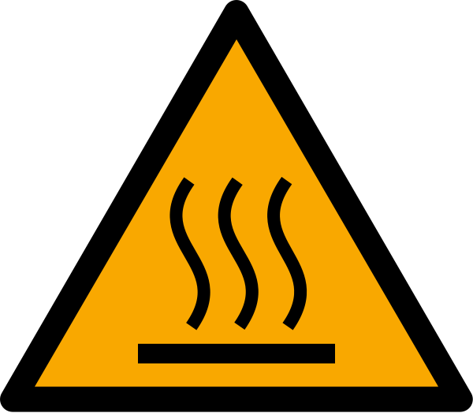
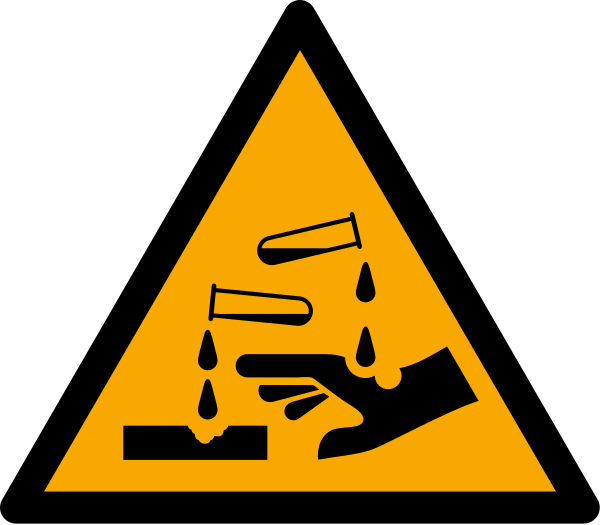
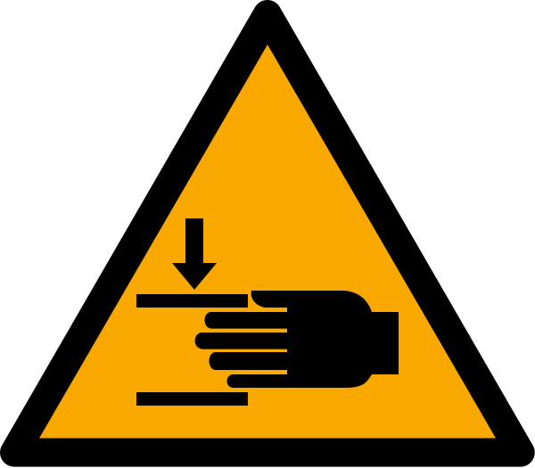
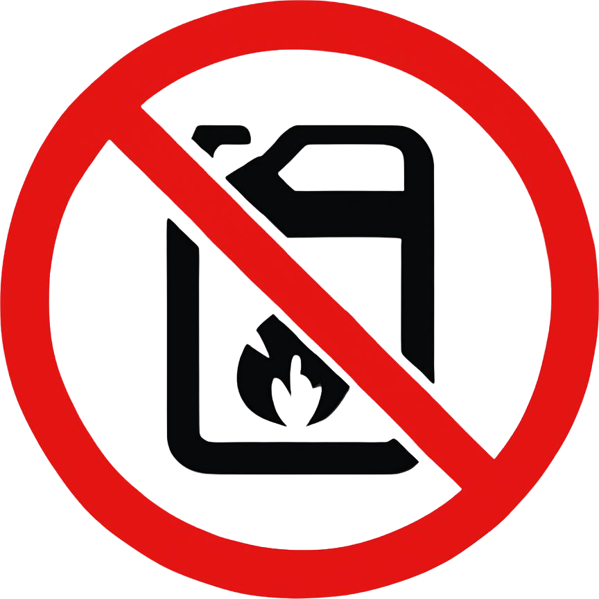
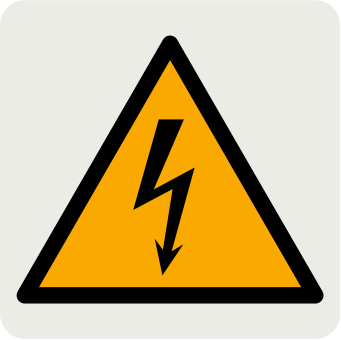
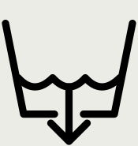
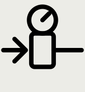

# 1.2 Symbole und Kennzeichnungsregeln

Die in dieser Anleitung und am Maschinenkörper der **KNV 90 7500 2B** verwendeten Symbole sind gemäß internationalen Normen (ISO 7010, ISO 3864-2) angebracht, um die Sicherheit des Bedieners zu erhöhen, Risiken zu kennzeichnen, Gebote anzuzeigen und die Anschlussstellen der Anlage zu bezeichnen. Symbole vermitteln Warnungen sprachunabhängig; machen Sie sich vor der Inbetriebnahme, vor Wartungsarbeiten oder vor dem Eingriff an heißen/chemisch belasteten Teilen mit den folgenden Bedeutungen vertraut.

Die Symbole sind in drei Gruppen zusammengefasst: **Warnung** (Gefahr und Verbot), **PSA** (Pflicht zur persönlichen Schutzausrüstung) und **Maschineninformation** (Anschlussstellen: Erdung, Wasser, Luft, Ablass; Sicherheitsverriegelung). Die Positionen der Etiketten an der Maschine und die Erläuterung der Restrisiken **Siehe Kapitel 2.2**. Die technische Beschreibung der Leuchten am Bedienfeld wird in **Siehe Kapitel 3.4** gegeben.

## 1.2.1 Signalwörter (Anleitungstext)

Die im Anleitungstext verwendeten Signalwörter entsprechen ISO 3864-2. Jede Warnung liefert die folgenden vier Informationen: Signalwort, Gefahrenart, mögliche Folge und Vermeidungsmaßnahme.

| Signalwort | Bedeutung | Verwendung |
| :--- | :--- | :--- |
| **GEFAHR** | Gefahr tödlicher oder schwerer Verletzung | Lebensbedrohlicher Sicherheitsverstoß |
| **WARNUNG** | Gefahr schwerer Verletzung oder Maschinenschaden | Erhebliches betriebliches Risiko |
| **VORSICHT** | Leichte Verletzung oder Sachschaden | Verfahrensspezifischer Hinweis |

Die allgemeinen Sicherheitshinweise sind in **Kapitel 2** zusammengefasst; in den Verfahrensschritten wird nur die für den jeweiligen Schritt spezifische Warnung gegeben.

---

## 1.2.2 Warnsymbole

Dreieckige Warnzeichen auf gelbem Grund kennzeichnen die Gefahrenbereiche der Maschine; rote Verbotszeichen zeigen Handlungen, die auf keinen Fall ausgeführt werden dürfen. Betreiben Sie die Maschine nicht, wenn ein Symbol fehlt oder unleserlich ist.

| Symbol | Bedeutung | Erforderliche Maßnahme |
| :---: | :--- | :--- |
|  | Allgemeine Gefahr / Achtung | Die zugehörigen Sicherheitsanweisungen befolgen (**Siehe Kapitel 2**). |
|  | Heiße Oberfläche / heißes Prozesswasser | Tank-, Kammer- und Trocknungsoberflächen vor dem Abkühlen des Systems nicht mit bloßen Händen berühren; hitzebeständige Handschuhe tragen. |
|  | Ätzende / korrosive Chemikalie | PSA gegen Chemikalienspritzer tragen; bei Hautkontakt mit viel Wasser abspülen (**Siehe Kapitel 2.6**). |
|  | Quetschen / Einklemmen der Hand (Förderer, Ventilator, Pumpe) | Bei laufender Maschine nicht in Förderer-Ein-/Auslauf und rotierende Teile greifen; Wartungsklappen nicht öffnen. |
|  | Rutschiger Boden | Im Tankumfeld auf Leckagen und Überlauf achten; Leckage beseitigen (**Siehe Kapitel 10**). |
|  | Brennbare / explosive Stoffe und Lösungsmittel verboten | Im Maschinenumfeld und in den Tanks keine Lösungsmittel, brennbaren Flüssigkeiten und offenen Flammen verwenden; nur freigegebene Reinigungsmittel (**Siehe Kapitel 10.1.7**). |
|  | Elektrische Gefahr (380 V) | Schaltschranktür nur durch eine Elektrofachkraft öffnen lassen; **Siehe Kapitel 2.4** LOTO. |

Auf den Tankdeckeln und Kammerklappen der Maschine befindet sich das kombinierte Dreifach-Etikett „Hände nicht einklemmen", „Heiße Oberfläche" und „Keine Lösungsmittel verwenden" (**Siehe Kapitel 2.2.2**).

---

## 1.2.3 PSA-Symbole

Gebotszeichen auf blauem Grund zeigen an, dass die angegebene persönliche Schutzausrüstung zu tragen ist. Welche PSA bei welcher Tätigkeit vorgeschrieben ist, wird in der Matrix **Siehe Kapitel 2.6** definiert. Am Maschinenkörper befindet sich das Sammeletikett „KKD KULLAN" (PSA tragen).

| Symbol | Bedeutung | Erforderliche Maßnahme |
| :---: | :--- | :--- |
|  | Anleitung lesen | Vor Inbetriebnahme, Betrieb und Wartung diese Anleitung lesen und befolgen. |
|  | Schutzkleidung | Geeignete Arbeitskleidung tragen; nicht mit weiter Kleidung und hängenden Accessoires an den Förderer treten. |
|  | Sicherheitsschuhe | Sicherheitsschuhe mit Stahlkappe und rutschfester Sohle tragen. |
|  | Schutzhandschuhe | Der Tätigkeit angemessene Handschuhe tragen (heiße Werkstücke, Filter, Chemikalien). |
|  | Schutzbrille | Schutzbrille gegen Spritzer tragen. |
|  | Staub-/Atemschutzmaske | Bei Chemikaliendämpfen oder Staub Atemschutzmaske tragen. |

---

## 1.2.4 Maschineninformationssymbole

Die Informationszeichen am Maschinenkörper zeigen die Anschlussstellen der Anlage (Erdung, Wasser, Luft, Ablass) und den Zustand der Sicherheitsverriegelung. Anschlussdrücke **Siehe Kapitel 3.3.5**; Installationsschritte **Siehe Kapitel 5.3**.

| Symbol | Bedeutung | Typische Position / Verwendung |
| :---: | :--- | :--- |
|  | Schutzerdung (PE) | Erdungsklemme am Schaltschrankgehäuse; an den PE-Leiter der Anlage anschließen (**Siehe Kapitel 5.3.3**). |
|  | Verriegelung / Energietrennung | Etikett „Panoların kapaklarını kilitli tutunuz" (Schaltschranktüren verschlossen halten) auf der Schaltschranktür; Energietrennung und Verriegelung vor Wartungsarbeiten (**Siehe Kapitel 2.4**). |
|  | Wasserablass / Entwässerung | Ablassventil **TAHLİYE** unter dem Tank; an die Abwasserleitung anschließen (**Siehe Kapitel 10.1.5**). |
|  | Drucklufteingang | Regler **AIR INLET / HAVA GİRİŞİ** am Maschinenkörper — 6 bar (**Siehe Kapitel 3.3.5**). |
|  | Wassereingang (Versorgung) | Netzwasseranschluss, über den die Tanks manuell befüllt werden. |
|  | Tankwasserbefüllung | Befüllstelle des Tanks; eine automatische Befüllung ist **nicht** vorhanden, der Bediener befüllt manuell (**Siehe Kapitel 7.2**). |
|  | Sicherheitsverriegelung (verriegelt / offen) | Bereich des magnetischen Schalters der Wartungsklappe; bei geöffneter Klappe läuft die Maschine nicht. |

---

## 1.2.5 Ablesen der Zustandsanzeigen

Die Maschine besitzt **kein** HMI-Display und keine Signalsäule. Der Maschinenzustand wird an den Leuchten des Bedienfelds abgelesen: die weiße **Betriebsleuchte** neben jedem Funktionsschalter, die roten Füllstand-Warnleuchten **TANK 1 / TANK 2 WASHING LEVEL** und die blaue **RESET**-Bereitschaftsleuchte. Die vollständige Beschreibung und Deutung der Leuchten **Siehe Kapitel 3.4**; Fehlerdiagnose anhand des Leuchtenzustands **Siehe Kapitel 11.1**.

Stellen Sie keine Diagnose allein anhand der Leuchten; die Stellung der Motorschutzschalter (MKŞ) und der Fehlerstrom-Schutzschalter im Schaltschrank ist Teil der Diagnose und wird ausschließlich von einer Elektrofachkraft unter LOTO geprüft.

---

## 1.2.6 Pflege der Etiketten

Die Warnetiketten an der Maschine ermöglichen dem Personal die visuelle Wahrnehmung der Gefahr. Ist ein Etikett abgenutzt, abgerieben oder unleserlich, geht seine Warnfunktion verloren. Feuchte Umgebung und Reinigungschemikalien verkürzen die Lebensdauer der Etiketten; die Etiketten sind daher Bestandteil der wöchentlichen Sichtprüfung.

1. Abgenutzte, abgeriebene oder unleserliche Etiketten unverzüglich erneuern.
2. Die Maschine nicht ohne Etiketten betreiben.
3. Zur Beschaffung von Ersatzetiketten **Siehe Kapitel 1.3**.
