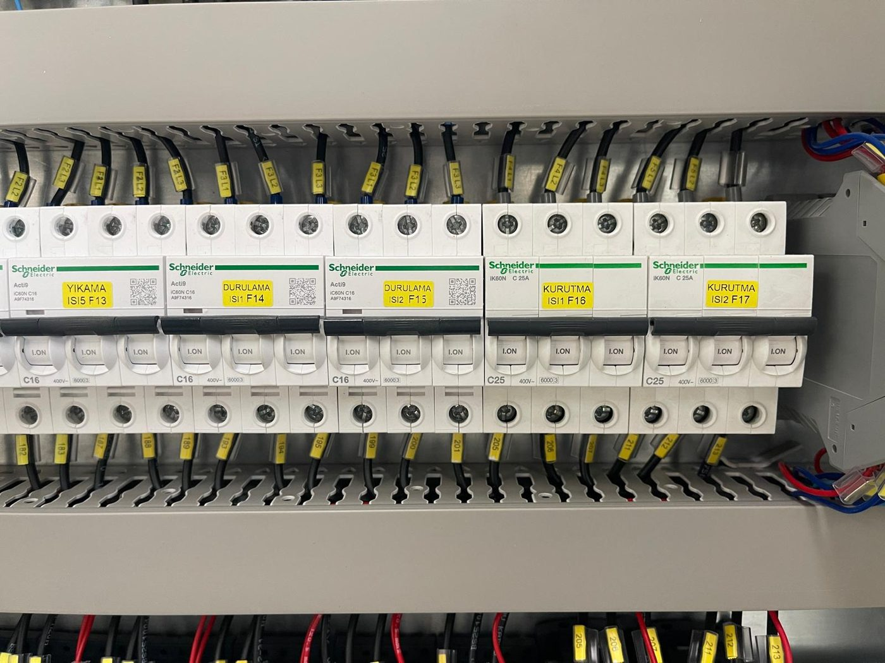

# 2.1 Güvenliğe giriş ve işletme sorumlulukları

Bu bölüm, KNV 90 7500 2B makinesinin güvenli çalışma sınırlarını, işverenin yasal yükümlülüklerini ve personel için geçerli emniyet çerçevesini tanımlar. Makine; konveyörlü sürekli akış, iki ısıtmalı proses tankı (yıkama + durulama), blower ve kurutma fanları, egzoz fanı ve buton kontrollü bir elektrik panosu ile çalışır. Her aşamada bu bölüm ve alt bölümlerdeki talimatlara uyulması zorunludur.

Makineyi işleten kurum; risk değerlendirmesi yapmak, personeli eğitmek, KKD sağlamak ve güvenlik cihazlarının çalışır durumda tutulmasından sorumludur. Kılavuzdaki güvenlik kurallarının ihlalinden doğan hukuki ve cezai sorumluluk işletmeciye aittir.

---

## 2.1.1 Amacına uygun kullanım

Makinenin amacına uygun kullanımı, yalnızca **Bölüm 3.2**'de tanımlanan sınırlar dahilinde geçerlidir. Makine; endüstriyel parçaların yüzeyindeki proses kaynaklı kir, yağ ve atıkların yıkama, durulama, su sıyırma ve kurutma prosesleriyle giderilmesi için tasarlanmıştır. Canlı organizmaların, gıdanın ve medikal aletlerin işlenmesi kesinlikle yasaktır.

Amaçlanan kullanım aşağıdaki koşulların birlikte sağlanmasına bağlıdır:

- Makine yalnızca **kapalı, korunaklı iç mekân** ortamında, **+10 °C ile +30 °C** sıcaklık ve **%30–50** göreceli nem aralığında çalıştırılır (**Bkz. Bölüm 3.2.5, 3.3.6**).
- Tüm güvenlik fonksiyonları (bakım kapağı manyetik switch'leri, acil stop devresi, tank seviye interlock'u) devredeyken işletim yapılır; hiçbiri köprülenmez veya baypas edilmez.
- Onaylanmamış kimyasallar, asit bazlı veya paslanmaz çeliğe zarar verecek temizlik maddeleri kullanılmaz (**Bkz. Bölüm 3.2.4**).
- Tanklar operatör tarafından elle doldurulur; tankta yeterli su yokken ısıtıcı ve pompa çalıştırılmaz (**Bkz. Bölüm 7.2**).
- Konveyör hızı yalnızca 20–60 Hz aralığında kullanılır; parça yükleme ve boşaltma elle, konveyör giriş ve çıkış bölgesinin dışından yapılır (**Bkz. Bölüm 7.4**).

Amaç dışı kullanım; proses hatası, ekipman hasarı, garanti iptali ve kişisel yaralanma riskini artırır (**Bkz. Bölüm 1.1.5**).

---

## 2.1.2 Öngörülebilir yanlış kullanım

Aşağıdaki eylemler öngörülebilir yanlış kullanım kapsamında değerlendirilir ve **yasaktır**:

1. Canlı organizma (insan, hayvan, bitki), gıda, gıda ambalajı, gıda ile temas eden yüzey veya medikal alet işleme; proses bölgesine canlı varlık alma.
2. Bakım kapağı manyetik switch'lerini mıknatıs veya yabancı cisimle kandırma, köprüleme, sökme; acil stop devresini veya emniyet rölelerini baypas etme.
3. Üretici onayı olmadan mekanik, elektrik (inverter parametresi, pano devresi) veya tesisat değişikliği yapma.
4. Makine çalışırken bakım kapaklarını kaldırma; konveyör giriş/çıkışına veya hücre içine el, kol, alet uzatma.
5. Tankta su yokken ısıtıcı anahtarını açma girişimi; TANK 1/2 WASHING LEVEL kırmızı lambası yanarken proses başlatma.
6. Asit bazlı, solvent içeren veya paslanmaz çeliğe zarar verecek temizlik maddeleri kullanma; tanklara yanıcı sıvı ekleme.
7. Konveyör hız potansiyometresini 20 Hz altına indirme (yük altında konveyör durabilir) veya 60 Hz üzerine zorlama.
8. Makineyi vinç ile sapanlayarak taşıma; forklift dışı kaldırma yöntemleri uygulama (**Bkz. Bölüm 4.1**).
9. Elektrik panosu kapağını açık bırakma, LOTO uygulamadan pano içine müdahale etme.

Tespit hâlinde makineyi güvenli şekilde durdurun; müdahaleye ancak tehlike giderildikten ve gerekirse LOTO uygulandıktan sonra devam edin (**Bkz. Bölüm 2.4**).

---

## 2.1.3 Güvenlik donanımı özeti

Makine güvenlik mimarisi aşağıdaki bileşenlerden oluşur. Tüm fonksiyonlar donanımsal röle mantığı ile çalışır; yazılım katmanı yoktur.

| Bileşen | Durum |
| :--- | :--- |
| Acil stop butonu | **7 adet** — 1 operatör paneli + 6 saha (**Bkz. Bölüm 2.5**) |
| Bakım kapağı | **7 adet** elle kaldırılıp açılan kapak (mekanik kilit yok) |
| Kapak emniyet switch'i | Omron **F3STGRNLPU21M1J8** manyetik kapı switch'i — tüm kapaklarda, **seri** bağlı |
| Emniyet rölesi — kapak zinciri | Omron **G9SB2002AACDC241** (G9SX serisi) — baypas edilemez tasarım |
| Emniyet rölesi — acil stop zinciri | Omron **G9SB2002AACDC241** (G9SX serisi) |
| Işık perdesi | Yok |
| Güvenlik kategorisi (EN ISO 13849-1) | [EKSİK] — tip etiketi / CE dosyasından doğrulanacak |
| Reset / hazır göstergesi | Mavi **RESET** buton-lambası (BL901M) — operatör paneli |
| Tank seviye interlock'u | Tankta yeterli su yoksa ilgili tank ısıtıcıları ve pompası çalıştırılamaz; kırmızı **WASHING LEVEL** lambası yanar |
| Faz koruma | Faz sıra rölesi MKR-01 — faz hatası veya eksik fazda pano çıkışı yok |

Herhangi bir bakım kapağı açıldığında emniyet zinciri **tüm makine hareketlerini ve prosesleri** durdurur; acil stop basıldığında da aynı sonuç oluşur. Her iki durumda RESET lambası söner ve makine, operatör RESET ile güvenli durumu onaylayana kadar yeniden çalıştırılamaz. Kapak switch'leri mıknatıs/kapak ile hizalı olmalıdır; hizasız kapak, makineyi kapalı görünse bile durdurur (**Bkz. Bölüm 11.7**).

