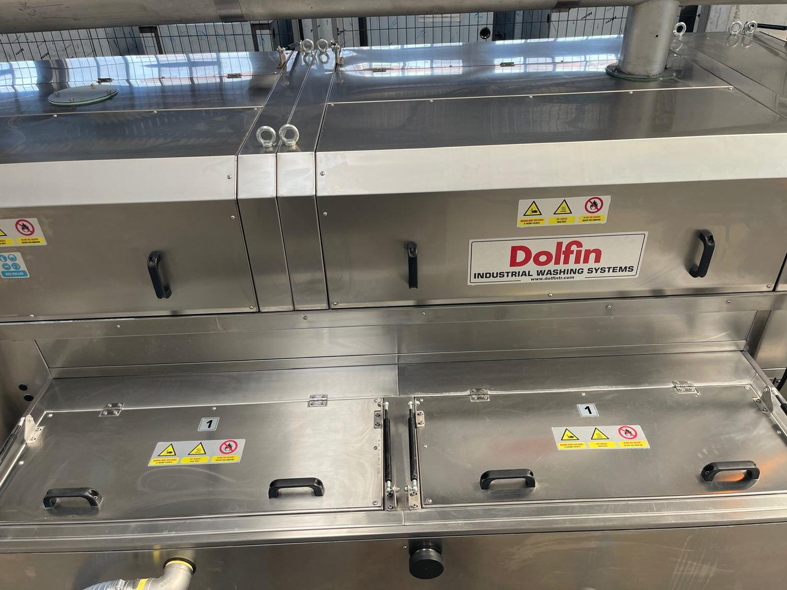
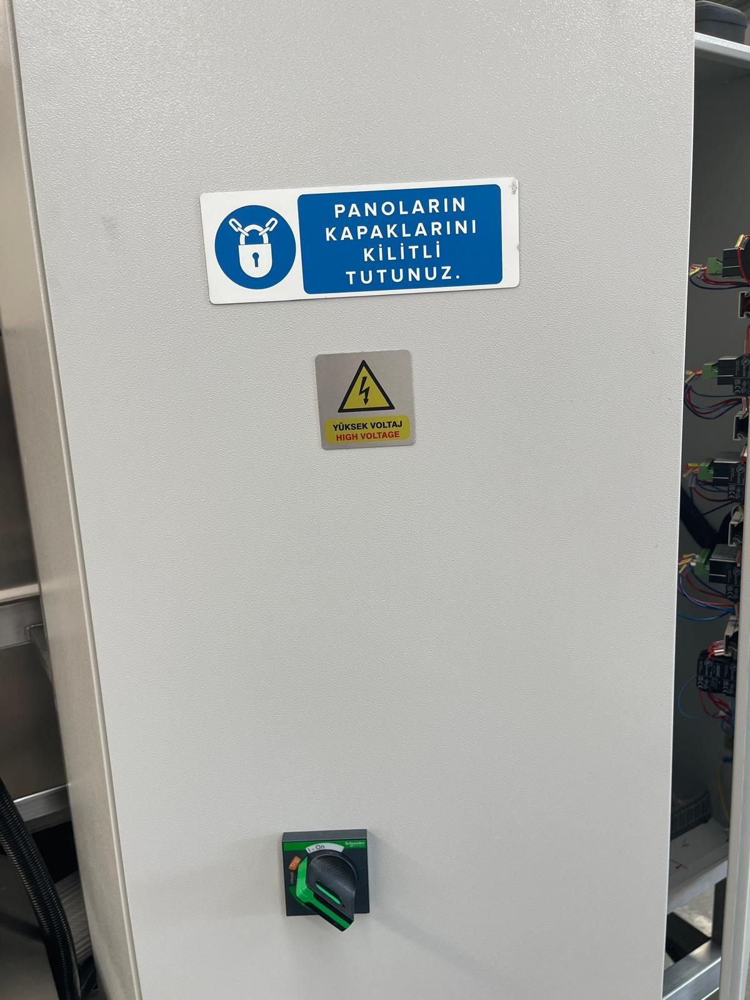

# 2.2 Restrisiken und Maschinenetiketten

In der Konstruktionsphase wurde eine Risikobeurteilung nach EN ISO 12100 durchgeführt; die vermeidbaren Risiken wurden konstruktiv (geschlossene Kammern, Klappen-Sicherheitskreis, Not-Halt, Füllstandverriegelung, Schutzgitter) verringert. Dennoch verbleiben aufgrund der Natur der Maschine **Restrisiken**, die nicht vollständig beseitigt werden können. Das Personal muss sich dieser Risiken bewusst sein, die zugehörige PSA tragen und die Matrix in **Kapitel 2.6** einhalten.

Die Warnetiketten an der Maschine sind in **Kapitel 1.2** zusammen mit den allgemeinen Symbolregeln erläutert; dieses Kapitel definiert die maschinenspezifischen Restrisiken und die Positionen der Etiketten.

---

## 2.2.1 Restrisiken

**Thermisches Risiko — heiße Prozessflüssigkeit, Heizstäbe und Heißluft**

Der Waschtank (TANK 1) und der Spültank (TANK 2) werden mit insgesamt sieben Heizstäben à 8 kW beheizt; die Wassertemperatur kann bis **+70 °C** erreichen (**Siehe Kapitel 3.3.5**). In den Trocknungskammern erzeugen zwei Heizungen à 12 kW Heißluft. Tankdeckel, Kammerklappen, Rohrleitungen, das Gehäuse der Trocknungskammer und die austretenden Werkstücke bleiben auch nach dem Prozess heiß. Der Kontakt mit bloßen Händen birgt die Gefahr von Verbrennungen ersten oder zweiten Grades. Beim Öffnen des Tankdeckels steigt heißer Dampf zum Gesicht auf. Vor Wartung oder Reinigung die Heizungen ausschalten und dem System Zeit zum Abkühlen geben; hitzebeständige Handschuhe tragen.

**Mechanisches Risiko — Kettenförderer, Drahtgurt und rotierende Mechanismen**

Der Förderer bewegt sich bei eingeschaltetem Schalter CONVEYOR kontinuierlich; im Werkstück-Einlauf (links) und -Auslauf (rechts) besteht die Gefahr des Einklemmens von Fingern und Händen zwischen Drahtgurt und feststehender Struktur. Der Getriebemotor des Förderers besitzt zwar einen Drehmomentbegrenzer, dieser ist jedoch nicht zum Schutz menschlicher Gliedmaßen ausgelegt. Ein- und Auslaufbereich sind mit Schutzgittern umgeben; nicht in das Gitter hineingreifen. Pumpen-, Ventilator- und Blowermotoren sind rotierende Elemente; ihre Abdeckungen bei laufender Maschine nicht abnehmen. Werkstücke ausschließlich von außerhalb des Kammereinlaufs auf den Förderer auflegen und am Auslauf vom Drahtgurt abnehmen.

**Chemikalien- und Flüssigkeitsexposition**

In den Wasch- und Spülprozessen sind Öl, Schmutz und erhitzte Prozessflüssigkeit vorhanden. Bei der Reinigung des Vorfilters, der Tankwartung, dem Wechsel des Feinfilters (Beutelfilter) und bei Leckagen besteht Spritzgefahr für Haut und Augen. Überlaufendes oder tropfendes Wasser im Tankumfeld erzeugt einen rutschigen Boden. Das Verbot „Keine Lösungsmittel verwenden" an der Maschine richtet sich gegen die Gefahr brennbarer Dämpfe und der Beschädigung der Edelstahloberflächen.

**Elektrisches Risiko**

Im Schaltschrank liegt eine Versorgung mit **380 V**, **50 Hz**, **3-phasig**, insgesamt **110 kW / 220 A** an (**Siehe Kapitel 3.3.3**). Die Heizstäbe sind am Tankgehäuse montiert und stehen in Kontakt mit dem Wasser; bei einem Isolationsfehler trennen die Fehlerstrom-Schutzschalter (RCCB) den Stromkreis, ein Eingriff am Schaltschrank oder an den Anschlusskästen der Heizstäbe auf nassem Boden kann jedoch tödlich sein. Die Schaltschranktür darf nur von Elektrofachpersonal geöffnet werden; vor dem Eingriff ist das LOTO-Verfahren nach **Kapitel 2.4** zwingend. Auch bei ausgeschaltetem Hauptschalter kann an den Zwischenkreiskondensatoren des Förderer-Frequenzumrichters kurzzeitig eine gefährliche Spannung anstehen; vor dem Eingriff am Frequenzumrichter mindestens 5 Minuten warten.

**Pneumatisches Risiko**

Die Druckluftversorgung beträgt **6 bar** (**Siehe Kapitel 3.3.5**). Beim Bruch der Luftleitung oder Lösen einer Verschraubung bergen peitschende Schläuche und Druckluft Verletzungsgefahr. Bei Arbeiten an der Pneumatik das Luftventil der Anlage schließen und den Restdruck ablassen (**Siehe Kapitel 2.4**).

**Lärm**

Der Geräuschpegel der Maschine ist mit **65 dB(A)** angegeben (**Siehe Kapitel 3.3.6**). Laufen vier Blower und zwei Trocknungsventilatoren gleichzeitig, steigt der Schallpegel in der Nähe des Trocknungsbereichs; bei längerer Arbeit in geringem Abstand kann eine Bewertung des Gehörschutzes durch den Betreiber gemäß den Lärmschutzvorschriften am Arbeitsplatz erforderlich sein.

**Abluft und Dampf**

Der Abluftventilator (1,1 kW) führt Dampf und feuchte Luft aus dem Wasch- und Trocknungsbereich in den Abluftkamin ab. Wird der Abluftkamin nicht an die Gebäudelüftung oder nach außen angeschlossen, breitet sich der Dampf im Betrieb aus; die Sicht wird beeinträchtigt, der Boden wird rutschig und im Schaltschrank bildet sich Kondensat.

---

## 2.2.2 Warnetiketten an der Maschine

Die Piktogramme am Maschinenkörper und am Schaltschrank entsprechen ISO 7010. Das Entfernen, Überstreichen oder Unleserlichmachen der Etiketten ist verboten.

| Etikett / Symbol | Position | Erforderliche Maßnahme |
| :--- | :--- | :--- |
| Hände nicht einklemmen + Heiße Oberfläche + Keine Lösungsmittel verwenden (Dreifach-Etikett) | Deckel von Tank 1 und Tank 2, Klappen der Wasch-/Spül-/Trocknungskammern | Klappe nur bei stehender und abgekühlter Maschine an den Griffen öffnen; keine Lösungsmittel verwenden |
| Allgemeine Gefahr (gelbes Dreieck) | Wartungsklappen, Seitenklappen | **Siehe Kapitel 2** |
| KKD KULLAN (PSA tragen — blaues Sammeletikett) | Maschinenkörper, Tankvorderseite | **Siehe Kapitel 2.6** |
| YÜKSEK VOLTAJ / HIGH VOLTAGE (Hochspannung) | Schaltschranktür | Nur Elektrofachkraft; LOTO anwenden (**Siehe Kapitel 2.4**) |
| PANOLARIN KAPAKLARINI KİLİTLİ TUTUNUZ (Schaltschranktüren verschlossen halten) | Schaltschranktür | Schaltschranktür während des Betriebs geschlossen und verriegelt halten |
| AIR INLET / HAVA GİRİŞİ (Drucklufteingang) | Maschinenkörper — Druckluftregler | 6-bar-Luftanschlussstelle (**Siehe Kapitel 3.3.5**) |
| TAHLİYE (Ablass) | Ablassventil unter dem Tank | Tankentleerung (**Siehe Kapitel 10.1.5**) |
| Tanknummer **1** / **2** | Tankdeckel | Tank 1 = Waschen, Tank 2 = Spülen |
| EMERGENCY STOP | Bedienfeld und 6 Not-Halt-Taster im Feld | **Siehe Kapitel 2.5** |

Abgenutzte Etiketten unverzüglich erneuern (**Siehe Kapitel 1.3**). Die Maschine nicht ohne Etiketten betreiben.
