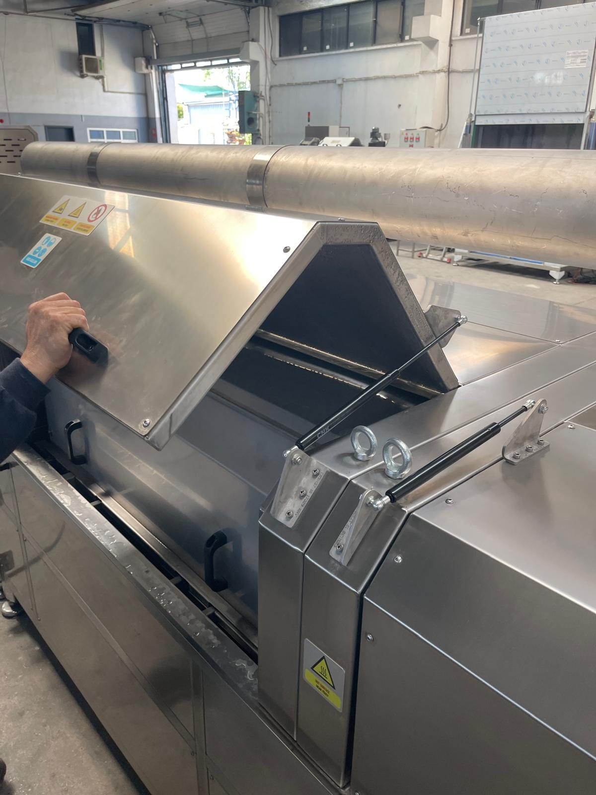
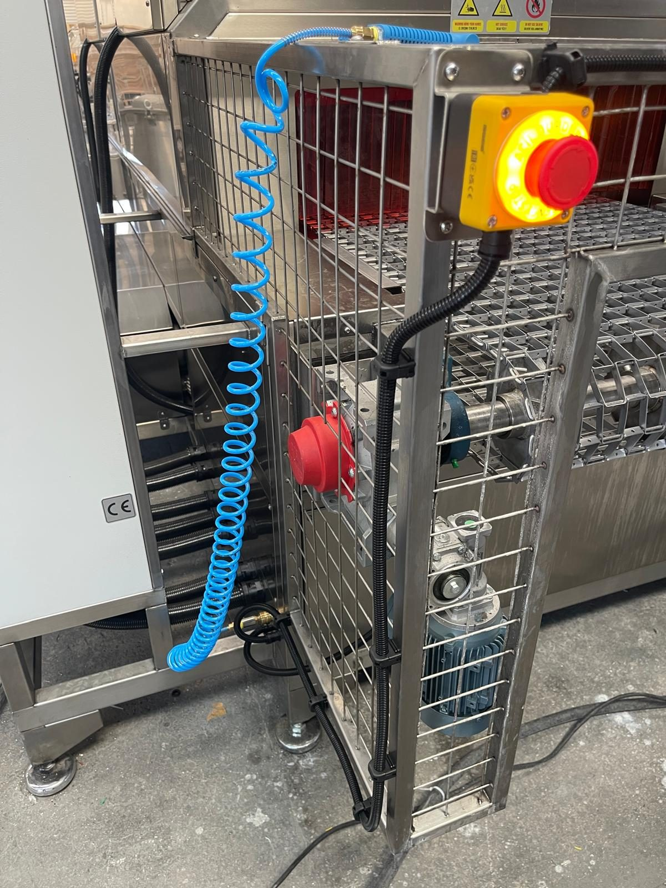
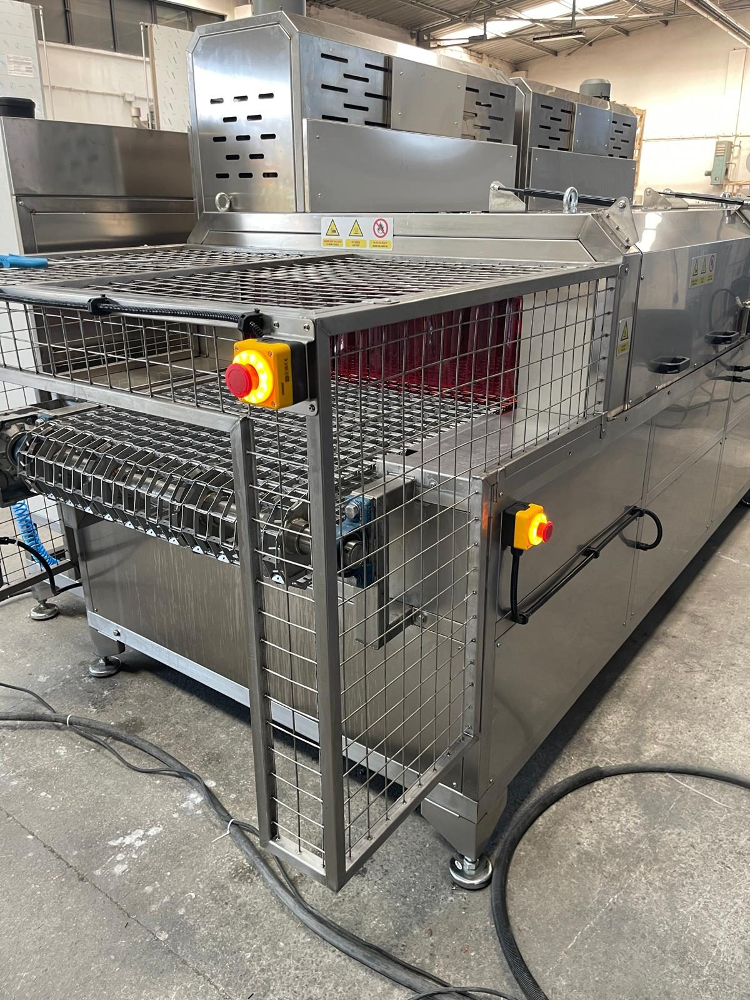
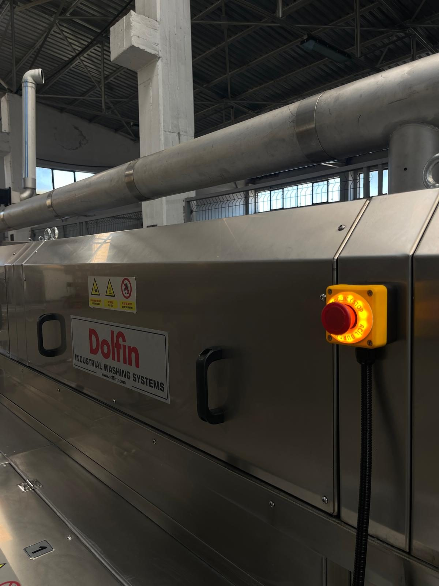

# 2.3 Genel operasyonel güvenlik kuralları

Aşağıdaki kurallar makinenin tüm kullanım aşamalarında geçerlidir. İhlal durumunda makineyi durdurun; güvenlik koşulları sağlanmadan yeniden devreye almayın.

1. Kılavuzu okuyun ve eğitim almadan makineyi çalıştırmayın (**Bkz. Bölüm 1.1.3**).
2. Güvenlik cihazlarını (kapak manyetik switch'leri, acil stop, emniyet röleleri, seviye interlock'u) devre dışı bırakmayın veya baypas etmeyin.
3. Makine çalışırken bakım kapaklarını açmayın; kapak açma öncesi LOTO uygulayın (**Bkz. Bölüm 2.4**). Kapak switch'leri mekanik kilit içermez; açıldığında makineyi durdurur ancak sıcak sıvı ve kalıntı hareket riskini ortadan kaldırmaz.
4. **RESET** lambası sönükken (emniyet zinciri açıkken) fonksiyon anahtarı açmayın; önce nedeni giderin (**Bkz. Bölüm 2.5, 11.1**).
5. Tanklarda yeterli su olmadan ısıtıcı ve pompa anahtarlarını açmayın; kırmızı **WASHING LEVEL** lambası yanıyorsa ilgili tankı doldurun (**Bkz. Bölüm 7.2**).
6. Konveyör hattında sıkıştıracak cisim kalmadığını doğrulayın; pompa emiş/çıkış vanaları açık olmalıdır (**Bkz. Bölüm 7.2.5**).
7. Parçaları yalnızca sol girişten konveyöre yerleştirin ve sağ çıkıştan alın; hücre içine uzanmayın, koruma kafesi içine girmeyin.
8. Elektrik panosu kapağını çalışma sırasında kapalı ve kilitli tutun; pano içine yalnızca yetkili elektrikçi LOTO altında müdahale eder.
9. Makine çevresine su püskürtmeyin; elektrik panosu, inverter ve kapak switch bölgelerine doğrudan su tutmayın.
10. Acil durumlarda en yakın acil stop butonuna basın (**Bkz. Bölüm 2.5**).

---

# 2.4 Tehlikeli enerji kontrolü — LOTO (kilitleme ve etiketleme)

**UYARI — Enerji kaynaklı yaralanma:** LOTO uygulanmadan yapılan bakım veya temizlikte makine kazara devreye girebilir; ezilme, elektrik çarpması, sıcak sıvı ve basınçlı hava yaralanması oluşabilir. Tüm enerji kaynaklarını izole edin, kilitleyin ve etiketleyin.

Bu prosedür, makine üzerinde mekanik bakım, elektrik müdahalesi, filtre/tank temizliği, kapak sökme, nozul ve rezistans kontrolü ve benzeri tüm işler öncesinde uygulanır. Diğer bölümlerde yalnızca **Bkz. Bölüm 2.4** referansı verilir; adımlar tekrarlanmaz.

Bu makinede HMI bulunmadığından enerji yokluğu doğrulaması **fiziksel** olarak yapılır: operatör paneli lambalarının tamamen sönmesi, fonksiyon anahtarı açıldığında hiçbir motorun çalışmaması ve hava hattı manometresinin sıfıra düşmesi.

## 2.4.1 Kapsam ve enerji kaynakları

| Enerji türü | Kaynak | İzolasyon noktası |
| :--- | :--- | :--- |
| Elektrik | 380 V, 3 faz, 110 kW / 220 A | Ana şalter — **TMŞ Schneider CVS250F (LV521091)**, pano kapağı üzerindeki döner kol; **OFF (O)** konumu kilitlenebilir |
| Pnömatik | 6 bar basınçlı hava | Tesisat hava vanası KAPALI + kilit; makine gövdesindeki **AIR INLET / HAVA GİRİŞİ** regülatöründen kalıntı basıncın tahliyesi ([EKSİK] — vananın fiziksel konumu layout/şemada) |
| Su / proses sıvısı | 1 bar şebeke su girişi; tanklarda +70 °C'ye kadar sıvı | Tesis su kesme vanası ([EKSİK] — varsa layout'tan eklenecek); tank boşaltma **TAHLİYE** vanası (**Bkz. Bölüm 10.1.5**) |
| Termal | Tank rezistansları (7 × 8 kW), kurutma ısıtıcıları (2 × 12 kW) | Elektrik izolasyonu sonrası soğuma süresi — tank sıvısı ve kurutma hücresi yüzeyleri |
| Mekanik | Konveyör, blower, fan, pompa, yağ sıyırıcı | Elektrik izolasyonu; durma sonrası kalan hareket (fan kanadı atalet) riskine dikkat |
| Elektriksel depolanmış | Konveyör inverteri DC bara kondansatörü | Ana şalter OFF sonrası en az **5 dakika** bekleme |

Hidrolik ve vakum sistemi bulunmamaktadır.

## 2.4.2 LOTO uygulama prosedürü

**Hazırlık**

1. Bakım veya müdahale kapsamını ve süresini belirleyin.
2. Etkilenecek personeli bilgilendirin; makine üzerinde çalışıldığını duyurun.

**Makineyi durdurma**

3. Operatör panelindeki tüm fonksiyon anahtarlarını **OFF** konumuna alın; önce CONVEYOR, ardından pompalar, blower/fan ve ısıtıcılar (**Bkz. Bölüm 7.3**).
4. Gerekirse en yakın **acil stop** butonuna basın (**Bkz. Bölüm 2.5**).

**Enerji izolasyonu**

5. Elektrik panosu kapağındaki **ana şalter kolunu** OFF (O) konumuna çevirin.
6. Şalter koluna kişisel **asma kilidinizi** takın.
7. Kilide **LOTO etiketi** asın; etikette adınız, tarih ve "Çalıştırmayın — bakım" ifadesi bulunsun.
8. Tesis **basınçlı hava** vanasını kapatın; mümkünse vanayı kilitleyin.
9. Makine gövdesindeki hava regülatörü manometresinin **0 bar** gösterdiğini doğrulayın; hat içi kalıntı basıncı regülatör veya tahliye noktasından boşaltın.
10. Tesis **su giriş** vanasını kapatın (varsa).
11. Tank içi müdahale gerekiyorsa proses sıvısını **TAHLİYE** vanasından boşaltın (**Bkz. Bölüm 10.1.5**); sıcak sıvı riskine karşı soğumayı bekleyin.

**Doğrulama**

12. Operatör paneli lambalarının (run lambaları, WASHING LEVEL, RESET) tamamen **sönük** olduğunu doğrulayın.
13. Bir fonksiyon anahtarını (ör. TANK 1 PUMP) kısa süre ON konumuna alın; hiçbir motorun çalışmadığını ve run lambasının yanmadığını doğrulayın; anahtarı OFF konumuna geri alın. Lamba yandıysa beslemenin kesilmediğini varsayın; pano içine girmeyin, yetkili elektrik personeli çağırın.
14. Konveyör, fan, blower ve pompa bölgelerinde hareket olmadığını gözle ve sesle kontrol edin.
15. Doğrulama tamamlanmadan kapak sökmeyin veya muhafaza içine girmeden müdahaleye başlamayın.

**Müdahale sonrası**

16. Tüm koruyucuları, kapakları ve bağlantıları yerine takın; araç ve malzemeleri alandan kaldırın.
17. Bakım kapaklarının manyetik switch'lerle hizalı kapandığını kontrol edin.
18. LOTO kilidi ve etiketini **yalnızca kilidi takan yetkili personel** söker.
19. Su ve hava vanalarını açın; hava regülatöründe **6 bar** okunana kadar bekleyin (**Bkz. Bölüm 3.3.5**).
20. Ana şalteri ON konumuna alın; **RESET** butonuna mavi lamba yanana kadar basın ve başlatma prosedürünü uygulayın (**Bkz. Bölüm 2.5, 7.2**).

**TEHLİKE — Çoklu personel:** Birden fazla kişi aynı makinede çalışıyorsa her enerji kaynağına ayrı kilit takılır; son personel çıkmadan grup kilidi sökülmez.

Bakım kapağı manyetik switch'leri baypas edilmemelidir. Switch köprülenemez, mıknatısla kandırılamaz veya devre dışı bırakılamaz; LOTO sonrası kapak açılır.

---

# 2.5 Acil durdurma (E-Stop) ve reset

Makinede toplam **7 adet** acil stop butonu bulunur:

| No. | Konum |
| :---: | :--- |
| 1 | Operatör paneli — **EMERGENCY STOP** |
| 2 | Konveyör girişi — sağ |
| 3 | Konveyör girişi — sol |
| 4 | Konveyör çıkışı — sağ |
| 5 | Konveyör çıkışı — sol |
| 6 | Makine uzun ekseni orta bölge — sağ |
| 7 | Makine uzun ekseni orta bölge — sol |

Acil stop'a basıldığında makinedeki **tüm hareket ve proses çıkışları** (konveyör, pompalar, ısıtıcılar, blower, kurutma ve egzoz fanları, yağ sıyırıcı) güvenli şekilde durur; mavi **RESET** lambası söner; reset onayı olmadan hiçbir fonksiyon yeniden çalıştırılamaz. Acil stop, normal stop yerine yalnızca acil tehlike anında kullanılmalıdır; sık acil stop kullanımı kontaktörleri ve rezistans kontrol devresini zorlar.

**Acil stop kullanılacak durumlar**

- Can güvenliğini tehdit eden sıkışma, düşme veya çarpma riski
- Ani mekanik arıza sesi, pompa veya fan kaynaklı şiddetli titreşim, tank veya boru hattında büyük sızıntı
- Elektrik arkı, duman, yanık kokusu veya rezistans kaynaklı anormal ısınma
- Konveyör üzerinde parça sıkışması veya tel bant hasarı

Bakım kapağı açıldığında emniyet zinciri makineyi zaten durdurur; bu bir acil stop nedeni değildir. Kapak duruşundan sonra kapağı switch ile hizalı kapatın, **Bölüm 2.4** gereklerini uygulayın ve ardından resetleyin.

**Reset prosedürü**

1. Fiziksel tehdidi giderin; sıkışma, sızıntı veya arıza kaynağını güvenli hâle getirin.
2. Basılı acil stop mantarını **serbest bırakın** (çekerek veya ok yönünde çevirerek kilidi kaldırın). Birden fazla buton basılmış olabilir; 7 butonun tamamını kontrol edin.
3. Tüm bakım kapaklarının kapalı ve switch ile hizalı olduğunu doğrulayın.
4. Operatör panelindeki mavi **RESET** butonuna, lamba **yanana kadar** basın. Yalnızca acil stopu kaldırmak yeterli değildir; makinenin güvenli duruma alındığı reset ile operatör tarafından onaylanır.
5. RESET lambası yanmıyorsa **Bölüm 11.1.2 — Arıza 4** teşhis adımlarını uygulayın; lamba yanmadan fonksiyon anahtarı açmayın.
6. Tehlike tamamen giderilmeden fonksiyonları yeniden başlatmayın; başlatma sırası **Bölüm 7.2**'ye göredir.

Reset prosedürü güvenlik fonksiyonunu geri kazandırır; arıza giderilmeden start vermek tekrar durma veya hasara yol açabilir. Acil stop fonksiyon testi **her ay** tekrarlanır (**Bkz. Bölüm 6.2.3, 5.4.1**).

---

# 2.6 Kişisel koruyucu donanım (KKD)

İşveren, görev bazlı KKD sağlamak ve kullanımını denetlemekle yükümlüdür. Aşağıdaki matris minimum gereksinimleri tanımlar; yerel mevzuat daha sıkı ise ona uyulur. Makine üzerindeki "KKD KULLAN" etiketi bu matrise işaret eder.

| Görev | İş elbisesi | Çelik burunlu ayakkabı | Eldiven | Koruyucu gözlük | Solunum koruması |
| :--- | :---: | :---: | :---: | :---: | :---: |
| Operatör paneli kullanımı (anahtar / reset) | ✓ | ✓ | — | — | — |
| Parça yükleme / boşaltma (konveyör giriş-çıkış) | ✓ | ✓ | ✓ (ısıya dayanıklı — çıkan parça sıcaktır) | ✓ (sıçrama riski) | — |
| Tank elle doldurma, seviye kontrolü | ✓ | ✓ (kaymaz) | ✓ | ✓ | — |
| Ön filtre, iç filtre ve torba filtre temizliği | ✓ | ✓ (kaymaz) | ✓ (sıvı geçirmez, kimyasala uygun) | ✓ | Gerekirse filtreli maske |
| Tank boşaltma, dezenfeksiyon, temizlik kimyasalı | ✓ (sıvı geçirmez önlük) | ✓ (kaymaz) | ✓ (kimyasala uygun, uzun konçlu) | ✓ (tam kapalı) | Gerekirse filtreli maske |
| Mekanik bakım (konveyör, pompa, fan, nozul) | ✓ | ✓ | ✓ (kesilmeye dirençli) | ✓ | — |
| Elektrik panosu müdahalesi (LOTO ile) | ✓ (pamuklu, alev almaz) | ✓ (yalıtkan taban) | Yalıtkan (ölçüm sırasında) | ✓ | — |
| Sıcak tank / rezistans / kurutma hücresi yakını çalışma | ✓ | ✓ | ✓ (ısıya dayanıklı) | ✓ | — |

**DİKKAT — Kaygan zemin:** Tank çevresinde sızıntı veya taşma durumunda kaymaz ayakkabı ve dikkatli hareket zorunludur (**Bkz. Bölüm 10**).

**DİKKAT — Sıcak parça:** Kurutma hücresinden çıkan parçalar sıcak hava ile kurutulmuştur ve yanık riski taşır; boşaltmada ısıya dayanıklı eldiven kullanın.

Kısa süreli ziyaretçiler; aktif proses bölgesine girmeden önce işveren tarafından bilgilendirilmeli ve asgari KKD (ayakkabı, gözlük) ile donatılmalıdır.
