# 3.1 Maschinenbeschreibung

**KNV 90 7500 2B** ist eine Teilewaschmaschine mit Förderer, in der industrielle Werkstücke auf einem Förderer transportiert und durch die Prozesse Waschen, Spülen, Wasserabblasen und Trocknen geführt werden. Die Maschine ist als integrierte Linie aufgebaut, bestehend aus Wasch- und Spültank mit den zugehörigen Sprühkammern, Blower- und Heißluft-Trocknungseinheit, Abluftventilator und Werkstückförderer. Ihre Hauptfunktion ist die Entfernung von Prozessschmutz sowie Öl und Rückständen von den Werkstückoberflächen mit erwärmten Wasch- und Spülflüssigkeiten und die anschließende Ausgabe des getrockneten Werkstücks aus der Linie.

Die Förderrichtung ist **Beschickung links / Entnahme rechts**. Der Zugang zu Schaltschrank, Bedienfeld und den täglichen Eingriffsstellen befindet sich **auf der rechten Seite der Maschine**. In diesem Projekt werden die Werkstücke **vom Bediener von Hand** aufgelegt und entnommen; eine Roboterintegration und eine automatische Liniensteuerung sind nicht vorhanden. Maschinengehäuse und Tanks sind aus Edelstahl gefertigt; die Prozesstanks werden mit elektrischen Heizstäben beheizt.

Die folgenden Unterkapitel erläutern den Prozessablauf und die Funktion jedes Hauptmoduls. Die numerischen technischen Werte sind in **Kapitel 3.3**, die Bedienelemente in **Kapitel 3.4** angegeben.

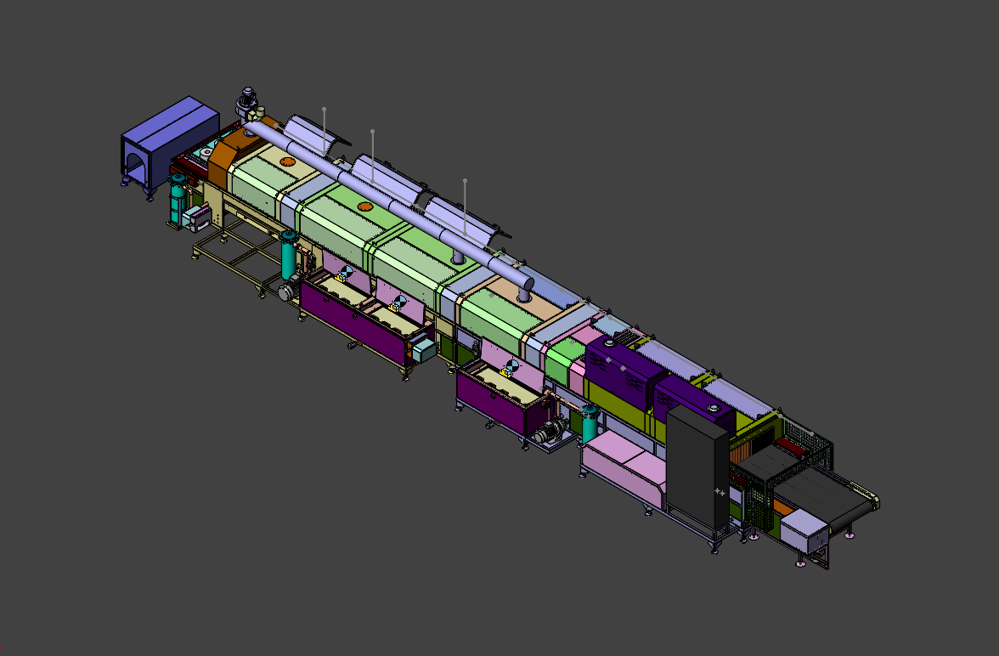

---

## 3.1.1 Gesamtansicht und Prozessablauf

Die Maschine führt entlang der Linie vier Prozessschritte aus. Die Werkstücke gelangen auf dem Förderer von der linken Seite in die Kammer, durchlaufen die Prozesszonen nacheinander und verlassen die Maschine auf der rechten Seite. Jeder Schritt wird von einer eigenständigen Funktionsgruppe ausgeführt und kann vom Bedienfeld aus einzeln ein- und ausgeschaltet werden.

| Schritt | Prozess | Mechanismus | Bedienfeldschalter |
| :---: | :--- | :--- | :--- |
| 1 | **Waschen** | Die Waschpumpe (PE02) fördert das erwärmte Wasser aus TANK 1 zu den Düsen in der Waschkammer; das in Bewegung befindliche Werkstück wird mit dem gesprühten Wasser gewaschen | TANK 1 HEATER, TANK 1 PUMP |
| 2 | **Spülen** | Die Spülpumpe (PE04) fördert das Spülwasser aus TANK 2 zu den Düsen der Spülkammer; Rückstände des Waschwassers werden vom Werkstück entfernt | TANK 2 HEATER, TANK 2 PUMP |
| 3 | **Wasserabblasen** | Vier Blower-Motoren (FE04–FE07) blasen Luft mit hoher Geschwindigkeit aus den Luftmesserrohren; das Wasser auf der Werkstückoberfläche wird abgeblasen | BLOWER 1, BLOWER 2 |
| 4 | **Trocknen** | Zwei Trocknungsventilatoren (FE02, FE03) führen die über die 12-kW-Heizungen (R21, R22) erwärmte Heißluft in die Trocknungskammer; das Werkstück trocknet | DRYING 1 HEATER, DRYING 1 FAN, DRYING 2 HEATER, DRYING 2 FAN |

Die Wasch- und Spülkammern sind an Ein- und Ausgang mit **PVC-Streifenvorhängen** verschlossen, um Dampf und Spritzwasser im Inneren zu halten. Der Abluftventilator (FE01) führt den Dampf und die feuchte Luft aus den Kammern in den Abluftkamin ab. Die Zykluszeit hängt von der Fördergeschwindigkeit (Frequenzumrichter 20–60 Hz) und der Linienlänge ab; ein fester Wert ist nicht definiert (**Siehe Kapitel 3.3.2**).

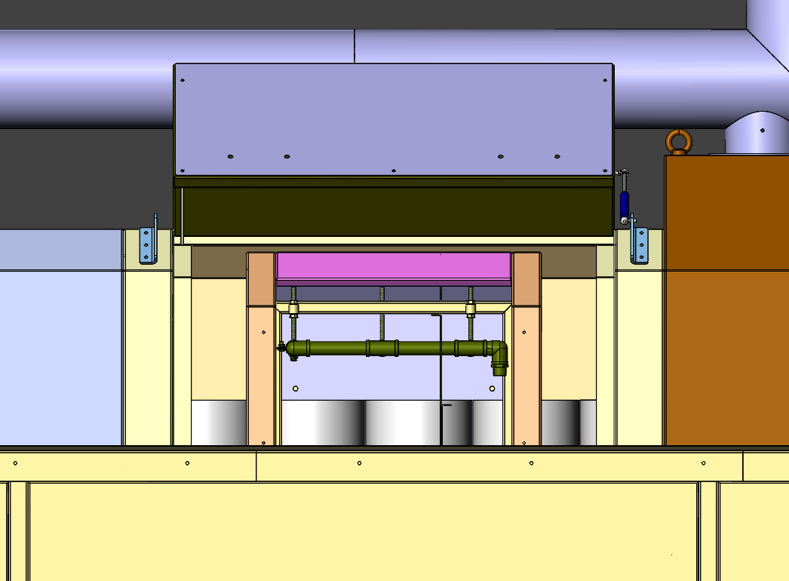

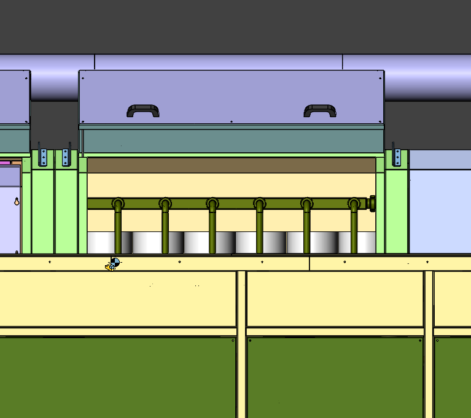

---

## 3.1.2 Förderer und Werkstücktransport

Der Förderer ist ein **Kettenförderer mit Edelstahl-Drahtgurt**, der die Werkstücke zwischen den Prozesszonen transportiert. Der Antrieb erfolgt über den **Getriebemotor (GE01, 0,25 kW)** auf der Ausgangsseite des Förderers; am Getriebe befindet sich ein **Drehmomentbegrenzer**, der bei Blockierung durchrutscht und so Kette und Getriebe schützt. Der Motor wird über den Frequenzumrichter **Delta VFD004EL21W-1** im Schaltschrank angesteuert; die Geschwindigkeit wird mit dem **Potentiometer** am Bedienfeld im Bereich 20–60 Hz eingestellt (**Siehe Kapitel 3.4.7**).

Die Beschickung erfolgt **links**, die Entnahme **rechts**. Die Ein- und Ausgangsbereiche des Förderers sind mit einem **Drahtschutzgitter** umgeben; das Gitter verhindert, dass der Bediener zwischen Drahtgurt und feststehende Struktur greift. Der Bediener legt die Werkstücke von außerhalb des Gitters auf den Drahtgurt und entnimmt sie am Ausgang auf gleiche Weise (**Siehe Kapitel 7.4**). Am Ein- und Ausgang des Förderers befindet sich auf beiden Seiten des Drahtgurts je ein **Not-Halt**-Taster (**Siehe Kapitel 2.5**).

Die Lagerreihen des Förderers werden monatlich über **4 Schmiernippel** geschmiert, jeweils rechts und links am Ein- und Ausgang (**Siehe Kapitel 9.1.4**). Der Drahtgurt ist ein Verschleißteil (**Siehe Kapitel 13.3**).

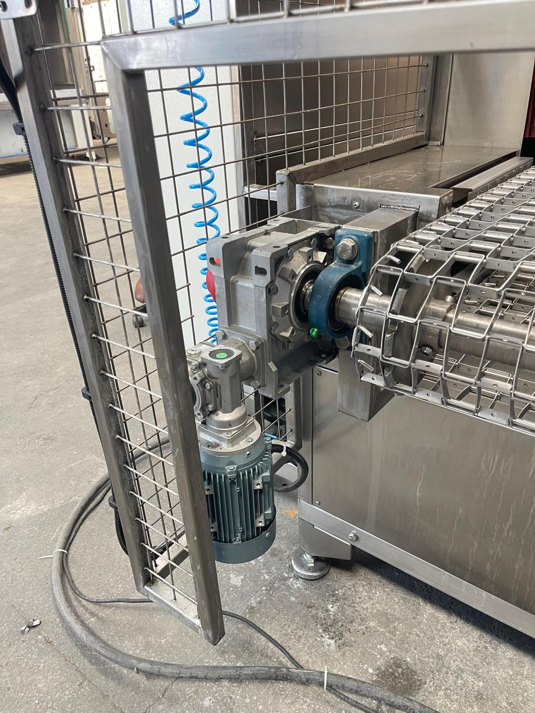

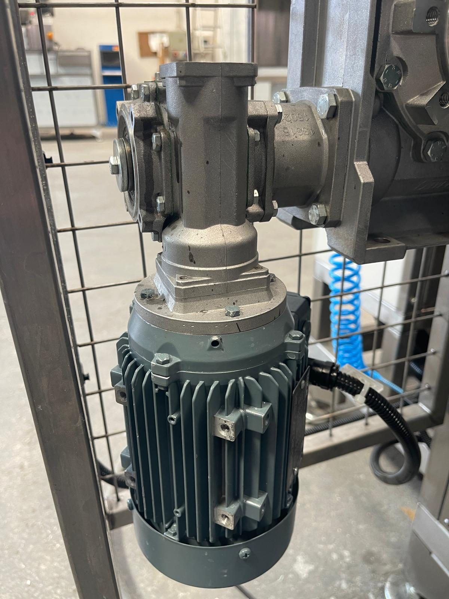

---

## 3.1.3 Waschtank (TANK 1) und Waschkammer

Die Waschzone besteht aus **TANK 1**, in dem das Prozesswasser bevorratet und erwärmt wird, der **Waschpumpe (PE02, 5,5 kW)**, die das Wasser mit Druck beaufschlagt, und der **Waschkammer**, in der das Werkstück durch Sprühen gewaschen wird. Der Tank ist mit zwei Deckeln mit Gasdruckfedern (Kennzeichnung "1") abgedeckt; im Tank befinden sich **fünf Heizstäbe mit je 8 kW** (R01–R05), ein **Füllstandsensor VEGASWING 51**, ein Schwimmer-Füllstandswächter und Filterfächer.

Wasserweg: Die Pumpe saugt das Wasser über den **Saugfilter** im Tank an, führt es durch den **Feinfilter (Beutelfilter)** am Pumpenausgang und fördert es zu den Düsenrohren in der Waschkammer. Das aus den Düsen gesprühte Wasser wäscht das in Bewegung befindliche Werkstück und fließt vom Kammerboden in den Tank zurück; die **Vorfilterkörbe** im Rücklauf halten den groben Schmutz zurück. Dieser geschlossene Kreislauf reduziert den Wasserverbrauch, erfordert jedoch die regelmäßige Reinigung der Filter (**Siehe Kapitel 10.1.3, 10.1.4**).

Die Tanktemperatur wird mit dem Thermostat **GEMO DTH2** am Bedienfeld eingestellt; die Heizungen arbeiten nur, wenn sich ausreichend Wasser im Tank befindet (**Siehe Kapitel 3.4.6**). Die Tankbefüllung erfolgt **von Hand**; eine automatische Befüllung ist nicht vorhanden. Unter dem Tank befindet sich das Ablassventil (**TAHLİYE**) mit rotem Griff.

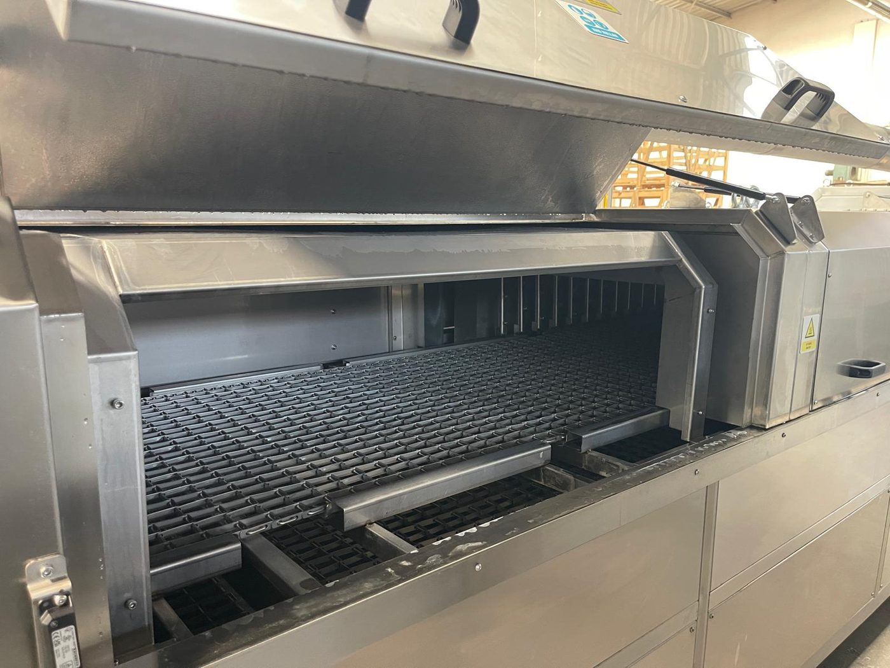

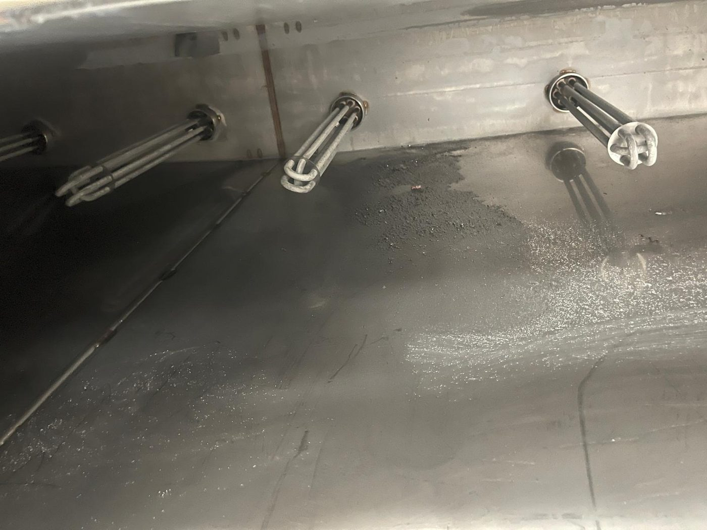

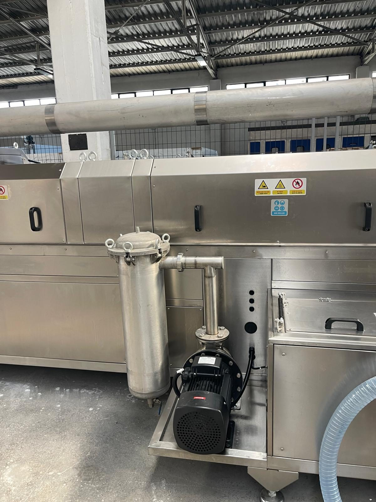

---

## 3.1.4 Spültank (TANK 2) und Spülkammer

Die Spülzone ist das Tank- und Kammersystem, in dem das nach dem Waschen auf der Werkstückoberfläche verbliebene verschmutzte Waschwasser mit sauberem Spülwasser entfernt wird. Die **Spülpumpe (PE04, 3 kW)** fördert das Wasser aus TANK 2 zu den Düsen der Spülkammer. Der Tank ist mit einem Deckel mit Gasdruckfedern (Kennzeichnung "2") abgedeckt und wird mit **zwei Heizstäben mit je 8 kW** (R06, R07) beheizt; die Temperatur wird mit einem separaten Thermostat GEMO DTH2 eingestellt.

Auch TANK 2 ist mit Füllstandsensor, Saugfilter, Feinfilter am Pumpenausgang und Ablassventil (TAHLİYE) ausgestattet; die Befüllung erfolgt von Hand. Die Qualität des Spülwassers bestimmt unmittelbar die Sauberkeit der Werkstückoberfläche; wenn das Wasser verölt oder verschmutzt ist, muss der Tank entleert und neu befüllt werden (**Siehe Kapitel 10.1.5**).

---

## 3.1.5 Ölskimmer und Ölabscheidereinheit

Der **Ölskimmer** (TANK 1 OIL SKIMMER) ist eine Scheibeneinheit, die die auf der Oberfläche des Waschtanks angesammelte Ölschicht aufnimmt und von einem **Getriebemotor mit 0,09 kW (GE06)** gedreht wird. Das Öl an der Oberfläche haftet an der Scheibe, wird abgestreift, in die Sammelrinne geleitet und aus dem Tank abgeführt. Der Ölskimmer verringert die Ölbelastung des Waschwassers, verzögert so das Verstopfen von Düsen und Filtern und verlängert die Standzeit des Prozesswassers.

Die **Ölabscheidereinheit** ist ein separater Edelstahlschrank, der neben der Maschine steht. Das aus dem Tank entnommene ölhaltige Wasser wird mit der **druckluftbetriebenen Membranpumpe** unten im Schrank in die Einheit gefördert; Öl und Wasser trennen sich aufgrund des Dichteunterschieds. Die Luftversorgung der Pumpe wird über ein Magnetventil freigegeben; der unbeschriftete Schalter am Bedienfeld schaltet den Ölabscheider ein, und die Betriebsleuchte leuchtet (**Siehe Kapitel 3.4.3**). Die Einheit ist der Druckluftverbraucher der Maschine (**Siehe Kapitel 3.3.5**).

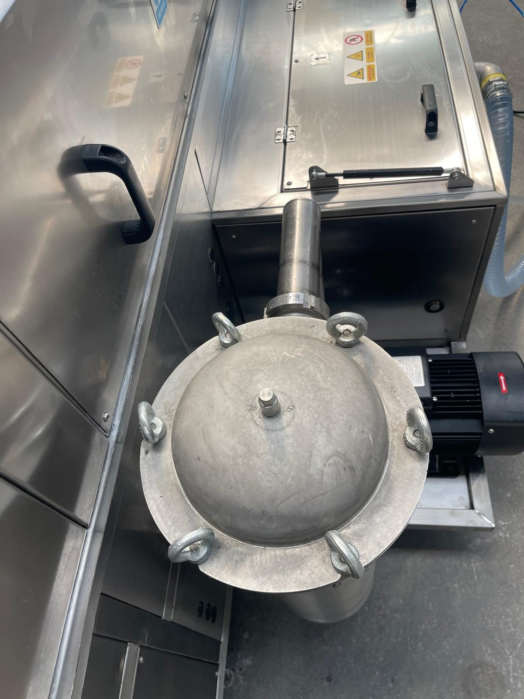

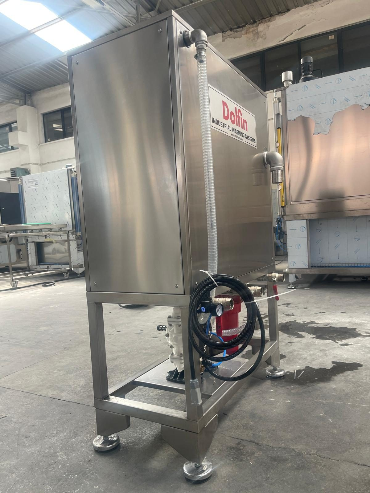

---

## 3.1.6 Trocknungseinheit — Blower und Heißluft

Die Trocknungseinheit arbeitet zweistufig. In der Stufe **Wasserabblasen** blasen **vier Blower-Motoren (FE04–FE07, je 4 kW)** Luft mit hoher Geschwindigkeit aus den Luftmesserrohren in der Kammer und entfernen das Wasser auf der Werkstückoberfläche mechanisch; diese Stufe verringert die für das Trocknen benötigte Wärmeenergie. In der Stufe **Trocknen** führen **zwei Trocknungsventilatoren (FE02, FE03, je 1,1 kW)** die über **zwei Heizungen mit je 12 kW (R21, R22)** erwärmte Heißluft in die Trocknungskammer; die Restfeuchte verdampft.

Die Temperatur der Trocknungsluft wird mit den GEMO-DTH2-Thermostaten **DRYING 1 HEATER** und **DRYING 2 HEATER** am Bedienfeld eingestellt. Die Trocknungsheizungen dürfen nicht ohne laufenden Ventilator eingeschaltet werden; andernfalls staut sich die Wärme in der Kammer (**Siehe Kapitel 7.2**). Staubablagerungen auf den Flügeln von Blowern und Trocknungsventilatoren verringern den Luftvolumenstrom; dies ist ein Wartungspunkt im 250-Stunden-Intervall (**Siehe Kapitel 9.1.3**).

| Komponente | Anzahl | Leistung | Bedienfeldschalter |
| :--- | :---: | :---: | :--- |
| Blower-Motor (FE04–FE07) | 4 | 4 kW | BLOWER 1, BLOWER 2 (zwei Gruppen — Zuordnung Schalter/Motor gemäß Schaltplan, **Siehe Kapitel 13.1**) |
| Trocknungsventilator-Motor (FE02, FE03) | 2 | 1,1 kW | DRYING 1 FAN, DRYING 2 FAN |
| Trocknungsventilator-Heizung (R21, R22) | 2 | 12 kW | DRYING 1 HEATER, DRYING 2 HEATER |

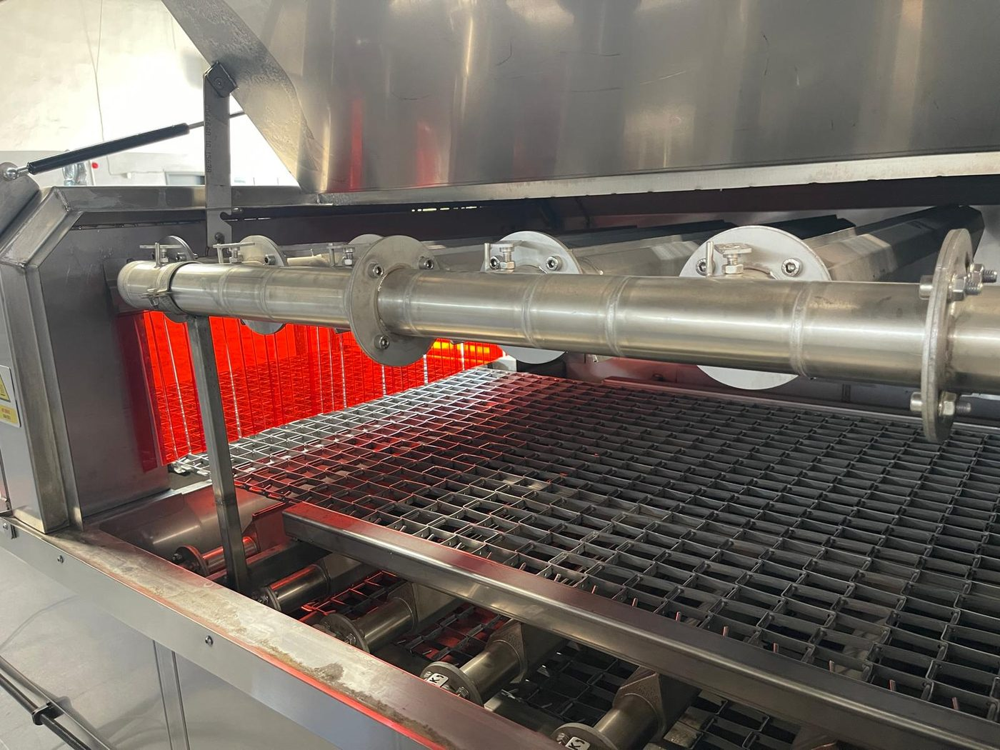

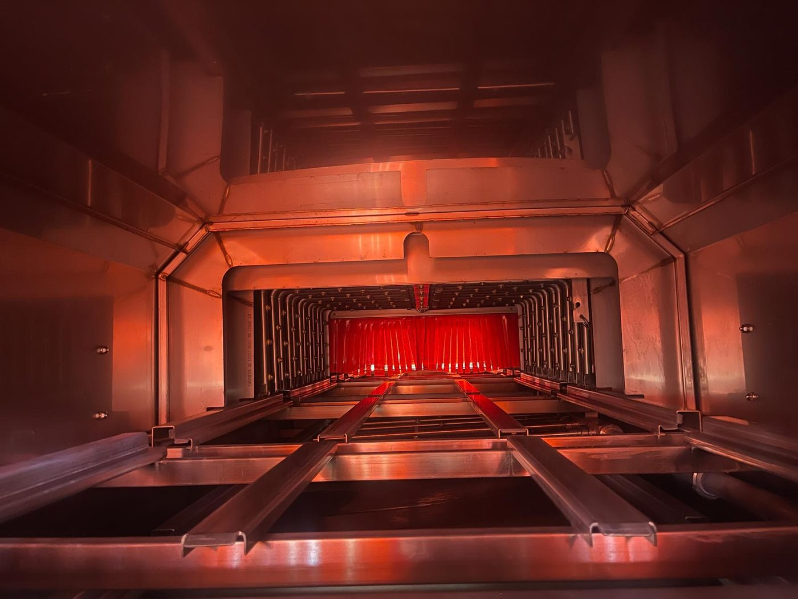

---

## 3.1.7 Abluftventilator

Der **Abluftventilator (FE01, 1,1 kW)** ist ein Radialventilator, der auf dem Abluftkamin oben auf der Maschine montiert ist. Er sammelt den in den Wasch-, Spül- und Trocknungskammern entstehenden Dampf und die feuchte Luft und führt sie über den Abluftkamin ab. Läuft die Abluft nicht, breitet sich der Dampf über die Kammerklappen und die PVC-Vorhänge in den Betrieb aus; im Schaltschrank entsteht Kondensat und der Boden wird rutschig. Der Abluftkamin muss bei der Installation an die Gebäudelüftung oder ins Freie angeschlossen werden (**Siehe Kapitel 5.3**).

Der Abluftventilator hat am Bedienfeld keinen eigenen Schalter; seine Einschaltbedingung ist im Schaltplan festgelegt ([EKSİK] — mit welcher Funktion er gemeinsam anläuft, ist anhand des Schaltplans zu verifizieren). Im Schaltschrank befinden sich ein eigener Motorschutzschalter (Q4 EGZOZ) und ein eigenes Schütz (K4) (**Siehe Kapitel 11.1.3**).

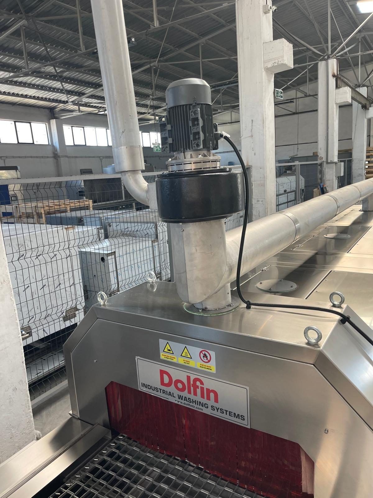

---

## 3.1.8 Schaltschrank und Steuerungsinfrastruktur

Die elektrische und steuerungstechnische Infrastruktur der Maschine ist im **Schaltschrank** (1000 × 1600 × 300 mm) auf der rechten Seite der Maschine zusammengefasst. Im Schaltschrank gibt es **kein** PLC und kein HMI; die Steuerung erfolgt mit Relais und Schützen über die EIN/AUS-Schalter am Bedienfeld. Auf der Außenseite der Schaltschranktür befinden sich der **Hauptschaltergriff** (Schneider Leistungsschalter (TMŞ) CVS250F, 250 A) und das **Bedienfeld**.

Versorgungsspannung, installierte Leistung, Hauptschalterwerte sowie die Motor- und Heizungsliste sind in **Kapitel 3.3** angegeben; die Tabelle wird in diesem Kapitel nicht wiederholt. Zusammenfassung:

- Versorgung: **380 V**, **50 Hz**, **3 Phasen**, **3P+N+PE**
- Gesamte installierte Leistung: **110 kW** (einschließlich Heizung); Schaltschrankstrom **220 A**
- Hauptschalter: **Schneider CVS250F — LV521091** (Leistungsschalter (TMŞ), 250 A)
- Steuerspannung: **220 V AC** (Schützspulen); **24 V DC** Steuerversorgung (LRS-350-24)

Die Bedienfeldschalter, Thermostate, Leuchten und die Schutzelemente im Schaltschrank sind in **Kapitel 3.4** ausführlich beschrieben.

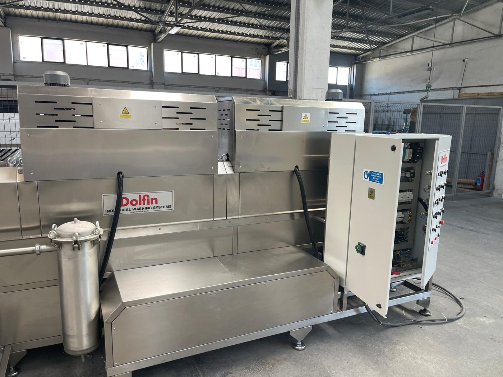

---

## 3.1.9 Not-Halt und Sicherheitsausrüstung

Die Maschine verfügt über **7 Not-Halt-Taster** (Bedienfeld, Förderereingang rechts/links, Fördererausgang rechts/links, mittlerer Bereich rechts/links) und **7 Wartungsklappen**. Jede Wartungsklappe wird mit einem magnetischen Sicherheitsschalter Omron **F3STGRNLPU21M1J8** überwacht; die Schalter sind in Reihe geschaltet und werden von zwei Sicherheitsrelais Omron **G9SB2002AACDC241** (Not-Halt-Kreis und Klappenkreis) ausgewertet. Wird eine Klappe geöffnet oder ein Not-Halt betätigt, stoppen alle Bewegungs- und Prozessausgänge; die Maschine wird nur über **RESET** am Bedienfeld wieder in den Bereitschaftszustand versetzt.

Das Reset-Verfahren, die Positionen der Not-Halt-Taster und das Verhalten nach dem Öffnen einer Klappe sind in **Kapitel 2.5**, die Übersicht der Sicherheitsausrüstung in **Kapitel 2.1.3** angegeben; die Schritte werden in diesem Kapitel nicht wiederholt. Die Klappenschalter dürfen während der Wartung nicht überbrückt werden; vor dem Öffnen einer Klappe wird **LOTO** angewendet (**Siehe Kapitel 2.4**).

---

Grenzen der bestimmungsgemäßen Verwendung siehe **Kapitel 3.2**; technische Tabellen siehe **Kapitel 3.3**; Bedienelemente siehe **Kapitel 3.4**; Aufstellungsplan siehe **Kapitel 3.5**.
