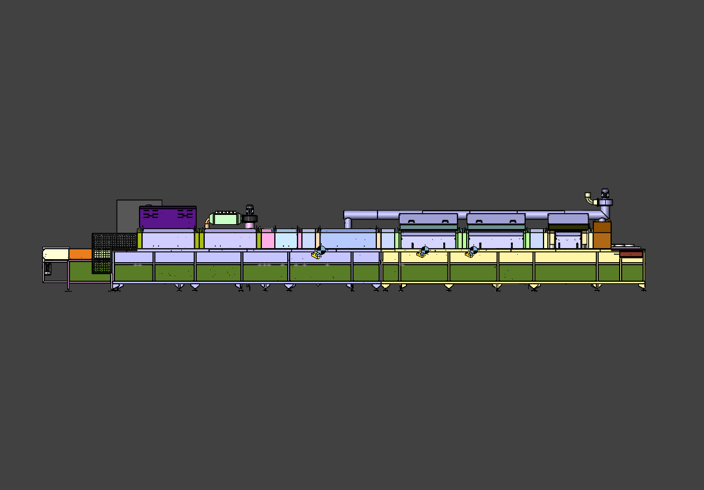
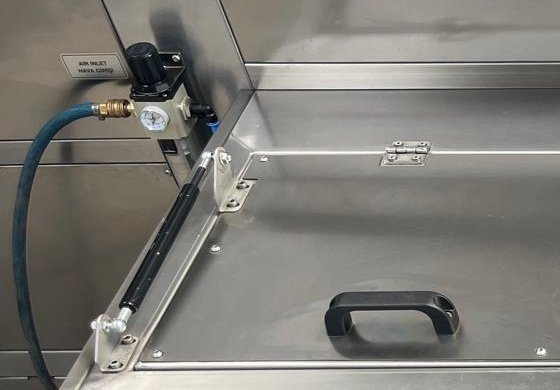

# 3.3 Technische Daten

Dieses Kapitel fasst Abmessungen, Gewicht, Kapazität, Elektrik, Motoren/Heizungen, Medienanschlüsse und Umgebungsbedingungen der Maschine **KNV 90 7500 2B** (Seriennummer **0726051**) zusammen. In den Kapiteln Installation (Kapitel 5), Einstellung (Kapitel 6), Betrieb (Kapitel 7) und Störungen (Kapitel 11) werden dieselben Zahlenwerte nicht wiederholt; die betreffenden Kapitel verweisen hierher. Mit `[EKSİK]` gekennzeichnete Werte sind anhand des Aufstellungsplans (Layout) im Lieferpaket oder des Typenschilds zu ergänzen.

---

## 3.3.1 Abmessungen und Gewicht

| Parameter | Einheit | Wert |
| :--- | :---: | ---: |
| Außenlänge (L) | mm | [EKSİK] |
| Außenbreite (W) | mm | [EKSİK] |
| Außenhöhe (H) — normal | mm | [EKSİK] |
| Leergewicht — trocken | kg | [EKSİK] |
| Betriebsgewicht — gefüllt | kg | [EKSİK] |
| Gestelltyp | — | Stellfuß |

Die Maschine wird auf **Stellfüßen** aufgestellt, die ein Ausrichten und Nivellieren ermöglichen (**Siehe Kapitel 5.2**). Bei gefüllten Tanks steigt das Betriebsgewicht erheblich; vor Transport und Lagerung müssen die Tanks entleert werden (**Siehe Kapitel 4.1**). Für die Außenabmessungen und die Aufstellfläche siehe den Aufstellungsplan (Layout) (**Siehe Kapitel 3.5, 13.2**).

---

## 3.3.2 Kapazität und Prozessparameter

| Parameter | Wert |
| :--- | :--- |
| Anzahl Prozessschritte | 4 |
| Prozessname 1 | Waschen (Düsensprühung, Werkstück in Bewegung) |
| Prozessname 2 | Spülen (Düsensprühung) |
| Prozessname 3 | Wasserabblasen (Blower) |
| Prozessname 4 | Trocknen (Trocknungsventilatoren — Heißluft) |
| Zykluszeit — nominal | [EKSİK] — abhängig von Fördergeschwindigkeit (20–60 Hz) und Linienlänge |
| Nominale Kapazität | Wird vom Kunden festgelegt |
| Maximale Kapazität | Wird vom Kunden festgelegt |
| Minimale Kapazität | Wird vom Kunden festgelegt |
| Produktformat / Verpackungsart | Wird vom Kunden festgelegt |
| Produktabmessung min / max | Wird vom Kunden festgelegt |
| Produktgewicht min / max | Wird vom Kunden festgelegt |

Die Zykluszeit ist die Zeit, die ein Werkstück auf dem Förderer für den Durchlauf der Linie Waschen → Spülen → Wasserabblasen → Trocknen benötigt, und hängt von der Fördergeschwindigkeit ab, die der Bediener mit dem Potentiometer wählt. Mit sinkender Geschwindigkeit nehmen Kontaktzeit und Reinigungswirkung zu, die Stückzahl pro Stunde nimmt ab. Die Kapazitätsplanung ist in **Kapitel 8** erläutert.

---

## 3.3.3 Elektrische Daten

| Parameter | Wert |
| :--- | :--- |
| Versorgungsspannung | 380 V |
| Versorgungsfrequenz | 50 Hz |
| Phasenzahl | 3 |
| Versorgungskonfiguration | 3P+N+PE |
| Gesamte installierte Leistung | 110 kW |
| Gesamte installierte Leistung — einschließlich Heizung | 110 kW |
| Maximale Stromaufnahme | 220 A |
| Gesamtstrom Schaltschrank | 220 A |
| Leistungsfaktor (cos φ) | [EKSİK] |
| Kurzschlussstrom / ICC-Anforderung | [EKSİK] |
| Hauptschalter | Schneider **EasyPact CVS250F — LV521091** (Leistungsschalter (TMŞ), 250 A); Türgriff LV521101 |
| Steuerkreisspannung | 220 V AC (Schützspulen) |
| Steuerversorgung | 24 V DC — LRS-350-24 (14,6 A) |
| Phasenüberwachung | Phasenfolgerelais MKR-01 |
| Gesamtsicherung / Leistungsschalter | Gemäß Motor- und Heizungszeilen (**Siehe Kapitel 3.3.4**); Schaltschrank-Leistungsschalter (TMŞ) 250 A |
| USV-/Generatoranforderung | Nein |

Die elektrische Versorgung wird bei der Installation mit einer 380-V-, 50-Hz-Dreiphasenleitung an die Eingangsklemmen des Schaltschranks angeschlossen. Die Phasenfolge wird vom **Phasenfolgerelais MKR-01** überwacht; bei falscher Phasenfolge oder fehlender Phase gibt das Relais kein Ausgangssignal und die Funktionen werden nicht freigegeben (**Siehe Kapitel 5.3.4, 11.3.1**). Energietrennung und LOTO-Punkt ist der Hauptschaltergriff an der Schaltschranktür (**Siehe Kapitel 2.4**). Die Heizungsgruppen sind mit Fehlerstrom-Schutzschaltern (RCCB A9N19642 / A9N19643) geschützt.

---

## 3.3.4 Motor-, Antriebs- und Heizungsliste

**Motoren und Schutzelemente** (Schneider, sofern nicht anders angegeben)

| Code | Motor | Leistung | Strom | Motorschutzschalter (MKŞ) / Antrieb | Schütz |
| :--- | :--- | ---: | ---: | :--- | :--- |
| GE01 | Getriebemotor Förderer | 0,25 kW | 0,50 A | Frequenzumrichter Delta VFD004EL21W-1 (0,4 kW); Sicherung A9F74106 1×6 | — |
| PE02 | Motor Waschpumpe | 5,50 kW | 11,10 A | MKŞ GV2ME16 (9–14 A) + GVAE11 | LC1K1610M7 (16 A) |
| PE04 | Motor Spülpumpe | 3,00 kW | 6,10 A | MKŞ GV2ME14 (6–10 A) + GVAE11 | LC1K1610M7 (16 A) |
| FE01 | Motor Abluftventilator | 1,10 kW | 2,30 A | MKŞ GV2ME07 (1,6–2,5 A) + GVAE11 | LC1K0610M7 (6 A) |
| GE06 | Getriebemotor Ölskimmer | 0,09 kW | 0,46 A | MKŞ GV2ME04 (0,4–0,63 A) + GVAE11 | LC1K0610M7 (6 A) |
| FE02 | Motor Trocknungsventilator 1 | 1,10 kW | 2,30 A | MKŞ GV2ME07 + GVAE11 | LC1K0610M7 |
| FE03 | Motor Trocknungsventilator 2 | 1,10 kW | 2,30 A | MKŞ GV2ME07 + GVAE11 | LC1K0610M7 |
| FE04 | Blower-Motor 1 | 4,00 kW | 8,00 A | MKŞ GV2ME14 (6–10 A) + GVAE11 | LC1K1610M7 (16 A) |
| FE05 | Blower-Motor 2 | 4,00 kW | 8,00 A | MKŞ GV2ME14 + GVAE11 | LC1K1610M7 |
| FE06 | Blower-Motor 3 | 4,00 kW | 8,00 A | MKŞ GV2ME14 + GVAE11 | LC1K1610M7 |
| FE07 | Blower-Motor 4 | 4,00 kW | 8,00 A | MKŞ GV2ME14 + GVAE11 | LC1K1610M7 |

Motordrehzahlen und Marke/Modell: [EKSİK] — Motortypenschild / Stückliste. Beschriftungen der Motorschutzschalter im Schaltschrank: Q1 YIKAMA POM. (Waschpumpe), Q2 DURULAMA POM. (Spülpumpe), Q3 SIYIRICI (Skimmer), Q4 EGZOZ (Abluft), Q5 KURUTMA FAN 1, Q6 KURUTMA FAN 2 (Trocknungsventilator 1/2), Q7–Q10 BLOWER 1–4 (**Siehe Kapitel 11.1.3**).

**Heizungen (Heizstäbe)**

| Code | Heizung | Leistung | Strom | Schütz | Sicherung |
| :--- | :--- | ---: | ---: | :--- | :--- |
| R01–R05 | TANK 1 (Waschen) 1.–5. Heizung | 5 × 8 kW | 16 A (je) | LC1K1610M7 | A9F74316 (16 A) |
| R06–R07 | TANK 2 (Spülen) 1.–2. Heizung | 2 × 8 kW | 16 A (je) | LC1K1610M7 | A9F74316 (16 A) |
| R21 | Heizung Trocknungsventilator 1 | 12 kW | 24 A | LC1D25M7 (25 A) | A9F74325 (25 A) |
| R22 | Heizung Trocknungsventilator 2 | 12 kW | 24 A | LC1D25M7 (25 A) | A9F74325 (25 A) |

Die Tankheizstäbe sind vom Typ **REZİSTANS KOMPLESİ 8000 W 50 cm düz dikişsiz** (Heizstab-Komplettsatz 8000 W, 50 cm, gerade, nahtlos) (07 15142). Die Heizungsgruppen sind mit Fehlerstrom-Schutzschaltern geschützt; bei einem Isolationsfehler löst der betreffende RCCB aus (**Siehe Kapitel 11.3.3**). Die Temperaturregelung erfolgt mit GEMO-DTH2-Thermostaten und Thermoelementen (ETB30F06-5Ç / -4Ç) (**Siehe Kapitel 3.4.4**).

---

## 3.3.5 Druckluft und Wasser

| Parameter | Wert |
| :--- | :--- |
| Drucklufteingang | 6 bar |
| Luftanschlussstelle | Regler **AIR INLET / HAVA GİRİŞİ** (mit Manometer) am Maschinengehäuse |
| Druckluftverbraucher | Membranpumpe der Ölabscheidereinheit (über Magnetventil gesteuert) |
| Wassereingangsdruck | 1 bar |
| Wassertemperatur min / max | +10 °C – +70 °C |
| Wasserqualität | Leitungswasser oder aufbereitetes Wasser |
| Tankbefüllung | Von Hand — kein automatisches Füllventil |
| Durchmesser Ablass-/Abwasserleitung | Siehe Aufstellungsplan (Layout) [EKSİK] |
| Anschlussdaten Druckluft und Wasser (Durchmesser, Position) | Siehe Aufstellungsplan (Layout) [EKSİK] |

Die Druckluft versorgt über den Regler am Maschinengehäuse die Membranpumpe der Ölabscheidereinheit; ein Hydraulik- oder Vakuumsystem ist nicht vorhanden. Die Schritte zum Luftanschluss sind in **Kapitel 5.3.1**, die Reglereinstellung in **Kapitel 6.5** angegeben. Das Wasser wird von Hand in die Tanks gefüllt; die Tankentleerung erfolgt über die Ablassventile (**TAHLİYE**) unter den Tanks, und das Abwasser wird gemäß den örtlichen Vorschriften entsorgt (**Siehe Kapitel 10.1.8**).

---

## 3.3.6 Umgebungsbedingungen

| Parameter | Min | Max |
| :--- | :---: | :---: |
| Betriebstemperatur | +10 °C | +30 °C |
| Lagertemperatur | +10 °C | +30 °C |
| Relative Luftfeuchte | 30 % | 50 % |

| Parameter | Wert |
| :--- | :--- |
| Schutzart (IP) | IP55 |
| Schallpegel | 65 dB(A) |
| Schutzart Schaltschrank | [EKSİK] |

Die Maschine ist ausschließlich für den Einsatz in **geschlossenen, geschützten Innenräumen** ausgelegt. Die minimalen Freiräume und die Deckenhöhe der Aufstellfläche sind in **Kapitel 3.5.2** angegeben; die Grenzen der bestimmungsgemäßen Verwendung sind in **Kapitel 3.2** zusammengefasst.

---

Bedienelemente siehe **Kapitel 3.4**; Aufstellungsplan siehe **Kapitel 3.5**.
