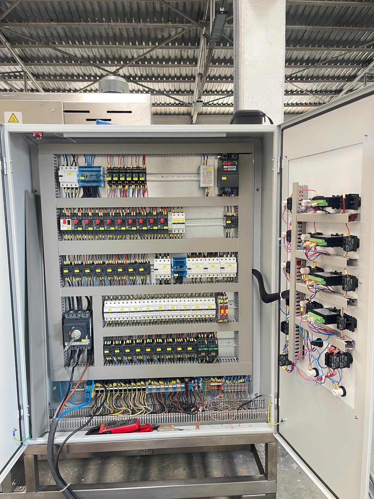
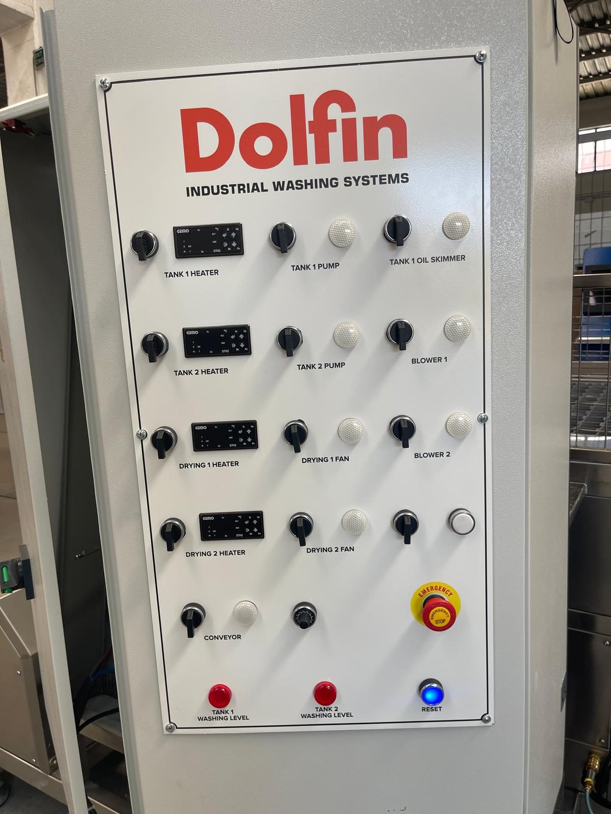
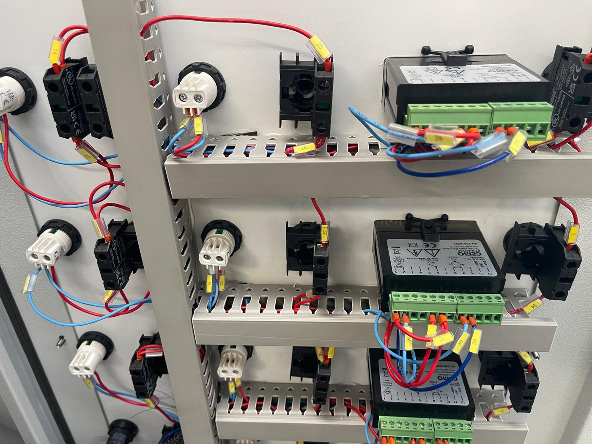
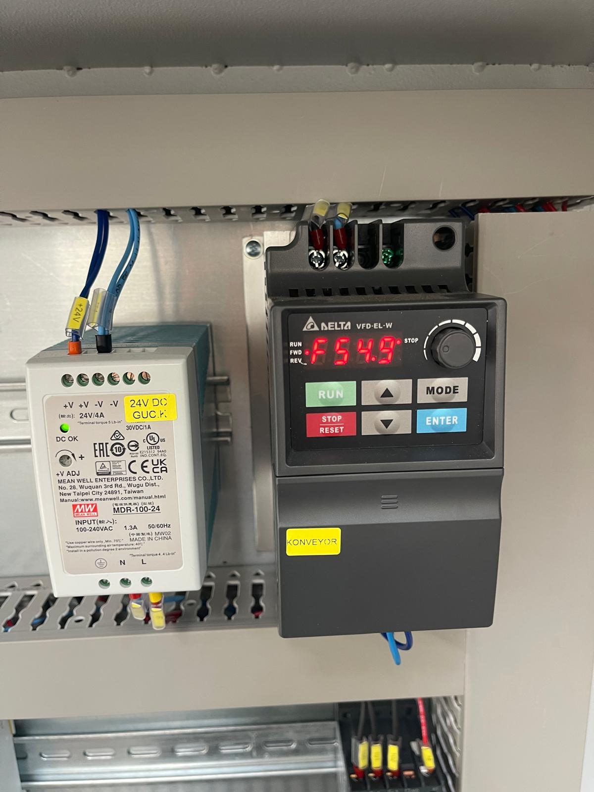

# 3.4 Makine kontrolleri

Makinenin operasyonel kontrolü, elektrik panosu kapağı üzerindeki **operatör paneli** ile yapılır. Bu makinede **PLC veya HMI yoktur**; kumanda röle ve kontaktörlerle gerçekleştirilir ve her proses fonksiyonu için ayrı bir **aç/kapa anahtarı** ile yanında bir **çalışma (run) lambası** bulunur. Isıtma sıcaklıkları dört adet **GEMO DTH2** dijital termostat ile ayarlanır; konveyör hızı bir **potansiyometre** ile seçilir. Makine durumu, pano üzerindeki kırmızı seviye uyarı lambaları ve mavi RESET lambası ile izlenir.

Bu mimari, operatöre her fonksiyonu bağımsız açıp kapatma esnekliği verir; ancak otomatik sekans olmadığından başlatma sırası ve interlock koşulları operatör tarafından bilinmelidir (**Bkz. Bölüm 7.2**). Güvenlik fonksiyonları **Bölüm 2**'de, arıza teşhisi **Bölüm 11**'de açıklanmıştır.

---

## 3.4.1 Kontrol panosu — genel yapı

| Parametre | Değer |
| :--- | :--- |
| Ana kontrol panosu konumu | Makineye karşıdan bakıldığında **sağ taraf** — operatör bu taraftan kumanda eder |
| Pano boyutları (G × Y × D) | 1000 × 1600 × 300 mm |
| Pano koruma sınıfı (IP) | [EKSİK] |
| Ana şalter | Pano kapağı dışında döner kol — TMŞ Schneider CVS250F (LV521091), pano içi |
| HMI / PLC | Yok |
| Operatör paneli dili | İngilizce etiketler |
| Şifre seviyeleri | Yok |
| Mod seçici (Manuel / Otomatik / Bakım) | Yok — operatör fonksiyonları ayrı ayrı yönetir |
| Jog / inching düğmeleri | Yok |
| Tepe lambası | Yok — durum pano lambaları ile |

Elektrik panosu; güç dağıtımı, motor koruma şalterleri, kontaktörler, kaçak akım röleleri, ısıtıcı sigortaları, konveyör inverteri, faz sıra rölesi, 24 V DC güç kaynağı ve iki emniyet rölesini barındırır (**Bkz. Bölüm 3.4.8**). Pano kapağında "PANOLARIN KAPAKLARINI KİLİTLİ TUTUNUZ" ve "YÜKSEK VOLTAJ" etiketleri bulunur; kapak çalışma sırasında kilitli tutulur ve yalnızca yetkili elektrikçi LOTO altında açar (**Bkz. Bölüm 2.4**).

---

## 3.4.2 Operatör paneli yerleşimi

Operatör paneli, pano kapağının üst kısmında Dolfin logolu bir plaka üzerindedir. Anahtarlar beş satır hâlinde düzenlenmiştir; her satır bir proses grubuna karşılık gelir. Aşağıdaki tablo paneli yukarıdan aşağıya ve soldan sağa listeler.

| Satır | Sol | Orta | Sağ |
| :---: | :--- | :--- | :--- |
| 1 | **TANK 1 HEATER** — anahtar + GEMO DTH2 termostat | **TANK 1 PUMP** — anahtar + run lambası | **TANK 1 OIL SKIMMER** — anahtar + run lambası |
| 2 | **TANK 2 HEATER** — anahtar + GEMO DTH2 termostat | **TANK 2 PUMP** — anahtar + run lambası | **BLOWER 1** — anahtar + run lambası |
| 3 | **DRYING 1 HEATER** — anahtar + GEMO DTH2 termostat | **DRYING 1 FAN** — anahtar + run lambası | **BLOWER 2** — anahtar + run lambası |
| 4 | **DRYING 2 HEATER** — anahtar + GEMO DTH2 termostat | **DRYING 2 FAN** — anahtar + run lambası | **Etiketsiz anahtar** — yağ ayırıcı ünitesi + run lambası |
| 5 | **CONVEYOR** — anahtar + run lambası | **Hız potansiyometresi** (konveyör) | **EMERGENCY STOP** — kırmızı mantar buton |
| 6 | **TANK 1 WASHING LEVEL** — kırmızı lamba | **TANK 2 WASHING LEVEL** — kırmızı lamba | **RESET** — mavi buton / lamba |

---

## 3.4.3 Fonksiyon anahtarları ve çalışma lambaları

Her anahtar iki konumludur: **OFF** (kapalı) ve **ON** (açık). Anahtar ON konumuna alındığında ilgili kontaktör çeker ve yanındaki beyaz **run lambası** yanar. Lamba, anahtarın değil **çıkışın** durumunu gösterir: anahtar ON iken lamba yanmıyorsa interlock (seviye, emniyet zinciri) veya koruma elemanı (MKŞ, kaçak akım) devreye girmiş demektir (**Bkz. Bölüm 11.1**).

| Anahtar | Türkçe karşılık | Çalıştırdığı birim | Koşul / not |
| :--- | :--- | :--- | :--- |
| TANK 1 HEATER | Yıkama tankı ısıtıcısı | R01–R05 rezistansları (termostat kontrollü) | TANK 1'de yeterli su olmalı; set sıcaklığa ulaşınca termostat keser |
| TANK 1 PUMP | Yıkama pompası | PE02 (5,5 kW) | TANK 1'de yeterli su olmalı; pompa vanaları açık |
| TANK 1 OIL SKIMMER | Yağ sıyırıcı | GE06 redüktör motoru | Yıkama tankı yüzeyinde yağ varken |
| TANK 2 HEATER | Durulama tankı ısıtıcısı | R06–R07 rezistansları | TANK 2'de yeterli su olmalı |
| TANK 2 PUMP | Durulama pompası | PE04 (3 kW) | TANK 2'de yeterli su olmalı |
| BLOWER 1 | Blower grubu 1 | Blower motorları (FE04–FE07 içinden — şema) | Su sıyırma |
| BLOWER 2 | Blower grubu 2 | Blower motorları (FE04–FE07 içinden — şema) | Su sıyırma |
| DRYING 1 HEATER | Kurutma 1 ısıtıcısı | R21 (12 kW, termostat kontrollü) | DRYING 1 FAN açıkken kullanın |
| DRYING 1 FAN | Kurutma 1 fanı | FE02 (1,1 kW) | — |
| DRYING 2 HEATER | Kurutma 2 ısıtıcısı | R22 (12 kW, termostat kontrollü) | DRYING 2 FAN açıkken kullanın |
| DRYING 2 FAN | Kurutma 2 fanı | FE03 (1,1 kW) | — |
| Etiketsiz anahtar | Yağ ayırıcı ünitesi | Diyaframlı pompa solenoid valfi | 6 bar hava bağlı olmalı |
| CONVEYOR | Konveyör | GE01 — inverter üzerinden | Hız potansiyometre ile; hat boş ve RESET lambası yanık |

Egzoz fanının panelde ayrı anahtarı yoktur ([EKSİK] — çalışma koşulu elektrik şemasından). Anahtarların açılış sırası ve interlock mantığı **Bölüm 7.2**'de verilir.

---

## 3.4.4 Termostatlar — GEMO DTH2

Dört ısıtıcı anahtarının yanında birer **GEMO DTH2** dijital termostat bulunur. Termostat, ilgili tank veya kurutma havası sıcaklığını termokupl (ETB30F06-5Ç / -4Ç) ile ölçer ve set değere ulaşıldığında ısıtıcı kontaktörünü keser; sıcaklık düştüğünde yeniden devreye alır. Böylece ısıtıcı anahtarı ON konumunda kalsa bile sıcaklık set değerde tutulur.

| Termostat | Kontrol ettiği ısıtıcı | Set değer aralığı |
| :--- | :--- | :--- |
| TANK 1 HEATER | R01–R05 (yıkama tankı) | [EKSİK] — proses gereksinimine göre; su sıcaklığı +70 °C'yi aşmamalı (**Bkz. Bölüm 3.3.5**) |
| TANK 2 HEATER | R06–R07 (durulama tankı) | [EKSİK] — +70 °C'yi aşmamalı |
| DRYING 1 HEATER | R21 (kurutma 1) | [EKSİK] |
| DRYING 2 HEATER | R22 (kurutma 2) | [EKSİK] |

Set değeri, termostat üzerindeki yukarı/aşağı ok tuşları ile girilir; ekran anlık sıcaklığı gösterir. Ayar prosedürü **Bölüm 6.3.3**'te verilmiştir. Termostat set değere ulaştığını gösterirken su ısınmaya devam ediyorsa termostat veya kontaktör arızası vardır (**Bkz. Bölüm 11.1.2 — Arıza 5**).

---

## 3.4.5 Sinyal lambaları ve RESET

| Lamba / buton | Renk | Anlam | Operatör eylemi |
| :--- | :---: | :--- | :--- |
| Run lambaları (her anahtar yanında) | Beyaz | İlgili çıkış devrede | Anahtar ON iken sönükse interlock/koruma kontrolü (**Bkz. Bölüm 11.1**) |
| TANK 1 WASHING LEVEL | Kırmızı | Yıkama tankı su seviyesi yetersiz | TANK 1'i elle doldurun; ısıtıcı ve pompa çalışmaz |
| TANK 2 WASHING LEVEL | Kırmızı | Durulama tankı su seviyesi yetersiz | TANK 2'yi elle doldurun; ısıtıcı ve pompa çalışmaz |
| RESET | Mavi | Yanık: emniyet zinciri kapalı, makine hazır. Sönük: acil stop basılı, kapak açık veya reset bekleniyor | Nedeni giderin; RESET'e lamba yanana kadar basın (**Bkz. Bölüm 2.5**) |

RESET lambası, bu makinenin **genel hazır göstergesidir**. Acil stop veya herhangi bir bakım kapağı emniyet zincirini açtığında lamba söner ve tüm çıkışlar kesilir; reset ile güvenli durum onaylanmadan hiçbir fonksiyon çalışmaz. Tepe lambası bulunmadığından operatör, hat durumunu bu lambalardan ve run lambalarından izler.

---

## 3.4.6 Proses kilitlemeleri (interlock)

Makine, otomasyon yazılımı olmaksızın aşağıdaki donanımsal kilitlemelerle korunur:

| Kilitleme | Koşul | Sonuç |
| :--- | :--- | :--- |
| Tank seviye interlock'u | TANK 1 veya TANK 2'de yeterli su yok (VEGASWING 51) | İlgili tankın ısıtıcıları ve pompası çalıştırılamaz; kırmızı WASHING LEVEL lambası yanar |
| Kapak emniyet zinciri | Herhangi bir bakım kapağı açık veya switch hizasız | Tüm hareket ve proses çıkışları durur; RESET lambası söner |
| Acil stop zinciri | 7 acil stoptan biri basılı | Tüm hareket ve proses çıkışları durur; RESET lambası söner |
| Faz koruma | Faz sırası ters veya faz eksik (MKR-01) | Pano çıkış vermez; fonksiyonlar devreye girmez |
| Termostat | Set sıcaklığa ulaşıldı | İlgili ısıtıcı kontaktörü kesilir (anahtar ON kalır) |
| Motor koruma (MKŞ) | Aşırı akım / kısa devre | İlgili motor beslemesi kesilir; run lambası söner |
| Kaçak akım (RCCB) | Isıtıcı izolasyon hatası | İlgili ısıtıcı grubu beslemesi kesilir |

Seviye interlock'u, rezistansların susuz çalışmasını ve pompanın kuru çalışmasını önler; bu nedenle seviye sensörü asla köprülenmez. Interlock'lara rağmen çalışmayan fonksiyon için **Bölüm 11.1.2** arıza tablosuna bakın.

---

## 3.4.7 Konveyör hız ayarı

| Parametre | Değer |
| :--- | :--- |
| Ayar elemanı | Operatör paneli potansiyometresi (CONVEYOR anahtarı yanında) |
| Sürücü | Delta VFD004EL21W-1 (0,4 kW) — pano içi |
| Ayar aralığı | **20–60 Hz** inverter çıkış frekansı |
| Yön ayarı | Fabrika ayarı — inverter parametresi; operatör değiştirmez |

Potansiyometre saat yönünde çevrildikçe inverter çıkış frekansı ve konveyör hızı artar. **20 Hz altına** düşürülürse motor torku yük altında yetersiz kalır ve konveyör durabilir; bu nedenle bu aralık dışında kullanmayın. Hız, parçanın hücre içindeki temas süresini ve dolayısıyla temizlik/kuruluk sonucunu belirler (**Bkz. Bölüm 8**). İnverter alarm kodları için Delta kılavuzuna bakın (**Bkz. Bölüm 11.3.2**).

---

## 3.4.8 Pano içi ana bileşenler

| Bileşen | Marka / model | İşlev |
| :--- | :--- | :--- |
| Ana şalter (TMŞ) | Schneider EasyPact CVS250F — LV521091 (250 A); kapı kolu LV521101 | Enerji kesme ve LOTO noktası (**Bkz. Bölüm 2.4**) |
| Faz sıra / koruma rölesi | MKR-01 | Faz sırası ve faz kaybı koruması |
| Motor koruma şalterleri (MKŞ) | Schneider GV2ME04 / GV2ME07 / GV2ME14 / GV2ME16 + GVAE11 yardımcı kontak | Motor aşırı akım ve kısa devre koruması — Q1…Q10 (**Bkz. Bölüm 11.1.3**) |
| Kontaktörler | Schneider LC1K0610M7, LC1K1610M7, LC1D25M7 (220 V bobin) | Motor ve ısıtıcı anahtarlama |
| Kaçak akım röleleri (RCCB) | Schneider A9N19642 (4P — motor grubu, kurutma 1/2), A9N19643 (4P — tank rezistansları) | İzolasyon hatası koruması |
| Isıtıcı sigortaları | A9F74316 (16 A — tank rezistansları), A9F74325 (25 A — kurutma ısıtıcıları) | Aşırı akım koruması |
| Konveyör inverteri | Delta VFD004EL21W-1 (0,4 kW); sigorta A9F74106 | Konveyör hız kontrolü |
| Kontrol güç kaynağı | LRS-350-24 (24 V DC, 14,6 A); sigorta A9F74160 / A9F74110 | Kontrol devresi beslemesi |
| Emniyet röleleri (2 adet) | Omron G9SB2002AACDC241 (G9SX) | Acil stop zinciri ve kapak switch zinciri |
| Termostatlar (4 adet) | GEMO DTH2 | Tank 1, Tank 2, kurutma 1, kurutma 2 sıcaklık kontrolü |
| Acil stop butonu (pano) | P1EC400E40K + kontak blokları | Operatör paneli acil stop |
| Reset butonu | BL901M + mavi sinyal lambası | Emniyet zinciri reset / hazır göstergesi |

Pano içi müdahale yalnızca yetkili elektrikçi tarafından, LOTO altında yapılır (**Bkz. Bölüm 2.4**). Yedek parça kodları **Bölüm 13.3**'te verilmiştir.

---

## 3.4.9 Çalışma modları ve start/stop

| Parametre | Değer |
| :--- | :--- |
| Genel START / STOP butonu | Yok — her fonksiyon kendi anahtarı ile açılır/kapatılır |
| Otomatik mod | Yok — tek komutla tüm hat çalışmaz |
| Manuel mod | Makinenin tek çalışma biçimi — operatör anahtarları interlock'lara uyarak açar |
| Bakım / setup modu | Yok — bakımda ana şalter kapatılır ve LOTO uygulanır (**Bkz. Bölüm 2.4**) |
| Step / tek adım modu | Yok |
| Reçete / program kaydı | Yok — set değerleri termostatlar ile |
| Trend / log kaydı | Yok |
| Uzaktan erişim | Hayır |

Başlatma sırası ve kapatma sırası **Bölüm 7.2** ve **7.3**'te tanımlanmıştır.

---

## 3.4.10 Acil durdurma

Makinede **7 adet acil stop butonu** bulunur (operatör paneli, konveyör giriş sağ/sol, çıkış sağ/sol, orta bölge sağ/sol). Acil stop'a basıldığında tüm hareket ve proses çıkışları durur; RESET lambası söner.

Reset prosedürü, acil stop sonrası yeniden başlatma koşulları ve operatör yükümlülükleri **Bölüm 2.5**'te verilmiştir; bu bölümde adımlar tekrarlanmaz.

---

Elektrik besleme değerleri için bkz. **Bölüm 3.3.3**; başlatma/durdurma prosedürleri için bkz. **Bölüm 7**; arıza teşhisi için bkz. **Bölüm 11**.
