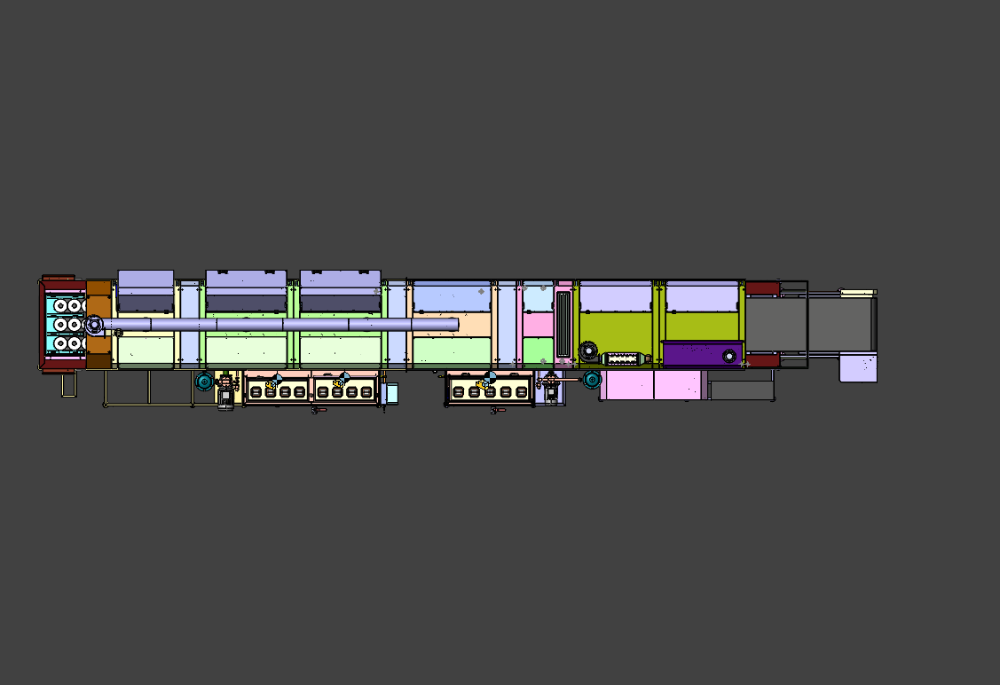
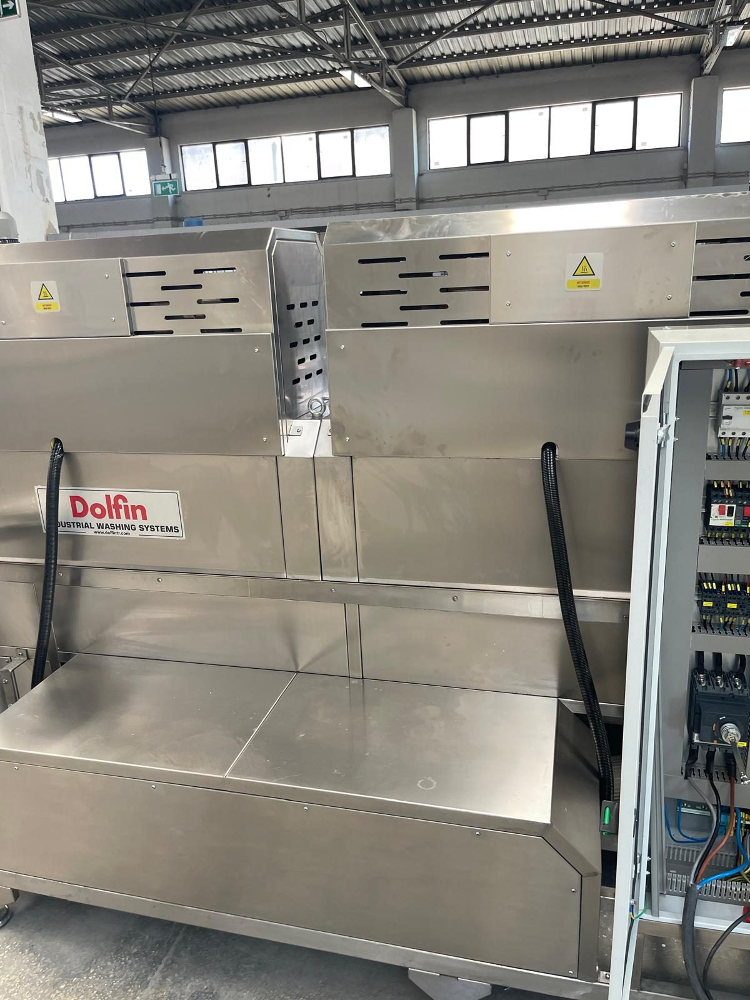

# 3.5 Aufstellungsplan der Maschine

Dieses Kapitel definiert die Positionierung der Maschine in der Anlage, die Richtungsdefinitionen, die minimalen Freiräume, den Wartungszugang und die Transporteinschränkungen. Die Kapitel Installation (Kapitel 5) und Transport (Kapitel 4) beziehen den Platzbedarf von hier; dieselben Werte werden nicht wiederholt.

**Referenzzeichnung:** Dateiname des Gesamtaufstellungsplans [EKSİK] — Aufstellungsplan (Layout) im Lieferpaket (**Siehe Kapitel 13.2**).

---

## 3.5.1 Richtungsdefinitionen und Bedienerseite

Die Maschinenrichtungen, die Förderrichtung und die Zugangsseite des Bedieners werden bei der Planung von Installation, Betrieb und Wartung als gemeinsame Referenz verwendet. In allen Texten des Handbuchs gelten die folgenden Definitionen. "Blick von vorn" ist der Blick auf die Maschine von der langen Seite, an der sich der Schaltschrank befindet.

| Definition | Richtung / Position |
| :--- | :--- |
| Bedienerseite | Rechts — Schaltschrank und Bedienfeld |
| Beschickungsseite (Eingang) | Links — Werkstückeingang |
| Entnahmeseite (Ausgang) | Rechts — Werkstückausgang |
| Förderrichtung | Links → Rechts |
| Ölabscheidereinheit | Separater Schrank neben der Maschine — über Schlauch und Luftleitung verbunden |

Die Werkstücke werden von der linken Seite von Hand auf den Förderer gelegt, durchlaufen die Zonen Waschen → Spülen → Wasserabblasen → Trocknen und werden auf der rechten Seite von Hand entnommen. Zwischen den Belade- und Entnahmestellen des Bedieners muss ein sicherer Gehweg vorhanden sein; dieser Weg darf sich nicht mit dem Wartungsbereich vor den Tanks überschneiden.

Der Bediener erreicht das Bedienfeld, den Hauptschaltergriff und den Schaltschrank **von der rechten Seite**. Die Maschine hat keine Signalsäule; die RESET- und Füllstandleuchten sind nur von der Vorderseite des Bedienfelds sichtbar. Die Arbeitsposition des Bedieners muss deshalb im Sichtbereich des Bedienfelds geplant werden.

---

## 3.5.2 Minimale Freiräume und Deckenhöhe

Bei der Planung der Aufstellfläche sind die folgenden minimalen Freiräume einzuhalten. Diese Werte sind für das Anheben und Öffnen der Wartungsklappen von Hand, das Öffnen der Tankdeckel, den Filterzugang, das vollständige Öffnen der Schaltschranktür und die sichere Bewegung des Personals erforderlich.

| Bereich | Minimaler Freiraum |
| :--- | :--- |
| Vorn (Bediener-/Schaltschrankseite) | [EKSİK] mm |
| Hinten | [EKSİK] mm |
| Seite — Eingang (links) | [EKSİK] mm |
| Seite — Ausgang (rechts) | [EKSİK] mm |
| Deckenhöhe | [EKSİK] mm — Abluftkamin und Kaminanschluss sind zu berücksichtigen |

| Zusätzliche Anforderung | Wert |
| :--- | :--- |
| Mindestgröße der Aufstellfläche | [EKSİK] m × m |
| Bodenebenheitstoleranz | [EKSİK] mm/m |
| Bodentragfähigkeit | [EKSİK] — für Betriebsgewicht (Tanks gefüllt) und dynamische Lasten |
| Bodenoberfläche | Hart, eben, wasserbeständig; Entwässerung im Tankbereich empfohlen |

Die Bodentragfähigkeit muss ausreichen, um das gefüllte Betriebsgewicht der Maschine (**Siehe Kapitel 3.3.1**) und die von Pumpen/Ventilatoren verursachten dynamischen Lasten zu tragen. Die Nivellierung erfolgt über die Stellfüße (**Siehe Kapitel 5.2**). Für die Ölabscheidereinheit sind neben der Maschine zusätzlicher Platz und die Trasse für Schlauch/Luftleitung zu planen.

---

## 3.5.3 Wartungszugangsbereiche

| Bereich | Zugang |
| :--- | :--- |
| Obere Deckel Tank 1 und Tank 2 | Deckel mit Gasdruckfedern — Zugang zu Vorfilter, Saugfilter, Heizstäben und Füllstandsensor |
| Wartungsklappen der Kammern (7 Stück) | Werden von Hand angehoben und geöffnet; mit magnetischem Sicherheitsschalter — Zugang zu Düsen, Blower-Rohr und Drahtgurt |
| Pumpen- und Feinfilterbereich | Neben dem Tank — Beutelfiltergehäuse und Pumpe |
| Schaltschrank | Rechte Seite — Fläche für das vollständige Öffnen der Tür |
| Fördergetriebe und Schmiernippel | Ein- und Ausgangsenden des Förderers — innerhalb des Schutzgitters |
| Abluftventilator und Abluftkamin | Oben auf der Maschine — Deckenhöhe und Bedarf an Zugangsbühne/Leiter |
| Ölabscheidereinheit | Separater Schrank — Membranpumpe und Filter im unteren Bereich |

Die Wartungsklappen werden mit **magnetischen Sicherheitsschaltern** überwacht; beim Öffnen einer Klappe stoppt die Maschine. Vor der Wartung muss die Maschine gestoppt, der Hauptschalter ausgeschaltet und das **LOTO-Verfahren** angewendet werden (**Siehe Kapitel 2.4**). Die Schalter dürfen nicht überbrückt werden.

Die tägliche Reinigung des Vorfilters erfolgt über die oberen Tankdeckel, die wöchentliche Reinigung des Beutelfilters über das Filtergehäuse am Pumpenausgang (**Siehe Kapitel 10**). Die Schmierstellen des Förderers liegen innerhalb des Schutzgitters; das Gitter wird nur nach LOTO betreten (**Siehe Kapitel 9.1.4**).

---

## 3.5.4 Transport, Gabelstapler und Schwerpunkt

| Parameter | Wert / Hinweis |
| :--- | :--- |
| Transportgewicht — montiert | [EKSİK] kg |
| Transportgewicht — größtes demontiertes Teil | [EKSİK] kg |
| Hebevorrichtung / Traverse, Referenzzeichnung | [EKSİK] |
| Gabelstapler-Gabelaufnahme | [EKSİK] |
| Zugangsstellen für Kran / Gabelstapler | [EKSİK] |
| Hinweis zum Schwerpunkt | [EKSİK] — Tanks und Schaltschrank sind asymmetrisch auf der Linie angeordnet; nur mit leeren Tanks transportieren |

Transportverfahren, Gabelposition und Schwerpunktangaben sind der Aufstellungs-/Hebezeichnung im Lieferpaket zu entnehmen. Liegt keine Zeichnung vor, ist vor dem Transport der Herstellerservice zu konsultieren (**Siehe Kapitel 1.3**). Die Maschine wird nicht mit gefüllten Tanks transportiert; das Schwappen der Flüssigkeit verlagert den Schwerpunkt und erzeugt Kippgefahr. Das Transportverfahren ist in **Kapitel 4.1** angegeben.

---

## 3.5.5 Anordnung der Sicherheitselemente

Die Not-Halt-Taster und die Wartungsklappen mit Sicherheitsschaltern sind über die gesamte Maschine verteilt; der Bediener hat von jeder Arbeitsposition Zugriff auf mindestens einen Not-Halt.

| Nr. | Position des Not-Halt |
| :---: | :--- |
| 1 | Bedienfeld (EMERGENCY STOP) |
| 2 | Förderereingang — rechts |
| 3 | Förderereingang — links |
| 4 | Fördererausgang — rechts |
| 5 | Fördererausgang — links |
| 6 | Mittlerer Bereich der Maschinenlängsachse — rechts |
| 7 | Mittlerer Bereich der Maschinenlängsachse — links |

Beim Betätigen eines Not-Halt-Tasters stoppen alle Funktionen. Das Reset-Verfahren und die Wiederanlaufbedingungen sind in **Kapitel 2.5** angegeben; die Schritte werden in diesem Kapitel nicht wiederholt.

Die Anzahl der Wartungsklappen beträgt **7**; an jeder Klappe befindet sich ein magnetischer Schalter Omron F3STGRNLPU21M1J8. Ein Lichtvorhang ist nicht vorhanden; Ein- und Ausgang des Förderers sind mit einem Drahtschutzgitter umgeben (**Siehe Kapitel 2.1.3**).

---

Technische Abmessungs- und Gewichtswerte siehe **Kapitel 3.3**; Transportverfahren siehe **Kapitel 4**.
