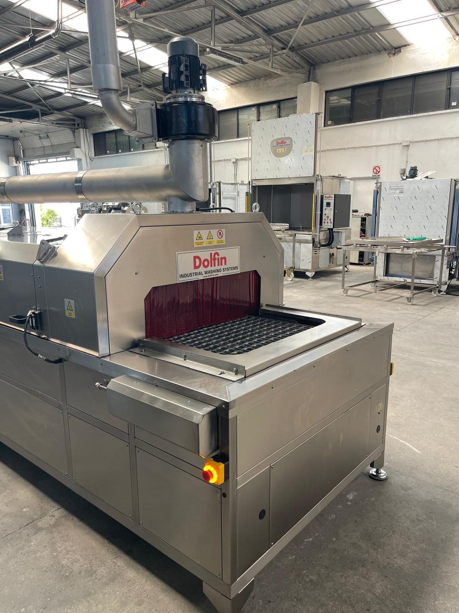

# 3. GENEL BAKIŞ

**KNV 90 7500 2B** (model kodu **KNV-90**, seri no **0726051**, müşteri **YETSAN**), endüstriyel parça yüzeylerinde biriken yağ, proses kiri ve atıkların giderilmesi amacıyla tasarlanmış, konveyörlü ve **iki banyolu** (yıkama + durulama) bir parça yıkama hattıdır. Bu bölüm, operatör, bakım ve kurulum personelinin makineyi bütünsel olarak tanıması, proses sınırlarını ve teknik çerçeveyi kavraması için düzenlenmiştir; ayrıntılı teknik değerler ilgili alt bölümlerde verilmiştir ve diğer bölümlerde tekrarlanmaz.

Makine, parçaların redüktör tahrikli **zincirli konveyör** üzerinde ilerleyerek **yıkama → durulama → blower ile su sıyırma → sıcak hava ile kurutma** proseslerinden sırasıyla geçmesini sağlar. Besleme **sol**, boşaltma **sağ**, operatör ve elektrik panosu tarafı **sağ** yöndedir. Bu projede parça giriş ve çıkışı **operatör tarafından elle** yapılır; robot entegrasyonu yoktur. Kontrol, PLC/HMI içermeyen **röle–kontaktör esaslı buton panosu** ile sağlanır; her fonksiyon ayrı aç/kapa anahtarı ile yönetilir ve tank sıcaklıkları GEMO DTH2 termostatlarla ayarlanır.

Makinenin ana modülleri şunlardır: zincirli konveyör ve redüktör tahriki; yıkama tankı (TANK 1) ile pompası, hücresi ve nozulları; durulama tankı (TANK 2) ile pompası, hücresi ve nozulları; yağ sıyırıcı ve yağ ayırıcı ünitesi; dört blower, iki kurutma fanı ve iki kurutma ısıtıcısından oluşan kurutma ünitesi; egzoz fanı; elektrik panosu ve güvenlik cihazları. Modüllerin işlevleri **Bölüm 3.1**'de; amaçlanan kullanım sınırları **Bölüm 3.2**'de; elektrik, motor ve tesisat verileri **Bölüm 3.3**'te; operatör paneli ve pano yapısı **Bölüm 3.4**'te; yerleşim ve alan gereksinimleri **Bölüm 3.5**'te açıklanmıştır.

---

## Bölüm içeriği

| Bölüm | Başlık | Konu |
| :--- | :--- | :--- |
| **3.1** | Makine tanımı ve sistematik yapı | Proses akışı, konveyör, tanklar, pompalar, yağ sıyırıcı/ayırıcı, kurutma, egzoz, pano |
| **3.2** | Amaçlanan kullanım | İşlenebilir parça tipleri, yasak kullanımlar, proses suyu, ortam ve personel gereksinimleri |
| **3.3** | Teknik özellikler | Boyut/ağırlık, kapasite, elektrik, motor ve ısıtıcı listesi, hava/su, ortam |
| **3.4** | Makine kontrolleri | Elektrik panosu, operatör paneli anahtarları, termostatlar, lambalar, interlock, konveyör hızı |
| **3.5** | Makine yerleşim planı | Yön tanımları, etraf boşlukları, bakım erişimi, taşıma kısıtları, güvenlik elemanları |

---

## Makine özeti

| Parametre | Değer |
| :--- | :--- |
| Sipariş / seri no | 0726051 |
| Model | KNV-90 — KNV 90 7500 2B |
| Makine tipi | Konveyörlü — iki banyolu endüstriyel parça yıkama (2 banyo + kurutma) |
| Proses akışı | Yıkama → Durulama → Su sıyırma (blower) → Kurutma (sıcak hava) |
| Kontrol | Buton panosu — röle/kontaktör; PLC/HMI yok |
| Besleme / boşaltma | Sol / Sağ — elle yükleme ve boşaltma |
| Operatör tarafı | Sağ (elektrik panosu ve operatör paneli) |
| Toplam kurulu güç | 110 kW — 380 V / 50 Hz / 3 faz (**Bkz. Bölüm 3.3.3**) |
| Koruma sınıfı | IP55 |

