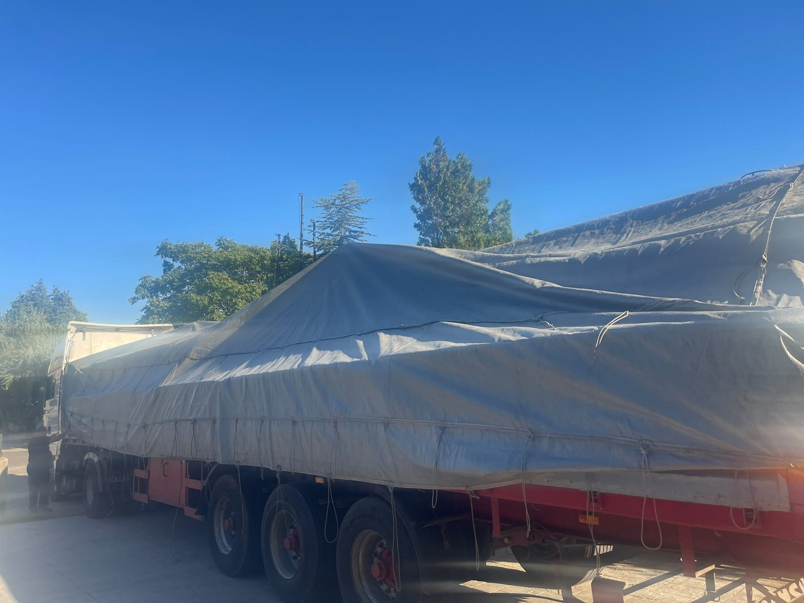

# 4.1 Transport und Versand

Die Maschine besteht aus einem **langen Hauptkörper**, der die Fördererlinie, die Tanks, die Trocknungseinheit und den Schaltschrank trägt, sowie der separat stehenden **Ölabscheidereinheit**. Da der Hauptkörper lang ist und die Gewichtsverteilung asymmetrisch ist (Tanks, Pumpen und Schaltschrank befinden sich auf einer Seite der Linie), dürfen Anheben und Transport nur durch einen zertifizierten Gabelstaplerfahrer und nur an den vom Hersteller festgelegten Anschlagpunkten erfolgen. Auf den Versandfotos ist die Maschine auf einem offenen Pritschenfahrzeug unter einer Schutzplane zu sehen, mit dem Gabelstapler verladen.

Außenabmessungen und Gewicht sind bei der Planung des Aufstellorts und des Fahrzeugs zu berücksichtigen (**Siehe Kapitel 3.3.1**); diese Werte sind in den DATA nicht definiert und müssen dem Aufstellungsplan (Layout) bzw. der Hebezeichnung entnommen werden (**Siehe Kapitel 3.5.4**).

---

## 4.1.1 Anforderungen vor dem Transport

Vor Beginn des Transports müssen die folgenden Bedingungen erfüllt sein. Fehlt eine Bedingung, den Transport stoppen; nicht fortfahren, bevor sie erfüllt ist.

| Parameter | Wert / Anforderung |
| :--- | :--- |
| Transportmittel | Gabelstapler — Anschlagpunkte gemäß Herstellerzeichnung |
| Transportgewicht — montiert | [EKSİK] kg |
| Transportgewicht — größtes demontiertes Teil | [EKSİK] kg |
| Verpackungsart | [EKSİK] — beim Versand wurde eine Schutzplane (Folie/Plane) verwendet |
| Hebevorrichtung / Traversenzeichnung | [EKSİK] |
| Gabelstapler-Gabeleinfahrt | [EKSİK] |
| Sicherung / Verzurrung während des Transports | [EKSİK] — Verzurrung mit Gurten und Plane auf dem Fahrzeug |
| Feuchtigkeits-/Korrosionsschutz | [EKSİK] — Schutzplane; in der Umgebung dürfen keine Feuchtigkeit und keine korrosiven Stoffe vorhanden sein |
| Transporttemperatur | +10 °C – +30 °C |
| Max. Transporthöhe (See / Land) | [EKSİK] — Route unter Berücksichtigung der Außenhöhe der Maschine und des Abluftkamins planen |

Der Gabelstaplerfahrer muss über ein gültiges Zertifikat verfügen. Die sichere Tragfähigkeit (SWL) des Gabelstaplers muss das montierte Transportgewicht abdecken. Auf dem Transportweg müssen Torhöhe, Rampenneigung und Wenderadius den Außenabmessungen der Maschine entsprechen.

**VORSICHT — Unbestimmter Anschlagpunkt:** Heben Sie die Maschine nicht an, wenn Ihnen die Hebezeichnung nicht vorliegt; wenden Sie sich an den Herstellerservice (**Siehe Kapitel 1.3**). Anheben an einem falschen Punkt führt zu Rahmenverformung, Verlust der Tankdichtheit und Schäden am Schaltschrank.

---

## 4.1.2 Vorbereitung vor dem Transport

1. Transportroute und Zielpunkt vorab festlegen; Hindernisse, Neigung und Tragfähigkeit des Bodens prüfen.
2. Sicherstellen, dass die bauseitigen **Elektro-, Wasser- und Druckluftanschlüsse** der Maschine getrennt sind (bei installierter Maschine wird LOTO gemäß **Kapitel 2.4** angewendet).
3. Prüfen, dass der Hauptschalter in Stellung **OFF (O)** steht.
4. Die Prozessflüssigkeit im Wasch- und Spültank über die Ablassventile (**TAHLİYE**) entleeren; der Transport mit gefüllten Tanks verändert den Schwerpunkt und erzeugt Kippgefahr (**Siehe Kapitel 10.1.5**).
5. Schlauch- und Druckluftanschlüsse der Ölabscheidereinheit vom Hauptkörper trennen; die Einheit separat transportieren.
6. Prüfen, dass Tankdeckel und Kammerklappen geschlossen sind und keine herabhängenden Kabel, Schläuche oder losen Teile verbleiben.
7. Prüfen, dass die Schutzplane transporttauglich, unbeschädigt und ausreichend befestigt ist.
8. Gabelstaplerfahrer und Einweiser benennen.

---

## 4.1.3 Entfernen der Verpackung

Wenn die Maschine am Aufstellort angekommen ist, wird die Schutzplane kontrolliert entfernt, um Transportschäden zu vermeiden:

1. Vor dem Öffnen der Plane eine äußere Schadenskontrolle durchführen (Quetschungen, Feuchtigkeit, Kippspuren); bei Abweichungen fotografieren und der Betriebsleitung melden.
2. Zurrgurte und Plane entfernen, ohne den Maschinenkörper, den Abluftkamin und die Schaltschranktür zu beschädigen.
3. Vor dem Anheben der Maschine mit dem Gabelstapler sicherstellen, dass die Füße und Anschlagpunkte frei von Verpackungselementen sind.
4. Verpackungsabfälle gemäß den betrieblichen Recyclingregeln trennen (**Siehe Kapitel 12.3**).

---

## 4.1.4 Transportverfahren mit dem Gabelstapler

**WARNUNG — Kippen und Quetschen:** Falsche Gabelposition, überhöhte Geschwindigkeit oder unausgewogene Beladung können beim Transport zum Umkippen der Maschine oder zum Quetschen von Personen führen. Setzen Sie die Gabeln ausschließlich an den vom Hersteller festgelegten Anschlagpunkten an; richten Sie den Schwerpunkt gemäß Zeichnung aus (**Siehe Kapitel 3.5.4**).

1. Die Gabeln des Gabelstaplers an den Punkten der Hebezeichnung ausrichten; keine Last auf Außenverkleidung, Schaltschrank, Tankkörper, Rohrleitungen oder Abluftkamin bringen.
2. Gabelbreite und -position entsprechend dem Schwerpunkt einstellen; bei dem langen Körper ggf. den Einsatz von zwei Gabelstaplern oder Gabelverlängerungen mit dem Hersteller abstimmen.
3. Die Maschine **10–15 cm** vom Boden anheben und einen Gleichgewichtstest durchführen; bei Neigung, Ungleichgewicht vorn/hinten oder Gabelrutschen langsam absenken und die Position korrigieren.
4. Die Last während des gesamten Transports niedrig halten; keine abrupten Wendemanöver, Rückwärtsfahrten oder scharfen Bremsungen.
5. Bei eingeschränktem Sichtfeld des Gabelstaplers einen Einweiser einsetzen; keine Personen unter der angehobenen Last oder in der Bewegungsbahn der Last.
6. Die Maschine am Zielpunkt langsam absenken; prüfen, dass alle **Stellfüße** auf dem Boden aufsitzen.
7. Die Ölabscheidereinheit neben der Maschine an der vorgesehenen Stelle platzieren.
8. Nach dem Platzieren am Aufstellort mit dem Montageverfahren in **Kapitel 5** fortfahren.

**Erwartetes Ergebnis:** Die Maschine steht am Zielpunkt stabil und unbeschädigt; die Füße haben vollständigen Bodenkontakt.

**Abweichung:** Werden Kippen, Risse, Tankverformung oder Schäden am Schaltschrank festgestellt, die Maschine nicht in Betrieb nehmen; wenden Sie sich an den Herstellerservice (**Siehe Kapitel 1.3**).

---

## 4.1.5 Kontrolle nach dem Transport

1. Rahmen, Schaltschrank, Tanks, Kammerklappen, Abluftkamin und Rohrleitungen auf sichtbare mechanische Schäden prüfen.
2. Sicherstellen, dass die Füße keine Verformung aufweisen.
3. Prüfen, dass die Schaltschranktür geschlossen, verriegelt und trocken ist.
4. Prüfen, dass der Drahtgurt des Förderers und die Schutzgitter an ihrem Platz sind.
5. Liegt kein Schaden vor, mit der Installation fortfahren (**Siehe Kapitel 5.1**); bei Schäden dokumentieren und den Service benachrichtigen.

Die Anforderungen an Boden und Freiraum am Aufstellort sind in **Kapitel 3.5.2** angegeben.
