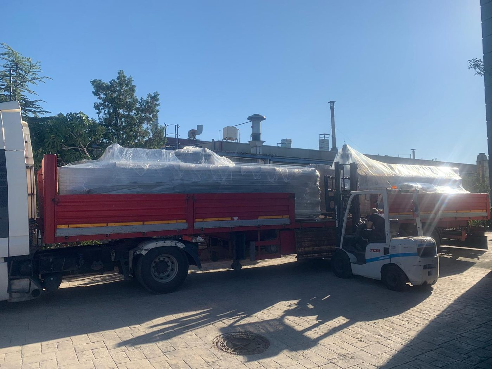

# 4. TAŞIMA VE DEPOLAMA

**KNV 90 7500 2B** (seri no **0726051**) makinesinin fabrikadan sevkiyatı, saha içi taşınması, kurulum alanına indirilmesi ve geçici depolanması bu bölümde tanımlanır. Taşıma ve depolama sırasında oluşabilecek mekanik hasar, devrilme ve korozyon riskleri; doğru ekipman seçimi ve ortam koşullarına uyumla önlenir. Bu bölümde yalnızca taşıma ve depolama prosedürleri verilir; boyut, ağırlık ve ağırlık merkezi değerleri **Bölüm 3.3.1** ve **Bölüm 3.5.4**'te tanımlıdır.

Makine, ana gövde (konveyör, tanklar, hücreler, kurutma ünitesi, egzoz bacası ve elektrik panosu) ve ayrı duran **yağ ayırıcı ünitesi** olmak üzere iki ana parça hâlinde sevk edilir. Sevkiyatta makine açık kasa araç üzerinde koruyucu örtü ile taşınmıştır. Taşıma ağırlığı, ambalaj tipi ve kaldırma noktaları için DATA kaydı bulunmamaktadır; bu değerler teslim paketindeki layout/kaldırma çiziminden veya üretici servisinden alınmalıdır (**Bkz. Bölüm 1.3**). Kaldırma yalnızca üreticinin tanımladığı noktalardan yapılır; makine, pano ve tank sacları üzerinden kaldırılmaz.

| Alt bölüm | Konu |
| :--- | :--- |
| **4.1** | Taşıma öncesi hazırlık, forklift prosedürü, ambalaj |
| **4.2** | Elleçleme, geçici depolama ve depodan çıkarma |

Taşıma ve depolama ortam sıcaklığı **+10 °C ile +30 °C** aralığında olmalıdır; nem ve korozif maddeler bulunmamalıdır. Taşıma sırasında **Bölüm 2** güvenlik kurallarına uyun; makine üzerinde müdahale gerektiren işlerde enerji izolasyonu **Bölüm 2.4**'e göre yapılır.

---

Kurulum adımları için bkz. **Bölüm 5**; yerleşim ve erişim noktaları için bkz. **Bölüm 3.5**.
