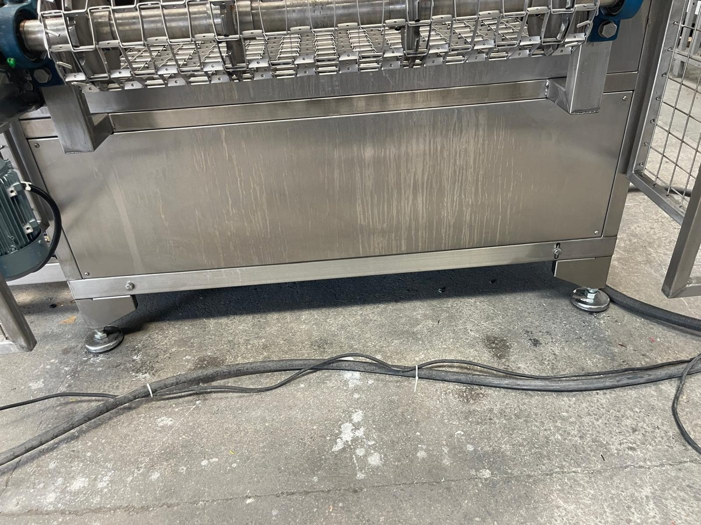

# 5.2 Positionierung der Maschine

Die Positionierung legt die Endposition, Ausrichtung und Nivellierung der Maschine am Aufstellort fest. Die Arbeiten werden im Rahmen von **Kapitel 5.1 Schritt 3** ausgeführt und in diesem Kapitel ausführlich beschrieben. Eine falsche Positionierung beeinträchtigt den Zugang des Bedieners zum Beschicken/Entnehmen, das Öffnen der Wartungsklappen, den Öffnungsbereich der Tankdeckel, das vollständige Öffnen der Schaltschranktür und die Ausrichtung des Förderers.

Die Platzanforderungen (Freiräume, Deckenhöhe, Seitendefinitionen) sind in **Kapitel 3.5** angegeben; hier wird das Installationsverfahren erläutert.

---

## 5.2.1 Anforderungen an den Aufstellort

Vor dem Platzieren der Maschine muss der Aufstellort die folgenden Bedingungen erfüllen:

| Parameter | Anforderung | Referenz |
| :--- | :--- | :--- |
| Min. Abmessungen des Montagebereichs | [EKSİK] | Kapitel 3.5.2 |
| Bodenebenheitstoleranz | [EKSİK] | Kapitel 3.5.2 |
| Bodentragfähigkeit | [EKSİK] — fest, eben, wasserbeständig | Kapitel 3.5.2 |
| Minimaler Freiraum | [EKSİK] | Kapitel 3.5.2 |
| Minimale Deckenhöhe | [EKSİK] — einschließlich Abluftkamin | Kapitel 3.5.2 |
| Platz für die Ölabscheidereinheit | Neben der Maschine, innerhalb der Schlauchlänge | Kapitel 3.5.1 |
| Abwasser / Entwässerung | Zugang zu den Ablassventilen (TAHLİYE) der Tanks und Bodenablauf empfohlen | Kapitel 10.1.8 |

Der Referenz-Aufstellungsplan ist das Layout im Lieferpaket (**Siehe Kapitel 3.5, 13.2**). Da es rund um die Tanks zu Wasserüberlauf und bei der Filterreinigung zu Tropfwasser kommt, wird ein rutschhemmender Boden mit Ablauf empfohlen.

---

## 5.2.2 Seitendefinitionen und Aufstellung

Die Maschine ist nach den folgenden Seiten auszurichten (**Siehe Kapitel 3.5.1**):

| Definition | Seite |
| :--- | :--- |
| Bedienerseite | Rechts — Schaltschrank und Bedienfeld |
| Beschickungsseite (Eingang) | Links |
| Entnahmeseite (Ausgang) | Rechts |
| Förderrichtung | Links → Rechts |

Die Werkstücke werden von der linken Seite von Hand aufgelegt und auf der rechten Seite von Hand entnommen. Bedienfeld und Schaltschrank befinden sich auf der rechten Seite in zugänglicher Position; der Bediener muss zwischen Eingang, Ausgang und Bedienfeld einen sicheren Gehweg haben. Die Schutzgitter und Not-Halt-Taster am Eingang und Ausgang des Förderers dürfen nicht verstellt werden.

Das Platzieren mit dem Gabelstapler erfolgt gemäß dem Verfahren in **Kapitel 4.1.4**; Anschlagpunkte und Schwerpunkt richten sich nach der Herstellerzeichnung (**Siehe Kapitel 3.5.4**).

---

## 5.2.3 Nivellierung und Ausrichtung

| Parameter | Wert |
| :--- | :--- |
| Nivelliermechanismus | Stellfüße |
| Ausrichttoleranz | [EKSİK] mm |

**Positionierungsverfahren**

1. Die Maschine mit dem Gabelstapler in ihre Endposition bringen und auf den Boden setzen (**Siehe Kapitel 4.1.4**).
2. Die Wasserwaage entlang der Fördererlinie (Längsachse) und quer zur Linie (Querachse) anlegen.
3. Die **Stellfüße** drehen und die Maschine in beiden Achsen nivellieren; bei der langen Linie die Kontrolle mit der Wasserwaage im Eingangs-, Mittel- und Ausgangsbereich wiederholen.
4. Sicherstellen, dass alle Füße gleichmäßig auf dem Boden aufsitzen; frei stehende Füße herausdrehen.
5. Die Kontermuttern der Füße anziehen.
6. Prüfen, dass Tankdeckel und Wartungsklappen der Kammern ohne Kraftaufwand schließen und die magnetischen Schalter fluchten.
7. Prüfen, dass der Drahtgurt des Förderers beim Drehen von Hand an beiden Kanten gleichmäßig läuft (ohne angeschlossene Energie).

**Erwartetes Ergebnis:** Maschine nivelliert; Drahtgurt des Förderers ohne seitliches Schleifen; Klappen fluchten mit den Schaltern.

**Abweichung:** Wird die Bodentoleranz überschritten oder erreichen die Füße die Grenze ihres Einstellbereichs, nicht in Betrieb gehen, bevor der Boden ausgebessert wurde.

Prüffrage zur mechanischen Installation: *Ist die Maschine nivelliert?* (**Siehe Kapitel 5.5.1**)

---

## 5.2.4 Wartungszugang

Bei der Positionierung ist darauf zu achten, dass die Wartungszugangsbereiche nicht verstellt werden (**Siehe Kapitel 3.5.3**):

| Bereich | Anforderung |
| :--- | :--- |
| Obere Deckel Tank 1 / Tank 2 | Freiraum oben und vorn zum vollständigen Öffnen der Deckel |
| Wartungsklappen der Kammern (7 Stück) | Platz zum Anheben von Hand und Offenhalten |
| Bereich Pumpe / Feinfilter | Öffnen des Beutelfiltergehäuses und Eingriff an der Pumpe |
| Schaltschrank | Freiraum zum vollständigen Öffnen der Tür; Zugang zum Anbringen eines Schlosses am Hauptschalterhebel |
| Abluftventilator / Kamin | Zugang von oben — Plattform oder Leiter |
| Fördererenden | Zugang in das Schutzgitter nach LOTO; Schmiernippel |

Wird die Maschine zu nah an einer Wand oder an Anlagen aufgestellt, können Filterwartung, Tankentleerung und Eingriffe am Schaltschrank nicht sicher durchgeführt werden.
