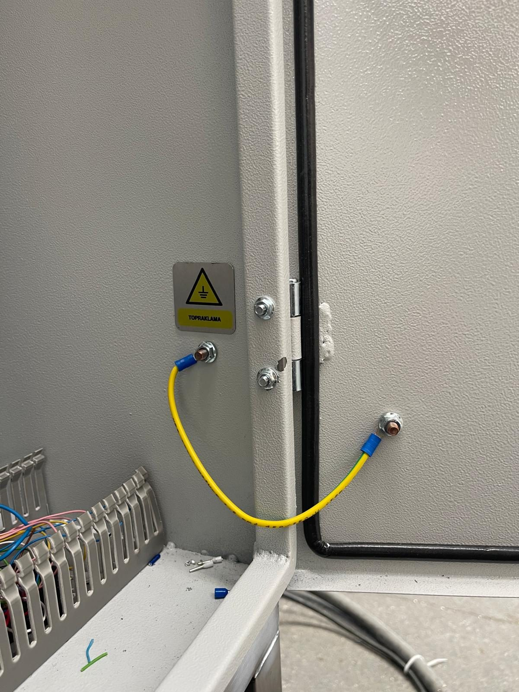
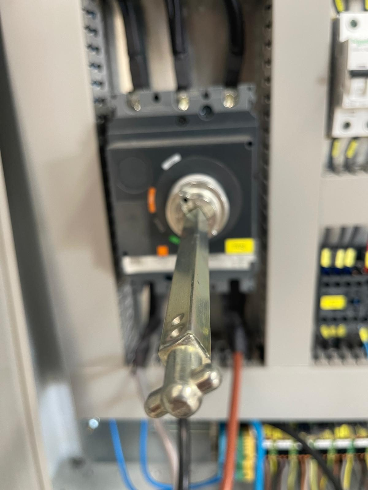

# 5.3 Systemanschlüsse und Inbetriebnahme

Die Medien-, Abluft-, Ölabscheider- und Elektroanschlüsse werden im Rahmen von **Kapitel 5.1 Schritte 4–9** ausgeführt. Die technischen Anschlusswerte sind in den Tabellen in **Kapitel 3.3.3** (Elektrik) und **Kapitel 3.3.5** (Druckluft/Wasser) angegeben; dieses Kapitel definiert das Installationsverfahren.

Ein Hydrauliksystem ist nicht vorhanden. Es gibt keinen Vakuumanschluss. Da diese Maschine über kein HMI verfügt, erfolgt die Anschlussprüfung über Manometer, Leuchten am Schaltschrank und physische Beobachtung.

---

## 5.3.1 Druckluftanschluss

| Parameter | Wert (Kapitel 3.3.5) |
| :--- | :--- |
| Druckluftversorgung | 6 bar |
| Anschlusspunkt | Druckregler **AIR INLET / HAVA GİRİŞİ** (mit Manometer) am Maschinenkörper |
| Anschlussdurchmesser | [EKSİK] — Aufstellungsplan (Layout) |
| Verbraucher | Membranpumpe der Ölabscheidereinheit |

**Anschlussverfahren**

1. Sicherstellen, dass die bauseitige Druckluftleitung trockene und ölfreie Luft liefert; in der Leitung muss ein absperrbares Absperrventil vorhanden sein (LOTO-Punkt — **Siehe Kapitel 2.4**).
2. Die bauseitige Druckluftleitung an den Eingang des Druckreglers **AIR INLET** am Maschinenkörper anschließen.
3. Das bauseitige Druckluft-Absperrventil öffnen.
4. Den Druckregler auf **6 bar** einstellen; das Manometer als Referenz verwenden (**Siehe Kapitel 6.5**).
5. Verschraubungen und Schlauchanschlüsse auf Leckagen prüfen (Geräusch oder Seifenwasser).

**Erwartetes Ergebnis:** Manometer 6 bar; keine Leckage.

**Abweichung:** Wird der Druck von 6 bar nicht erreicht, die Kapazität des bauseitigen Kompressors, das Leitungsventil und die Reglereinstellung prüfen.

---

## 5.3.2 Wasseranschluss und Tankentleerung

| Parameter | Wert (Kapitel 3.3.5) |
| :--- | :--- |
| Wassereingangsdruck | 1 bar |
| Wassertemperatur | +10 °C – +70 °C |
| Wasserqualität | Leitungswasser oder aufbereitetes Wasser |
| Tankbefüllung | Von Hand — kein automatisches Füllventil |
| Entleerung | Ablassventile **TAHLİYE** unter den Tanks — Durchmesser [EKSİK] |

**Anschlussverfahren**

1. Die bauseitige Wasserleitung so vorbereiten, dass sie den Punkt erreicht, an dem die Tanks von Hand befüllt werden (Schlauch oder fester Füllstutzen); sicherstellen, dass der Wasserdruck **1 bar** beträgt.
2. Prüfen, dass die Ablassventile **TAHLİYE** unter Tank 1 und Tank 2 geschlossen sind.
3. Die Ablassventile (TAHLİYE) an die bauseitige Abwasserleitung anschließen; ölhaltiges Prozesswasser darf nicht in die Haushaltskanalisation eingeleitet werden (**Siehe Kapitel 10.1.8**).
4. Die Tanks gemäß **Kapitel 7.2.1** von Hand befüllen; während des Befüllens Tankunterseite, Rohranschlüsse und Pumpengehäuse auf Leckagen prüfen.
5. Nach Abschluss der Befüllung sicherstellen, dass die roten Leuchten **TANK 1 / TANK 2 WASHING LEVEL** erloschen sind (bei Hauptschalter ON).

**Erwartetes Ergebnis:** Tanks gefüllt; WASHING-LEVEL-Leuchten aus; keine Leckage.

**Abweichung:** Leuchtet die Füllstandleuchte trotz gefülltem Tank, den Füllstandsensor prüfen (**Siehe Kapitel 11.7**).

---

## 5.3.3 Elektroanschluss und Erdung

Die Werte der elektrischen Versorgung sind in der Tabelle in **Kapitel 3.3.3** angegeben. Installationsleitung: **380 V, 50 Hz, 3 Phasen, 3P+N+PE, 110 kW / 220 A**; Hauptschalter **Schneider CVS250F (250 A)**.

**GEFAHR — Stromschlag:** Arbeiten an spannungsführenden Leitungen sind verboten. Vor dem Anschluss muss der bauseitige Einspeiseschalter ausgeschaltet und verriegelt sein; der Hauptschalter der Maschine muss in Stellung **OFF** stehen. Der Anschluss wird ausschließlich von einer Elektrofachkraft ausgeführt.

**Anschlussverfahren**

1. Den Querschnitt des bauseitigen Zuleitungskabels anhand des Stroms von 220 A und der bauseitigen Kabellänge prüfen.
2. Die Schaltschranktür öffnen; das Zuleitungskabel durch die Eingangsverschraubung des Schaltschranks führen und in der Reihenfolge **L1-L2-L3-N** an die Eingangsklemmen des Hauptschalters (Leistungsschalter, TMŞ) anschließen.
3. Den **PE**-Leiter an die Erdungsschiene des Schaltschranks anschließen; prüfen, dass die gelb-grüne Erdungsbrücke zwischen Schaltschranktür und Gehäuse vorhanden ist.
4. Die Festigkeit der Anschlüsse mit einem Drehmomentschlüssel prüfen; lose Anschlüsse verursachen Erwärmung und Brandgefahr.
5. Die Schaltschranktür schließen und verriegeln.
6. Den bauseitigen Einspeiseschalter einschalten; den Hauptschalter der Maschine noch nicht einschalten — mit der Phasenprüfung in **Kapitel 5.3.6** fortfahren.

---

## 5.3.4 Anschluss des Abluftkamins

Der Abluftventilator (FE01) ist auf dem Kamin oben auf der Maschine montiert und führt den Dampf aus den Kammern ab. Der Kamin muss an den bauseitigen Lüftungskanal oder direkt nach außen angeschlossen werden; andernfalls breitet sich der Dampf in der Betriebsstätte aus, die Sicht wird beeinträchtigt und im Schaltschrank bildet sich Kondensat.

1. Einen zum Kaminaustrittsdurchmesser passenden Kanal ([EKSİK] — Aufstellungsplan/Layout) bis zur bauseitigen Lüftung oder nach außen verlegen.
2. Damit im Kanal kondensiertes Wasser nicht zur Maschine zurückfließt, den Kanal mit Gefälle verlegen und am tiefsten Punkt einen Kondensatablauf vorsehen.
3. Am Außenaustritt eine Haube gegen Regen und Rückströmung verwenden.
4. Die Kanalverbindungen dicht ausführen; bei laufendem Abluftventilator prüfen, dass an den Verbindungen kein Dampf austritt (**Siehe Kapitel 5.5.5**).

---

## 5.3.5 Anschluss der Ölabscheidereinheit

Die Ölabscheidereinheit ist ein separater Edelstahlschrank; die darunter angeordnete Membranpumpe wird mit Druckluft betrieben.

1. Die Einheit neben der Maschine an der im Layout angegebenen Position aufstellen und ihre Füße nivellieren.
2. Die Saug- und Rücklaufschläuche für das ölhaltige Wasser zwischen Tank und Einheit anschließen; die Schlauchführung darf den Gehweg nicht kreuzen und darf nicht gequetscht werden.
3. Die Druckluftleitung der Einheit (Eingang des Magnetventils) an die Druckluftleitung der Maschine anschließen.
4. Sicherstellen, dass der elektrische Anschluss der Einheit (Magnetventil) vom Schaltschrank aus hergestellt ist; der Anschluss erfolgt gemäß Schaltplan (**Siehe Kapitel 13.1**).
5. Bei der Inbetriebnahme den unbeschrifteten Ölabscheiderschalter am Bedienfeld einschalten; prüfen, dass die Membranpumpe läuft und an den Schläuchen keine Leckage auftritt.

---

## 5.3.6 Inbetriebnahme und Phasenprüfung

Die Phasenfolge ist für die Drehrichtung von Pumpen, Ventilatoren und Blowern entscheidend; eine vertauschte Phasenfolge führt zu Rückwärtslauf der Motoren, sinkendem Pumpendruck und verringertem Trocknungsvolumenstrom. Das Phasenfolgerelais **MKR-01** gibt bei vertauschter oder fehlender Phase kein Ausgangssignal.

**Inbetriebnahmeverfahren**

| Nr. | Vorgang |
| :---: | :--- |
| 1 | Drehstromzuleitung an den Schaltschrank angeschlossen (**Kapitel 5.3.3**) |
| 2 | Hauptschalterhebel in Stellung **ON (I)** gebracht |
| 3 | **RESET**-Taster betätigt; Aufleuchten der blauen Leuchte bestätigt |
| 4 | Ausgangszustand des Phasenfolgerelais MKR-01 geprüft (Relaisanzeige) |
| 5 | Bei vertauschter Phasenfolge Hauptschalter **OFF**; Elektrofachkraft hat **zwei Phasen** getauscht; Schalter wieder eingeschaltet |
| 6 | Pumpe oder Ventilator kurz betrieben und Drehrichtung mit dem Pfeil am Motor verglichen |

**Checkliste elektrische Inbetriebnahmeprüfung**

| Prüfung | Erwartetes Ergebnis |
| :--- | :--- |
| Gibt das Phasenüberwachungsrelais ein Ausgangssignal? | Ja |
| Liegt an der Maschine Spannung an? (RESET-Leuchte leuchtet) | Ja |
| Erlischt bei Betätigung des Not-Halts die RESET-Leuchte und stoppt die Maschine? | Ja |
| Sind die Motordrehrichtungen korrekt? | Ja |

Die Not-Halt-Prüfschritte sind in **Kapitel 5.4.1**, das Reset-Verfahren in **Kapitel 2.5** angegeben.

---

## 5.3.7 Checkliste Abschluss der Anschlüsse

| # | Prüfung | Status |
| :---: | :--- | :---: |
| 1 | Druckluftanschluss hergestellt; Druckregler 6 bar | ☐ |
| 2 | Keine Leckage in der Druckluftleitung | ☐ |
| 3 | Wasser vorbereitet; Tanks von Hand befüllt; WASHING-LEVEL-Leuchten aus | ☐ |
| 4 | Ablassventile (TAHLİYE) geschlossen und an die Abwasserleitung angeschlossen | ☐ |
| 5 | Abluftkamin an die Lüftung / nach außen angeschlossen | ☐ |
| 6 | Schlauch-, Druckluft- und Elektroanschlüsse der Ölabscheidereinheit hergestellt | ☐ |
| 7 | Drehstrom- und PE-Anschluss hergestellt (380 V, 50 Hz) | ☐ |
| 8 | Phasenfolge geprüft; MKR-01 gibt Ausgangssignal | ☐ |
| 9 | Hauptschalter eingeschaltet; RESET-Leuchte leuchtet | ☐ |

Nach Abschluss der Anschlüsse mit den Prüfungen in **Kapitel 5.4** und **5.5** fortfahren.
