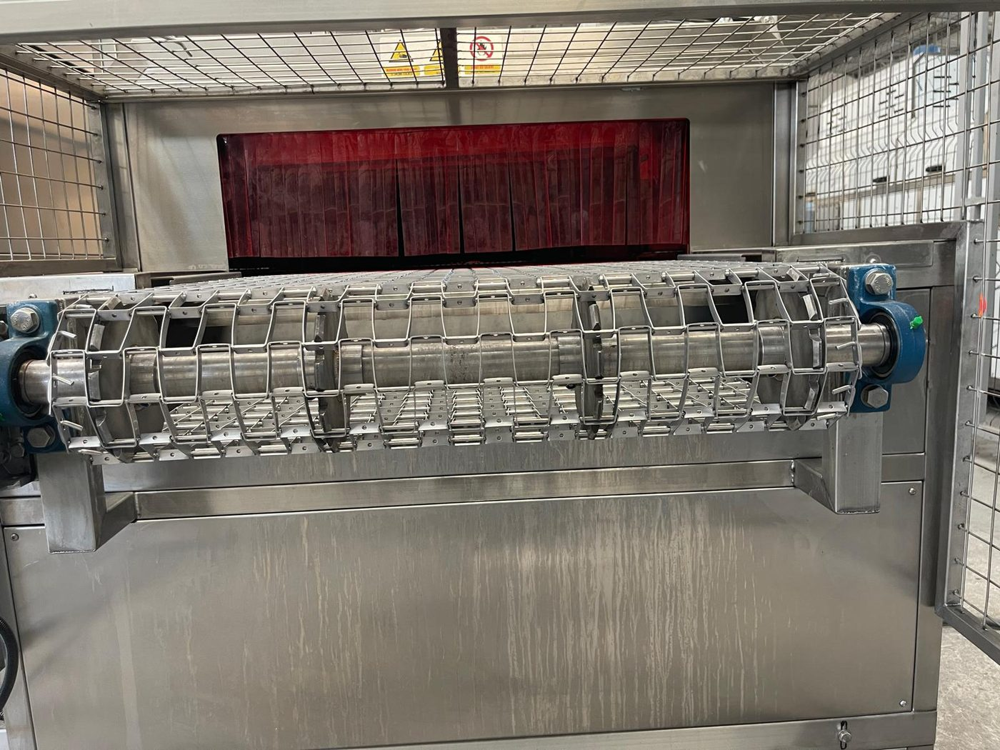
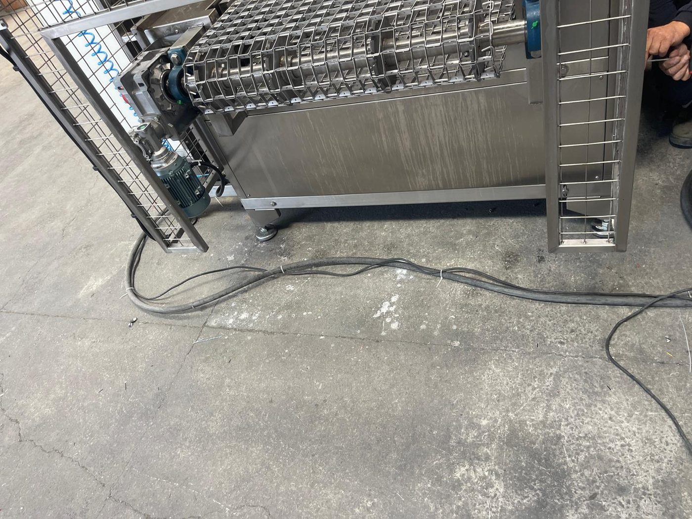

# 7.4 Betriebsablauf

Die Maschine besitzt **keinen** festen Automatikzyklus. Der Betriebsablauf besteht darin, dass die vom Bediener eingeschalteten Funktionen gleichzeitig mit dem Förderer laufen und das Werkstück entlang der Linie die eingeschalteten Prozesszonen durchläuft. Die Beschickung erfolgt **links**, die Entnahme **rechts**; Beladen und Entnehmen erfolgen **manuell**.

---

## 7.4.1 Werkstückfluss — allgemeiner Ablauf

| Schritt | Beschreibung |
| :---: | :--- |
| 1 | Der Bediener schaltet die benötigten Funktionen in der Reihenfolge nach **Kapitel 7.2.2** ein; der Förderer läuft |
| 2 | Der Bediener legt das Werkstück vom **linken Eingang** aus auf den Drahtgurt |
| 3 | Das Werkstück passiert den PVC-Vorhang und tritt in die **Waschkammer** ein; bei eingeschalteter TANK 1 PUMP sprühen die Düsen das erwärmte Waschwasser |
| 4 | Das Werkstück gelangt in die **Spülkammer**; bei eingeschalteter TANK 2 PUMP wird Spülwasser gesprüht |
| 5 | Das Werkstück gelangt in die Zone **Wasserabblasen**; bei eingeschaltetem BLOWER 1/2 blasen die Luftmesser das Oberflächenwasser ab |
| 6 | Das Werkstück gelangt in die **Trocknungskammer**; bei eingeschaltetem DRYING 1/2 FAN und HEATER trocknet es mit Heißluft |
| 7 | Das Werkstück erreicht den **rechten Ausgang**; der Bediener entnimmt es mit hitzebeständigen Handschuhen |

Die Zone einer nicht eingeschalteten Funktion durchläuft das Werkstück ohne Bearbeitung. Im Dauerbetrieb legt der Bediener in Abständen, die zur Förderergeschwindigkeit passen, weiter Werkstücke auf; die Werkstücke müssen auf dem Drahtgurt so weit voneinander entfernt liegen, dass sie nicht aneinanderstoßen.

---

## 7.4.2 Zykluszeit und Kapazität

| Parameter | Wert | Bedeutung |
| :--- | :--- | :--- |
| Zykluszeit — nominal | [EKSİK] | Durchlaufzeit eines Werkstücks vom Eingang bis zum Ausgang entlang der Linie; abhängig von der Fördererfrequenz (20–60 Hz) und den eingeschalteten Prozessen |
| Nennkapazität | Wird vom Kunden festgelegt | Abhängig von Werkstückgröße, Belegung des Drahtgurts und Geschwindigkeit |

Je weiter die Förderergeschwindigkeit verringert wird, desto länger ist die Kontaktzeit des Werkstücks in den Kammern; Reinigung und Trocknung verbessern sich, die Stückzahl pro Stunde sinkt. Die produktspezifische Aufzeichnung der Kombination aus Geschwindigkeit und Temperatur ist in **Kapitel 8.2** beschrieben.

---

## 7.4.3 Produkteingang und -ausgang — manuelles Beladen/Entnehmen

| Parameter | Wert |
| :--- | :--- |
| Eingang | Der Bediener legt das Werkstück vom **linken Eingang** aus auf den Förderer |
| Ausgang | Der Bediener entnimmt das Werkstück am **rechten Ausgang** |
| Roboter / automatische Beschickung | Nicht vorhanden |

Während des Beladens und Entnehmens wird nicht in das Schutzgitter hineingegriffen; die Hände werden nicht zwischen Drahtgurt und feststehende Struktur gebracht. Das austretende Werkstück kommt heiß aus der Trocknungskammer; hitzebeständige Handschuhe sind Pflicht (**Siehe Kapitel 2.6**). Am Ausgang anfallende Werkstücke dürfen sich am Ende des Drahtgurts nicht stauen; ein Stau belastet den Förderer und lässt den Drehmomentbegrenzer durchrutschen.

---

## 7.4.4 Prozessfunktionen — Verhalten im Ablauf

| Funktion | Rolle im Ablauf |
| :--- | :--- |
| TANK 1 HEATER / TANK 2 HEATER | Hält die Wassertemperatur auf dem Thermostat-Sollwert; Schalter bleibt ON |
| TANK 1 PUMP / TANK 2 PUMP | Kontinuierliches Sprühen in die Kammern; läuft auch ohne Werkstück |
| TANK 1 OIL SKIMMER | Nimmt das Oberflächenöl des Waschtanks ab — kann kontinuierlich oder periodisch betrieben werden |
| Ölabscheider (Schalter ohne Beschriftung) | Fördert das ölhaltige Wasser zur Abscheidereinheit — erfordert Druckluft 6 bar |
| BLOWER 1 / BLOWER 2 | Wasserabblasen — kontinuierlich |
| DRYING 1/2 FAN + HEATER | Heißlufttrocknung — Heizung thermostatgeregelt |
| CONVEYOR | Werkstücktransport — kontinuierlich mit der am Potentiometer eingestellten Geschwindigkeit |

Steht eine Funktion auf OFF, wird der zugehörige Prozessschritt übersprungen; die zur Linienauslegung passende Kombination wird vom Bediener festgelegt.

---

## 7.4.5 Verhalten der Maschine im Fehlerfall

| Zustand | Verhalten der Maschine | Maßnahme des Bedieners |
| :--- | :--- | :--- |
| Wartungsklappe geöffnet (magnetischer Schalter) | Alle Bewegungen und Prozessausgänge stoppen; RESET-Leuchte erlischt | Klappe ausgerichtet schließen; RESET; **Siehe Kapitel 2.5** |
| Not-Halt betätigt | Alle Ausgänge stoppen; RESET-Leuchte erlischt | Gefahr beseitigen; **Siehe Kapitel 2.5** |
| Kein Wasser im Tank / Füllstand niedrig | Heizung und Pumpe des betreffenden Tanks stoppen; rote WASHING-LEVEL-Leuchte leuchtet | Tank manuell befüllen (**Siehe Kapitel 7.2.1**) |
| Motorschutzschalter (MKŞ) ausgelöst | Der betreffende Motor stoppt; Betriebsleuchte erlischt; die übrigen Funktionen laufen weiter | Funktion auf OFF stellen; Elektrofachkraft — **Siehe Kapitel 11.1.3** |
| Fehlerstrom-Schutzschalter der Heizung ausgelöst | Die betreffende Heizungsgruppe stoppt | Heizung auf OFF stellen; Elektrofachkraft — **Siehe Kapitel 11.3.3** |
| Phasenfehler (MKR-01) | Der Schaltschrank gibt keinen Ausgang frei; keine Funktion läuft | Elektrofachkraft — **Siehe Kapitel 11.3.1** |
| Alarm des Förderer-Frequenzumrichters | Förderer stoppt; Code auf der Anzeige des Frequenzumrichters | CONVEYOR OFF; **Siehe Kapitel 11.3.2** |

Die Maschine besitzt keine HMI-Alarmliste; der Fehler wird anhand des Leuchtenstatus und der Stellung der Schutzelemente im Schaltschrank diagnostiziert (**Siehe Kapitel 11.1**). Bei Stillstand der Linie können in der Kammer verbliebene Werkstücke heißem Wasser und Dampf ausgesetzt bleiben; vor dem Öffnen einer Klappe wird **Kapitel 2.4** angewendet.

**VORSICHT — Klappe offen:** Bei Auslösen des Klappenschalters stoppt die Maschine; keinen Funktionsschalter einschalten, bevor die Klappe geschlossen und RESET durchgeführt wurde.

---

Zum Einschalten siehe **Kapitel 7.2**; zur Fehlertabelle siehe **Kapitel 11.1.2**.
