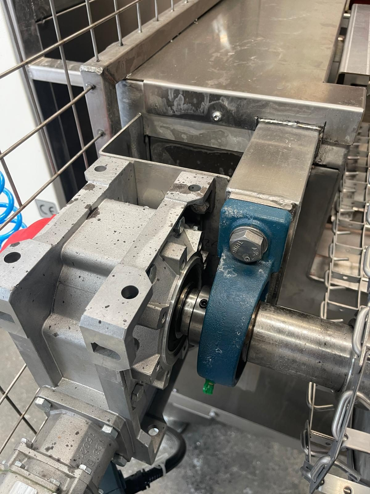

# 9.1 Bakım talimatları

---

## 9.1.1 Bakım felsefesi ve personel

KNV 90 7500 2B için **önleyici bakım** felsefesi uygulanır. Amaç; filtre tıkanması, nozul tıkanması, yağ birikimi, rezistans arızası, emniyet fonksiyonu zayıflaması ve pompa/fan/blower arızalarını planlı müdahale ile önlemek, plansız hat duruşunu azaltmaktır. Kapalı devre su sirkülasyonu nedeniyle filtre bakımı bu makinede proses kalitesinin ve pompa ömrünün belirleyicisidir.

| Parametre | Değer |
| :--- | :--- |
| Bakım felsefesi | Önleyici bakım |
| Personel yeterliliği | Makinenin kullanıldığı ülkenin mevcut bakım personeli yeterlilik seviyesi |
| Yağlama tablosu | Ayrı lubrication chart yok — **Bölüm 9.1.4** |

Bakım personeli; makine kullanımı, LOTO, acil stop ve temel güvenlik kuralları konusunda eğitim almış olmalıdır (**Bkz. Bölüm 3.2.6**). Rezistans, termokupl, kaçak akım rölesi, MKŞ ve elektrik bağlantı sıkılık kontrolleri yalnızca **yetkili elektrik personeli** tarafından yapılır.

---

## 9.1.2 Bakım öncesi güvenlik

Bakım için özel bir mod **bulunmamaktadır**. Aşağıdaki kurallara uyun:

1. Makineyi **Bölüm 7.3.1** sırasına göre durdurun; tüm fonksiyon anahtarları OFF.
2. Kurutma rezistanslarının ve tank suyunun soğumasını bekleyin.
3. Ana şalteri **OFF (O)** konumuna alın.
4. **LOTO prosedürünü** uygulayın (**Bkz. Bölüm 2.4** — adımlar tekrarlanmaz).
5. Kapak switch'lerini ve seviye sensörünü **baypas etmeyin**.
6. Bakım kapaklarını ve tank kapaklarını yalnızca enerji izolasyonu ve LOTO sonrası açın.

Bakım erişimi tank üst kapakları, 7 hücre bakım kapağı, pompa/filtre bölgesi, konveyör uçları ve elektrik panosu üzerinden sağlanır (**Bkz. Bölüm 3.5.3**).

**UYARI — Enerji kaynaklı yaralanma:** LOTO uygulanmadan yapılan bakımda makine kazara devreye girebilir; ezilme, elektrik çarpması ve +70 °C sıcak sıvı yaralanması oluşabilir.

**UYARI — Sıcak yüzey:** Rezistanslar, kurutma hücresi ve tank suyu enerji kesildikten sonra da sıcaktır; ısıya dayanıklı eldiven kullanın.

---

## 9.1.3 Periyodik bakım takvimi

Aşağıdaki tablo periyodik bakım takvimidir. Temizlik adımları için ilgili bölüme referans verilir; prosedür adımları tekrarlanmaz.

Saat bazlı periyotlar makine toplam çalışma saati üzerinden takip edilir; sayaç yoksa vardiya planına göre yaklaşık takvim karşılığı kullanılabilir (ör. tek vardiya 8 saat/gün çalışmada 250 saat ≈ 6 hafta).

| Periyot | Bakım maddesi | Referans |
| :--- | :--- | :--- |
| **Günlük** | Genel görsel kontrol — sızıntı, anormal ses, pano seviye/RESET lambaları | — |
| **Günlük** | Yıkama tankı ön filtre temizliği | Bölüm 10.1.3 |
| **Günlük** | Tank su seviyesi ve 6 bar hava durumu (tesis + elle dolum sonrası) | Bölüm 7.2 |
| **Günlük** | Konveyör hattında sıkışma veya parça birikintisi kontrolü | — |
| **Haftalık** | Tank iç filtreleri temizliği | Bölüm 10.1.4 |
| **Haftalık** | Pompa çıkışı torba filtre temizliği veya değişimi | Bölüm 10.1.4 |
| **Haftalık** | Yağ sıyırıcı ve tank yüzeyi kontrolü — aşırı yağ tabakası | — |
| **Haftalık** | Konveyör zincir gerginliği ve hizası gözle kontrol | Bölüm 6.1.3 |
| **Haftalık** | Kapak emniyet switch fonksiyonu kısa test | Bölüm 2.3, 5.4.2 |
| **Haftalık** | Acil stop butonları görsel kontrol (hasar, sıkışma yok) | Bölüm 2.5 |
| **Aylık** | Acil stop fonksiyon testi — bas, makine dursun, reset (7 buton) | Bölüm 6.2.3, 5.4.1 |
| **Aylık** | Konveyör 4 yağlama noktası gresleme | Bölüm 9.1.4 |
| **Aylık** | Seviye sensörleri ve sızıntı tavası temizlik/kontrol | Bölüm 11.7 |
| **Aylık** | Pano filtre/ventilasyon delikleri toz kontrolü | — |
| **Aylık** | Pompa, fan ve blower birimlerinde anormal titreşim/ses kontrolü | — |
| **250 saat** | Isıtıcı termokupl ve rezistans bağlantı kontrolü (LOTO sonrası, yetkili elektrikçi) | Bölüm 11.3.3 |
| **250 saat** | Egzoz fanı, kurutma fanı ve blower kanat/gövde toz birikimi temizliği | — |
| **250 saat** | Basınçlı hava hattı ve regülatör kaçak kontrolü | Bölüm 6.5 |
| **500 saat** | Yağ sıyırıcı redüktör yağ keçesi / teflon kontrol, gerekirse değişim | Bölüm 13.3 |
| **500 saat** | Konveyör redüktör yağ seviyesi / sızıntı kontrolü | Bölüm 9.1.4 |
| **500 saat** | Tank ve kapak contaları kontrol | — |
| **1000 saat** | Pompa emiş filtresi komple kontrol / değişim | Bölüm 13.3 |
| **1000 saat** | Nozul tıkanma/aşınma kontrolü (160 adet) | Bölüm 13.3 |
| **1000 saat** | Konveyör tahrik grubu (redüktör + inverter) mekanik ve elektrik kontrolü | — |
| **1000 saat** | Tank su kalitesi değerlendirmesi; gerekirse tam boşaltma ve iç temizlik | Bölüm 10 |
| **Yıllık** | Tüm emniyet fonksiyonları test raporu (kapak switch'leri, acil stop, kaçak akım) | Bölüm 2, 5.4 |
| **Yıllık** | Isıtıcı rezistans ve termokupl fonksiyon kontrolü | — |
| **Yıllık** | Konveyör redüktör keçe / sızıntı kontrolü — periyodik yağ değişimi [EKSİK] (redüktör etiketi) | Bölüm 9.1.4 |
| **Yıllık** | Elektrik bağlantıları sıkılık kontrolü (LOTO, yetkili elektrikçi) | — |
| **Yıllık** | Uzun duruş planlanıyorsa tank boşaltma ve koruyucu temizlik | Bölüm 7.3.4 |

**Periyodik bakım uygulama notları**

**Günlük:** Görsel kontrol, lamba ve manometre okuması için kapak açılmıyorsa LOTO gerekmez. **Ön filtre temizliği tank kapağı açmayı gerektirir** — **Bölüm 10.1.3** ve **LOTO (Bölüm 2.4)** uygulanır.

**Haftalık / aylık:** Tank ve filtre işlemleri için makine durdurulmalı; kapak açma gerektiren işlerde **LOTO zorunludur**. Kapak switch kısa testi ve acil stop testi makine hazır durumdayken yapılır (**Bölüm 5.4**).

**250–1000 saat:** Mekanik/elektrik müdahale gerektiren maddelerde **LOTO** uygulayın. Termokupl, rezistans, kaçak akım ve elektrik sıkılık kontrollerinde yetkili elektrikçi kullanın. Fan ve blower temizliğinde kanat dengesini bozmayın.

**Yıllık:** Emniyet test raporunu kayıt altına alın; NOK maddelerde operasyona geçmeyin.

---

## 9.1.4 Yağlama

| Parametre | Değer |
| :--- | :--- |
| Yağlama noktası sayısı | **4 adet** gres nipeli |
| Konum | Konveyör **girişinde sağ ve sol**, konveyör **çıkışında sağ ve sol** |
| Periyot | **Aylık** (bkz. Bölüm 9.1.3) |
| Gres tipi | **Castrol Tribol GR 100-1 PD** (NLGI 1) |
| Konveyör redüktörü (XXC40/75, tork sınırlayıcılı) | Yağ tipi ve değişim periyodu [EKSİK] — redüktör etiketi / BOM; **500 saat** seviye/sızıntı, **yıllık** keçe/sızıntı kontrolü |

Dört nipel, konveyör giriş ve çıkış rulman hatlarına aittir; redüktör gövdesine değil. Konveyör redüktörünün yağ bilgisi redüktör etiketinden okunmalı ve bu tabloya işlenmelidir; etiket bilgisi olmadan redüktör gövdesi açılmaz.

**Konveyör gresleme prosedürü**

1. Makineyi **Bölüm 7.3.1** ile durdurun.
2. **LOTO** uygulayın (**Bölüm 2.4**).
3. Konveyör giriş ve çıkış tarafındaki koruma kafesi içine girin; sağ ve sol **4 gres nipelini** tespit edin.
4. Nipelleri temizleyin; gres tabancası ile her nipele **Castrol Tribol GR 100-1 PD** basın; eski gresin dışarı çıkmaya başladığı anda durun.
5. Taşan gresi silin; gres konveyör tel bandına ve proses suyuna bulaşmamalıdır.
6. Redüktör gövdesini açmayın; redüktör ve tork sınırlayıcı çevresinde yağ sızıntısı olup olmadığını gözle kontrol edin.
7. Kafes ve kapakları kapatın; LOTO kaldırın; RESET sonrası konveyörü kısa süre boşta çalıştırarak ses kontrolü yapın.

**Beklenen sonuç:** Rulmanlarda anormal ses yok; tel bant düzgün ilerliyor; redüktörde sızıntı yok.

---

## 9.1.5 Kritik parça listesi

**Kritik** parçalar; arızada makinenin prosesini, parça akışını veya **güvenlik fonksiyonunu** doğrudan etkiler. Stok **0** olan kalemler siparişle temin edilir; lead time planlaması kullanıcı firma sorumluluğundadır.

Tam BOM için bkz. **Bölüm 13.3.1**.

| Sipariş kodu | Parça adı | Önerilen stok | Konum / fonksiyon | Gerekçe |
| :--- | :--- | :---: | :--- | :--- |
| 10 13529 | REDÜKTÖR MOTORLU XXC40/75 P63/B14 I LD TORK LİMİT | 0 | Konveyör tahrik | Arızada parça akışı durur |
| 07 17686 | KNV 90 7500 2B POMPA KOMPLESİ | 0 | Yıkama / durulama pompası | Arızada proses durur |
| 10 16319 | İNVERTÖR Delta VFD004EL21W-1 0,4 kW | 0 | Konveyör | Arızada konveyör durur |
| 07 15142 | REZİSTANS KOMPLESİ 8000 W 50 cm DÜZ DİKİŞSİZ | 2 | Tank ısıtma (7 ad) | Arızada sıcaklık sağlanamaz |
| 07 16791 | SEVİYE SENSÖRÜ ÇAT.TİP VEGASWING 51 | 1 | Tank seviye (2 ad) | Arızada seviye güvenliği bozulur |
| 10 00296 | PASLANMAZ SEVİYE BEKÇİSİ | 0 | Tank seviye güvenlik | [EKSİK] — saha montajına göre |
| 10 02976 | TERMOKUPL ETB30F06-5Ç | 1 | Isıtma kontrol | Arızada ısıtma devre dışı |
| 10 02634 | TERMOKUPL ETB30F06-4Ç | 1 | Isıtma kontrol | Arızada ısıtma devre dışı |
| 10 07147 | SWITCH F3STGRNLPU21M1J8 OMRON MANYETİK KAPI | 2 | 7 bakım kapağı | Güvenlik zinciri; arızada stop |
| 10 02896 | BUTON ACİL P1EC400E40K | 2 | Saha acil stop | Güvenlik |
| 10 00220 | EMNİYET RÖLESİ G9SB2002AACDC241 (acil stop) | 1 | Pano | Bypass edilemez |
| 10 11531 | EMNİYET RÖLESİ G9SB2002AACDC241 (kapak) | 1 | Pano | Bypass edilemez |
| 10 00258 | FAZ KORUMA RÖLESİ MKR-01 | 1 | Pano giriş | Faz hatası koruması |
| 07 17689 | KNV 90 7500 2B KURUTMA KOMPLESİ | 0 | Kurutma hücresi | Arızada kurutma yok |
| 07 17683 | SALYANGOZLU FAN ENA 4 1,1 kW | 0 | Egzoz | Arızada egzoz etkilenir |
| 07 04649 | YAĞ SIYIRICI KOMPLESİ TİP 3 | 0 | TANK 1 yağ sıyırıcı | Arızada yağ sıyırıcı çalışmaz |
| — | TMŞ LV521091 + kapı kolu LV521101 | 0 | Ana güç | Arızada tüm pano |

---

## 9.1.6 Yedek parça listesi (tüketim ve önerilen)

**Tüketim** parçaları planlı bakımda düzenli değiştirilir veya temizlenir. **Önerilen** parçaların stoklanması duruş süresini kısaltır. Önerilen stok miktarları tesis stok politikasına göre güncellenebilir; zorunlu sipariş taahhüdü değildir. Tam BOM için bkz. **Bölüm 13.3.1**.

| Sipariş kodu | Parça adı | Kategori | Önerilen stok | Konum / fonksiyon | Gerekçe |
| :--- | :--- | :--- | :---: | :--- | :--- |
| 07 10214 | ÖN FİLTRE NS KOMPLESİ | Tüketim | 2 | Tank ön filtre (6 ad) | Günlük temizlik tüketimi |
| 07 17682 | KNV 90 7500 2B HASSAS FİLTRE KOMPLESİ | Tüketim | 1 | Pompa çıkışı hassas (torba) filtre | Haftalık temizlik; periyodik değişim |
| 07 00670 | EMİŞ FİLTRESİ KOMPLESİ (PYM2,KBN,VDL,ULT,KNV) | Tüketim | 1 | Pompa emiş | 1000 saat kontrol/değişim |
| 07 08732 | EMİŞ FİLTRESİ KOMPLESİ 2" 1/2 | Tüketim | 1 | Emiş hattı | Periyodik değişim |
| 10 01079 | NOZZLE 650.724.1C.CC | Tüketim | 20 | Yıkama/durulama nozul (160 ad) | Aşınan parça |
| 10 17538 | TEL BANT 850 mm (konveyör) | Tüketim | 0 | Konveyör | Aşınma — stok [EKSİK] |
| 07 03635 | YAĞ AYIRICI ÜNİTESİ | Önerilen | 0 | Yağ ayırıcı | Proses kalitesi |
| 07 17687 | SIZINTI TAVASI MONTAJ KOMPLESİ | Önerilen | 0 | Alt sızıntı tavası | Sızıntı algılama |
| 07 00669 | TERMOSTAT ADAPTÖRÜ KOMPLESİ | Önerilen | 1 | Tank termostat montajı | Bakım |
| 10 11089 | TERMOSTAT GEMO DTH2 | Önerilen | 1 | Yıkama/durulama/kurutma | Sıcaklık ayarı |
| 10 00272 | RESET BUTONU BL901M + mavi lamba | Önerilen | 1 | Operatör paneli | Reset fonksiyonu |
| 10 00305 | KAÇAK AKIM RÖLESİ A9N19642 4P | Önerilen | 0 | Motor grubu RCCB | Koruma |
| 10 00304 | KAÇAK AKIM RÖLESİ A9N19643 4P | Önerilen | 0 | Tank rezistans RCCB | Koruma |
| 10 01421 | Sigorta A9F74106 1×6 | Önerilen | 2 | Konveyör/inverter besleme | Koruma |
| — | MKŞ GV2ME16 / GV2ME14 / GV2ME07 / GV2ME04 | Önerilen | 1 / 2 / 2 / 1 | Q1 / Q2,Q7–Q10 / Q4–Q6 / Q3 | Motor koruma |
| — | Kontaktör LC1K1610M7 / LC1K0610M7 / LC1D25M7 | Önerilen | 2 / 2 / 1 | Pompa-blower / fan-sıyırıcı / kurutma ısıtıcı | Yedek |
| — | Sigorta A9F74316 (16 A) / A9F74325 (25 A) | Önerilen | 3 / 2 | Tank ısıtıcı / kurutma ısıtıcı | Koruma |

**Sipariş:** Sipariş kodu ile üretici/servis kanalından temin edin (**Bkz. Bölüm 1.3.4**). Kritik parçalar için bkz. **Bölüm 9.1.5**. Tüm kalemler **Bölüm 13.3.1**.

---

## 9.1.7 Bakım kayıt formu

Periyodik bakım ve test sonuçlarını kayıt altına alın. NOK maddeler giderilmeden operasyona dönülmemelidir.

| # | İşlem | Periyot | Tarih | Yapan | OK/NOK |
| :---: | :--- | :--- | :--- | :--- | :---: |
| 1 | Günlük kontrol maddeleri | Günlük | | | ☐ |
| 2 | Haftalık filtre / kapak switch / acil stop görsel | Haftalık | | | ☐ |
| 3 | Aylık acil stop fonksiyon testi (7 buton) | Aylık | | | ☐ |
| 4 | Konveyör yağlama (4 nokta) | Aylık | | | ☐ |
| 5 | 250 / 500 / 1000 saat bakım (ilgili madde) | Saat | | | ☐ |
| 6 | Yıllık emniyet test raporu | Yıllık | | | ☐ |
| 7 | Filtre/tank temizliği | Bkz. Bölüm 10 | | | ☐ |
| 8 | Termostat set değerleri kaydı | Değişiklikte | | | ☐ |

**Onaylayan:** _______________ **Tarih:** _______________

---

Tam parça listesi için bkz. **Bölüm 13.3**.
