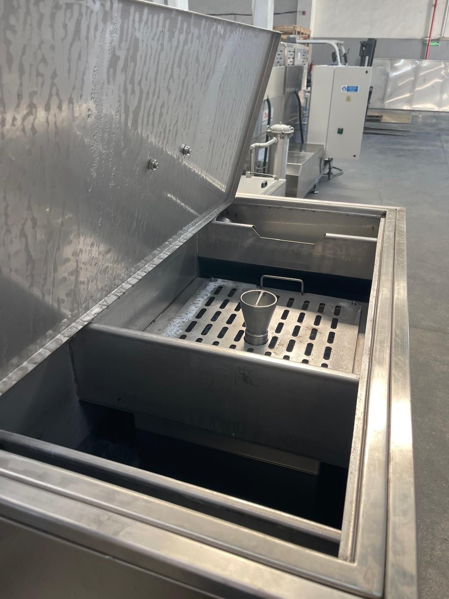
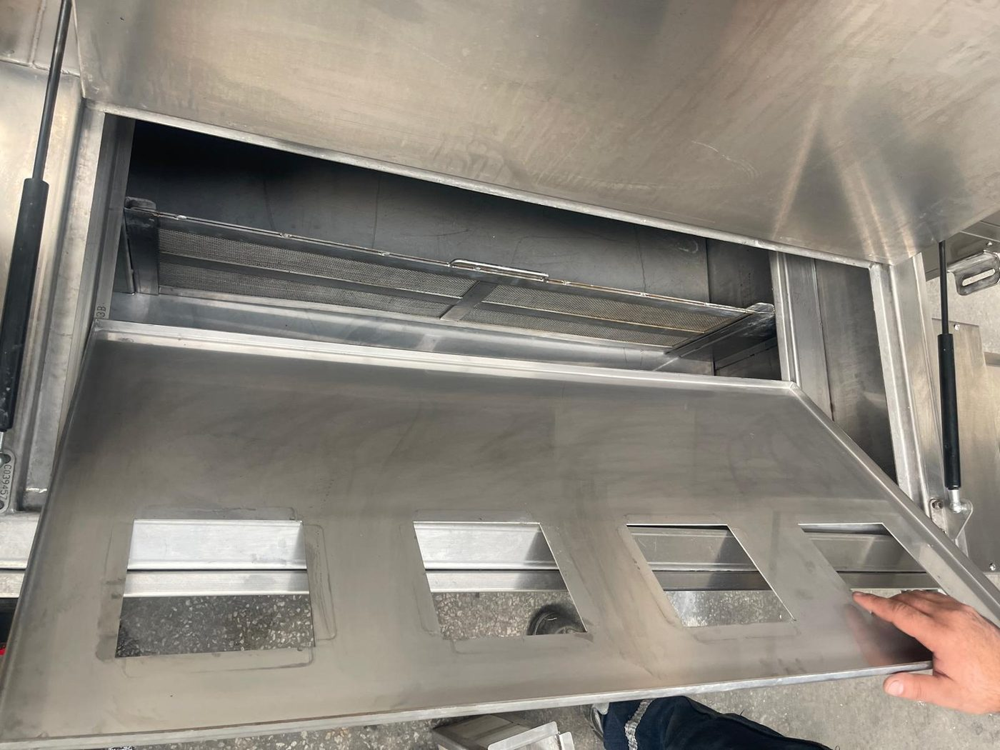
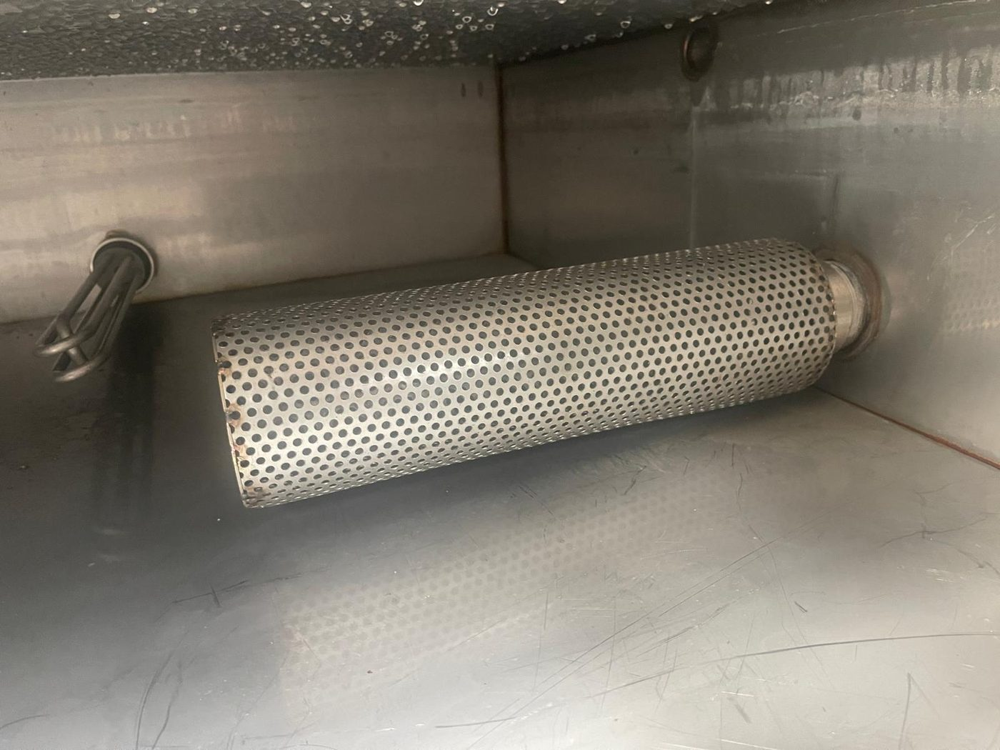
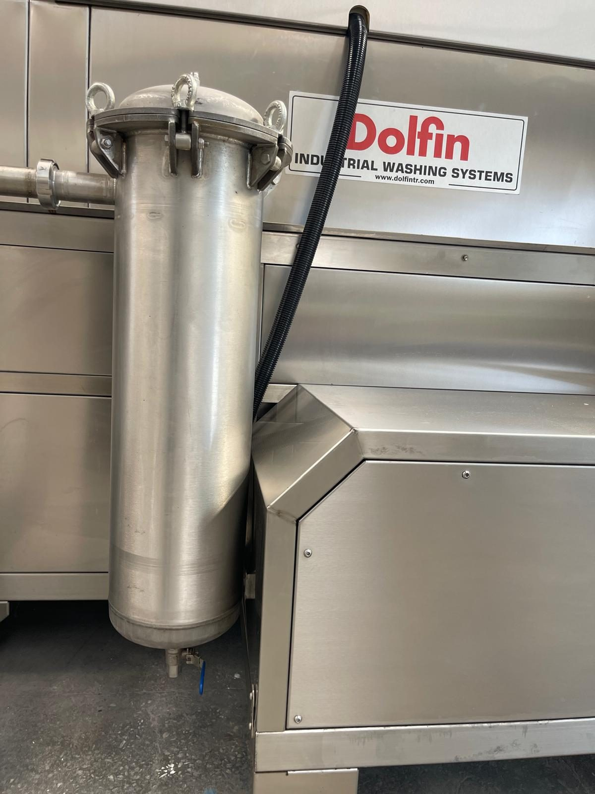
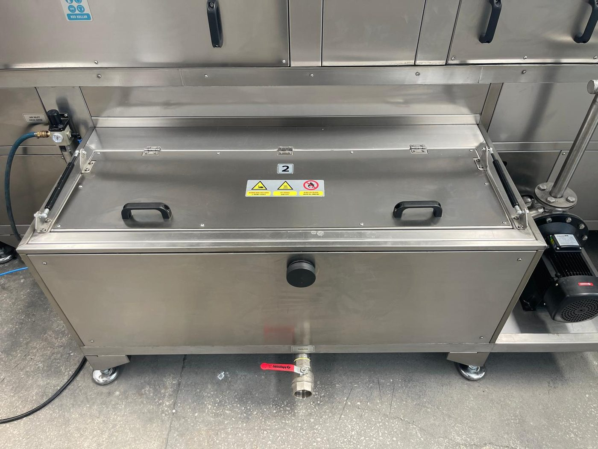
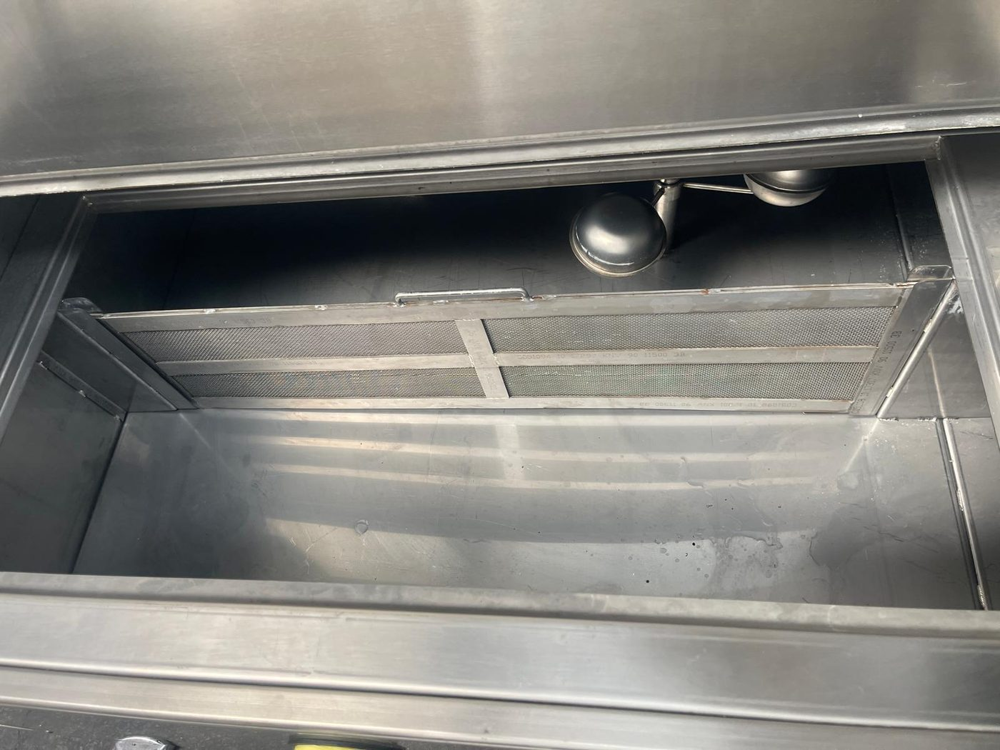

# 10.1 Reinigung und Desinfektion

Die Prozesstanks der Maschine arbeiten mit **heißem Wasser** (bis +70 °C); bei der Reinigung besteht die Gefahr durch heiße Oberflächen und Dampf. Als Reinigungsmittel sind Mittel zu verwenden, die den in **Kapitel 10.1.7** festgelegten Kriterien entsprechen; verbotene Mittel verursachen dauerhafte Schäden an Tanks, Dichtungen und Edelstahloberflächen.

Die Bestellnummern der Ersatzfilter sind in den Tabellen in **Kapitel 9.1.6** und **13.3.1** angegeben.

---

## 10.1.1 Reinigungsart

| Parameter | Wert |
| :--- | :--- |
| Reinigungsart | **Trocken / nass** |
| CIP / COP | Nicht vorhanden |

Die Reinigung erfolgt **manuell**. Die Außenflächen der Maschine werden mit einem trockenen Tuch abgewischt; das Tankinnere erfordert eine Nassreinigung (Wasser, Seifenwasser). Schaltschrank, Bedienfeld, Frequenzumrichter des Förderers, Klappenschalter und Motorklemmenkästen **nicht direkt mit Wasser abspritzen**.

---

## 10.1.2 Sicherheit vor der Reinigung

Der Zugang zu Tanks und Filtern erfordert das Öffnen von Klappen und Deckeln. Die Wartungsklappen der Kammern werden mit magnetischen Schaltern überwacht und setzen die Maschine beim Öffnen still; die oberen Tankdeckel besitzen keinen Schalter. In beiden Fällen gilt vor der Reinigung:

1. Die Maschine in der Reihenfolge nach **Kapitel 7.3.1** stillsetzen.
2. Das Abkühlen des Tankwassers und der Heizstäbe abwarten.
3. Den Hauptschalter in Stellung **OFF (O)** bringen.
4. Das **LOTO-Verfahren** anwenden (**Siehe Kapitel 2.4**).
5. Die Klappenschalter und den Füllstandsensor **nicht überbrücken**.
6. Vor einer längeren Reinigung oder Desinfektion die Tanks über das Ablassventil **TAHLİYE** entleeren (**Siehe Kapitel 10.1.5**).

**WARNUNG — Heiße Oberfläche und Dampf:** Vor dem Öffnen des Tankdeckels warten, bis die Prozessflüssigkeit eine sichere Temperatur erreicht hat; heißes Wasser und Dampf können Hautverbrennungen verursachen. Hitzebeständige Handschuhe und Schutzbrille verwenden.

**WARNUNG — Chemikalien:** Ausschließlich freigegebene Reinigungsmittel verwenden. Säurehaltige und für Edelstahl schädliche Mittel sind **verboten** (**Siehe Kapitel 10.1.7**).

---

## 10.1.3 Tägliche Reinigung — Vorfilter

| Parameter | Wert |
| :--- | :--- |
| Intervall | **Täglich** (siehe **Kapitel 9.1.3**) |
| Umfang | **Vorfilter** des Waschtanks (Vorfilterkörbe — 6 Stück montiert) |
| Sonstiges | Täglich ist keine weitere Reinigung erforderlich |

Die Vorfilterkörbe sitzen in den Fächern unter der Lochplatte, durch die das vom Kammerboden in den Tank zurücklaufende Wasser fließt; sie halten Späne und groben Schmutz zurück. Ein verstopfter Vorfilter verlangsamt den Rücklauf in den Tank, führt zu Wasseransammlungen am Kammerboden und lässt Schmutz in den Tank gelangen.

Ersatzteil: **07 10214** — ÖN FİLTRE NS KOMPLESİ (empfohlener Lagerbestand: 2 — siehe **Kapitel 9.1.6**).

**Tägliches Reinigungsverfahren**

1. Die Maschine stillsetzen; **LOTO** anwenden (**Kapitel 10.1.2**).
2. Den oberen Deckel des Waschtanks (TANK 1) öffnen; die Gasdruckfedern halten den Deckel offen.
3. Die **Lochplatte** über der Vorfilteraufnahme abheben.
4. Die Vorfilterkörbe an den Griffen nach oben herausziehen; das Abtropfen des Wassers in den Tank abwarten.
5. Die Späne und den Schmutz aus den Körben in den Abfallbehälter entleeren (**Siehe Kapitel 10.1.8**).
6. Die Körbe mit **Leitungswasser** und bei Bedarf mit einem freigegebenen Reinigungsmittel (**Siehe Kapitel 10.1.7**) reinigen; eine Bürste kann verwendet werden; keine verbotenen Chemikalien verwenden.
7. Bei Beschädigung der Körbe (Verformung, Löcher, gerissenes Sieb) durch Ersatzteile austauschen.
8. Die Körbe so einsetzen, dass sie vollständig in ihren Aufnahmen sitzen; die Lochplatte schließen.
9. Den Tankdeckel schließen; das Verfahren zum Aufheben von LOTO abschließen; vor der Inbetriebnahme prüfen, dass keine Leckage vorliegt.

**Erwartetes Ergebnis:** Vorfilter sauber und korrekt montiert; keine Wasseransammlung am Kammerboden; keine ungewöhnlichen Geräusche an der Pumpenansaugung.

**Abweichung:** Bei häufiger Verstopfung die Qualität des Prozesswassers und die Ölfracht bewerten; den Einsatz von Ölskimmer und Ölabscheider erhöhen (**Siehe Kapitel 3.1.5, 11**).

---

## 10.1.4 Wöchentliche Grundreinigung — Saugfilter der Tanks und Beutelfilter

| Parameter | Wert |
| :--- | :--- |
| Intervall | **Wöchentlich** (siehe **Kapitel 9.1.3**) |
| Umfang | **Saugfilter** der Tanks (Ansaugfilter) + **Feinfilter (Beutelfilter)** am Pumpenausgang |

Der Saugfilter ist der gelochte Zylinder am Ende der Pumpensaugleitung im Tank; er verhindert das Eindringen grober Partikel in die Pumpe. Der Feinfilter ist der Beutelfilter im Edelstahlgehäuse am Pumpenausgang; er hält feine Partikel zurück, die die Düsen verstopfen würden. Ein verstopfter Beutelfilter verringert den Sprühdruck und belastet die Pumpe.

Ersatzteil: **07 17682** — HASSAS FİLTRE KOMPLESİ (Lagerbestand 1); **07 00670 / 07 08732** — EMİŞ FİLTRESİ KOMPLESİ (Lagerbestand 1).

**Wöchentliches Reinigungsverfahren**

1. Die Maschine stillsetzen; **LOTO** anwenden.
2. Die oberen Deckel von Tank 1 und Tank 2 öffnen; die Saugfilter aus ihren Aufnahmen entnehmen.
3. Die Saugfilter mit Leitungswasser und Bürste reinigen; Filter mit verstopften Löchern oder verformtem Gehäuse austauschen.
4. Die Saug-/Druckventile der Pumpen schließen.
5. Den Deckel des Feinfiltergehäuses öffnen; das darin enthaltene Wasser in eine Wanne ablassen; den **Beutelfilter** entnehmen.
6. Den Beutelfilter umstülpen und den Schmutz entleeren; mit Leitungswasser reinigen. Ist eine Reinigung nicht möglich oder das Sieb gerissen, den Filter **austauschen**.
7. Den Beutelfilter in das Gehäuse einsetzen; Dichtung und Deckel dicht schließen.
8. Die Saugfilter wieder einsetzen; die Tankdeckel schließen.
9. Die Pumpenventile öffnen.
10. Die **tägliche** Reinigung der Vorfilter (**Kapitel 10.1.3**) im selben Wartungsdurchgang durchführen.
11. Die Scheibe des Ölskimmers und die Tankoberfläche kontrollieren; bei übermäßiger Ölschicht den Ölskimmer betreiben oder das Oberflächenöl abnehmen.
12. LOTO aufheben; die Pumpen einschalten und Filtergehäuse sowie Anschlüsse auf Leckagen prüfen.

**Erwartetes Ergebnis:** Filter sauber oder neu; Sprühdruck normal; keine Leckage.

---

## 10.1.5 Verfahren für Tankentleerung und Desinfektion

| Parameter | Wert |
| :--- | :--- |
| Anwendung | Längere Stillsetzung (Wochenende), Bewertung der Wasserqualität nach 1000 h, Geruchs-/Schmutzansammlung |
| Methode | Tankentleerung (Ablassventil TAHLİYE) + Innenreinigung mit **Seifenwasser** |

**Verfahren für Tankentleerung und Desinfektion**

1. Die Maschine stillsetzen; das Abkühlen des Tankwassers abwarten; **LOTO** anwenden.
2. Prüfen, dass das Ablassventil **TAHLİYE** unter dem Tank an die Abwasserleitung angeschlossen ist (**Siehe Kapitel 10.1.8**).
3. Das Ablassventil TAHLİYE öffnen; die vollständige Entleerung des Tanks abwarten.
4. Den oberen Tankdeckel öffnen; Vorfilterkörbe, Lochplatte und Saugfilter entnehmen (**Siehe Kapitel 10.1.3, 10.1.4**).
5. Schlamm und Ablagerungen am Tankboden mit Schaufel/Spachtel aufnehmen; in den Abfallbehälter entleeren.
6. Die Innenflächen des Tanks, die Heizstäbe und den Füllstandsensor mit **Seifenwasser** reinigen; eine für Edelstahloberflächen geeignete weiche Bürste oder ein Tuch verwenden; die Heizstabrohre und das Thermoelement nicht mit Kraft beanspruchen.
7. Das Seifenwasser über das Ablassventil TAHLİYE ablassen.
8. Das Tankinnere mit **sauberem Wasser** nachspülen; das Spülwasser ablassen.
9. Das Ablassventil TAHLİYE schließen.
10. Filter und Lochplatte wieder einsetzen; den Tankdeckel schließen.
11. Denselben Vorgang für den anderen Tank wiederholen.
12. Die Außenfläche der Maschine nach **Kapitel 10.1.6** abwischen.
13. Das Abwasser gemäß **Kapitel 10.1.8** entsorgen.
14. Vor der Wiederinbetriebnahme die Tanks nach **Kapitel 7.2.1** befüllen.

**VORSICHT — Verbotene Chemikalien:** Säurehaltige und für Edelstahl schädliche Reinigungs-/Desinfektionsmittel **dürfen nicht verwendet werden** (**Siehe Kapitel 10.1.7**). Für die Desinfektion des Tankinneren gilt die Methode mit **Seifenwasser**.

**VORSICHT — Heizstäbe:** Die Heizstäbe dürfen im leeren Tank niemals unter Spannung gesetzt werden; die Füllstandverriegelung verhindert dies, dennoch ist das Arbeiten unter LOTO zwingend.

**Erwartetes Ergebnis:** Tankinneres sauber, keine Ablagerungen und kein Geruch; bereit zur Neubefüllung mit Prozesswasser.

---

## 10.1.6 Trocknung nach der Reinigung

| Parameter | Wert |
| :--- | :--- |
| Maschine außen | Mit einem **trockenen Tuch** abwischen |
| Tankinneres | Nach der Entleerung natürliche Trocknung oder Trocknung mit einem Tuch |
| Schaltschrank / Bedienfeld / Frequenzumrichter | **Nicht mit Wasser reinigen** — ausschließlich trockenes oder leicht feuchtes Tuch |
| Klappenschalter und Magnete | Trockenes Tuch; kein Wasser und keine Chemikalien anwenden |

Auf der Außenfläche der Maschine keine Wasseransammlungen zurücklassen; in der Nähe des Schaltschranks keine Nassreinigung durchführen. Nach Abschluss der Trocknung wird LOTO aufgehoben und die Inbetriebnahme nach dem Verfahren in **Kapitel 7.2** durchgeführt.

---

## 10.1.7 Reinigungsmittel

Für die Reinigung der Maschine kann **Leitungswasser** verwendet werden. Als Reinigungschemikalien sind **edelstahlverträgliche neutrale oder leicht alkalische** Reiniger zu verwenden. Die folgende Tabelle gibt die Herstellerempfehlung wieder; der Kunde kann auch gleichwertige Produkte verwenden, die nicht säurehaltig sind und die Maschine (Edelstahl, Tanks, Dichtungen) nicht schädigen.

| Parameter | Wert |
| :--- | :--- |
| Reinigungswasser | **Leitungswasser** |
| Allgemeines Kriterium | Edelstahlverträgliche **neutrale** oder **leicht alkalische** Reiniger |
| Desinfektion (Tankinneres) | **Seifenwasser** |
| Gleichwertiges Produkt des Kunden | Nicht säurehaltige Produkte, die Edelstahl, Tanks und Dichtungen nicht schädigen, können verwendet werden |

**Vom Hersteller empfohlene Reinigungsmittel**

| Produkt | Verwendung |
| :--- | :--- |
| **VEIDEC 89 SUPER FOAM 750** | Allgemeine Reinigung |
| **VEIDEC BIO CLEANING 3** | Hartnäckige, nicht entfernbare Flecken — mit einem leicht angefeuchteten **Schwamm** in geringer Menge abreiben |
| **VEIDEC 34 INOX** | Polieren |

Die Produktanweisungen (Dosierung, Einwirkzeit, Nachspülen) beachten. Die Chemikalien nicht direkt auf Schaltschrank, Bedienfeld, Frequenzumrichter und die Bereiche der Klappenschalter aufbringen.

**Verbotene Reinigungsmittel**

| Verboten | Begründung |
| :--- | :--- |
| **Säurehaltige** Reinigungsmittel | Korrosion an Tanks, Heizstäben, Dichtungen und Edelstahloberflächen |
| Mittel, die **Edelstahl schädigen** | Schäden am Maschinengehäuse und am Tankmaterial |
| **Lösungsmittel / brennbare Flüssigkeiten** | Brandgefahr; Verbotsschild an der Maschine |

Quelle des Prozesswassers (Produktion): Leitungswasser oder aufbereitetes Wasser (**Siehe Kapitel 3.3.5**). Für die **Reinigung** der Maschine ist Leitungswasser ausreichend.

---

## 10.1.8 Entsorgung von Abwasser und Chemikalien

| Parameter | Anforderung |
| :--- | :--- |
| Entsorgung von Abwasser / Chemikalien | Die im Einsatzland der Maschine geltenden Anforderungen an die Entsorgung von Abwasser / Chemikalien |

Das Wasser aus der Tankentleerung ist **ölhaltiges Prozesswasser**; nicht in die kommunale Kanalisation einleiten. Das Wasser aus der Tankentleerung, das Seifenwasser der Reinigung, das in der Ölabscheidereinheit gesammelte Öl, die Abfälle der Filterreinigung und die Späne aus den Vorfilterkörben sind gemäß den örtlichen Vorschriften für die **Entsorgung von Abwasser und Chemikalien** zu sammeln, zu klassifizieren und zu behandeln oder einer zugelassenen Entsorgungsanlage zu übergeben. Das Entsorgungsverfahren ist im Rahmen der Umweltgenehmigungen des Werks festzulegen.

Durchmesser und Anschlussdaten der Abfluss-/Abwasserleitung sind in der Layoutzeichnung angegeben ([EKSİK] — **Siehe Kapitel 3.3.5, 13.2**).

---

## 10.1.9 Reinigungsprotokoll

| # | Tätigkeit | Intervall | Datum | Durchgeführt von | OK/NOK |
| :---: | :--- | :--- | :--- | :--- | :---: |
| 1 | Reinigung der Vorfilter des Waschtanks | Täglich | | | ☐ |
| 2 | Reinigung der Saugfilter in den Tanks | Wöchentlich | | | ☐ |
| 3 | Reinigung/Austausch der Beutelfilter am Pumpenausgang | Wöchentlich | | | ☐ |
| 4 | Kontrolle Ölskimmer / Tankoberfläche | Wöchentlich | | | ☐ |
| 5 | Tankentleerung + Desinfektion (Seifenwasser) | Bei Bedarf / längerer Stillstand | | | ☐ |
| 6 | Trocknung der Außenflächen | Nach jeder Reinigung | | | ☐ |

**Freigegeben von:** _______________ **Datum:** _______________

---

Referenz zum Ablassen der Flüssigkeit vor der Demontage **Kapitel 12.1** → Kapitel 10.1.5.
