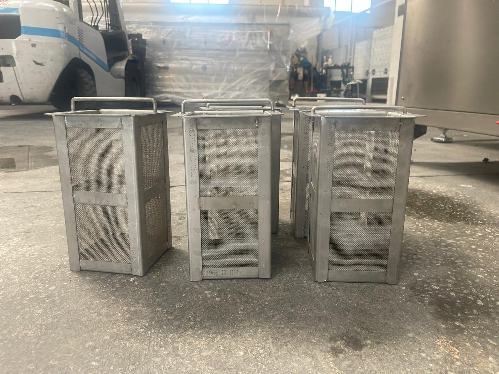

# 10. TEMİZLİK

Bu bölüm, **KNV 90 7500 2B** makinesinin manuel temizlik ve dezenfeksiyon prosedürlerini tanımlar. Makine **kuru/ıslak** manuel temizliğe uygundur; otomatik **CIP** veya **COP** sistemi **bulunmamaktadır**. Kapalı devre su sirkülasyonu nedeniyle ön filtre, iç filtre, emiş filtresi ve pompa çıkışı torba filtre temizliği, proses kalitesinin ve pompa ömrünün temel koşuludur.

Temizlik işlemleri **bakım personeli** veya eğitimli operatör tarafından yapılır. Tank, filtre ve kapak erişimi gerektiren tüm işlemlerde makine durdurulmalı ve **LOTO prosedürü** uygulanmalıdır (**Bkz. Bölüm 2.4** — adımlar tekrarlanmaz). Periyodik temizlik periyotları **Bölüm 9.1.3** bakım takviminde verilmiştir.

| Parametre | Değer |
| :--- | :--- |
| Temizlik tipi | Kuru / ıslak — manuel |
| Günlük | Yıkama tankı ön filtreleri |
| Haftalık | Tank iç filtreleri + pompa çıkışı torba filtreler |
| Dezenfeksiyon | Tank boşaltma (TAHLİYE vanası) + sabunlu su yıkama |
| Temizlik suyu | Şebeke suyu |
| Onaylı kimyasal | Nötr / hafif alkali (paslanmaz uyumlu); üretici önerisi VEIDEC serisi — bkz. **10.1.7** |
| Yasak | Asit bazlı maddeler; paslanmaz çeliğe zarar veren maddeler; solvent |

| Alt bölüm | Konu |
| :--- | :--- |
| **10.1** | Temizlik ve dezenfeksiyon prosedürleri |

---

Bakım takvimi için bkz. **Bölüm 9.1.3**; yedek filtre için bkz. **Bölüm 9.1.6**, **13.3**.
