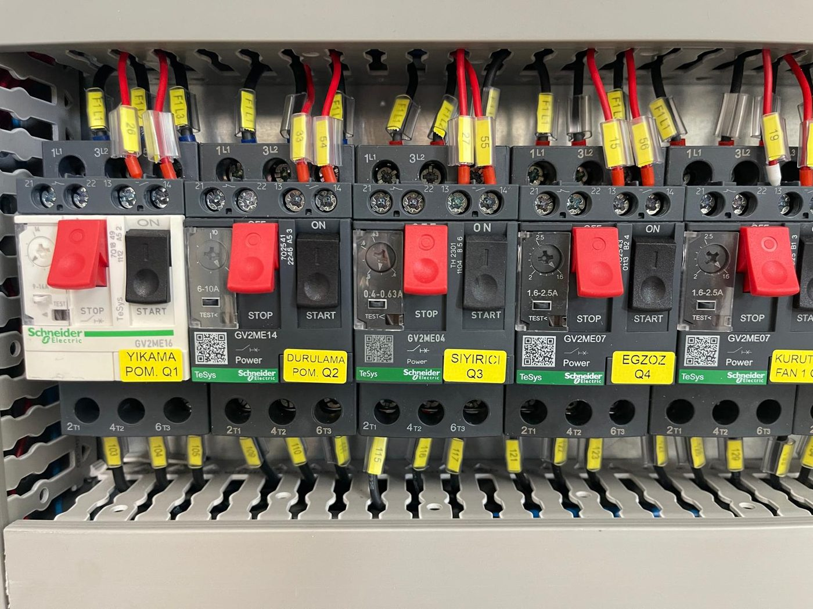
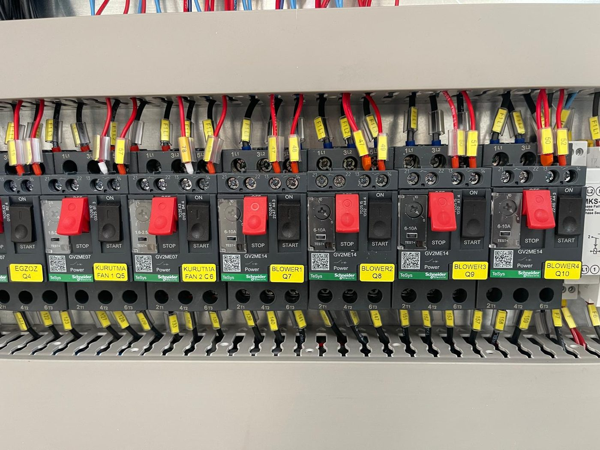

# 11.1 Arıza bulma

Arıza teşhisinde önce operatör paneli **lamba durumu** okunur; ardından aşağıdaki arıza tablosuna göre kontrol ve çözüm adımları uygulanır. Tabloda çözüm bulunmayan veya tekrarlayan arızalarda ilgili alt bölüme (**11.3**–**11.7**) ve **Bölüm 11.2.2** servis kriterlerine bakın.

---

## 11.1.1 Genel teşhis adımları

1. **RESET lambasına** bakın. Sönükse emniyet zinciri açıktır: acil stop basılı, bakım kapağı açık/hizasız veya reset bekleniyor — **Arıza 4**.
2. **WASHING LEVEL lambalarına** bakın. Kırmızı yanıyorsa ilgili tankta su yetersizdir; o tankın ısıtıcı ve pompası interlock ile kilitlidir — **Arıza 3**.
3. Çalışmayan fonksiyonun **run lambasına** bakın. Anahtar ON iken lamba sönükse çıkış kesilmiştir: interlock, MKŞ trip, kaçak akım trip veya kontaktör arızası — **Arıza 1, 2, 3**.
4. Hiçbir fonksiyon çalışmıyor ve RESET lambası da yanmıyorsa pano beslemesi veya faz koruma sorunu — **Arıza 6**.
5. Konveyör çalışmıyorsa inverter ekranındaki kodu okuyun — **Bölüm 11.3.2**.
6. Pano içi kontrol gerekiyorsa makineyi durdurun, **LOTO** uygulayın (**Bölüm 2.4**) ve yetkili elektrikçi ile **Bölüm 11.1.3** MKŞ tespit tablosuna göre trip olan elemanı bulun.
7. Çözüm adımlarını uygulayın; neden giderilmeden MKŞ veya kaçak akım rölesini tekrar tekrar kurmayın.

**Hata davranışı:** Emniyet zinciri açıldığında (kapak, acil stop) **tüm** çıkışlar kesilir. Seviye, MKŞ ve kaçak akım trip'leri yalnızca **ilgili** fonksiyonu keser; diğer fonksiyonlar çalışmaya devam eder. Faz hatasında pano hiç çıkış vermez.

**Beklenen sonuç:** Neden giderilir; RESET lambası yanar; fonksiyon anahtarı ON alındığında run lambası yanar ve birim çalışır.

---

## 11.1.2 Arıza tablosu — belirti, neden, kontrol, çözüm

Aşağıdaki tablo bu makine için tanımlı arıza senaryolarıdır. Pano içi işlemler yalnızca yetkili elektrikçi tarafından LOTO altında yapılır.

| # | Belirti | Olası neden | Kontrol | Çözüm | Yetkinlik |
| :---: | :--- | :--- | :--- | :--- | :---: |
| 1 | Motor / pompa / fan / blower çalışmıyor; anahtar ON, run lambası sönük; ilgili **MKŞ trip** (GV2ME kolu aşağıda / "0") | Aşırı akım, mekanik sıkışma, faz kaybı, kısa devre; pompa vanası kapalı | Anahtarı OFF al; LOTO; **Bölüm 11.1.3** tablosundan trip olan MKŞ'yi bul (Q1 yıkama, Q2 durulama, Q3 sıyırıcı, Q4 egzoz, Q5–Q6 kurutma fanı, Q7–Q10 blower); mil/kaplin serbestliği, vana konumu, kablo | Mekanik nedeni gider; MKŞ kolunu reset; LOTO kaldır; kısa test. Tekrarlayan trip → servis | Elektrik |
| 2 | **Kaçak akım rölesi (RCCB)** trip — A9N19642 / A9N19643 grubu; ilgili ısıtıcılar veya motor grubu çalışmıyor | Rezistansta izolasyon hatası (patlak/ıslak rezistans), nem, kablo hasarı | LOTO; trip olan RCCB'yi ve beslediği grubu tespit et (K.AKIM F1…F5 etiketleri); rezistans ve bağlantı izolasyonunu ölç | Arızalı rezistansı ayır ve değiştir (**Bkz. Bölüm 13.3** — 07 15142); nem kaynağını gider; RCCB reset. Tekrarlayan trip → servis | Elektrik |
| 3 | Pompa veya tank ısıtıcısı anahtarı ON ama çalışmıyor; **TANK 1/2 WASHING LEVEL** kırmızı yanıyor | Tankta su yok veya seviye düşük (seviye interlock'u); MKŞ trip; kontaktör çekmiyor | Tank seviyesini gözle kontrol et; kırmızı lambayı kontrol et | Tankı elle doldur (**Bölüm 7.2.1**); lamba sönünce anahtarı yeniden aç. Tank dolu ama lamba yanıyorsa seviye sensörü — **Bölüm 11.7**. Lamba sönük ama çalışmıyorsa MKŞ/kontaktör — Arıza 1 | Operatör / Elektrik |
| 4 | Tankta su varken **RESET** ile mavi lamba yanmıyor; makine hazır olmuyor | Bakım kapağı açık veya kapak switch'i hizasız; en az bir acil stop basılı; emniyet rölesi G9SB reset bekliyor | 7 acil stopun tamamını kontrol et; 7 bakım kapağının kapalı ve switch–mıknatıs hizalı olduğunu kontrol et | Tüm acil stopları serbest bırak; kapakları hizalı kapat; RESET'e lamba yanana kadar bas. Devam ederse LOTO altında kapak switch kablosu ve emniyet rölesi girişlerini kontrol et (**Bölüm 11.7.1**) | Operatör / Elektrik |
| 5 | GEMO DTH2 set sıcaklığa ulaşıldı gösteriyor, ancak su (veya kurutma havası) **ısınmaya devam ediyor** | Termostat çıkış arızası (kontak açılmıyor); ısıtıcı kontaktörü yapışmış (LC1K / LC1D sürekli çekili) | Isıtıcı anahtarını OFF al; sıcaklık yükselmeye devam ediyorsa kontaktör yapışıktır. LOTO; kontaktörde ses/ısınma; termostat çıkışını ve kontaktör kontaklarını test et | Arızalı termostat (10 11089) veya kontaktörü değiştir (**Bölüm 13.3**). Isıtıcı anahtarı OFF iken ısınma devam ediyorsa ana şalteri kapat ve servis çağır | Elektrik |
| 6 | **Panoda enerji yok** — hiçbir fonksiyon çalışmıyor, RESET lambası yanmıyor; güç kablosu bağlı | Ana şalter (TMŞ) OFF veya açmış; kontrol sigortası atmış; **MKR-01 faz sıra rölesi** fazlar ters/eksik olduğu için çıkış vermiyor; 24 V DC güç kaynağı arızası | Ana şalter kol konumu; tesis besleme; LOTO altında kontrol sigortaları (A9F74160 / A9F74110), MKR-01 göstergesi, LRS-350-24 çıkışı | TMŞ'yi ON al; atmış sigortayı nedenini bulduktan sonra değiştir; faz sırasını yetkili elektrikçi doğrulasın ve gerekirse iki fazı değiştirsin (**Bölüm 5.3.6**); MKR-01 reset; şema **Bölüm 13.1** | Elektrik |
| 7 | **Konveyör** çalışmıyor; CONVEYOR anahtarı ON; inverter ekranında alarm kodu | İnverter alarmı (aşırı akım, aşırı yük, besleme); mekanik sıkışma; tel bant takılması; potansiyometre 20 Hz altında | Hat üzerinde sıkışma; inverter ekran kodu; potansiyometre konumu | Sıkışmayı LOTO altında gider; potansiyometreyi 20 Hz üstüne al; inverter kodunu Delta kılavuzunda bul (**Bölüm 11.3.2**); inverteri OFF/ON ile reset. Tekrarlıyorsa servis | Operatör / Elektrik |
| 8 | Konveyör dönüyor ama **tel bant ilerlemiyor** | Tork sınırlayıcı kayıyor (aşırı yük, sıkışma, parça yığılması) | Çıkışta parça birikimi; hat üzerinde sıkışma | Konveyörü OFF al; LOTO; sıkışmayı gider; yükü azalt. Tork sınırlayıcı sürekli kayıyorsa servis | Operatör / Bakım |
| 9 | **Püskürtme zayıf**, pompa çalışıyor | Torba filtre / emiş filtresi tıkalı; ön filtreler tıkalı; pompa vanası kısık; nozullar tıkalı; su seviyesi düşük | Filtre durumu; vana konumu; seviye | **Bölüm 10.1.3, 10.1.4** filtre temizliği; vanaları aç; 1000 saatlik nozul kontrolü (**Bölüm 9.1.3**) | Bakım |
| 10 | **Parça ıslak çıkıyor** | Blower veya kurutma kapalı; kurutma ısıtıcısı set değeri düşük; konveyör hızı yüksek; fan/blower kanatları tozlu | Anahtar konumları; termostat; hız; fan temizliği | BLOWER 1/2 ve DRYING FAN/HEATER aç; set değeri yükselt; hızı düşür; fan/blower toz temizliği (250 saat) | Operatör / Bakım |
| 11 | **Buhar** hücre kapaklarından ve perdelerden işletmeye yayılıyor | Egzoz fanı çalışmıyor (Q4 trip); baca tıkalı veya bağlantısız | Egzoz fanı sesi; Q4 MKŞ; baca | Arıza 1 prosedürü (Q4); baca kanalını aç/bağla (**Bölüm 5.3.4**) | Bakım / Elektrik |
| 12 | **Yağ ayırıcı** pompası çalışmıyor; anahtar ON | Hava yok / basınç düşük (6 bar); solenoid valf arızası; diyafram pompa tıkalı | Manometre; solenoid tık sesi; hortumlar | Tesis hava vanasını aç; regülatörü 6 bar'a ayarla (**Bölüm 6.5**); solenoid ve pompa — **Bölüm 11.5** | Bakım |
| 13 | Makine altında **su birikintisi** / sızıntı | Tank contası, TAHLİYE vanası sızdırıyor, filtre gövdesi kapağı, hortum bağlantısı, tank taşması | Kaynağı izle; sızıntı tavası | Vana/conta/kapak sık veya değiştir; taşmayı önlemek için dolum seviyesine dikkat; **Bölüm 11.7.4** | Bakım |

> **Not:** Bu tablo DATA ve pano yapısına dayanır. Çözüm adımları genel teşhis rehberidir; elektrik panosu müdahalesi öncesi **LOTO** (**Bölüm 2.4**) zorunludur.

---

## 11.1.3 MKŞ tespit tablosu — pano içi motor koruma şalterleri

Pano içinde her motor hattı için ayrı Schneider GV2ME motor koruma şalteri (MKŞ) bulunur; trip durumunda kol aşağı ("0") düşer ve GVAE11 yardımcı kontak ilgili run lambasını söndürür. Etiketler pano içinde sarı plakalarda yazılıdır.

| Pano etiketi | MKŞ tipi | Motor | Trip belirtisi |
| :--- | :--- | :--- | :--- |
| **Q1 YIKAMA POM.** | GV2ME16 (9–14 A) | Yıkama pompası PE02 | Yıkama püskürtmesi yok; TANK 1 PUMP run lambası sönük |
| **Q2 DURULAMA POM.** | GV2ME14 (6–10 A) | Durulama pompası PE04 | Durulama püskürtmesi yok; TANK 2 PUMP run lambası sönük |
| **Q3 SIYIRICI** | GV2ME04 (0,4–0,63 A) | Yağ sıyırıcı GE06 | Disk dönmüyor; TANK 1 OIL SKIMMER run lambası sönük |
| **Q4 EGZOZ** | GV2ME07 (1,6–2,5 A) | Egzoz fanı FE01 | Bacadan tahliye yok; buhar yayılıyor |
| **Q5 KURUTMA FAN 1** | GV2ME07 | Kurutma fanı FE02 | DRYING 1 FAN run lambası sönük |
| **Q6 KURUTMA FAN 2** | GV2ME07 | Kurutma fanı FE03 | DRYING 2 FAN run lambası sönük |
| **Q7 BLOWER 1** | GV2ME14 | Blower FE04 | Blower grubunda hava azaldı |
| **Q8 BLOWER 2** | GV2ME14 | Blower FE05 | Blower grubunda hava azaldı |
| **Q9 BLOWER 3** | GV2ME14 | Blower FE06 | Blower grubunda hava azaldı |
| **Q10 BLOWER 4** | GV2ME14 | Blower FE07 | Blower grubunda hava azaldı |
| Konveyör | MKŞ yok — inverter koruması (VFD004EL21W-1); sigorta A9F74106 | Konveyör GE01 | İnverter ekranında alarm; CONVEYOR run lambası sönük |
| Isıtıcılar | MKŞ yok — kaçak akım RCCB + sigorta A9F74316 / A9F74325 | R01–R07, R21–R22 | Sıcaklık yükselmiyor; **Bölüm 11.3.3** |

**MKŞ reset:** Neden giderildikten sonra trip kolunu yukarı (ON) konumuna alın. RESET lambası yanmıyorsa önce **Arıza 4** uygulanır; MKŞ reset emniyet zincirini etkilemez. Reset öncesi LOTO; reset sonrası pano kapağı kapatılır ve ilgili fonksiyon kısa test edilir.

---

Elektrik ayrıntıları **11.3**; pnömatik **11.5**; sensör **11.7**.
