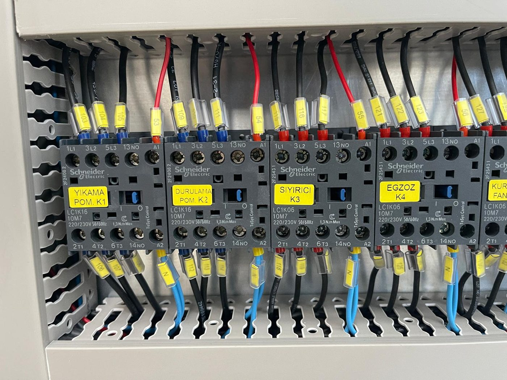
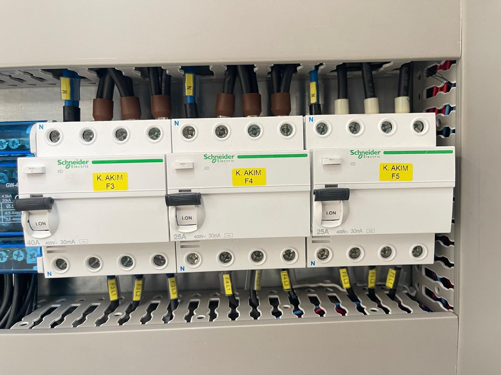
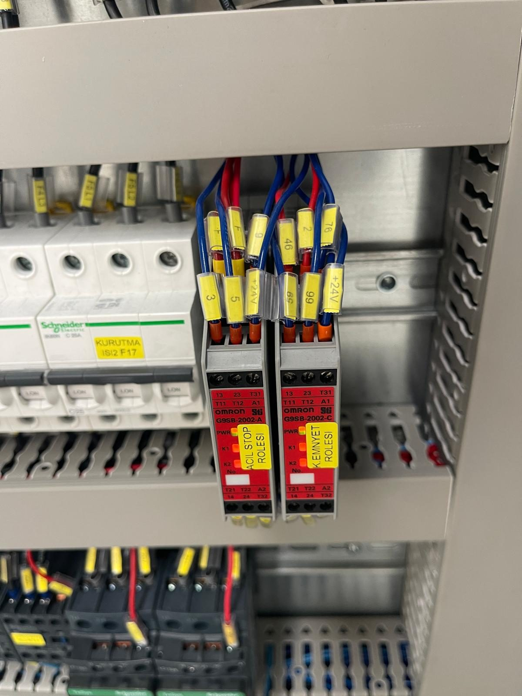
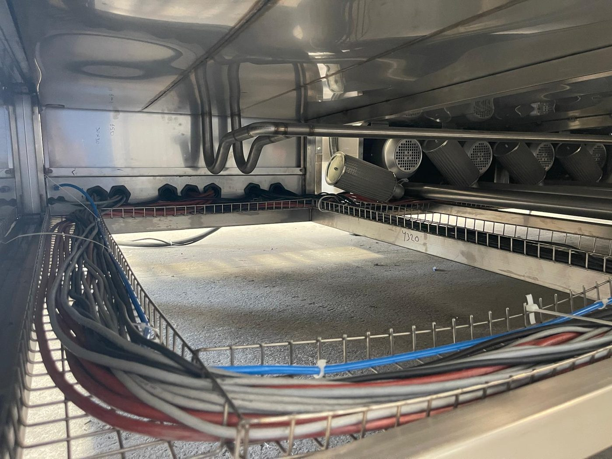

# 11.3 Elektrik arızaları

Elektrik arızalarında pano içi müdahale öncesi **LOTO** uygulayın (**Bölüm 2.4**). Besleme değerleri **Bölüm 3.3.3**, motor/ısıtıcı ve koruma elemanı listesi **Bölüm 3.3.4** tablosunda verilmiştir. Bu bölümdeki tüm işlemler yetkili elektrik personeli içindir.

**TEHLİKE — Elektrik çarpması:** Pano içinde 380 V bulunur; ana şalter kapalı iken giriş terminalleri enerjili kalır. İnverter DC barası şalter kapatıldıktan sonra en az 5 dakika tehlikeli gerilim taşır.

---

## 11.3.1 Faz kaybı ve faz sırası

| Parametre | Değer |
| :--- | :--- |
| Faz kaybı / ters faz davranışı | Faz sıra rölesi **MKR-01** çıkış vermez; pano fonksiyonları devreye girmez (RESET lambası yanmayabilir) |
| Motor dönüş yönü | Pompa, fan, blower doğrudan yol vermeli — faz sırasına bağlı; konveyör inverter — parametre ile sabit |

**Faz hatası teşhis prosedürü**

1. Makineyi durdurun; ana şalteri **OFF** alın; LOTO uygulayın.
2. Tesis besleme şalterinde üç fazın mevcut olduğunu ve gerilim dengesini ölçün.
3. Pano kapağını açın; MKR-01 röle göstergesini okuyun (faz sırası / faz kaybı LED'i — röle etiketine göre).
4. Faz sırası ters ise tesis beslemesi kapalı ve kilitli iken besleme hattında **iki fazı** yer değiştirin (**Bölüm 5.3.6**). Enerji açıkken faz değiştirmeyin.
5. Pano kapağını kapatın; LOTO kaldırın; ana şalteri ON alın; MKR-01 çıkış verdiğini ve RESET lambasının yandığını doğrulayın.
6. Bir pompa veya fanı kısa süre çalıştırarak dönüş yönünü motor üzerindeki ok ile karşılaştırın.

**Tekrarlayan faz hatası:** Tesis besleme kalitesi (gevşek bağlantı, faz dengesizliği) veya röle arızası — **Bölüm 11.2.2** servis kriteri.

---

## 11.3.2 Motor arızaları — MKŞ ve inverter

| Motor | Koruma | Trip belirtisi |
| :--- | :--- | :--- |
| Yıkama pompası PE02 (5,5 kW) | Q1 GV2ME16 | TANK 1 PUMP run lambası sönük |
| Durulama pompası PE04 (3 kW) | Q2 GV2ME14 | TANK 2 PUMP run lambası sönük |
| Yağ sıyırıcı GE06 (0,09 kW) | Q3 GV2ME04 | OIL SKIMMER run lambası sönük |
| Egzoz fanı FE01 (1,1 kW) | Q4 GV2ME07 | Buhar tahliyesi yok |
| Kurutma fanları FE02, FE03 (1,1 kW) | Q5, Q6 GV2ME07 | DRYING FAN run lambası sönük |
| Blowerlar FE04–FE07 (4 kW) | Q7–Q10 GV2ME14 | Blower havası azaldı |
| Konveyör GE01 (0,25 kW) | İnverter Delta VFD004EL21W-1; sigorta A9F74106 | CONVEYOR run lambası sönük; inverter ekranında kod |

**Motor arıza teşhis prosedürü (MKŞ trip)**

1. İlgili fonksiyon anahtarını **OFF** alın.
2. Pompa için emiş/çıkış vanalarının açık olduğunu kontrol edin (**Bölüm 7.2.5**); kapalı vana pompayı zorlar.
3. Ana şalteri kapatın; **LOTO** uygulayın.
4. Pano kapağını açın; **Bölüm 11.1.3** tablosundan trip olan MKŞ'yi bulun (kol "0" konumunda).
5. Motor ve kablo bağlantılarını görsel kontrol edin; motor sargı direncini ve izolasyonunu ölçün.
6. Mekanik sıkışma şüphesinde mil/kaplin serbestliğini elle kontrol edin (fan kanadı, pompa çarkı, sıyırıcı diski).
7. Nedeni giderin; MKŞ kolunu ON konumuna alın.
8. Pano kapağını kapatın; LOTO kaldırın; RESET; fonksiyonu kısa test edin ve motor akımını pens ampermetre ile MKŞ ayar aralığına göre kontrol edin.

**Konveyör inverter alarmı**

| Parametre | Değer |
| :--- | :--- |
| İnverter | Delta **VFD004EL21W-1** (0,4 kW) — pano içi |
| Alarm kodları | Sürücü ekranındaki koda göre **Delta VFD-EL kullanım kılavuzu** (**Bkz. Bölüm 13.1**) |
| Reset | CONVEYOR anahtarı OFF → ON veya inverter STOP/RESET tuşu |

1. CONVEYOR anahtarını OFF alın; inverter ekranındaki alarm kodunu kaydedin.
2. Hat üzerinde sıkışma veya parça yığılması varsa LOTO altında giderin.
3. Potansiyometrenin 20 Hz altında olmadığını kontrol edin (aşırı yük alarmı).
4. Alarm kodunun anlamını Delta kılavuzundan okuyun; aşırı akım/aşırı yük ise mekanik yükü, besleme hatası ise sigorta A9F74106 ve bağlantıları kontrol edin.
5. İnverteri resetleyin; CONVEYOR ON; tel bandın ilerlediğini doğrulayın.

**DİKKAT — Parametre:** İnverter parametrelerini değiştirmeyin; yön, min/maks frekans ve rampa fabrika ayarıdır. Parametre gerektiren arızalarda üretici servisi çağırın (**Bölüm 11.2.2**).

**Beklenen sonuç:** MKŞ normal; motor çalışıyor; run lambası yanık; motor akımı MKŞ aralığında.

---

## 11.3.3 Isıtıcı arızaları — kaçak akım, sigorta, termostat, kontaktör

| Isıtıcı grubu | Koruma | Kontrol |
| :--- | :--- | :--- |
| TANK 1 rezistansları R01–R05 (5 × 8 kW) | RCCB A9N19643; sigorta A9F74316 (16 A) ×5; kontaktör LC1K1610M7 ×5 | TANK 1 HEATER termostatı + anahtarı |
| TANK 2 rezistansları R06–R07 (2 × 8 kW) | RCCB A9N19643; sigorta A9F74316 ×2; kontaktör LC1K1610M7 ×2 | TANK 2 HEATER termostatı + anahtarı |
| Kurutma ısıtıcıları R21, R22 (2 × 12 kW) | RCCB A9N19642; sigorta A9F74325 (25 A) ×2; kontaktör LC1D25M7 ×2 | DRYING 1/2 HEATER termostatı + anahtarı |

Pano içindeki kaçak akım röleleri **K.AKIM F1…F5** etiketleriyle, ısıtıcı sigortaları **YIKAMA ISI 1…5**, **DURULAMA ISI 1–2**, **KURUTMA ISI 1–2** etiketleriyle işaretlidir.

**Sıcaklık yükselmiyor (ısıtıcı anahtarı ON)**

1. İlgili **WASHING LEVEL** lambasının sönük olduğunu doğrulayın; kırmızı yanıyorsa seviye interlock'u ısıtıcıyı kilitler — tankı doldurun (**Bölüm 7.2.1**).
2. Termostat set değerinin anlık sıcaklığın üzerinde olduğunu kontrol edin (**Bölüm 6.3.3**).
3. Ana şalteri kapatın; LOTO uygulayın.
4. İlgili RCCB (K.AKIM) kolunun ve ısıtıcı sigortalarının konumunu kontrol edin; trip varsa aşağıdaki kaçak akım prosedürüne geçin.
5. Isıtıcı kontaktörünün çekip çekmediğini (bobin 220 V AC) ve termostat çıkışını kontrol edin.
6. Termokupl bağlantısını (ETB30F06) ve termostat ekranındaki okumayı doğrulayın; okuma anlamsızsa termokupl arızası — **Bölüm 11.7.3**.

**Kaçak akım trip (RCCB)**

1. Isıtıcı anahtarını OFF alın; ana şalteri kapatın; **LOTO** uygulayın.
2. Trip olan RCCB'nin beslediği grubu şemadan belirleyin (tank 1, tank 2 veya kurutma).
3. Grubun her rezistansını sırayla ayırın; rezistans gövde–uç izolasyon direncini megger ile ölçün; düşük izolasyonlu (patlak/ıslak) rezistansı belirleyin.
4. Arızalı rezistansı **REZİSTANS KOMPLESİ 8000 W 50 cm** (07 15142) veya kurutma ısıtıcısı ile değiştirin (**Bölüm 13.3**); tank rezistansı değişiminde tank boşaltılır (**Bölüm 10.1.5**).
5. Tank altı rezistans bağlantı kutularında nem ve sızıntı izi kontrolü yapın; nem kaynağını giderin.
6. RCCB'yi kurun; LOTO kaldırın; ısıtıcıyı test edin.
7. Trip tekrarlıyorsa **servis** çağırın (**Bölüm 11.2.2**).

**Termostat set değere ulaştı, ısınma devam ediyor (Arıza 5)**

1. Isıtıcı anahtarını OFF alın. Sıcaklık yükselmeye devam ediyorsa kontaktör yapışıktır: ana şalteri **OFF** alın.
2. LOTO; yapışık kontaktörü (LC1K1610M7 veya LC1D25M7) değiştirin.
3. Anahtar OFF iken ısınma duruyor, ON iken set değeri aşıyorsa termostat çıkışı veya termokupl arızalıdır; termostatı (GEMO DTH2) veya termokuplu değiştirin.

**UYARI — Elektrik:** Rezistans ve kaçak akım koruma devresi müdahalesi yalnızca yetkili elektrik personeli tarafından yapılır. Kaçak akım rölesini köprülemek veya devre dışı bırakmak ölümcül elektrik çarpması riski oluşturur ve yasaktır.

---

## 11.3.4 Pano içi genel kontroller

| Kontrol | Periyot / durum | Bölüm |
| :--- | :--- | :--- |
| Bağlantı sıkılığı (TMŞ, kontaktör, klemens) | Yıllık — LOTO | 9.1.3 |
| Pano ventilasyon ve toz | Aylık | 9.1.3 |
| 24 V DC güç kaynağı LRS-350-24 çıkışı | Arıza 6 teşhisi | 11.1.2 |
| Kontrol sigortaları A9F74160 / A9F74110 | Arıza 6 teşhisi | 11.1.2 |
| Emniyet röleleri G9SB — LED durumu | RESET alınamıyorsa | 11.7.1 |

Kablo renk kodu, klemens numaraları ve devre detayları **elektrik şemasında** verilmiştir (teslim paketi — **Bkz. Bölüm 13.1**).
