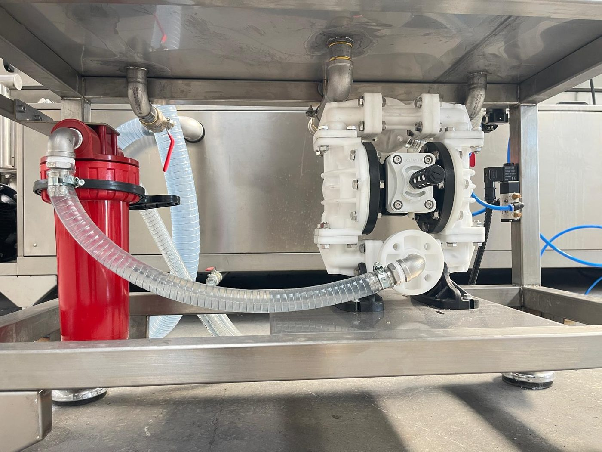

# 11.5 Pnömatik arızalar

Makinede basınçlı hava yalnızca **yağ ayırıcı ünitesinin diyaframlı pompasını** tahrik eder; pnömatik silindir, otomatik dolum vanası veya pnömatik kapak bulunmaz. Basınçlı hava **6 bar** olmalıdır; medya değerleri **Bölüm 3.3.5**, regülatör ayarı **Bölüm 6.5**'te verilmiştir. Hava basıncı düşüklüğü yıkama, durulama, kurutma ve konveyör fonksiyonlarını etkilemez; yalnızca yağ ayırıcı pompası çalışmaz.

---

## 11.5.1 Basınç düşük / hava yok

| Parametre | Değer |
| :--- | :--- |
| Basınç düşük alarmı | HMI yok — manometre okuması; yağ ayırıcı pompası çalışmıyor veya düzensiz çalışıyor |
| Minimum değer | 6 bar |

**Basınç düşük teşhis prosedürü**

1. Makine gövdesindeki **AIR INLET** regülatör manometresini okuyun.
2. Tesis hava vanasının açık olduğunu ve tesis kompresörünün çalıştığını kontrol edin.
3. Regülatörü **6 bar**'a ayarlayın (**Bölüm 6.5.1**).
4. Hava hortumlarında ve rakorlarda kaçak kontrolü yapın (ses / sabunlu su); kaçak varsa tesis hava vanasını kapatıp rakoru sıkın veya hortumu değiştirin.
5. Regülatör filtresinde su veya yağ birikimi varsa boşaltın; tesis hava kalitesini (kuru, yağsız) kontrol edin.
6. Basınç 6 bar'da sabitlendiğinde yağ ayırıcı anahtarını ON alıp pompanın çalıştığını doğrulayın.

---

## 11.5.2 Yağ ayırıcı diyaframlı pompa ve solenoid valf

| Belirti | Olası neden | Kontrol | Çözüm |
| :--- | :--- | :--- | :--- |
| Anahtar ON, pompa çalışmıyor; run lambası yanık | Hava yok / düşük; solenoid valf açılmıyor | Manometre; solenoid tık sesi; valf bobini beslemesi | 11.5.1; LOTO altında bobin gerilimi ve valf — bobin arızalıysa değiştir |
| Anahtar ON, run lambası sönük | Panodan çıkış yok (röle/kontaktör) | **Bölüm 11.1.2 — Arıza 1** mantığı; emniyet zinciri (RESET) | Yetkili elektrikçi |
| Pompa çalışıyor, sıvı aktarmıyor | Emiş hortumu tıkalı / hava alıyor; ünite filtresi tıkalı; diyafram hasarlı | Hortum bağlantıları; kırmızı filtre gövdesi | Hortumları temizle/sık; filtre elemanını temizle veya değiştir; diyafram servis |
| Pompa sürekli çalışıyor, duramıyor | Solenoid valf yapışık; anahtar OFF değil | Anahtar konumu; valf | Tesis hava vanasını kapat; LOTO; valfi temizle/değiştir |
| Hava hattından sürekli kaçak | Rakor gevşek; hortum çatlak; regülatör contası | Sabunlu su testi | Sık / değiştir |

| Parametre | Değer |
| :--- | :--- |
| Silindir yavaş / takılma | **Uygulanmaz** — pnömatik silindir yok |
| Valf bobini arızası | Yağ ayırıcı solenoid valfi — yukarıdaki tablo |

**Beklenen sonuç:** Manometre 6 bar; yağ ayırıcı anahtarı ON iken diyaframlı pompa düzenli çalışıyor ve yağlı suyu aktarıyor; kaçak yok.

---

Pnömatik ayarlar için bkz. **Bölüm 6.5**.
