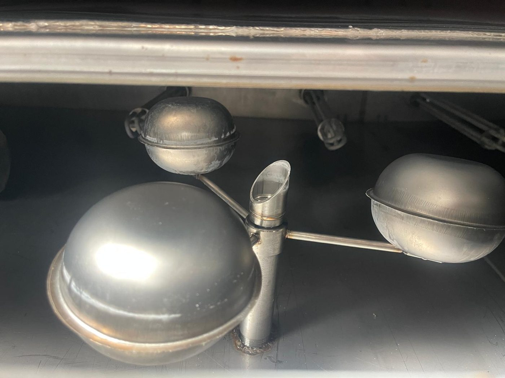
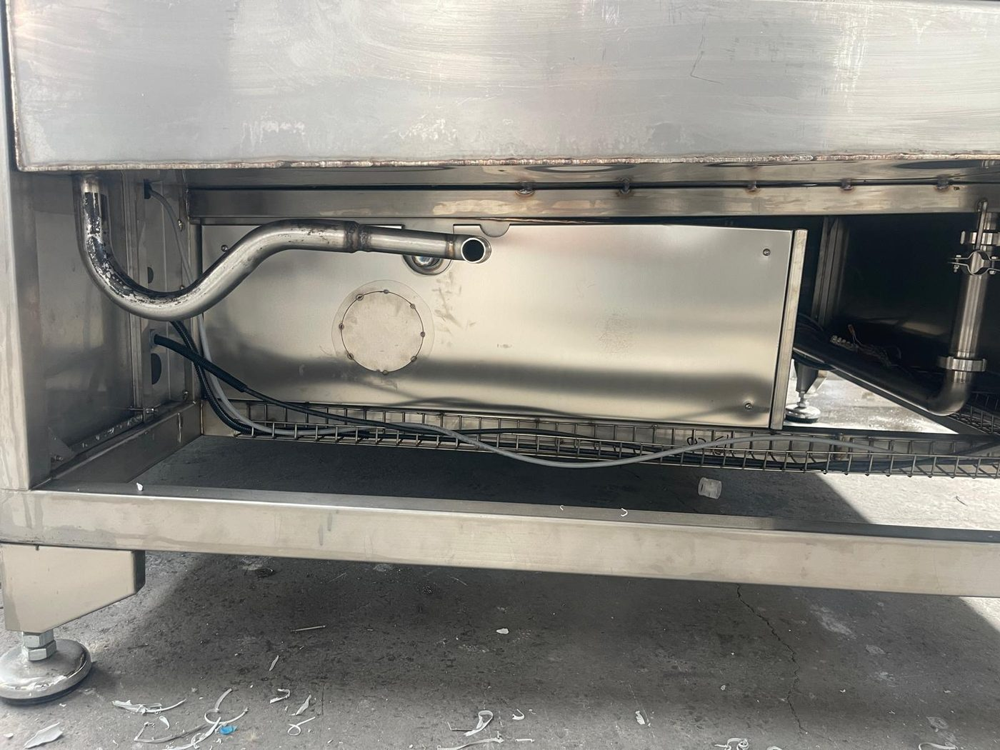

# 11.7 Sensorstörungen

Die Maschine verfügt über Sicherheitssensoren (magnetische Schalter der Wartungsklappen), Prozesssensoren (Tank-Füllstandsensoren, Schwimmer-Füllstandswächter, Thermoelemente) und einen Sensor der Leckagewanne. Da kein HMI vorhanden ist, wird der Sensorstatus nicht direkt überwacht; eine Sensorstörung zeigt sich am Verhalten der betroffenen Funktion (RESET nicht möglich, Füllstandleuchte falsch, Temperaturanzeige unplausibel).

---

## 11.7.1 Magnetische Schalter der Wartungsklappen — RESET nicht möglich

| Parameter | Wert |
| :--- | :--- |
| Schalter | Omron **F3STGRNLPU21M1J8** magnetischer Türschalter — 7 Wartungsklappen, Reihenschaltung |
| Sicherheitsrelais | Omron **G9SB2002AACDC241** (Klappenkette) |
| Symptom | RESET-Leuchte leuchtet nicht, obwohl alle Klappen geschlossen erscheinen; Maschine läuft nicht |

Der Schalter reagiert empfindlich auf die Ausrichtung zwischen dem Magneten an der Klappe und dem Sensor. Sitzt die Klappe nicht vollständig, ist der Magnet verrutscht oder befinden sich Schmutz/Metallspäne auf der Schalterfläche, bleibt die Kette offen. Da die Schalter in Reihe geschaltet sind, sperrt eine einzelne Klappe die gesamte Maschine.

**Diagnoseverfahren**

1. Prüfen, dass alle 7 Not-Halt-Taster entriegelt sind (**Kapitel 2.5**).
2. Jede der 7 Wartungsklappen öffnen und ausgerichtet wieder schließen; nach jedem Schließen RESET versuchen.
3. Flächen von Klappenschalter und Magnet mit einem trockenen Tuch reinigen; auf mechanische Beschädigung oder lose Befestigung prüfen.
4. Ist RESET weiterhin nicht möglich, Hauptschalter ausschalten; **LOTO** anwenden; Schaltschranktür öffnen.
5. Eingangs-LEDs des Sicherheitsrelais G9SB ablesen (gemäß Relaisetikett); ermitteln, welcher Eingang offen ist.
6. Kabelanschlüsse und Klemmen der Schalterkette prüfen; defekten Schalter durch den Originaltyp ersetzen (10 07147 — **Kapitel 13.3**).
7. Nach dem Austausch den Klappentest gemäß **Kapitel 5.4.2** durchführen.

**Schalter nicht überbrücken und nicht mit einem Magneten täuschen** — die Sicherheitsfunktion wird außer Kraft gesetzt (**Kapitel 2.4, 6.2.1**).

---

## 11.7.2 Tank-Füllstandsensoren und Schwimmer-Füllstandswächter

| Parameter | Wert |
| :--- | :--- |
| Füllstandsensor | **VEGASWING 51** Schwinggabel (2 Stück — Tank 1, Tank 2) |
| Schwimmer-Füllstandswächter | Edelstahl-Schwimmer-Füllstandswächter (10 00296) |
| Symptom | WASHING-LEVEL-Leuchte leuchtet bei vollem Tank; oder leuchtet bei leerem Tank nicht |

**Diagnoseverfahren**

1. Tankdeckel öffnen (LOTO) und den tatsächlichen Wasserstand per Sichtprüfung kontrollieren.
2. **Tank voll, Leuchte an:** Auf der Gabel des Sensors kann sich eine Öl-/Schmutzschicht oder ein Fremdkörper befinden; Sensorgabel reinigen (monatlicher Wartungspunkt — **Kapitel 9.1.3**). Prüfen, dass sich der Schwimmer frei bewegt.
3. **Tank leer, Leuchte aus (Heizung/Pumpe können laufen):** Gefährlicher Zustand — Heizungen sofort auf OFF stellen; Sensor- oder Schaltkreisstörung; unter LOTO Sensorausgang und Kabel prüfen; Sensor ersetzen (07 16791).
4. Sensorkabelanschluss und Klemme im Schaltschrank prüfen (Schaltplan — **Kapitel 13.1**).
5. Nach dem Austausch den Test der Füllstandverriegelung gemäß **Kapitel 5.4.4** durchführen.

---

## 11.7.3 Thermoelemente und Thermostate

| Parameter | Wert |
| :--- | :--- |
| Thermoelement | ETB30F06-5Ç / ETB30F06-4Ç (2 + 2) |
| Thermostat | GEMO DTH2 (4 Stück) |
| Symptom | Unplausible/feststehende Anzeige auf dem Thermostatdisplay, Sensorfehleranzeige, Temperaturregelung gestört |

1. Die Anzeige auf dem Thermostatdisplay mit der Tankwassertemperatur vergleichen (externes Thermometer).
2. Bei fehlender Anzeige oder Fehlercode unter LOTO den Anschluss des Thermoelements (Polarität, Leitungsbruch) prüfen.
3. Thermoelement ersetzen (10 02976 / 10 02634); gegebenenfalls ist der Thermostatadapter-Komplettsatz (07 00669) erforderlich.
4. Bei Verdacht auf Thermostatstörung (kein Ausgang / schaltet nicht ab) das Verfahren **Kapitel 11.3.3 — Störung 5** durchführen.

---

## 11.7.4 Leckagewanne

| Parameter | Wert |
| :--- | :--- |
| Leckagewanne | SIZINTI TAVASI MONTAJ KOMPLESİ (07 17687) — unter der Maschine |
| Sensortyp | [EKSİK] |
| Symptom | Wasseransammlung in der Wanne; Nässe unter der Maschine |

1. Wasseransammlung in der Wanne prüfen; ist das Wasser ölhaltig, stammt es wahrscheinlich aus der Tank-/Pumpenleitung, ist es sauber, aus einem Überlauf beim Befüllen.
2. Tankdichtungsstöße, Ablassventil (TAHLİYE), Deckel des Feinfiltergehäuses, Pumpenstopfbuchse und Schlauchanschlüsse auf Leckagen untersuchen.
3. Leckage beseitigen; Wanne entleeren und reinigen (monatlicher Wartungspunkt).
4. Ist in der Wanne ein Sensor vorhanden ([EKSİK]), die Sonde reinigen und den Anschluss prüfen.

---

## 11.7.5 Liste der kritischen Sensoren

| Funktion | Typ / Modell | Einbauort | Symptom |
| :--- | :--- | :--- | :--- |
| Klappensicherheit | Omron F3STGRNLPU21M1J8 (7 Stk.) | Wartungsklappen | RESET nicht möglich |
| Tankfüllstand | VEGASWING 51 Schwinggabel (2 Stk.) + Edelstahl-Schwimmer-Füllstandswächter | Tank 1, Tank 2 | WASHING-LEVEL-Leuchte |
| Temperatur | Thermoelement ETB30F06-5Ç / -4Ç (2+2) | Tank 1, Tank 2, Trocknung 1, Trocknung 2 | Thermostatanzeige |
| Leckagewanne | [EKSİK] Sensortyp (07 17687 Montage-Komplettsatz) | Unter der Maschine | Wasseransammlung |

Sensor-LED / Statusanzeige: kein HMI; der Füllstandstatus wird über die roten Leuchten TANK 1/2 WASHING LEVEL, der Status des Sicherheitskreises über die RESET-Leuchte überwacht. Bestellnummern der Ersatzteile in der BOM-Tabelle in **Kapitel 13.3**; Kabelfarbcode und Anschlussdetails im **Schaltplan** (**Siehe Kapitel 13.1**).
