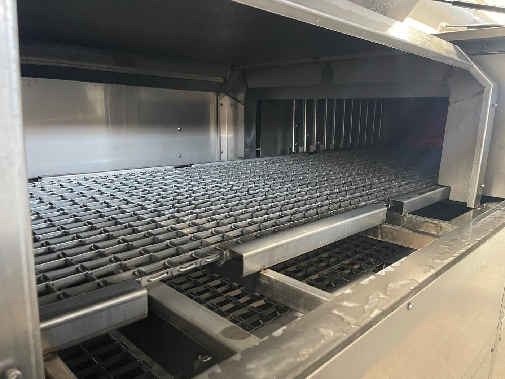

# 13.3 Ersatzteilliste

Die **Ersatzteilliste (BOM)** der Maschine ist in dieser Anleitung enthalten; sie wird **nicht** als separates Dokument geliefert. Die vollständige Liste ist in der Tabelle **13.3.1** angegeben — in anderen Kapiteln finden sich nur Zusammenfassungen oder Querverweise. Quelle: **KNV 90 7500 ÜRÜN AĞACI.xlsm** (Projektstammverzeichnis) und Schaltschrank-Materialliste; die SSOT-Kopie ist die Datei **0726051-YETSAN-KNV 90 PARCA LISTESI**.

Die in der Stückliste (Produktbaum) enthaltenen Positionen **10 18815 DOZAJ POMPASI DOSATRON** und **10 04305 TEPE LAMBASI** werden an dieser Maschine **nicht verwendet** und wurden nicht in die Liste aufgenommen.

---

## 13.3.1 Ersatzteiltabelle (40 Positionen)

**Kategoriedefinitionen**

| Kategorie | Bedeutung | Lagerempfehlung |
| :--- | :--- | :--- |
| **Kritisch** | Bei Ausfall steht der Prozess oder die Sicherheit; sofortiger Austausch erforderlich | 0 = auf Bestellung; ≥1 = vor Ort vorhalten |
| **Empfohlen** | Bei Ausfall sinkt die Leistung; geplante Bevorratung empfohlen | Vor Ort 0–2 Stück |
| **Verschleiß** | Wird bei periodischer Wartung/Reinigung verbraucht | Je nach Intervall und Verbrauchsrate |

**Bestellverfahren**

1. **Bestellnummer** und **Teilebezeichnung** aus der Tabelle **13.3.1** entnehmen. Bei mit "—" gekennzeichneten Schaltschrankelementen den Schneider-Typencode verwenden.
2. In der Bestellung Modell (**KNV-90**), Seriennummer (**0726051**) und Stückzahl angeben — siehe **1.3.4**.
3. Originalteile verwenden; Fremdteile stellen ein Garantie- und Sicherheitsrisiko dar.
4. Mit [EKSİK] gekennzeichnete Lagermengen werden vor der Bestellung vom Anwender/der Freigabestelle ausgefüllt.

---

**Mechanik / Prozess (Stückliste)**

| Bestellnummer | Teilebezeichnung | Kategorie | Empfohlener Lagerbestand | Einbauort / Funktion | Begründung |
| :--- | :--- | :--- | :---: | :--- | :--- |
| 10 13529 | REDÜKTÖR MOTORLU XXC40/75 P63/B14 I LD TORK LİMİT (konveyör) | Kritisch | 0 | Fördererantrieb | Bei Ausfall stoppt der Werkstückfluss |
| 07 17686 | KNV 90 7500 2B POMPA KOMPLESİ | Kritisch | 0 | Wasch-/Spülpumpe | Bei Ausfall stoppt der Prozess |
| 07 17683 | SALYANGOZLU FAN ENA 4 1,1 kW HAVA SOĞ. SİLİKONLU | Kritisch | 0 | Abluft / Lüftung | Bei Ausfall ist die Abluft beeinträchtigt |
| 07 04649 | YAĞ SIYIRICI KOMPLESİ TİP 3 MONTAJ | Kritisch | 0 | Ölskimmer TANK 1 | Bei Ausfall arbeitet der Ölskimmer nicht |
| 07 03635 | YAĞ AYIRICI ÜNİTESİ | Empfohlen | 0 | Ölabscheider | Prozessqualität |
| 07 17682 | KNV 90 7500 2B HASSAS FİLTRE KOMPLESİ | Verschleiß | 1 | Feinfilter (Beutelfilter) am Pumpenausgang | Periodischer Wechsel |
| 07 10214 | ÖN FİLTRE NS KOMPLESİ | Verschleiß | 2 | Tank-Vorfilter (6 Stk. montiert) | Verbrauch durch tägliche Reinigung |
| 07 00670 | EMİŞ FİLTRESİ KOMPLESİ (PYM2,KBN,VDL,ULT,KNV) | Verschleiß | 1 | Pumpenansaugung | Periodischer Wechsel |
| 07 08732 | EMİŞ FİLTRESİ KOMPLESİ 2" 1/2 | Verschleiß | 1 | Saugleitung | Periodischer Wechsel |
| 07 15142 | REZİSTANS KOMPLESİ 8000 W 50 cm DÜZ DİKİŞSİZ | Kritisch | 2 | Tankheizung (7 Stk.) | Bei Ausfall wird die Temperatur nicht erreicht |
| 07 16791 | SEVİYE SENSÖRÜ ÇAT.TİP VEGASWING 51 DİŞ ÇEKİLMİŞ | Kritisch | 1 | Tankfüllstand (2 Stk.) | Bei Ausfall ist die Füllstandsicherheit beeinträchtigt |
| 10 00296 | PASLANMAZ SEVİYE BEKÇİSİ | Kritisch | 0 | Tankfüllstand-Sicherheit | [EKSİK] — keine separate Zeile in der Stückliste; gemäß Montage vor Ort |
| 10 02976 | TERMOKUPL ETB30F06-5Ç | Kritisch | 1 | Heizungsregelung | Bei Ausfall ist die Heizung außer Betrieb |
| 10 02634 | TERMOKUPL ETB30F06-4Ç | Kritisch | 1 | Heizungsregelung | Bei Ausfall ist die Heizung außer Betrieb |
| 07 00669 | TERMOSTAT ADAPTÖRÜ KOMPLESİ | Empfohlen | 1 | Thermostatmontage am Tank | Wartung |
| 10 01079 | NOZZLE 650.724.1C.CC | Verschleiß | 20 | Wasch-/Spüldüse (160 Stk.) | Verschleißteil |
| 10 17538 | TEL BANT 850 mm (konveyör zinciri) | Verschleiß | 0 | Förderer | Verschleiß — Lagerbestand [EKSİK] |
| 07 17689 | KNV 90 7500 2B KURUTMA KOMPLESİ | Kritisch | 0 | Trocknungskammer | Bei Ausfall keine Trocknung |
| 07 17687 | KNV 90 7500 2B SIZINTI TAVASI MONTAJ KOMPLESİ | Empfohlen | 0 | Untere Leckagewanne | Leckageerkennung |

**Elektrik / Sicherheit (Stückliste + Schaltschrank)**

| Bestellnummer | Teilebezeichnung | Kategorie | Empfohlener Lagerbestand | Einbauort / Funktion | Begründung |
| :--- | :--- | :--- | :---: | :--- | :--- |
| 10 07147 | SWITCH F3STGRNLPU21M1J8 OMRON MANYETİK KAPI | Kritisch | 2 | 7 Wartungsklappen (5 Stk. in der Stückliste) | Sicherheitskreis; bei Ausfall Stopp |
| 10 02896 | BUTON ACİL P1EC400E40K SARI-SİYAH PL.KUTU | Kritisch | 2 | Not-Halt vor Ort | Sicherheit |
| 10 00220 | EMNİYET RÖLESİ G9SB2002AACDC241 OMRON G9SX | Kritisch | 1 | Not-Halt-Kreis | Nicht überbrückbar |
| 10 11531 | EMNİYET RÖLESİ G9SB2002AACDC241 OMRON G9SX (kapak) | Kritisch | 1 | Klappenschalterkreis | Nicht überbrückbar |
| 10 16319 | İNVERTÖR Delta VFD004EL21W-1 0,4 kW (konveyör) | Kritisch | 0 | Förderer | Bei Ausfall stoppt der Förderer |
| 10 00305 | SIGORTA KAÇAK AKIMLI A9N19642 4P | Empfohlen | 0 | RCCB Motorgruppe / Trocknung | Schutz |
| 10 00304 | SIGORTA KAÇAK AKIMLI A9N19643 4P | Empfohlen | 0 | RCCB Tankheizstäbe | Schutz |
| 10 00258 | FAZ KORUMA RÖLESİ MKR-01 | Kritisch | 1 | Schaltschrankeingang | Schutz vor Phasenfehler |
| 10 11089 | TERMOSTAT GEMO DTH2 (ısıtma) | Empfohlen | 1 | Waschen/Spülen/Trocknung | Temperatureinstellung |
| 10 00272 | RESET BUTONU BL901M + mavi lamba | Empfohlen | 1 | Bedienfeld | Reset-Funktion |

**Schutzelemente im Schaltschrank (MKŞ / Schütz / Sicherung — Empfehlung Ersatzsatz)**

| Bestellnummer | Teilebezeichnung | Kategorie | Empfohlener Lagerbestand | Einbauort / Funktion | Begründung |
| :--- | :--- | :--- | :---: | :--- | :--- |
| 10 01421 | Sicherung A9F74106 1×6 (Versorgung Förderer/Frequenzumrichter) | Empfohlen | 2 | Schaltschrank | Schutz |
| — | Motorschutzschalter Schneider GV2ME16 (9–14 A) — Waschpumpe | Empfohlen | 1 | Q1 — PE02 | Motorschutz |
| — | Motorschutzschalter Schneider GV2ME14 (6–10 A) — Spülen / Blower | Empfohlen | 2 | Q2, Q7–Q10 — PE04 / FE04–07 | Motorschutz |
| — | Motorschutzschalter Schneider GV2ME07 (1,6–2,5 A) — Ventilator | Empfohlen | 2 | Q4–Q6 — FE01–FE03 | Motorschutz |
| — | Motorschutzschalter Schneider GV2ME04 (0,4–0,63 A) — Ölskimmer | Empfohlen | 1 | Q3 — GE06 | Motorschutz |
| — | Schütz LC1K1610M7 (16 A 220 V) | Empfohlen | 2 | Pumpen / Blower / Tankheizung | Reserve |
| — | Schütz LC1K0610M7 (6 A 220 V) | Empfohlen | 2 | Ventilator / Ölskimmer | Reserve |
| — | Schütz LC1D25M7 (25 A 220 V) | Empfohlen | 1 | Trocknungsheizung | Reserve |
| — | Sicherung A9F74316 (16 A) — Tankheizung | Empfohlen | 3 | R01–R07 | Schutz |
| — | Sicherung A9F74325 (25 A) — Trocknungsheizung | Empfohlen | 2 | R21–R22 | Schutz |
| — | Leistungsschalter (TMŞ) LV521091 (CVS250F 250 A) + Türgriff LV521101 | Kritisch | 0 | Hauptstromversorgung | Bei Ausfall gesamter Schaltschrank |

---

## 13.3.2 Querverweise in der Anleitung

| Thema | Referenz |
| :--- | :--- |
| Kritische Teile (betriebliche Übersicht) | **9.1.5** |
| Verschleiß- / empfohlene Ersatzteile | **9.1.6** |
| Vollständige BOM | Dieses Kapitel — **13.3.1** |
| Periodische Wartung / Filterintervalle | **9.1.3**, **10.1** |
| Bei der Reinigung verwendete Filter | **10.1.3**, **10.1.4** |
| Störung — MKŞ / Schütz / RCCB | **11.1.3**, **11.3** |
| Störung — Heizstab / Thermoelement / Thermostat | **11.3.3**, **11.7.3** |
| Störung — Klappenschalter / Füllstandsensor | **11.7.1**, **11.7.2** |
| Ersatzteilbestellung | **1.3.4** |

**Verschleißteile:** Die Zeilen der Kategorie **Verschleiß** (Filter, Düsen, Drahtgurt) umfassen die Verschleiß-/Verbrauchsteile.
