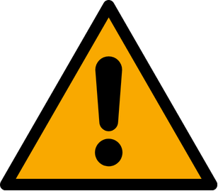
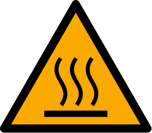
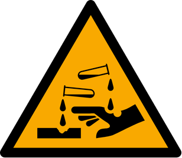
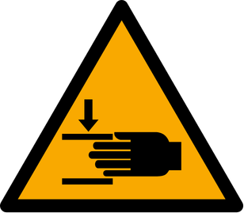
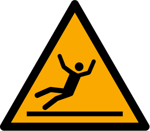
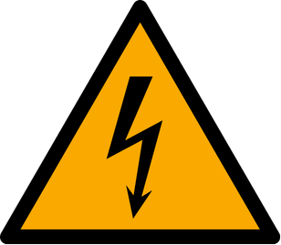
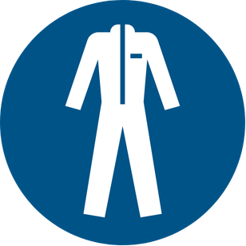
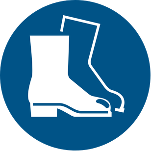
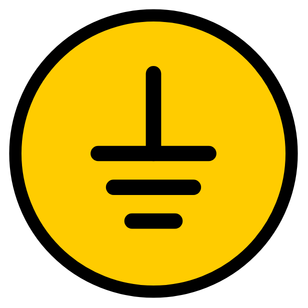
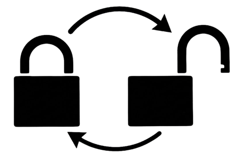

# 1.2 Semboller ve etiketleme kuralları

Bu kılavuzda ve **KNV 30 3000 2B** makine gövdesinde kullanılan semboller; operatör güvenliğini artırmak, riskleri belirtmek, zorunlu eylemleri göstermek ve tesis bağlantı noktalarını tanımlamak amacıyla uluslararası standartlara (ISO 7010, ISO 3864-2) uygun yerleştirilmiştir. Semboller dil bağımsız uyarı iletimi sağlar; makineyi devreye almadan, bakım yapmadan veya sıcak/kimyasal parçalara müdahale etmeden önce aşağıdaki anlamları inceleyin.

Semboller üç grupta toplanır: **uyarı** (tehlike ve yasak), **KKD** (kişisel koruyucu donanım zorunluluğu) ve **makine bilgi** (bağlantı noktaları: topraklama, su, hava, tahliye; emniyet kilidi). Makine üzerindeki etiket konumları ve kalıntı risk açıklamaları **Bkz. Bölüm 2.2**. Tepe lambası ve HMI durum göstergelerinin teknik tanımı **Bkz. Bölüm 3.4**'te verilir.

## 1.2.1 Sinyal kelimeleri (kılavuz metni)

Kılavuz metninde kullanılan sinyal kelimeleri ISO 3864-2 ile uyumludur. Her uyarı şu dört bilgiyi verir: sinyal kelimesi, tehlike türü, olası sonuç ve önleme yöntemi.

| Sinyal | Anlam | Kullanım |
| :--- | :--- | :--- |
| **TEHLİKE** | Ölümcül veya ağır yaralanma riski | Hayati güvenlik ihlali |
| **UYARI** | Ciddi yaralanma veya makine hasarı riski | Önemli operasyonel risk |
| **DİKKAT** | Hafif yaralanma veya ekipman hasarı | Prosedüre özel uyarı |

Genel güvenlik uyarıları **Bölüm 2**'de toplanmıştır.

---

## 1.2.2 Uyarı sembolleri

Sarı zeminli üçgen uyarı işaretleri makinedeki tehlike bölgelerini; kırmızı yasak işaretleri ise kesinlikle yapılmaması gereken eylemleri gösterir. Sembol görülmediğinde veya okunamadığında makineyi çalıştırmayın.

| Sembol | Anlam | Gerekli eylem |
| :---: | :--- | :--- |
|  | Genel tehlike / dikkat | İlgili güvenlik talimatlarına uyun (**Bkz. Bölüm 2**). |
|  | Sıcak yüzey / buhar | Sistem soğumadan çıplak elle temas etmeyin; koruyucu eldiven kullanın. |
|  | Aşındırıcı / korozif kimyasal | Kimyasal sıçramasına karşı KKD kullanın; cilde temasında bol suyla yıkayın (**Bkz. Bölüm 2.6**). |
|  | Ezilme / el sıkışması (hareketli parçalar) | Makine çalışırken hareketli bölgelere el sokmayın; muhafazaları açmayın. |
|  | Kaygan zemin | Sıvı sızıntısına karşı dikkatli yürüyün; sızıntıyı giderin (**Bkz. Bölüm 10**). |
|  | Yanıcı / patlayıcı madde yasak | Makine çevresinde yanıcı sıvı ve açık alevi kullanmayın; yalnızca onaylı temizlik maddeleri (**Bkz. Bölüm 10.1.7**). |
|  | Elektrik tehlikesi | Yalnızca yetkili personel müdahale etsin; **Bkz. Bölüm 2.4** LOTO. |

---

## 1.2.3 KKD sembolleri

Mavi zeminli zorunluluk işaretleri, belirtilen kişisel koruyucu donanımın kullanılması gerektiğini gösterir. Hangi görevde hangi KKD'nin zorunlu olduğu **Bkz. Bölüm 2.6** matrisinde tanımlanır.

| Sembol | Anlam | Gerekli eylem |
| :---: | :--- | :--- |
|  | Kılavuzu oku | Devreye alma, operasyon ve bakım öncesi bu kılavuzu okuyun ve uygulayın. |
|  | Koruyucu giysi / yansıtıcı yelek | Uygun iş elbisesi veya yansıtıcı yelek giyin. |
|  | Emniyet ayakkabısı | Çelik burunlu koruyucu ayakkabı kullanın. |
|  | Koruyucu eldiven | İşe uygun eldiven takın. |
|  | Koruyucu gözlük (göz koruması) | Sıçramaya karşı koruyucu gözlük kullanın. |
|  | Toz / solunum maskesi | Kimyasal buhar veya tozda solunum maskesi takın. |

---

## 1.2.4 Makine bilgi sembolleri

Makine gövdesindeki bilgi işaretleri; tesis bağlantı noktalarını (topraklama, su, hava, tahliye) ve emniyet kilidi durumunu gösterir. Bağlantı basınçları ve hat çapları **Bkz. Bölüm 3.3.5**; kurulum adımları **Bkz. Bölüm 5.3**.

| Sembol | Anlam | Tipik konum / kullanım |
| :---: | :--- | :--- |
|  | Koruyucu topraklama (PE) | Makine gövdesi topraklama terminali; tesis PE hattına bağlayın (**Bkz. Bölüm 5.3**). |
|  | Kilitleme / enerji izolasyonu | Bakım öncesi enerji izolasyonu ve kilit (**Bkz. Bölüm 2.4**). |
|  | Su tahliyesi / drenaj | Tank veya makine boşaltma noktası; atık su hattına bağlayın. |
|  | Basınçlı hava girişi | 6 bar pnömatik besleme bağlantı noktası. |
|  | Su girişi (besleme) | Şebeke / manuel su dolum bağlantı noktası. |
|  | Tank su dolumu | Tankın otomatik olarak su ile doldurulduğu dolum noktası / göstergesi. |
|  | Emniyet kilidi (kilitli / açık) | Bakım kapağı veya koruyucu muhafaza kilidi durumu; kilit açıkken çalıştırmayın. |

Hava ve su bağlantısı yapıldıktan sonra HMI manuel sayfasındaki ilgili durum göstergesinin yeşil yanması gerekir. Basınç düşük alarm kodları **Bkz. Bölüm 11.1** (Error-235 hava, Error-236 su).

---

## 1.2.5 Durum göstergelerinin okunması

Makinede tepe lambası ve HMI alarm ekranı birlikte kullanılır. Tepe lambası uzaktan makine durumunu gösterir; HMI alarm kodu ve açıklama metnini sunar. Her iki kaynağı birlikte değerlendirin; yalnızca lambaya bakarak arıza teşhisi yapmayın.

Tepe lambası renkleri ve HMI alarm davranışının tam tanımı **Bkz. Bölüm 3.4**. Alarm kodları listesi **Bkz. Bölüm 11.1**.

---

## 1.2.6 Etiket bakımı

Makine üzerindeki uyarı etiketleri, personelin riski görsel olarak algılamasını sağlar. Etiket yıprandığında, silindiğinde veya okunamaz hale geldiğinde uyarı işlevi kaybolur.

1. Yıpranmış, silinmiş veya okunmayan etiketleri derhal yenileyin.
2. Etiketsiz makineyi çalıştırmayın.
3. Yedek etiket temini için **Bkz. Bölüm 1.3**.
