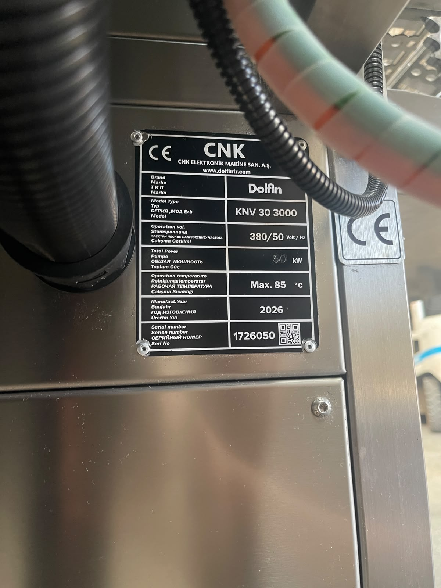

# 1.3 Destek ve servis

## 1.3.1 Üretici ve merkez servis iletişim bilgileri

Bu kılavuzdaki **üretici** ifadesi, **KNV 30 3000 2B** makinesini tasarlayan, üreten ve yasal sorumluluğunu üstlenen **CNK ELEKTRONİK MAKİNE SANAYİ AŞ** firmasını ifade eder. Kurulum, devreye alma, işletim, bakım, arıza, yedek parça ve garanti talepleri için aşağıdaki kanalları kullanın.

| Bilgi | Detay |
| :--- | :--- |
| **Üretici** | CNK ELEKTRONİK MAKİNE SANAYİ AŞ |
| **Fabrika adresi** | 1.Organize Sanayi Bölgesi Prof. Orhan Işık Caddesi No:8 |
| **İlçe** | Sincan |
| **Şehir** | Ankara |
| **Ülke** | Türkiye |
| **Telefon** | +90 312 267 30 15 |
| **Faks** | +90 312 267 30 11 |
| **Web** | https://dolfintr.com |
| **E-posta** | dolfin@dolfintr.com |

Servis, yedek parça veya garanti talebinde **Bkz. Bölüm 1.3.2** makine kimlik etiketindeki bilgileri eksiksiz iletin. Etiket okunamıyorsa makineyi çalıştırmadan önce etiketi yenileyin veya üretici servisi ile görüşün.

---

## 1.3.2 Makine kimlik etiketi

Her makinede, gövdeye sabitlenmiş **makine kimlik etiketi** (tip / tanıtım etiketi) bulunur. Etiket; servis kaydı, yedek parça siparişi, garanti işlemleri ve arıza teşhisinde makinenin doğru tanımlanması için zorunlu referanstır. Müşteri veya işletme personeli üretici ile iletişime geçmeden önce etiket üzerindeki değerleri okuyup talebe eklemelidir.

**Tipik konum:** Elektrik panosu veya ana makine modülü üzerinde, dışarıdan görülebilir ve silinmeyecek şekilde monte edilmiştir. Etiket yıpranmış veya okunamaz durumdaysa makineyi güvenlik riski oluşturmadan çalıştırmayın; **Bkz. Bölüm 1.3** iletişim kanallarından yedek etiket talep edin.

Etikette aşağıdaki alanlar yer alır:

| Etiket alanı | Açıklama | Bu makine örneği |
| :--- | :--- | :--- |
| **Seri numarası** | Makineye özgü tekil numara; servis kayıtları bu numara ile eşleştirilir | Etiket üzerindeki değer |
| **Model / tip kodu** | Makine model tanımı | KNV-30 |
| **Ticari tanım** | Tam makine adı / varyant | KNV 30 3000 2B |
| **Üretim yılı** | İmalat yılı | 2026 |
| **İmalat / sevk tarihi** | Tesis sevkiyat tarihi (varsa) | 2026-08-12 |

**Müşteri / işletme — servis öncesi zorunlu adımlar**

1. Etiketi bulun; seri numarası, model ve üretim yılını net okuyun veya okunaklı fotoğraf çekin.
2. Telefon veya e-posta ile talep açarken bu üç bilgiyi **ilk satırda** yazın.
3. Etiket hasarlı veya eksikse seri numarası tahmin etmeyin; üreticiden etiket yenileme veya kayıt doğrulama isteyin.
4. Yedek parça siparişlerinde seri numarasını mutlaka belirtin (**Bkz. Bölüm 1.3.4**).

---

## 1.3.3 Servis ve teknik destek talep prosedürü

Servis talebinden önce aşağıdaki bilgileri hazırlayın. Eksik kimlik bilgisi, servis ekibinin sahada tekrar teşhis yapmasına ve müdahale süresinin uzamasına neden olabilir.

1. **Kimlik etiketi bilgileri:** Seri numarası, model kodu (KNV-30) ve üretim yılı — etiket fotoğrafı ekleyin (**Bkz. Bölüm 1.3.2**).
2. Sorunu kısa ve net tanımlayın (ör. pompa devreye girmiyor, su ısınmıyor).
3. HMI ekranındaki **aktif alarm kodlarını** ve mesaj metnini kaydedin (**Bkz. Bölüm 11.1**).
4. Arıza anındaki proses fazını (yıkama, durulama, kurutma) ve makinenin çalışma süresini belirtin.
5. Mekanik hasar veya sızıntı varsa net fotoğraf veya video ekleyin.

Talebi telefon veya e-posta ile iletin. Acil durumlarda makineyi güvenli şekilde durdurun (**Bkz. Bölüm 2.5**).

---

## 1.3.4 Yedek parça temini ve orijinal parça zorunluluğu

Yedek parça siparişlerinde orijinal parça kullanımı zorunludur. Muadil parçalar; tolerans farkları, malzeme uyumsuzluğu ve güvenlik fonksiyonlarının devre dışı kalması riski taşır. Orijinal olmayan parça kullanımı performansı düşürür, güvenlik riski oluşturur ve makineyi **garanti dışı** bırakır.

1. Yedek parça siparişlerini **Bölüm 13**'teki parça listesi referans numaralarıyla verin.
2. Siparişte **stok kodu**, **parça adı**, **adet**, **model kodu (KNV-30)** ve **seri numarası** bilgisini yazın.
3. Üretici onayı olmadan muadil veya standart dışı parça takmayın.

---

## 1.3.5 İletişim öncesi kontrol listesi

Yetkili servisi aramadan önce aşağıdaki kontrolleri yapın. Birçok arıza bildirimi, tesisat veya reset eksikliğinden kaynaklanır; bu kontroller gereksiz servis çağrısını önler.

1. Ana elektrik beslemesinin açık olduğunu doğrulayın (**Bkz. Bölüm 3.3.3**).
2. Basınçlı hava ve su beslemesinin uygun olduğunu kontrol edin (**Bkz. Bölüm 3.3.5**, **6.5**).
3. Su giriş vanalarının açık olduğunu doğrulayın.
4. Tüm acil stop butonlarının serbest olduğunu ve reset prosedürünün uygulandığını kontrol edin (**Bkz. Bölüm 2.5**).
5. HMI üzerinde alarm reset adımlarını uygulayın (**Bkz. Bölüm 11.1**).

Sorun devam ediyorsa servis talebi oluşturun; talebe **Bkz. Bölüm 1.3.2** kimlik etiketi bilgilerini ekleyin.

---

## 1.3.6 Üretici sorumluluğunun sınırları

Üretici sorumluluğu, makinenin bu kılavuzda tanımlanan teknik özellikler ve amaçlanan kullanım (**Bkz. Bölüm 3.2**) çerçevesinde işletilmesiyle sınırlıdır. Kılavuz dışı kullanım, yetkisiz modifikasyon veya standart dışı parça kullanımı üretici sorumluluğunu ortadan kaldırır.

Üretici yetkili servis onayı olmadan PLC/HMI yazılımı, elektrik panosu, pnömatik hatlar veya güvenlik donanımı üzerinde yapılan değişiklikler garanti kapsamını geçersiz kılar. Bu tür müdahalelerden doğan hasar, yaralanma veya üretim kaybından üretici sorumlu tutulamaz.
