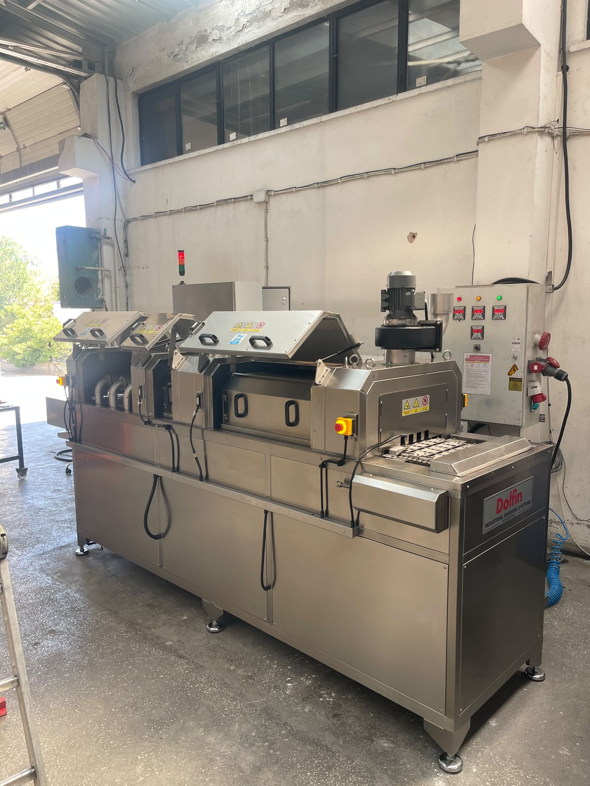
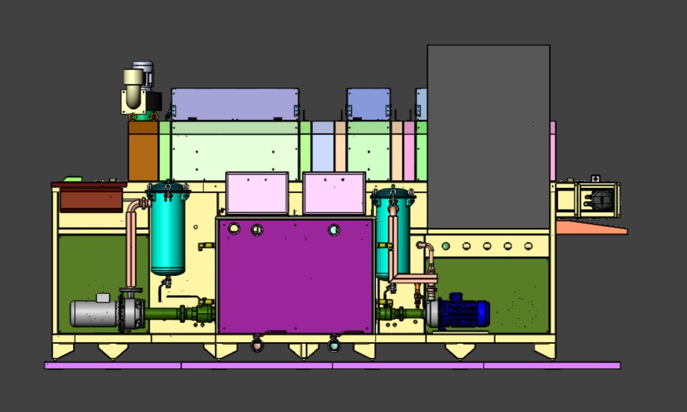
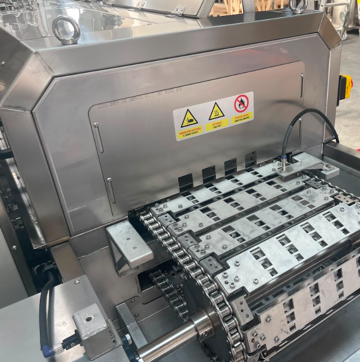
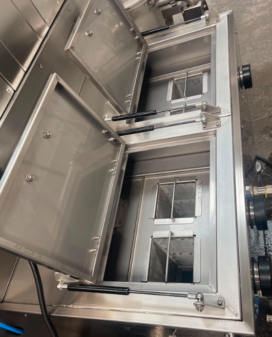
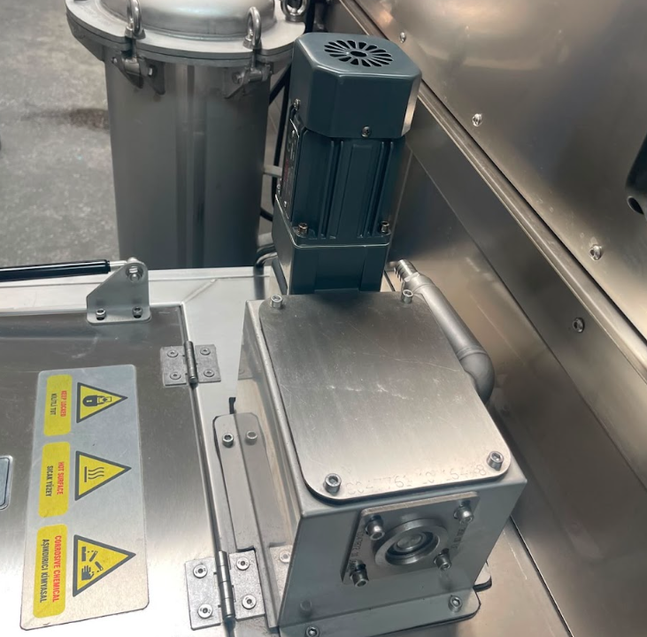
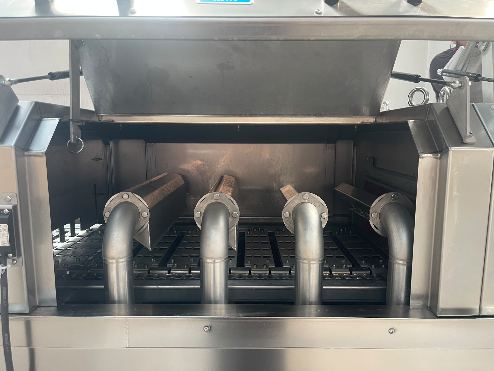

# 3.1 Maschinenbeschreibung

**KNV 30 3000 2B** ist eine automatische Teilewaschanlage, in der industrielle Teile auf einem Förderband durch Wasch-, Spül- und Trocknungsprozesse gefördert werden. Die Maschine hat einen integrierten Linienaufbau aus Wasch- und Spülbädern, einer Trocknungszone und einem Teiletransport-Förderband.

Die Förderflussrichtung ist **linke Beschickung / rechte Entnahme**. Zugang zum Bedienfeld (HMI) und zu den täglichen Eingriffspunkten befindet sich auf der **rechten Seite der Maschine**. In diesem Projekt sind Teile-Einlauf und -Auslauf mit einer **Roboterlinie** integriert; Be- und Entladeverfahren gehören zur Kundenlinie (**Siehe Kapitel 3.1.9**).

Das Maschinengehäuse ist aus Edelstahl gefertigt. Prozesstanks arbeiten mit heißem Wasser; die Trocknungszone hat Air-Knife-Einheiten und Abluftausrüstung, der Waschtank hat eine Ölskimmer-Einheit. Komponentenanordnungen und Prozessfluss sind in den folgenden Unterabschnitten detailliert.

---

## 3.1.1 Gesamtansicht und Prozessfluss

Die Maschine besteht entlang der Linie aus drei Hauptprozesszonen: **Waschen**, **Spülen** und **Trocknen**. Teile werden von links auf das Förderband genommen, durchlaufen die Prozesszonen nacheinander und verlassen die Linie rechts.

Die Nenn-Prozesszykluszeit ist mit **900 Sekunden** (15 Minuten) definiert (siehe **Kapitel 3.3.2**). Der Förderantrieb erfolgt durch **Servomotor**; der Teilefluss arbeitet synchron zur Roboterlinie.

---

## 3.1.2 Förderband und Teiletransport

Die Förderstrecke transportiert Teile zwischen den Prozesszonen. Beschickung ist **links**, Entnahme ist **rechts**. Der Getriebemotor des Förderbands ist ein **1,5 kW** Siemens-SIMOTICS-Servoantriebssystem (siehe **Kapitel 3.3.4**).

Bei der Roboterintegration unterliegen Teile-Einlauf und -Auslauf dem Verfahren der Kundenlinie. Wenn am Auslaufförderband ein Teil erkannt wird, stoppt die Maschine; nachdem der Roboter das Teil entnommen hat, wird mit HMI **Produkt entnommen Bestätigung** fortgefahren (siehe **Kapitel 3.4.6**, **11.1.2** Error-461).

---

## 3.1.3 Waschbad

Die Waschzone ist das Tanksystem, in dem Teile mit heißem Prozesswasser und Düsen gewaschen werden. Die Waschpumpe ist **Lowara ESHE 40-160/30**, **3 kW**, **380 V** (siehe **Kapitel 3.3.4**).

Im Tank befinden sich ein **Vorfilter**, ein **Innenfilter** und ein **Ölskimmer**. Die tägliche Vorfilterreinigung ist in **Kapitel 10.1.3** definiert. Das manuelle Ventil vor der Pumpe muss vor dem Start **offen** sein (siehe **Kapitel 7.2.5**).

---

## 3.1.4 Spülbad

Die Spülzone ist das Tanksystem, in dem nach dem Waschen auf der Teileoberfläche verbliebenes Prozesswasser mit Spülwasser entfernt wird. Die Spülpumpe ist **Goulds GCEA 370/3**, **1,85 kW** (siehe **Kapitel 3.3.4**).

Füllstandsregelung des Spültanks, automatisches Füllventil und Heizsystem arbeiten mit ähnlicher Logik wie der Waschtank. Die wöchentliche Filterreinigung unterliegt **Kapitel 10.1.4**.

---

## 3.1.5 Ölskimmer

Der Ölskimmer sammelt die auf der Waschtankoberfläche angesammelte Ölschicht und reduziert die Ölbelastung des Prozesswassers. Der Getriebemotor ist eine **0,04 kW**, **1340 rpm** FINEX-angetriebene Einheit (siehe **Kapitel 3.3.4**).

Übermäßige Ölansammlung kann zu Filterverstopfung und Leistungsabfall im Prozess führen. Periodische Wartung erfolgt gemäß dem Kalender in **Kapitel 9.1.3**.

---

## 3.1.6 Trocknung und Abluft

In der Trocknungszone nehmen **4 Trocknungs-Air-Knives** (Trocknungsventilator-Einheiten, je **4 kW**) Feuchtigkeit von der Teileoberfläche. Der **Abluftventilator** (**0,37 kW**) unterstützt Dampf- und Feuchteabfuhr (siehe **Kapitel 3.3.4**).

Da die Förderflussrichtung **linker Einlauf → rechter Auslauf** ist, ist die Anordnung der Trocknungsausrüstung wie folgt:

| Komponente | Lage (entlang des Förderbands) |
|---------|---------------------------|
| **Abluftventilator** | **Förderband-Einlauf**-Seite (links) |
| **Trocknungs-Air-Knives** (4 Stück) | **Förderband-Auslauf**-Seite (rechts) |

Nach dem Spülen durchläuft das Teil zuerst die Abluftzone auf der Einlaufseite; die Trocknungs-Air-Knives führen die Endtrocknung auf der Auslaufseite aus.

Die Trocknungsventilatoren sind Modell **Ölçükontrol OK 710K37** (4 × **4 kW**, **2940 rpm**). Die Trocknungsfunktion kann am HMI mit dem Prozesswähler aktiv/passiv geschaltet werden (siehe **Kapitel 7.1.6**).

Staubansammlung in Trocknungsventilatoren und Abluftkanälen senkt die Luftleistung; sie ist im periodischen Wartungskalender enthalten (siehe **Kapitel 9.1.3**).

---

## 3.1.7 Elektrische, Steuerungs- und Automatisierungsinfrastruktur

Die elektrische und Automatisierungsinfrastruktur der Maschine ist auf dem zentralen **Elektroschrank** zusammengefasst. Die Schutzart des Schranks ist **IP55**, die Abmessungen **800 × 1200 × 300 mm** (B × H × T).

Versorgungsspannung, installierte Leistung, Hauptschalterwerte und die Motorliste stehen in **Kapitel 3.3** — Technische Daten; Tabellen werden in diesem Kapitel nicht wiederholt. Kurzfassung:

- Versorgung: **380 V**, **50 Hz**, **3 Phasen**, **3P+N+PE**
- Gesamte installierte Leistung: **50 kW** (einschließlich Heizung)
- Hauptschalter: **100 A**, Schneider

Die Automatisierungsarchitektur basiert auf einer **Siemens SIMATIC S7-1200**-SPS (CPU 1215C) und einem **SIMATIC HMI KTP700 Basic PN** (7")-Bedienfeld. Start/Stop, Alarmverwaltung, Prozessfunktionsauswahl, Spracheinstellung und Parameterzugriff erfolgen über die HMI-Schnittstelle. Lagen der Steuerelemente, Signallampenbedeutungen und Bildschirmverhalten sind in **Kapitel 3.4** — Maschinensteuerungen detailliert.

Die Farbcodierung der Signalleuchte ermöglicht dem Bediener, den Maschinenzustand aus der Ferne zu überwachen: **rot** Alarm, **gelb** betriebsbereit, **grün** läuft. Im Alarmfall wird der HMI-Alarmbildschirm aktiviert; gleichzeitig leuchtet die Signalleuchte rot.

Die Maschine ist über das **Profinet**-Protokoll für die Integration in ein übergeordnetes System vorbereitet. Die HMI-Schnittstelle hat Sprachunterstützung in **Türkisch, Englisch und Deutsch**.

---

## 3.1.8 Not-Halt und Sicherheitsausrüstung

An der Maschine befinden sich **4 Not-Halt-Taster**:

1. Am Elektroschrank
2. Am Maschineneinlauf rechts vom Förderband
3. Am Maschineneinlauf links vom Förderband
4. Am Maschinenauslauf links vom Förderband

Beim Drücken des Not-Halts stoppt **jede Funktion** an der Maschine. Das Wiederinbetriebnahme-Verfahren, Reset-Schritte und das Maschinenverhalten nach Not-Halt stehen in **Kapitel 2.5** — Not-Halt-System; die Schritte werden in diesem Kapitel nicht wiederholt.

Die Anzahl der Sicherheitstüren / festen Barrieren ist null; Wartungsklappen werden durch einen **RFID-Sicherheitssensor** überwacht. Beim Öffnen einer Klappe stoppt der RFID-Switch die Maschine. Die Sicherheitskategorie der Maschine ist **Cat. 3** (EN ISO 13849-1; siehe **Kapitel 2.1.3**). Es ist kein Lichtvorhang vorhanden.

Während der Wartung darf der RFID-Sicherheitssensor nicht umgangen werden; vor dem Öffnen einer Klappe müssen Energieisolation und das **LOTO**-Verfahren angewendet werden (siehe **Kapitel 2.4**).

---

## 3.1.9 Linienintegration und Kommunikation

Im Rahmen dieses Projekts erfolgen die **Einlauf**- und **Auslauf**-Operationen der Teile durch Roboter; Einlauf-/Auslaufverfahren gehören zur Kundenlinie. An der Maschine ist kein ständiger Bediener vorhanden; bei einer Störung erfolgt der Eingriff durch Wartungspersonal (siehe **Kapitel 11**).

Der Anschluss an das übergeordnete System (MES / SCADA) erfolgt **durch den Kunden**. Die Maschine ist mit **Profinet**-Infrastruktur integrationsbereit; Protokoll, I/O-Kurzfassung und Dokumentation sind in **Kapitel 5.6** definiert. Die Liste der gelieferten externen Dokumente steht in **Kapitel 13.1**.
---

Für Grenzen der bestimmungsgemäßen Verwendung siehe **Kapitel 3.2**; für technische Tabellen siehe **Kapitel 3.3**; für Steuerelemente siehe **Kapitel 3.4**; für das Layout siehe **Kapitel 3.5**.
