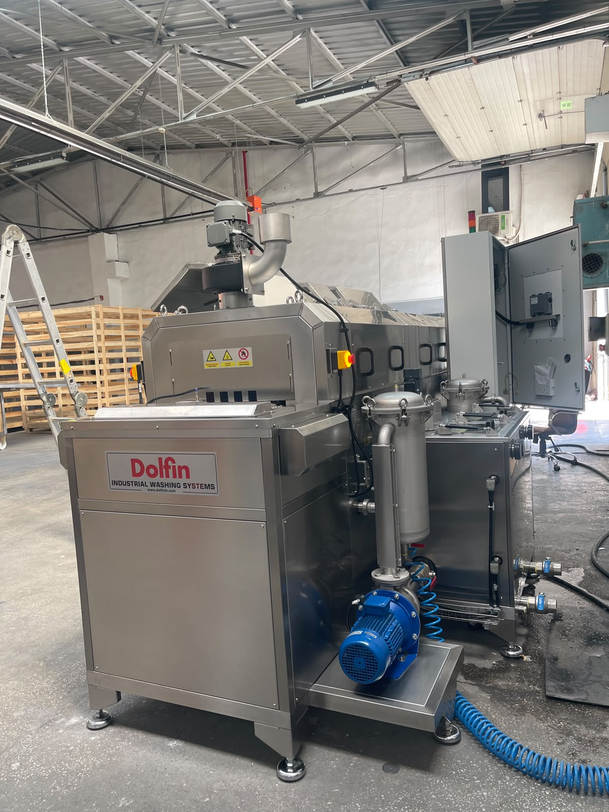
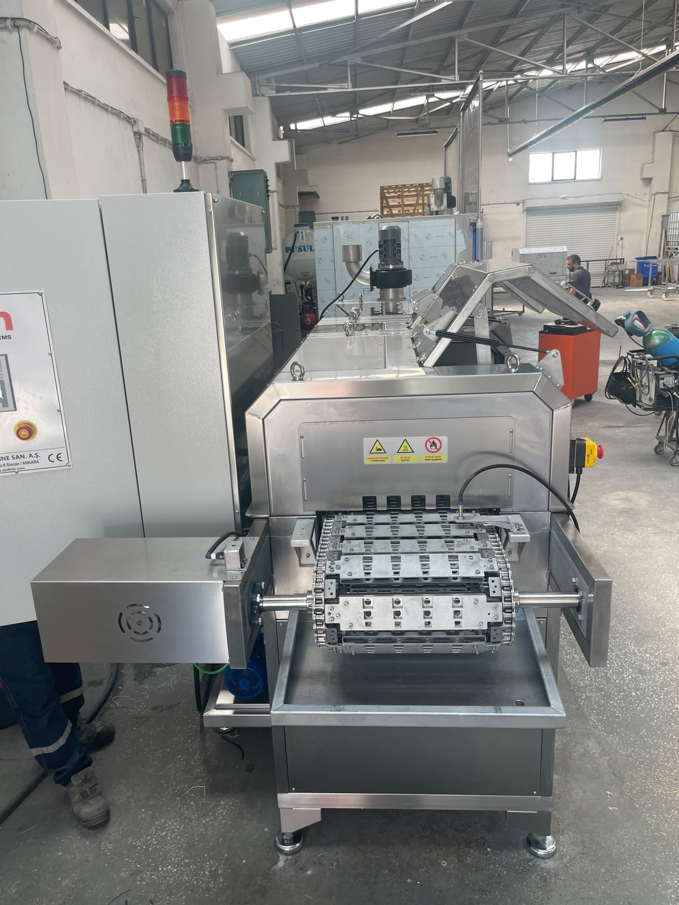
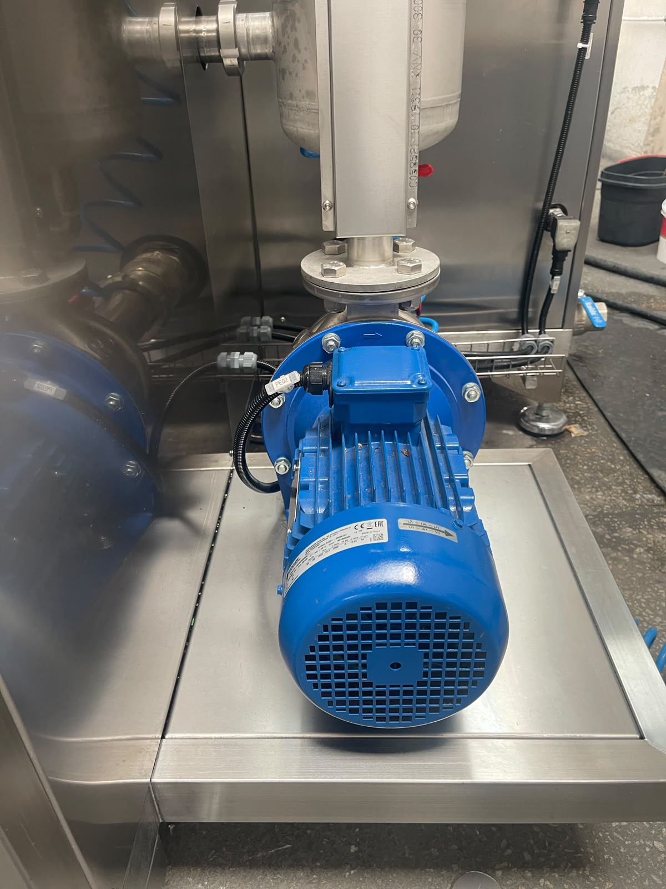
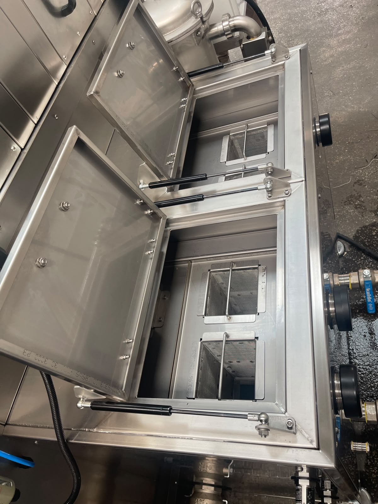
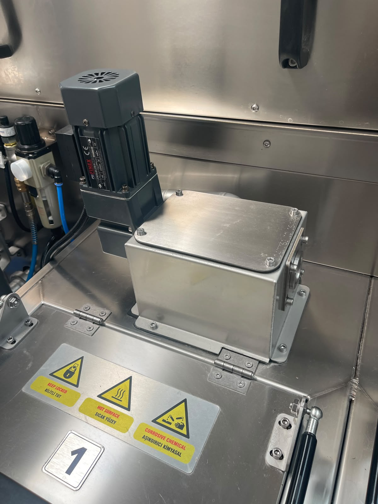
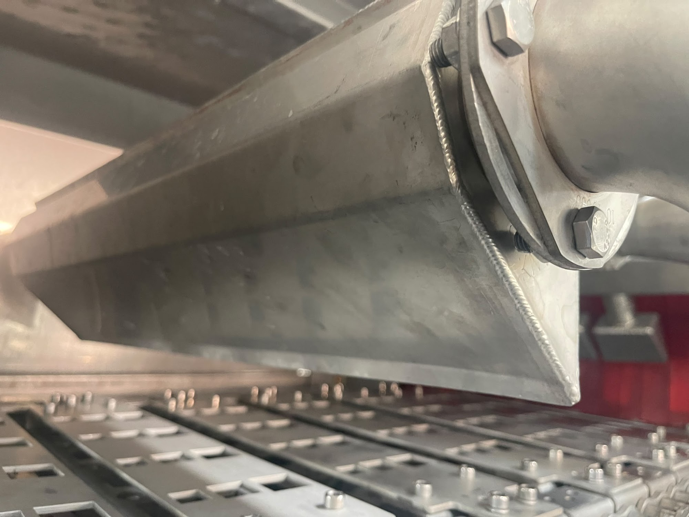
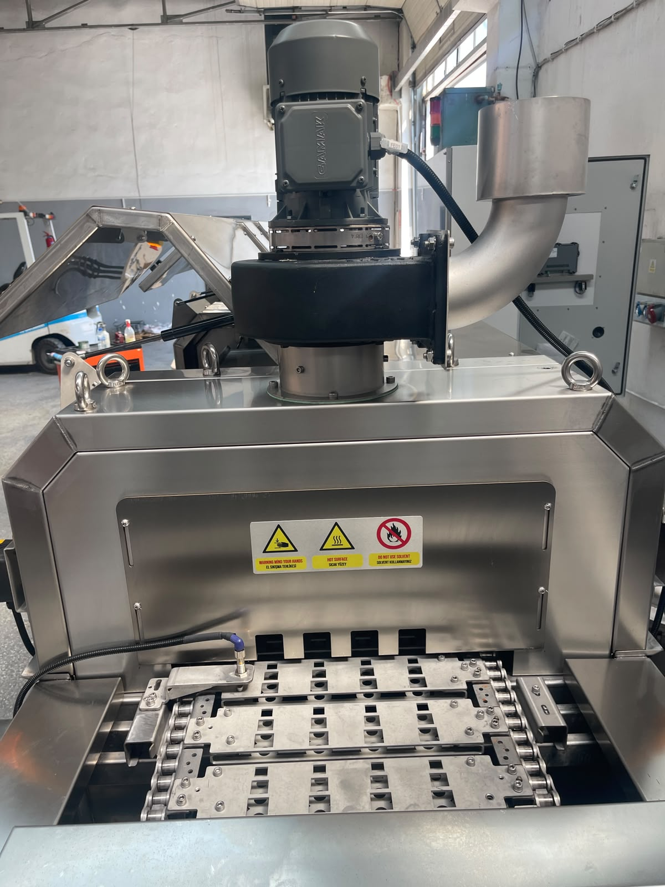
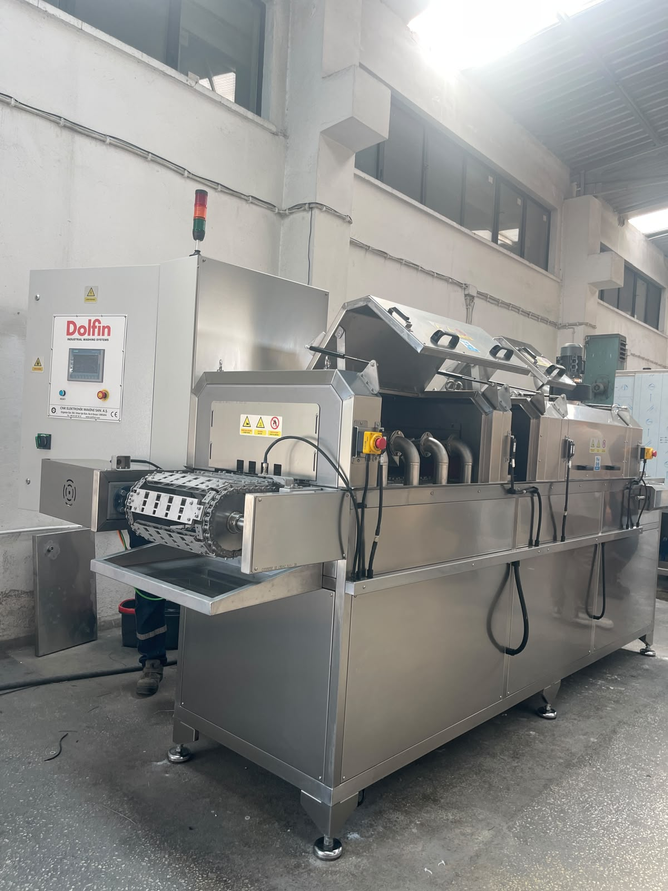
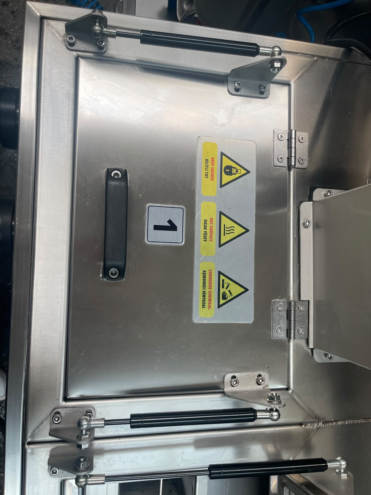

# 3.1 Makine tanımı ve sistematik yapı

KNV-30 3000 2B (Seri no: **1726050**, müşteri: **ALPER ÖZLEM IDEA**, üretim yılı: **2026**), girişten yüklemeli konveyörlü, iki banyolu (yıkama + durulama) endüstriyel parça yıkama makinesidir. Parçalar konveyör hattı üzerinde ilerleyerek yıkama, durulama ve kurutma proseslerini ardışık olarak tamamlar; makinenin ana işlevi, parça yüzeyinde endüstriyel işlemlerden kalan **yağ ve kirliliğin giderilmesidir**.

Makine, **konveyör** tipi sürekli besleme prensibiyle tasarlanmıştır. Besleme tarafı **sol**, boşaltma tarafı **sağ**, operatör tarafı **sağ** yöndedir. Proses akışı üç adımdan oluşur: **Yıkama → Durulama → Kurutma**. Nominal döngü süresi **900 saniye** (15 dakika) olarak tanımlanmıştır.

<!-- FOTO: Makine genel görünüm — operatör tarafı (sağ), besleme sol / boşaltma sağ -->

---

## 3.1.1 Genel tanım ve proses konsepti

KNV 30 3000 2B, endüstriyel üretim hatlarında işlenmiş parçaların yüzey temizliği için kullanılan, konveyör üzerinde ilerleyen parçaların sabit proses bölgelerinden geçirildiği bir yıkama sistemidir. **2B** tanımı, makinenin **iki bağımsız proses banyosuna** — yıkama ve durulama — sahip olduğunu ifade eder; her banyo kendi sirkülasyon devresi ile çalışır ve banyolar arası sıvı karışımı yapısal olarak engellenir.

Parçalar sol taraftan (besleme/giriş) konveyöre yüklenir. Konveyör hattı boyunca sırasıyla yıkama bölgesi, durulama bölgesi ve kurutma bölgesinden geçen parçalar, sağ taraftan (boşaltma/çıkış) temizlenmiş ve kurutulmuş olarak alınır. Bu sürekli akış prensibi, hat entegrasyonuna uygun kesintisiz üretim imkânı sağlar.

Makinenin dış boyutları **3770 × 1730 × 2122 mm** (L × W × H), boş ağırlığı **1300 kg**, çalışma ağırlığı (dolu) **1500 kg**'dır. Makine, **ayarlanabilir ayak** sistemi üzerine monte edilmiştir; ağırlık merkezi konveyör hattının ortasındadır.

| Proses adımı | Sıra | Açıklama |
|--------------|------|----------|
| Yıkama | 1 | Endüstriyel yağ ve kir tabakasının giderilmesi |
| Durulama | 2 | Yıkama kalıntılarının ve kirliliğin uzaklaştırılması |
| Kurutma | 3 | Parça yüzeyindeki nemin alınması |

Nominal döngü süresi: **900 sn**

<!-- FOTO: Proses akışı şeması veya konveyör hattı boyunca bölge görünümü -->

---

## 3.1.2 Konveyör taşıma sistemi

Konveyör, makinenin omurgasını oluşturan taşıma sistemidir. Parçaların proses bölgeleri arasında kontrollü ve sürekli ilerlemesini sağlar. Giriş ve çıkış noktaları operatör erişimine açık konumdadır; besleme **sol**, boşaltma **sağ** yöndedir.

Konveyör tahriki, redüktörlü elektrik motoru ile gerçekleştirilir:

| Parametre | Değer |
|-----------|-------|
| Motor adı | Konveyör Redüktörü motoru |
| Güç | 1,5 kW |
| Devir | 2000 rpm |
| Marka | Siemens |
| Model | SIMOTICS S-1FL6 |

Konveyör hattı, parçaların yıkama nozulları ve durulama nozulları altından geçmesini sağlayacak şekilde proses bölgeleri boyunca konumlandırılmıştır. Referans / home pozisyonu olarak **konveyörün başı** kullanılmalıdır.

Konveyör üzerinde toplam **4 adet yağlama noktası** bulunur: giriş tarafında 2 adet, çıkış tarafında 2 adet. Periyodik yağlama, konveyörün uzun ömürlü ve sorunsuz çalışması için gereklidir (ayrıntılar bakım bölümünde).

<!-- FOTO: Konveyör giriş ve çıkış — besleme (sol) / boşaltma (sağ) -->

<!-- FOTO: Konveyör tahrik ünitesi — redüktör ve motor -->

---

## 3.1.3 Yıkama banyosu ve sirkülasyon sistemi

Yıkama banyosu, parça yüzeyindeki endüstriyel yağ ve kir tabakasının giderildiği birinci proses bölgesidir. Tank içerisindeki proses sıvısı, yıkama pompası tarafından emilerek püskürtme sistemine basılır; parçalar konveyör üzerinde ilerlerken nozullardan gelen basınçlı sıvı ile temas eder.

Yıkama sirkülasyon devresi, bağımsız pompa motoru ile tahrik edilir:

| Parametre | Değer |
|-----------|-------|
| Motor adı | Yıkama Pompası Motoru |
| Güç | 3 kW |
| Devir | 2900 rpm |
| Marka | Lowara |
| Model | ESHE 40-160/30 |

Yıkama tankı, proses sıvısının depolandığı ve ısıtıldığı ana haznedir. Tank içerisinde **ön filtreler** bulunur; günlük bakımda sökülüp temizlenmeleri gerekir. Pompa çıkış hattında **hassas torba filtreler** yer alır; haftalık derin temizlikte sökülüp temizlenmelidir.

Proses suyu için **şebeke suyu** veya **arıtılmış su** kullanılmalıdır. Su giriş basıncı **1 bar**, su sıcaklığı **+10°C ile +70°C** aralığında olmalıdır.

<!-- FOTO: Yıkama banyosu — tank, pompa ve filtre genel görünüm -->

<!-- FOTO: Yıkama pompası — Lowara ESHE 40-160/30 -->

---

## 3.1.4 Durulama banyosu ve sirkülasyon sistemi

Durulama banyosu, yıkama prosesinden geçen parçalar üzerinde kalan deterjan, yağ kalıntısı ve kirliliğin uzaklaştırıldığı ikinci proses bölgesidir. Yıkama banyosundan bağımsız tank ve pompa devresine sahiptir; iki banyo arasında sıvı karışımı yapısal olarak engellenmiştir.

Durulama sirkülasyon devresi:

| Parametre | Değer |
|-----------|-------|
| Motor adı | Durulama Pompası Motoru |
| Güç | 1,85 kW |
| Devir | 2900 rpm |
| Marka | GOULDS |
| Model | GCEA 370/3 |

Durulama tankında da filtreler bulunur; haftalık derin temizlik prosedürü kapsamında tank filtreleri ve pompa çıkışındaki torba filtreler sökülüp temizlenmelidir. Temizlik maddesi olarak **asit bazlı** veya **paslanmaz çeliğe zarar verecek** maddeler kullanılmamalıdır.

<!-- FOTO: Durulama banyosu — tank ve pompa genel görünüm -->

---

## 3.1.5 Yağ sıyırıcı ünitesi

Yıkama tankında biriken yüzen yağ tabakasının sürekli olarak uzaklaştırılması için yağ sıyırıcı ünite entegre edilmiştir. Endüstriyel parça yıkamada yağ birikimi, proses sıvısının etkinliğini düşürür ve bakım ihtiyacını artırır; yağ sıyırıcı bu birikimi önleyerek tank içi proses kalitesini korur.

| Parametre | Değer |
|-----------|-------|
| Motor adı | Yağ Sıyırıcı Redüktörü Motoru |
| Güç | 0,04 kW |
| Marka | FINEX |
| Model | E1610-40-150-17B-C |

<!-- FOTO: Yağ sıyırıcı ünite — yıkama tankı üzerinde konum -->

---

## 3.1.6 Kurutma ve egzost sistemi

Kurutma bölgesi, durulama prosesinden çıkan parçalar üzerindeki yüzey neminin güçlü ve yönlendirilmiş hava akışı ile uzaklaştırıldığı üçüncü ve son proses adımıdır. Kurutma, boyama, kaplama ve montaj gibi yüzey kalitesinin kritik olduğu sonraki proses adımları için parçaların nemden arındırılmış olarak hattan çıkmasını sağlar.

Makinede **4 adet kurutma fanı** bulunur:

| Fan | Güç | Devir |
|-----|-----|-------|
| 1. Kurutma Fanı Motoru | 4 kW | 2900 rpm |
| 2. Kurutma Fanı Motoru | 4 kW | 2900 rpm |
| 3. Kurutma Fanı Motoru | 4 kW | 2900 rpm |
| 4. Kurutma Fanı Motoru | 4 kW | 2900 rpm |

Toplam kurutma fan gücü **16 kW**'dır. Kurutma bölgesinde biriken nemli havanın makine dışına tahliyesi için **egzost fanı** kullanılır:

| Parametre | Değer |
|-----------|-------|
| Motor adı | Egzost Fanı Motoru |
| Güç | 0,37 kW |
| Devir | 2800 rpm |
| Marka | ENA |
| Model | ENA 2 |

HMI arayüzündeki çalışma sayfasında yıkama, durulama, **kurutma 1**, **kurutma 2** ve **egzoz** seçenekleri bağımsız olarak açılıp kapatılabilir; operatör proses ihtiyacına göre bu fonksiyonları yapılandırabilir.

<!-- FOTO: Kurutma bölgesi — fan üniteleri genel görünüm -->

<!-- FOTO: Egzost fanı -->

---

## 3.1.7 Elektrik, kontrol ve otomasyon altyapısı

Makinenin elektrik ve otomasyon altyapısı, merkezi **elektrik panosu** üzerinde toplanmıştır. Pano koruma sınıfı **IP55**, boyutları **800 × 1200 × 300 mm** (W × H × D)'dir.

### Güç beslemesi

| Parametre | Değer |
|-----------|-------|
| Besleme gerilimi | 380 V |
| Frekans | 50 Hz |
| Faz | 3 |
| Toplam kurulu güç | 50 kW |
| Maksimum akım çekişi | 100 A |
| Besleme konfigürasyonu | 3P+N+PE |
| Ana şalter | 100 A, Schneider |
| Toplam sigorta / devre kesici | 100 A |
| Güç faktörü (cos φ) | 0,9 |
| Kısa devre akımı (ICC) gereksinimi | 10 kA |
| UPS / jeneratör gereksinimi | Hayır |

### Otomasyon bileşenleri

| Bileşen | Marka / Model | Özellik |
|---------|---------------|---------|
| HMI | SIMATIC HMI KTP700 Basic PN (6AV2123-2GB03-0AX0) | 7" ekran |
| PLC | SIEMENS SIMATIC S7-1200 | CPU 1215C DC/DC/DC (6ES7215-1AG40-0XB0) |
| I/O | — | 36 giriş / 24 çıkış |
| Ana şalter konumu | Elektrik panosu üzerinde | — |
| Start / Stop | HMI arayüzü — dijital buton | — |

### Sinyal lambaları (tepe lambası)

| Renk | Anlam |
|------|-------|
| Kırmızı | Alarm |
| Sarı | Makine kullanıma hazır |
| Yeşil | Makine çalışıyor |

Alarm durumunda HMI alarm ekranı devreye girer; eş zamanlı olarak tepe lambası **kırmızı** yanar. Reçete / program kaydında herhangi bir sınır bulunmamaktadır. Uzaktan erişim **Secomea** modülü ile mümkündür.

HMI dilleri: **Türkçe**, **İngilizce**, **Almanca**. HMI arayüzünde şifre koruması bulunmaktadır. Çalışma modları: **Otomatik** ve **Bakım**. Jog / inching düğmeleri bulunmamaktadır.

### Güvenlik entegrasyonu

Makinede **RFID güvenlik sensörü** bulunmaktadır; kapaklar açıldığında sensör makineyi durdurur. Makine stop kategorisi **Cat.3**'tür. Acil stop butonları toplam **4 adet** olup konumları: (1) elektrik panosu üzerinde, (2) makine girişinde konveyörün sağında, (3) makine girişinde konveyörün solunda, (4) makine çıkışında konveyörün solunda. Acil stop'a basıldığında makinedeki **her fonksiyon durur**.

<!-- FOTO: Elektrik panosu — HMI, ana şalter ve sinyal lambaları -->

<!-- FOTO: HMI ekran — ana çalışma sayfası -->

---

## 3.1.8 Yardımcı medya bağlantıları

Makinenin proses ve pnömatik fonksiyonları için tesisat bağlantıları gereklidir:

| Medya | Değer | Not |
|-------|-------|-----|
| Basınçlı hava girişi | 6 bar | 3/4" bağlantı (montaj adım 4) |
| Su girişi basıncı | 1 bar | 1/2" bağlantı (montaj adım 5) |
| Su sıcaklığı | +10°C – +70°C | Şebeke veya arıtılmış su |
| Su kalitesi | Şebeke suyu veya arıtılmış su | — |

Pnömatik regülatör basınç ayarı **6 bar** olarak tanımlanmıştır. HMI manuel sayfasında hava ve su bağlantı durumu yeşil gösterge ile izlenir.

<!-- FOTO: Basınçlı hava ve su bağlantı noktaları -->

---

## 3.1.9 Ana bileşenler özeti

Aşağıdaki tablo, makinenin ana modüllerini ve işlevlerini özetler:

| Bileşen | İşlev |
|---------|-------|
| Konveyör | Parça taşıma; proses bölgeleri arası sürekli akış |
| Yıkama Pompası | Yıkama banyosu sirkülasyonu; basınçlı püskürtme |
| Durulama Pompası | Durulama banyosu sirkülasyonu; kalıntı giderme |
| Yağ Sıyırıcı | Yıkama tankındaki yüzen yağın uzaklaştırılması |
| Kurutma Fanı (×4) | Parça yüzey kurutma; toplam 16 kW |
| Egzost Fanı | Kurutma bölgesi nem tahliyesi |
| Elektrik Panosu | Güç dağıtımı, koruma ve otomasyon merkezi |
| HMI | Operatör arayüzü; start/stop, alarm, parametre |
| PLC | Proses otomasyonu ve I/O yönetimi |
| Ana Şalter | 100 A — Schneider |
| Sigorta | 100 A toplam devre kesici |

Makine **iç mekan** ortamında, **+10°C ile +30°C** sıcaklık ve **%30–50** göreceli nem aralığında çalışacak şekilde tasarlanmıştır. Koruma sınıfı **IP55**, gürültü seviyesi **65 dB(A)**'dır.

Makine arkasındaki kapakların tamamı sökülebilir ve bakım erişimine açıktır. Minimum etraf boşluğu ön, arka ve yan yönlerde **1000 mm**, minimum tavan yüksekliği **2500 mm**'dir.

<!-- FOTO: Makine arka taraf — bakım kapakları -->

