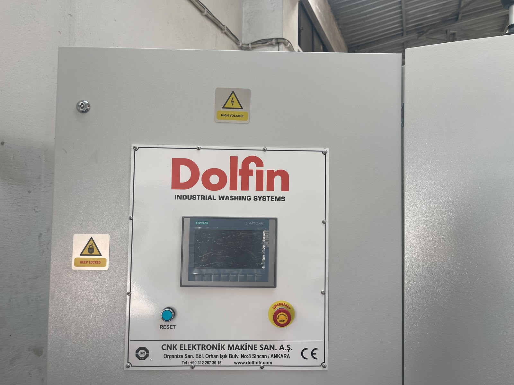

# 3.2. Intended Use

This section defines the intended purpose, processable product limits, prohibited uses, environmental conditions, and operator requirements for the KNV 30 3000 2B industrial parts washing machine. Compliance with the limits specified below is mandatory for safe, efficient, and intended operation of the machine.

---

## 3.2.1. Designed Scope of Use

KNV 30 3000 2B is an industrial parts washing machine with front loading, conveyor feed, and two process baths (wash + rinse). Parts travel on the conveyor and complete washing, rinsing, and drying processes.

The **intended use** of the machine is **removal of contamination from industrial parts**. The designed primary function is **cleaning of oil and contamination** remaining on part surfaces from industrial processes. The machine processes parts on a continuous-flow principle along the conveyor line; the feed side is on the **left**, the discharge side on the **right**.

This machine is designed for use only in **indoor** industrial facility environments, within the technical and environmental limits specified in this manual.

<!-- PHOTO: Typical use — loading parts onto the conveyor line (feed side) -->

---

## 3.2.2. Processable Product and Material Types

The following product types may be processed with the machine:

| Category | Description |
|----------|-------------|
| General | Industrial parts |
| Material examples | Metal, plastic, rubber, etc. |

Parts pass through wash and rinse processes to remove surface contamination; surface moisture is then removed in the drying zone. Suitability of parts for process fluid, temperature, and conveyor transport capacity is the responsibility of the user company.

The nominal process cycle time is defined as **900 seconds** (15 minutes). The minimum capacity reference value is specified as **730 parts/hour**; nominal and maximum capacity values are determined by the user company according to process conditions.

<!-- PHOTO: Examples of processable industrial parts — on the conveyor -->

---

## 3.2.3. Prohibited and Unsuitable Uses

The following product and use types are **not suitable** for the machine and are **strictly prohibited**:

| Prohibited category | Description |
|---------------------|-------------|
| Living organisms | Humans, animals, plants, or any living organism |

Use of the machine outside the specified purpose is considered foreseeable misuse. Washing, cleaning, or entry of living organisms into machine process zones is prohibited.

The machine is equipped with an RFID safety sensor; when covers are opened, the machine stops. Safety door bypass must not be performed. For maintenance, covers shall be opened only after machine power is isolated; **LOTO procedure** shall be applied when power is isolated.

<!-- PHOTO: Machine process zone — industrial parts only -->

---

## 3.2.4. Process Water and Cleaning Agent Limits

Water used in the wash and rinse processes of the machine shall comply with the following conditions:

| Parameter | Value / Requirement |
|-----------|---------------------|
| Water source | Mains water or purified water |
| Water inlet pressure | 1 bar |
| Water temperature | +10°C – +70°C |

**Prohibited cleaning agents:**
- Acid-based cleaning agents shall not be used.
- Cleaning agents harmful to stainless steel shall not be used.

For disinfection of machine tanks, after draining the tank, the interior shall be washed with **soapy water**. Disposal of waste water and chemicals shall comply with the regulations applicable in the country of use.

Cleaning type: **dry / wet**

<!-- PHOTO: Water connection point and process tanks -->

---

## 3.2.5. Environmental and Facility Conditions

The machine is designed for use in **indoor** environments only. Operating and storage environmental conditions shall remain within the following limits:

| Parameter | Min | Max |
|-----------|-----|-----|
| Ambient / operating temperature | +10°C | +30°C |
| Storage temperature | +10°C | +30°C |
| Relative humidity | 30% | 50% |

Additional environmental characteristics:

| Parameter | Value |
|-----------|-------|
| Protection rating (IP) | IP55 |
| Noise level | 65 dB(A) |

The floor where the machine is installed shall be **hard and level**. Minimum clearance at front, rear and sides is **1000 mm**; minimum ceiling height is **2500 mm**. During transport, moisture and corrosive substances shall not be present; storage environments shall also be free of moisture and corrosive substances.

Compressed air supply shall be provided at **6 bar** pressure (3/4" connection).

<!-- PHOTO: Machine installation area — indoor, clearance zones -->

---

## 3.2.6. Operator, Training and Target Audience

The machine is designed to be used by the following personnel groups:

| Personnel | Role |
|-----------|------|
| Operator | Daily operation, start/stop, process monitoring |
| Maintenance | Periodic maintenance, filter cleaning, lubrication |
| Installation | Assembly, utility connections, commissioning |

The number of operators required at the machine at the same time is **1–2** persons.

**Competency / training requirement:** Operations and maintenance personnel training; training related to machine operation and maintenance shall be completed. Personnel shall be instructed on the HMI interface (Turkish, English, German), emergency stop procedure, and basic safety rules.

The machine is defined as suitable for **24/7** continuous operation; nevertheless, operation shall be carried out under supervision of trained personnel and within the limits specified in this section.

<!-- PHOTO: Operator — monitoring the machine from HMI panel -->

