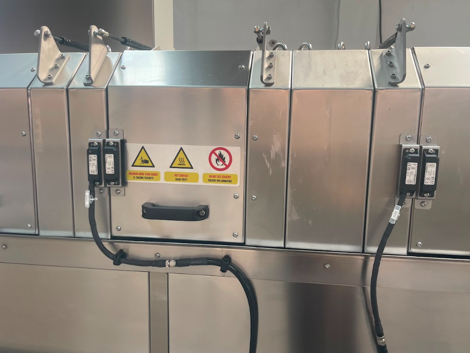
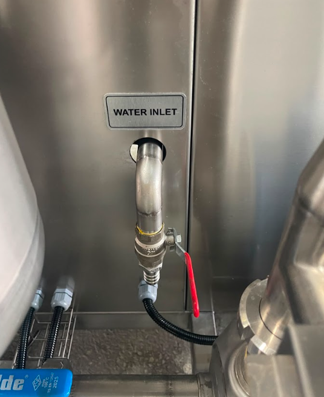
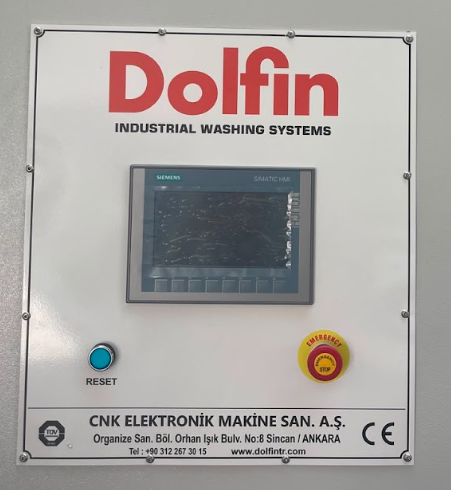

# 3.2 Amaçlanan kullanım

Bu bölüm, makinenin **tasarlanan kullanım kapsamını**, işlenebilir ve yasak ürün tiplerini, proses suyu sınırlarını, ortam koşullarını ve hedef personeli tanımlar. Makine, belirtilen sınırlar dışında kullanıldığında öngörülebilir hatalı kullanım kapsamına girer; güvenlik ve proses sonuçları garanti kapsamı dışında kalabilir (bkz. **Bölüm 2.1**). Teknik tablo değerleri **Bölüm 3.3**'te, alan gereksinimleri **Bölüm 3.5**'te verilmiştir.

---

## 3.2.1 Tasarlanan kullanım kapsamı

KNV 30 3000 2B, girişten yüklemeli konveyörlü, iki banyolu (yıkama + durulama) endüstriyel parça yıkama makinesidir. Parçalar konveyör üzerinde ilerleyerek yıkama, durulama ve kurutma proseslerini tamamlar.

Makinenin **amaçlanan kullanım alanı**, endüstriyel parçaların kirliliğinin giderilmesidir. Tasarlanan ana işlev; parça yüzeyinde endüstriyel işlemlerden kalan **yağ ve kirliliğin temizlenmesidir**. Makine, parçaları konveyör hattı boyunca sürekli akış prensibiyle işler; besleme tarafı **sol**, boşaltma tarafı **sağ** yöndedir.

Bu makine yalnızca **iç mekan** endüstriyel tesis ortamlarında, bu kılavuzda belirtilen teknik ve çevresel sınırlar dahilinde kullanılmak üzere tasarlanmıştır.

---

## 3.2.2 İşlenebilir ürün ve malzeme türleri

Makine ile işlenebilir ürün tipleri aşağıdaki gibidir:

| Kategori | Açıklama |
|----------|----------|
| Genel | Endüstriyel parçalar |
| Malzeme örnekleri | Metal, plastik, kauçuk vb. |

Parçalar, yıkama ve durulama proseslerinden geçirilerek yüzey kirliliği giderilir; ardından kurutma bölgesinde yüzey nemi alınır. İşlenecek parçaların proses sıvısına, sıcaklığa ve konveyör taşıma kapasitesine uygun olması kullanıcı firmanın sorumluluğundadır.

Nominal proses döngü süresi **900 saniye** (15 dakika) olarak tanımlanmıştır. Minimum kapasite referans değeri **730 adet/saat** olarak belirtilmiştir; nominal ve maksimum kapasite değerleri kullanıcı firma tarafından proses koşullarına göre belirlenir.

---

## 3.2.3 Yasak ve uygun olmayan kullanımlar

Aşağıdaki ürün ve kullanım tipleri makine için **uygun değildir** ve **kesinlikle yasaktır**:

| Yasak kategori | Açıklama |
|----------------|----------|
| Canlı organizmalar | İnsan, hayvan, bitki veya herhangi bir canlı organizma |

Makinenin belirtilen amaç dışında kullanılması öngörülebilir hatalı kullanım kapsamında değerlendirilir. Canlı organizmaların yıkanması, temizlenmesi veya makine proses bölgelerine girmesi yasaktır.

Makine, RFID güvenlik sensörü ile donatılmıştır; kapaklar açıldığında makine durur. RFID güvenlik sensörü bypass edilmemelidir. Bakım için makine durdurulur, elektrik kesilir ve **LOTO prosedürü** uygulanır; kapaklar ancak bundan sonra açılır.

---

## 3.2.4 Proses suyu ve temizlik maddesi sınırları

Makinenin yıkama ve durulama proseslerinde kullanılacak su aşağıdaki koşullara uygun olmalıdır:

| Parametre | Değer / Gereksinim |
|-----------|-------------------|
| Su kaynağı | Şebeke suyu veya arıtılmış su |
| Su giriş basıncı | 1 bar |
| Su sıcaklığı | +10°C – +70°C |

**Yasak temizlik maddeleri:**
- Asit bazlı temizlik maddeleri kullanılmamalıdır.
- Paslanmaz çeliğe zarar verecek temizlik maddeleri kullanılmamalıdır.

Makine tanklarının dezenfeksiyonu için tank içerisi su boşaltıldıktan sonra **sabunlu su** ile yıkanmalıdır. Atık su ve kimyasal bertarafında makinenin kullanıldığı ülkenin mevcut mevzuatı uygulanmalıdır.

Temizlik tipi: **kuru / ıslak**

---

## 3.2.5 Ortam ve tesis koşulları

Makine yalnızca **iç mekan** endüstriyel tesis ortamlarında kullanılmak üzere tasarlanmıştır. Çalışma ve depolama ortam koşulları aşağıdaki sınırlar içinde olmalıdır; bu değerler **Bölüm 3.3.6** — Ortam koşulları tablosunda verilmiştir:

| Parametre | Min | Max |
|-----------|-----|-----|
| Ortam / çalışma sıcaklığı | +10°C | +30°C |
| Depolama sıcaklığı | +10°C | +30°C |
| Göreceli nem | %30 | %50 |

| Parametre | Değer |
|-----------|-------|
| Koruma sınıfı (IP) | IP55 |
| Gürültü seviyesi | 65 dB(A) |

Minimum etraf boşlukları, tavan yüksekliği, zemin düzgünlük toleransı ve montaj alanı boyutu **Bölüm 3.5.2**'de verilmiştir. Kurulum planlamasında bu bölüme bakın; burada tekrarlanmaz.

Basınçlı hava beslemesi **6 bar** basınçta sağlanmalıdır (3/4" bağlantı — bkz. **Bölüm 3.3.5**). Taşıma ve depolama sırasında nem ve korozif madde bulunmamalıdır (bkz. **Bölüm 4.2**).

---

## 3.2.6 Operatör, eğitim ve hedef kitle

Makine aşağıdaki personel grupları tarafından kullanılmak üzere tasarlanmıştır:

| Personel | Rol |
|----------|-----|
| Hat sorumlusu | HMI hazırlık / start / stop, alarm izleme, Error-461 **Ürün Alındı Onay** |
| Bakım | Periyodik bakım, filtre temizliği, yağlama, arıza müdahalesi |
| Kurulum | Montaj, medya bağlantıları, devreye alma |

Parça yükleme ve boşaltma **robot** ile yapılır; hatta sürekli vardiya operatörü **bulunmaz**. Aynı anda makine çevresinde bulunabilecek müdahale personeli **1–2** kişidir (hat sorumlusu ve/veya bakım); bu sayı 7/24 hat başında duran operatör anlamına gelmez.

**Yetkinlik / eğitim gereksinimi:** İşletme ve bakım personeli eğitimi; makine kullanımı ve bakımı ile ilgili eğitim alınmış olmalıdır. Personel, HMI arayüzü (Türkçe, İngilizce, Almanca), acil stop prosedürü ve temel güvenlik kuralları konusunda bilgilendirilmelidir.

Makine **24/7** robot hattında çalışmaya uygundur. HMI komutları ve hata onayı, eğitimli hat sorumlusu veya bakım personeli tarafından verilir; proses izleme üst sistem (MES/SCADA — müşteri) veya periyodik tur ile yapılabilir.

