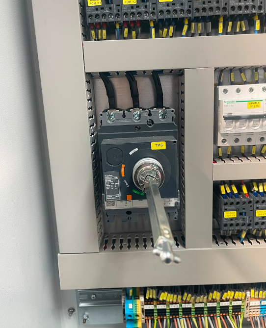
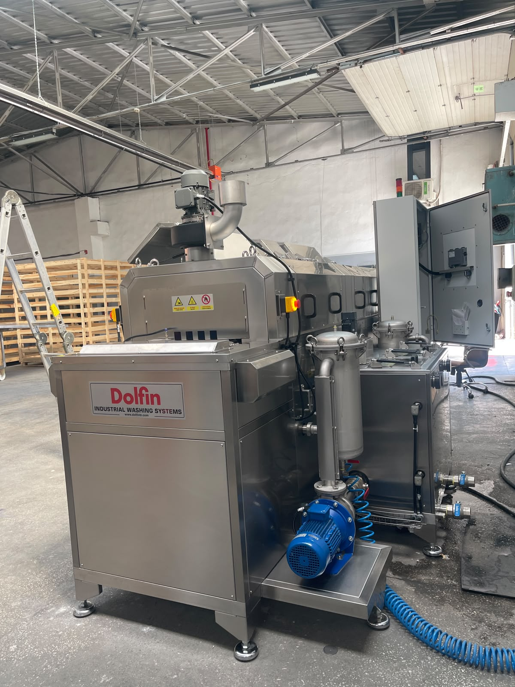
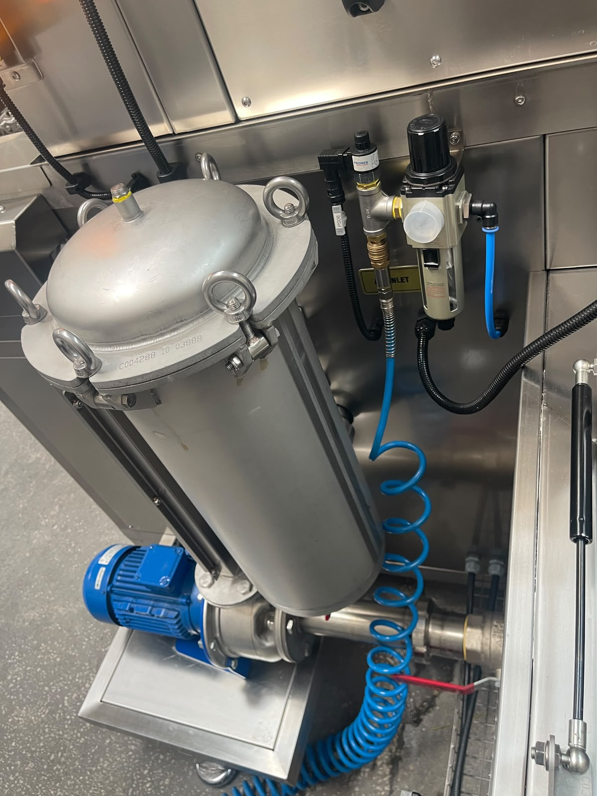

# 3.3 Technische Daten

Dieses Kapitel sammelt Abmessungen, Gewicht, Kapazität, Elektrik, Motor, Medienanschlüsse und Umgebungsbedingungen der Maschine **KNV 30 3000 2B** (Seriennr. **1726050**). Dieselben Zahlenwerte werden in den Kapiteln Installation (Kapitel 5), Einstellungen (Kapitel 6) und Betrieb (Kapitel 7) nicht wiederholt; diese Kapitel verweisen hierher.

---

## 3.3.1 Physikalische Abmessungen und Gewicht

| Parameter | Einheit | Wert |
|-----------|:-----:|------:|
| Außenlänge (L) | mm | 3770 |
| Außenbreite (W) | mm | 1730 |
| Außenhöhe (H) — normal | mm | 2122 |
| Leergewicht — trocken | kg | 1300 |
| Betriebsgewicht — gefüllt | kg | 1500 |
| Fahrgestelltyp | — | Verstellbare Füße |

Die Maschine wird so aufgestellt, dass Lot- und Niveauausgleich über das System verstellbarer Füße möglich ist. Der Schwerpunkt liegt in der Mitte der Förderstrecke; für Transport- und Gabelstaplerplanung siehe **Kapitel 3.5.4**. Die minimale Installationsflächengröße muss **5 m × 3 m** betragen (siehe **Kapitel 3.5.2**).

---

## 3.3.2 Kapazität und Prozessparameter

| Parameter | Wert |
|-----------|-------|
| Anzahl der Prozessschritte | 3 |
| Prozessname 1 | Waschen |
| Prozessname 2 | Spülen |
| Prozessname 3 | Trocknen |
| Zykluszeit — Nenn | 900 s (15 min) |
| Nennkapazität | Wird vom Anwenderunternehmen festgelegt |
| Maximalkapazität | Wird vom Anwenderunternehmen festgelegt |
| Mindestkapazität | 730 Stück/Stunde |
| Produktformat / Verpackungstyp | Wird vom Anwenderunternehmen festgelegt |
| Produktgröße min | Wird vom Anwenderunternehmen festgelegt |
| Produktgröße max | Wird vom Anwenderunternehmen festgelegt |
| Produktgewicht min | Wird vom Anwenderunternehmen festgelegt |
| Produktgewicht max | Wird vom Anwenderunternehmen festgelegt |

**900 s** ist die Zeit, in der ein Teil die Strecke Waschen → Spülen → Trocknen durchläuft. **730 Stück/Stunde** ist die Durchsatzreferenz der Linie, während sich gleichzeitig mehr als ein Teil auf dem Förderband befindet; die Roboterzykluszeit ist nicht 900 s. Nennkapazität und Produktgrößen-/Gewichtsgrenzen werden vom Anwenderunternehmen entsprechend den Prozessbedingungen festgelegt; die Teilegeometrie muss mit Förderkapazität und Düsenabdeckungsfläche kompatibel sein. Rezept- und Kapazitätsverwaltung sind in **Kapitel 8** erläutert.

---

## 3.3.3 Elektrische Daten

| Parameter | Wert |
|-----------|-------|
| Versorgungsspannung | 380 V |
| Versorgungsfrequenz | 50 Hz |
| Phasenanzahl | 3 |
| Gesamte installierte Leistung | 50 kW |
| Gesamte installierte Leistung — einschließlich Heizung | 50 kW |
| Maximaler Strombezug | 100 A |
| Leistungsfaktor (cos φ) | 0,9 |
| Kurzschlussstrom / ICC-Anforderung | 10 kA |
| Versorgungskonfiguration | 3P+N+PE |
| Hauptschalter — In | 100 A |
| Hauptschalter-Marke | Schneider |
| Gesamte Sicherung / Leistungsschalter | 100 A |
| USV- / Generatoranforderung | Nein |

Die elektrische Versorgung wird bei der Montage über den Schrank aus einer 380-V-, 50-Hz-, Drehstromleitung bereitgestellt. Die Phasenrichtung ist über das Phasenfolgerelais zu prüfen; bei Erkennung von Phasenvertauschung wird der Hauptschalter auf **OFF** gestellt, befugtes Elektropersonal tauscht zwei Phasen (siehe **Kapitel 5.3.4**). Isolations- und LOTO-Punkt der Energie ist der Hauptschalter (siehe **Kapitel 2.4**).

---

## 3.3.4 Motor- und Antriebsliste

| Motor | Leistung | Drehzahl | Marke | Modell |
|-------|-----|-------|-------|-------|
| Getriebemotor Förderband | 1,5 kW | 2000 rpm | Siemens | SIMOTICS S-1FL6 |
| Waschpumpenmotor | 3 kW | 2900 rpm | Lowara | ESHE 40-160/30 |
| Spülpumpenmotor | 1,85 kW | 2900 rpm | GOULDS | GCEA 370/3 |
| Getriebemotor Ölskimmer | 0,04 kW | 1340 rpm | FINEX | E1610-40-150-17B-C |
| Abluftventilatormotor | 0,37 kW | 2800 rpm | ENA | ENA 2 |
| 1. Trocknungsventilatormotor | 4 kW | 2940 rpm | Ölçükontrol | OK 710K37 |
| 2. Trocknungsventilatormotor | 4 kW | 2940 rpm | Ölçükontrol | OK 710K37 |
| 3. Trocknungsventilatormotor | 4 kW | 2940 rpm | Ölçükontrol | OK 710K37 |
| 4. Trocknungsventilatormotor | 4 kW | 2940 rpm | Ölçükontrol | OK 710K37 |

Die Gesamtleistung der Trocknungsventilatoren beträgt **16 kW**. Motorschutz- und thermische Überlastzustände können von der HMI-Manuellen Seite überwacht werden (siehe **Kapitel 3.4.5**).

---

## 3.3.5 Druckluft und Wasser

| Parameter | Wert |
|-----------|-------|
| Drucklufteingang | 6 bar |
| Wassereintrittsdruck | 1 bar |
| Wassertemperatur min / max | +10°C – +70°C |
| Wasserqualität | Leitungswasser oder aufbereitetes Wasser |
| Druckluft- und Wasseranschlussdaten | Siehe Layoutzeichnung (**1726050-ALPER-KNV 30 LAYOUT.pdf**) |

Bei der Montage werden Druckluft **3/4"** und Wasser **1/2"** angeschlossen; Anschlusslagen und Durchmesserdetails stehen in der Layoutzeichnung (siehe **Kapitel 3.5**, **Kapitel 13.2**). Die Druckluftregler-Einstellung beträgt **6 bar**. Nach Herstellung von Wasser- und Luftanschluss wird erwartet, dass die Anzeigen **Wasserstatus** und **Luftstatus** auf der HMI-Manuellen Seite grün leuchten (siehe **Kapitel 5.5** — Pneumatischer Fülltest).

---

## 3.3.6 Umgebungsbedingungen

| Parameter | Min | Max |
|-----------|-----|-----|
| Betriebstemperatur | +10°C | +30°C |
| Lagertemperatur | +10°C | +30°C |
| Relative Feuchte | 30 % | 50 % |

| Parameter | Wert |
|-----------|-------|
| Schutzart (IP) | IP55 |
| Lärmpegel | 65 dB(A) |

Die Maschine ist ausschließlich für den Einsatz in **Innenräumen** ausgelegt. Minimale Umgebungsabstände und Deckenhöhe des Installationsbereichs stehen in **Kapitel 3.5.2**; Grenzen der bestimmungsgemäßen Verwendung sind in **Kapitel 3.2** zusammengefasst.

---

Für Steuerelemente siehe **Kapitel 3.4**; für das Layout siehe **Kapitel 3.5**.
