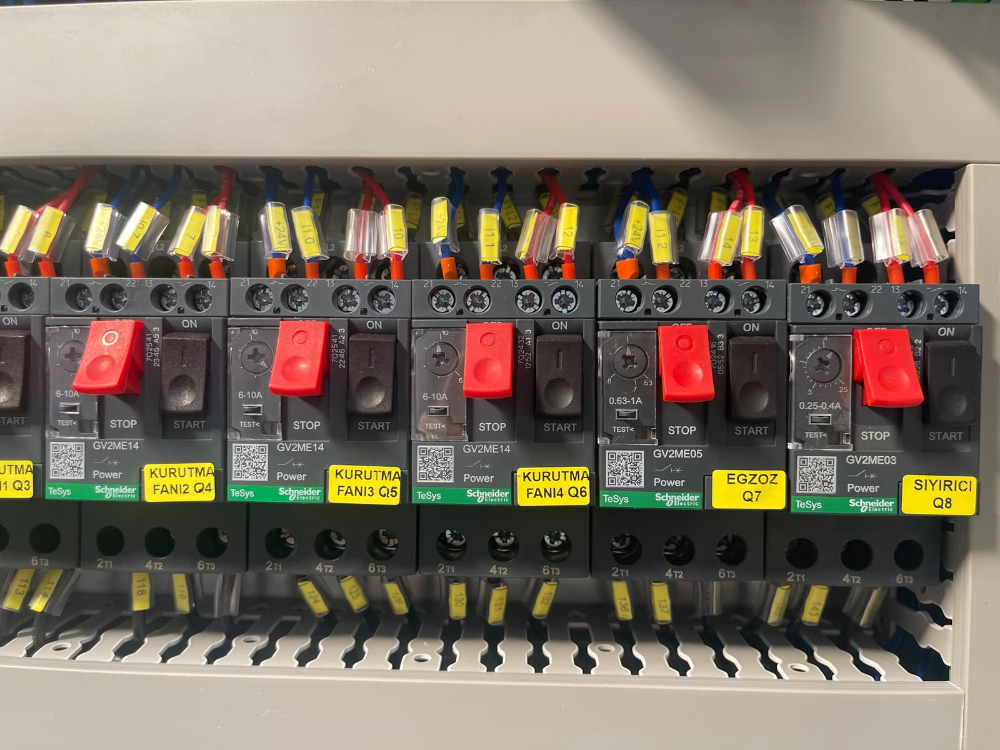

# 3.3. Teknik Özellikler

Bu bölüm, KNV 30 3000 2B makinesinin fiziksel, elektriksel, proses, motor ve ortam teknik verilerini içerir. Tablolardaki değerler proje DATA dosyasından alınmıştır.

---

## 3.3.1. Fiziksel Boyutlar ve Ağırlık

| Parametre | Birim | Değer |
|-----------|:-----:|------:|
| Dış uzunluk (L) | mm | 3770 |
| Dış genişlik (W) | mm | 1730 |
| Dış yükseklik (H) — normal | mm | 2122 |
| Boş ağırlık — kuru | kg | 1300 |
| Çalışma ağırlığı — dolu | kg | 1500 |
| Şase tipi | — | Ayarlanabilir ayak |

Makine, ayarlanabilir ayak sistemi üzerinde terazi ve seviye ayarı yapılabilir şekilde kurulur. Ağırlık merkezi konveyör hattının ortasındadır.

<!-- FOTO: Makine dış boyutları — ön/sağ genel görünüm -->

---

## 3.3.2. Kapasite ve Proses Parametreleri

| Parametre | Değer |
|-----------|-------|
| Proses adım sayısı | 3 |
| Proses adı 1 | Yıkama |
| Proses adı 2 | Durulama |
| Proses adı 3 | Kurutma |
| Döngü süresi — nominal | 900 sn (15 dk) |
| Nominal kapasite | [EKSİK] |
| Maksimum kapasite | Bilinmiyor |
| Minimum kapasite | 730 adet/saat |
| Ürün formatı / ambalaj tipi | Bilinmiyor |
| Ürün boyutu min | Bilinmiyor |
| Ürün boyutu max | Bilinmiyor |
| Ürün ağırlığı min | Bilinmiyor |
| Ürün ağırlığı max | Bilinmiyor |

Nominal ve maksimum kapasite değerleri ile ürün boyut/ağırlık sınırları kullanıcı firma tarafından proses koşullarına göre belirlenir.

<!-- FOTO: Proses bölgeleri — yıkama, durulama, kurutma hat boyunca -->

---

## 3.3.3. Elektrik Özellikleri

| Parametre | Değer |
|-----------|-------|
| Besleme gerilimi | 380 V |
| Besleme frekansı | 50 Hz |
| Faz sayısı | 3 |
| Toplam kurulu güç | 50 kW |
| Toplam kurulu güç — ısıtma dahil | 50 kW |
| Maksimum akım çekişi | 100 A |
| Güç faktörü (cos φ) | 0,9 |
| Kısa devre akımı / ICC gereksinimi | 10 kA |
| Besleme konfigürasyonu | 3P+N+PE |
| Ana şalter — In | 100 A |
| Ana şalter marka | Schneider |
| Toplam sigorta / devre kesici | 100 A |
| UPS / jeneratör gereksinimi | Hayır |

Elektrik beslemesi montaj sırasında 380 V, 50 Hz, trifaze hat ile pano üzerinden sağlanır. Faz yönü faz sıra rölesi üzerinden kontrol edilmelidir.

<!-- FOTO: Elektrik panosu — ana şalter ve besleme etiketi -->

---

## 3.3.4. Motor ve Sürücü Listesi

| Motor | Güç | Devir | Marka | Model |
|-------|-----|-------|-------|-------|
| Konveyör redüktörü motoru | 1,5 kW | 2000 rpm | Siemens | SIMOTICS S-1FL6 |
| Yıkama pompası motoru | 3 kW | 2900 rpm | Lowara | ESHE 40-160/30 |
| Durulama pompası motoru | 1,85 kW | 2900 rpm | GOULDS | GCEA 370/3 |
| Yağ sıyırıcı redüktörü motoru | 0,04 kW | — | FINEX | E1610-40-150-17B-C |
| Egzost fanı motoru | 0,37 kW | 2800 rpm | ENA | ENA 2 |
| 1. Kurutma fanı motoru | 4 kW | 2900 rpm | — | — |
| 2. Kurutma fanı motoru | 4 kW | 2900 rpm | — | — |
| 3. Kurutma fanı motoru | 4 kW | 2900 rpm | — | — |
| 4. Kurutma fanı motoru | 4 kW | 2900 rpm | — | — |

Toplam kurutma fan gücü: **16 kW**. Kurutma fanları marka/model bilgisi DATA dosyasında [EKSİK] olarak bırakılmıştır.

<!-- FOTO: Motor grupları — pompa ve fan tahrik üniteleri -->

---

## 3.3.5. Basınçlı Hava ve Su

| Parametre | Değer |
|-----------|-------|
| Basınçlı hava girişi | 6 bar |
| Su girişi basıncı | 1 bar |
| Su sıcaklığı min / max | +10°C – +70°C |
| Su kalitesi | Şebeke suyu veya arıtılmış su |
| Drain / atık su hattı çap | [EKSİK] |

Montaj bağlantıları: basınçlı hava **3/4"**, su **1/2"**. Pnömatik regülatör basınç ayarı **6 bar**'dır.

<!-- FOTO: Basınçlı hava ve su bağlantı noktaları — etiketli -->

---

## 3.3.6. Ortam Koşulları

| Parametre | Min | Max |
|-----------|-----|-----|
| Çalışma sıcaklığı | +10°C | +30°C |
| Depolama sıcaklığı | +10°C | +30°C |
| Göreceli nem | %30 | %50 |

| Parametre | Değer |
|-----------|-------|
| Koruma sınıfı (IP) | IP55 |
| Gürültü seviyesi | 65 dB(A) |

Makine yalnızca **iç mekan** ortamında kullanılmak üzere tasarlanmıştır.
