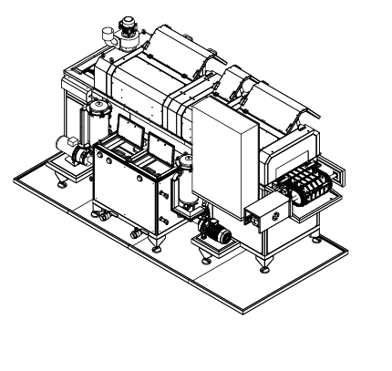
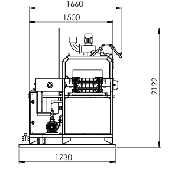
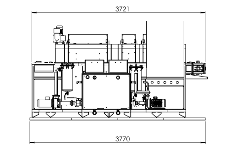
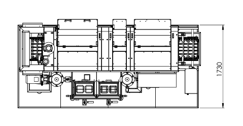
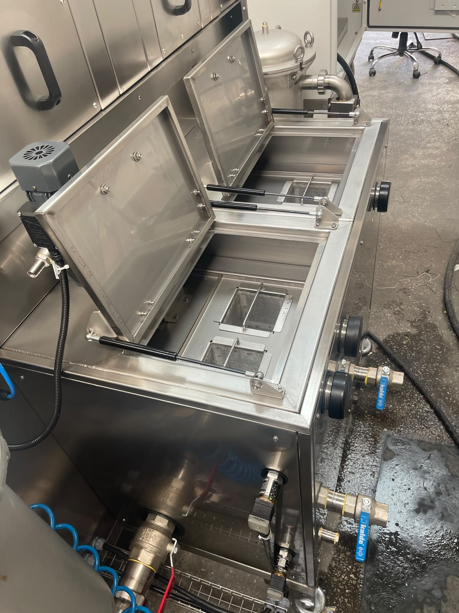

# 3.3 Teknik özellikler

Bu bölüm, **KNV 30 3000 2B** (seri no **1726050**) makinesine ait boyut, ağırlık, kapasite, elektrik, motor, medya bağlantıları ve ortam koşullarını **tek kaynak (SSOT)** olarak toplar. Kurulum (Bölüm 5), ayar (Bölüm 6) ve operasyon (Bölüm 7) bölümlerinde aynı sayısal değerler tekrarlanmaz; ilgili bölümler buraya çapraz referans verir.

---

## 3.3.1 Fiziksel boyutlar ve ağırlık

| Parametre | Birim | Değer |
|-----------|:-----:|------:|
| Dış uzunluk (L) | mm | 3770 |
| Dış genişlik (W) | mm | 1730 |
| Dış yükseklik (H) — normal | mm | 2122 |
| Boş ağırlık — kuru | kg | 1300 |
| Çalışma ağırlığı — dolu | kg | 1500 |
| Şase tipi | — | Ayarlanabilir ayak |

Makine, ayarlanabilir ayak sistemi üzerinde terazi ve seviye ayarı yapılabilir şekilde kurulur. Ağırlık merkezi konveyör hattının ortasındadır; taşıma ve forklift planlaması için bkz. **Bölüm 3.5.4**. Minimum kurulum alanı boyutu **5 m × 3 m** olmalıdır (bkz. **Bölüm 3.5.2**).

<!-- FOTO: Makine dış boyutları — operatör tarafından (sağ) genel görünüm -->

---

## 3.3.2 Kapasite ve proses parametreleri

| Parametre | Değer |
|-----------|-------|
| Proses adım sayısı | 3 |
| Proses adı 1 | Yıkama |
| Proses adı 2 | Durulama |
| Proses adı 3 | Kurutma |
| Döngü süresi — nominal | 900 sn (15 dk) |
| Nominal kapasite | Kullanıcı firma belirler |
| Maksimum kapasite | Kullanıcı firma belirler |
| Minimum kapasite | 730 adet/saat |
| Ürün formatı / ambalaj tipi | Kullanıcı firma belirler |
| Ürün boyutu min | Kullanıcı firma belirler |
| Ürün boyutu max | Kullanıcı firma belirler |
| Ürün ağırlığı min | Kullanıcı firma belirler |
| Ürün ağırlığı max | Kullanıcı firma belirler |

Nominal kapasite ve ürün boyut/ağırlık sınırları kullanıcı firma tarafından proses koşullarına göre belirlenir; parça geometrisi konveyör taşıma kapasitesi ve nozul kapsama alanı ile uyumlu olmalıdır. Reçete ve kapasite yönetimi **Bölüm 8**'de açıklanmıştır.

<!-- FOTO: Proses bölgeleri — yıkama, durulama, kurutma hat boyunca -->

---

## 3.3.3 Elektrik özellikleri

| Parametre | Değer |
|-----------|-------|
| Besleme gerilimi | 380 V |
| Besleme frekansı | 50 Hz |
| Faz sayısı | 3 |
| Toplam kurulu güç | 50 kW |
| Toplam kurulu güç — ısıtma dahil | 50 kW |
| Maksimum akım çekişi | 100 A |
| Güç faktörü (cos φ) | 0,9 |
| Kısa devre akımı / ICC gereksinimi | 10 kA |
| Besleme konfigürasyonu | 3P+N+PE |
| Ana şalter — In | 100 A |
| Ana şalter marka | Schneider |
| Toplam sigorta / devre kesici | 100 A |
| UPS / jeneratör gereksinimi | Hayır |

Elektrik beslemesi montaj sırasında 380 V, 50 Hz, trifaze hat ile pano üzerinden sağlanır. Faz yönü faz sıra rölesi üzerinden kontrol edilmelidir; ters faz tespitinde iki faz değiştirilerek düzeltilir (bkz. **Bölüm 5** — Montaj adımları). Enerji izolasyonu ve LOTO noktası ana şalterdir (bkz. **Bölüm 2.4**).

<!-- FOTO: Elektrik panosu — ana şalter, HMI ve besleme etiketi (EKLENECEK: FOTO-3-3-2-elektrik-besleme.jpg) -->

---

## 3.3.4 Motor ve sürücü listesi

| Motor | Güç | Devir | Marka | Model |
|-------|-----|-------|-------|-------|
| Konveyör redüktörü motoru | 1,5 kW | 2000 rpm | Siemens | SIMOTICS S-1FL6 |
| Yıkama pompası motoru | 3 kW | 2900 rpm | Lowara | ESHE 40-160/30 |
| Durulama pompası motoru | 1,85 kW | 2900 rpm | GOULDS | GCEA 370/3 |
| Yağ sıyırıcı redüktörü motoru | 0,04 kW | 1340 rpm | FINEX | E1610-40-150-17B-C |
| Egzost fanı motoru | 0,37 kW | 2800 rpm | ENA | ENA 2 |
| 1. Kurutma fanı motoru | 4 kW | 2940 rpm | Ölçükontrol | OK 710K37 |
| 2. Kurutma fanı motoru | 4 kW | 2940 rpm | Ölçükontrol | OK 710K37 |
| 3. Kurutma fanı motoru | 4 kW | 2940 rpm | Ölçükontrol | OK 710K37 |
| 4. Kurutma fanı motoru | 4 kW | 2940 rpm | Ölçükontrol | OK 710K37 |

Toplam kurutma fan gücü **16 kW**'dır. Motor koruma ve termik aşırı yük durumları HMI manuel sayfasından izlenebilir (bkz. **Bölüm 3.4.5**).

<!-- FOTO: Pompa ve fan tahrik üniteleri — yıkama/durulama pompaları -->

---

## 3.3.5 Basınçlı hava ve su

| Parametre | Değer |
|-----------|-------|
| Basınçlı hava girişi | 6 bar |
| Su girişi basıncı | 1 bar |
| Su sıcaklığı min / max | +10°C – +70°C |
| Su kalitesi | Şebeke suyu veya arıtılmış su |
| Basınçlı hava ve su bağlantı verileri | Bkz. layout çizimi (**1726050-ALPER-KNV 30 LAYOUT.pdf**) |

Montaj sırasında basınçlı hava **3/4"**, su **1/2"** bağlantıları uygulanır; bağlantı konumları ve çap detayları layout çiziminde verilmiştir (bkz. **Bölüm 3.5**, **Bölüm 13.2**). Pnömatik regülatör basınç ayarı **6 bar**'dır. Su ve hava bağlantısı kurulduktan sonra HMI manuel sayfasındaki **su bilgisi** ve **hava bilgisi** göstergelerinin yeşil yanması beklenir (bkz. **Bölüm 5.5** — Pnömatik dolum testi).

<!-- FOTO: Basınçlı hava ve su bağlantı noktaları — etiketli (EKLENECEK: FOTO-3-3-4-medya-baglantilari.jpg) -->

---

## 3.3.6 Ortam koşulları

| Parametre | Min | Max |
|-----------|-----|-----|
| Çalışma sıcaklığı | +10°C | +30°C |
| Depolama sıcaklığı | +10°C | +30°C |
| Göreceli nem | %30 | %50 |

| Parametre | Değer |
|-----------|-------|
| Koruma sınıfı (IP) | IP55 |
| Gürültü seviyesi | 65 dB(A) |

Makine yalnızca **iç mekan** ortamında kullanılmak üzere tasarlanmıştır. Kurulum alanı minimum etraf boşlukları ve tavan yüksekliği **Bölüm 3.5.2**'de SSOT olarak verilmiştir; amaçlanan kullanım sınırları **Bölüm 3.2**'de özetlenmiştir.

---

**Bölüm 3.3 sonu.** Kontrol elemanları için bkz. **Bölüm 3.4**; yerleşim planı için bkz. **Bölüm 3.5**.
