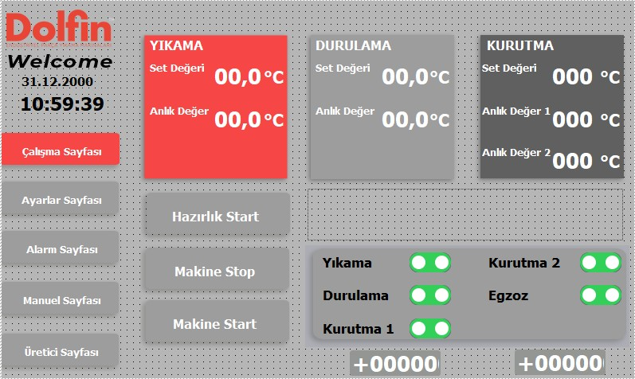
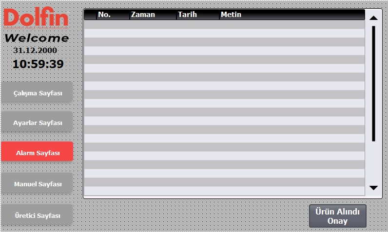

# 3.4 Machine controls

---

## 3.4.1 Control panel — general structure

| Parameter | Value |
|-----------|-------|
| Main control panel location | On electrical panel |
| Panel protection rating (IP) | IP55 |
| Panel dimensions (W × H × D) | 800 × 1200 × 300 mm |
| Main switch location | On electrical panel |
| Main switch | 100 A, Schneider |

The electrical panel houses power distribution, motor protection, automation components (PLC, HMI), and signal lamps.

<!-- PHOTO: Electrical panel — general view, door open -->

---

## 3.4.2 HMI operator interface

| Parameter | Value |
|-----------|-------|
| HMI display size | 7" |
| HMI brand / model | SIMATIC HMI KTP700 Basic PN (6AV2123-2GB03-0AX0) |
| Start / Stop location | Digital button on HMI interface |
| Operator panel languages | Turkish, English, German |
| Password protection | A password is provided on the HMI interface |

The HMI **operating page** provides wash, rinse, drying 1, drying 2, and exhaust options; the operator can switch these functions on/off as required and run the machine. **Manual mode** is not provided.

On the HMI **manual page**, air and water connection status is monitored; after connection is established, the corresponding indication turns **green**.

From the HMI **settings page**, temperature, date/time, and language settings can be configured.

<!-- PHOTO: HMI screen — operating page -->

<!-- PHOTO: HMI screen — manual page (air/water status) -->

---

## 3.4.3 PLC and I/O infrastructure

| Parameter | Value |
|-----------|-------|
| PLC brand / model | SIEMENS SIMATIC S7-1200 |
| PLC CPU model | S7-1200 CPU 1215C DC/DC/DC (6ES7215-1AG40-0XB0) |
| I/O module summary | 36 inputs / 24 outputs |
| Fieldbus / protocol | Profinet |

Encoder / feedback settings are embedded in the PLC program; adjustment shall be performed by the manufacturer.

<!-- PHOTO: PLC modules — internal panel mounting -->

---

## 3.4.4 Operating modes, Start/Stop and emergency Stop

| Parameter | Value |
|-----------|-------|
| Mode selector | Automatic / Maintenance |
| Manual mode | Not provided |
| Step / single-step mode | Not provided |
| Mode change conditions | Not provided |
| Jog / inching buttons | Not provided |

**Maintenance mode:** No dedicated maintenance mode is provided. For maintenance, covers shall be opened only after machine power is isolated; **LOTO procedure** shall be applied when power is isolated.

**Emergency stop locations (4 units):**
1. On electrical panel
2. On the right of the conveyor at machine infeed
3. On the left of the conveyor at machine infeed
4. On the left of the conveyor at machine outfeed

When emergency stop is activated, **every function on the machine stops**. Reset: After releasing the emergency stop button and confirming the physical hazard is cleared, press the reset button on the panel label until the lamp illuminates.

<!-- PHOTO: Emergency stop buttons — infeed and outfeed locations -->

---

## 3.4.5 Signal lamps (stack light)

| Colour | Meaning |
|--------|---------|
| Red | Alarm |
| Yellow | Machine ready for operation |
| Green | Machine running |

The stack light visually communicates the instantaneous machine status to the operator. In alarm conditions, the red lamp illuminates.

<!-- PHOTO: Stack light — on top of machine -->

---

## 3.4.6 Alarm, recipe and remote access

| Function | Behaviour |
|----------|-----------|
| Alarm screen | Alarm screen is available on the HMI interface; stack light illuminates red in alarm conditions |
| Recipe / program storage | No recipe limit applies |
| Trend / log recording duration | [MISSING] |
| Remote access | Yes — Secomea module |

<!-- PHOTO: HMI alarm screen -->

