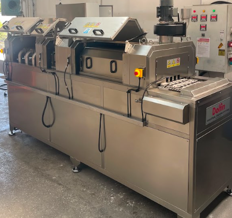

# 3.5 Machine layout

This chapter defines positioning of the machine inside the plant, direction definitions, minimum surrounding clearances, maintenance access and transport restrictions. The installation (Chapter 5) and transport (Chapter 4) chapters take space requirements from here; the same values are not repeated.

**Reference drawing:** machine layout PDF in the delivery package (`1726050-ALPER-KNV 30 LAYOUT.pdf`).

---

## 3.5.1 Direction definitions and operator side

Machine directions, conveyor flow direction and operator access side are used as a common reference in installation, operation and maintenance planning. The following definitions apply in all manual texts:

| Definition | Direction / Location |
|-------|-------------|
| Operator side | Right |
| Feed side (infeed) | Left |
| Discharge side (outfeed) | Right |
| Conveyor flow direction | Left → Right |

Parts are taken onto the conveyor from the left, pass through wash → rinse → drying process zones and leave the line from the right. In this project, infeed and outfeed are performed by **robot**; sufficient manoeuvre allowance shall be left on the feed and discharge sides when planning the robot access area.

The operator accesses the HMI panel, main switch and electrical cabinet from the **right side**. The tower light is in a position visible to the operator on the machine; colour meanings are explained in **Chapter 3.4.10**.

---

## 3.5.2 Minimum surrounding clearances and ceiling height

The following minimum clearances shall be provided in installation-area planning. These values are required for opening maintenance covers, filter access and safe personnel movement; installation shall not be performed in narrower spaces.

| Zone | Minimum clearance |
|-------|----------------|
| Front | 1000 mm |
| Rear | 1000 mm |
| Side (both sides) | 1000 mm |
| Ceiling height | 2500 mm |

| Additional requirement | Value |
|---------------|-------|
| Installation-area minimum size | 5 m × 3 m |
| Floor-flatness tolerance | 0.5 mm/m |
| Floor surface | Hard and flat |

Floor strength shall be at a level that will carry the operating weight of the machine (**1500 kg** — see **Chapter 3.3.1**) and dynamic loads. Level adjustment is performed with adjustable feet; alignment tolerance is **0.5 mm** (see **Chapter 5** — Positioning).

---

## 3.5.3 Maintenance access zones

| Zone | Access |
|-------|--------|
| Machine rear | All covers are removable and accessible |

For periodic maintenance, filter cleaning, pump check and mechanical interventions, internal components are accessed by removing the **covers at the rear of the machine**. Covers are monitored by an **RFID safety sensor**; the machine stops when a cover is opened. Before maintenance the machine shall be stopped, the main switch shall be turned off and the **LOTO procedure** shall be applied (see **Chapter 2.4**). The RFID safety sensor must not be bypassed.

Daily pre-filter cleaning and weekly tank/bag-filter maintenance are performed via these access zones (see **Chapter 9** and **Chapter 10**).

---

## 3.5.4 Transport, forklift and centre of gravity

| Parameter | Value / Note |
|-----------|-------------|
| Crane use in transport | Must not be used under any circumstances |
| Forklift transport | Profiles under the machine shall be used |
| Forklift fork entry | Yes |
| Centre of gravity | Middle of the machine conveyor |

A crane **must not be used under any circumstances** for machine transport; there is no lifting point or slinging equipment. In forklift transport the **transport profiles** under the machine shall be used; fork tips shall be seated fully into the profile channels. During transport there shall be no moisture and corrosive substances in the environment (see **Chapter 4** — Storage conditions).

The centre of gravity is at the middle of the conveyor line; unbalanced loading of the machine during forklift manoeuvre creates a tip-over risk. Empty weight is **1300 kg** (see **Chapter 3.3.1**).

---

## 3.5.5 Layout of safety elements

Layout of emergency-stop buttons, RFID-sensored covers and the tower light is shown on the layout drawing. Emergency-stop locations:

| No. | Location |
|-----|-------|
| 1 | On the electrical cabinet |
| 2 | On the right of the conveyor at machine infeed |
| 3 | On the left of the conveyor at machine infeed |
| 4 | On the left of the conveyor at machine outfeed |

When emergency stop is pressed, all functions stop. The reset procedure and recommissioning conditions are given in **Chapter 2.5**; steps are not repeated in this chapter.

The number of safety doors / fixed barriers is zero; the machine safety category is **Cat. 3** (EN ISO 13849-1). There is no light curtain (see **Chapter 2.1.3**).

---

For technical dimension and weight values see **Chapter 3.3**; for transport procedures see **Chapter 4**.
