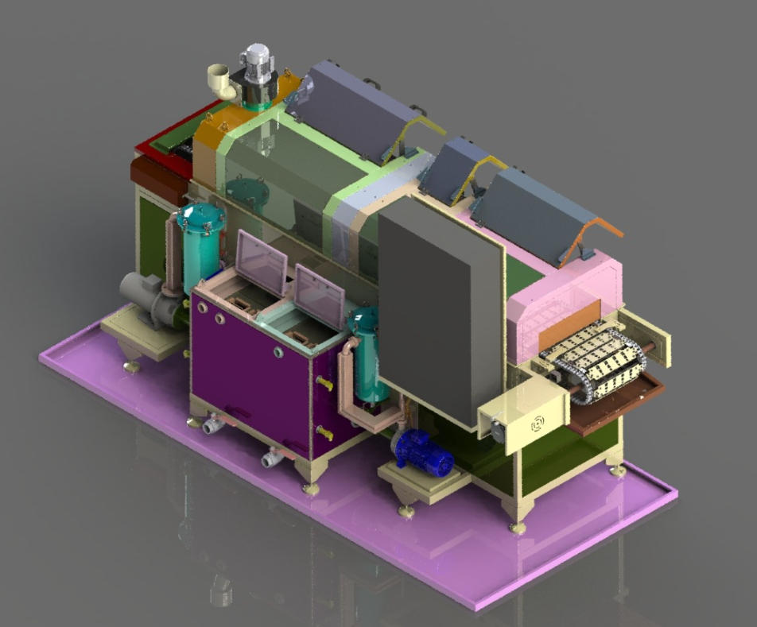

# 3. GENEL BAKIŞ

**KNV 30 3000 2B** (model kodu **KNV-30**, seri no **1726050**, müşteri **ALPER ÖZLEM IDEA**), endüstriyel parça yüzeylerinde biriken yağ ve proses kirinin giderilmesi amacıyla tasarlanmış, konveyörlü ve **iki banyolu** (yıkama + durulama) bir parça yıkama makinesidir. Bu bölüm, operatör, bakım ve kurulum personelinin makineyi bütünsel olarak tanıması, proses sınırlarını ve teknik çerçeveyi kavraması için düzenlenmiştir; ayrıntılı teknik değerler ilgili alt bölümlerde **tek kaynak (SSOT)** olarak verilmiştir.

Makine, parçaların **konveyör hattı** üzerinde ilerleyerek **yıkama → durulama → kurutma** proseslerinden sırasıyla geçmesini sağlar. Besleme **sol**, boşaltma **sağ**, operatör tarafı **sağ** yöndedir. Bu proje kapsamında parça giriş ve çıkışı **robot** ile gerçekleştirilir; makine **7/24 otomatik** çalışacak şekilde hat içine entegre edilmiştir. Nominal döngü süresi **900 saniye** (15 dakika) olarak tanımlanmıştır.

Makinenin ana modülleri şunlardır: konveyör, yıkama pompası, durulama pompası, yağ sıyırıcı, kurutma fanları, egzost fanı, elektrik panosu, HMI, PLC, ana şalter ve koruma elemanları. Modüllerin işlevleri ve birbirleriyle ilişkisi **Bölüm 3.1**'de; amaçlanan kullanım sınırları **Bölüm 3.2**'de; boyut, kapasite, elektrik ve motor verileri **Bölüm 3.3**'te; kontrol ve HMI yapısı **Bölüm 3.4**'te; yerleşim ve alan gereksinimleri **Bölüm 3.5**'te açıklanmıştır.

---

## Bölüm içeriği

| Bölüm | Başlık | Konu |
|-------|--------|------|
| **3.1** | Makine tanımı ve sistematik yapı | Proses konsepti, konveyör, banyolar, kurutma, otomasyon altyapısı |
| **3.2** | Amaçlanan kullanım | İşlenebilir parça tipleri, yasak kullanımlar, ortam ve personel gereksinimleri |
| **3.3** | Teknik özellikler | Boyut/ağırlık, kapasite, elektrik, motor listesi, medya bağlantıları (SSOT) |
| **3.4** | Makine kontrolleri | Elektrik panosu, HMI, PLC, start/stop, sinyal lambaları, alarm |
| **3.5** | Makine yerleşim planı | Yön tanımları, etraf boşlukları, bakım erişimi, taşıma kısıtları |

---

## Makine özeti

| Parametre | Değer |
|-----------|-------|
| Sipariş / seri no | 1726050 |
| Model | KNV-30 — KNV 30 3000 2B |
| Makine tipi | Konveyör — iki banyolu endüstriyel parça yıkama |
| Proses akışı | Yıkama → Durulama → Kurutma |
| Nominal döngü süresi | 900 sn (15 dk) |
| Besleme / boşaltma | Sol / Sağ (robot entegrasyonu) |
| Operatör tarafı | Sağ |
| Çalışma modu | Tam otomatik — 7/24 |
| Koruma sınıfı | IP55 |

Detaylı teknik tablolar, bileşen marka/model bilgileri ve yerleşim çizimi ilgili alt bölümlerde verilmiştir. Genel yerleşim planı için bkz. **1726050-ALPER-KNV 30 LAYOUT.pdf** (Bölüm 3.5).

<!-- FOTO: KNV 30 3000 2B — bölüm genel görünüm -->

