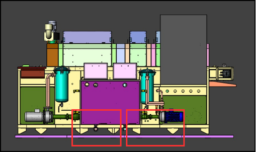

# 4.1 Transport und Versand

Die Maschine wird in **Container**-Verpackung versendet. Das montierte Transportgewicht beträgt **1300 kg**; Transport demontierter Teile ist in diesem Projekt nicht vorgesehen — während des Transports wird kein Modul getrennt. Das Hebegerät ist eine **Gabelstaplergabel**; an der Maschine **ist** eine Gabelstapler-Gabeleinfahrt vorhanden (untere Transportprofile). Transportfixierung und -sicherung erfolgen durch das kontrollierte Hebe-/Absenkverfahren mit Gabelstapler; ein separater Traversenbalken, Anschlagmittel oder Kran wird nicht verwendet.

Außenabmessungen sind bei der Planung des Installationsbereichs zu berücksichtigen (siehe **Kapitel 3.3.1**). Der Schwerpunkt liegt in der Mitte der Förderstrecke; die Gabelposition ist entsprechend einzustellen (siehe **Kapitel 3.5.4**).

---

## 4.1.1 Anforderungen vor dem Transport

Vor Beginn des Transports müssen die folgenden Bedingungen erfüllt sein. Den Transport anhalten, wenn eine Bedingung fehlt; nicht fortfahren, bis sie vollständig ist.

| Parameter | Wert / Anforderung |
| :--- | :--- |
| Transportmittel | Gabelstapler (Kran verboten) |
| Transportgewicht — montiert | 1300 kg |
| Transportgewicht — demontiertes max. Teil | 1300 kg (Teile werden nicht entfernt) |
| Verpackungstyp | Container |
| Hebegerät | Gabelstaplergabel |
| Gabelstapler-Gabeleinfahrt | Ja — untere Profile |
| Transporttemperatur | +10°C – +30°C |
| Umgebung | Feuchtigkeit und korrosive Stoffe dürfen nicht vorhanden sein |
| Max. Transporthöhe (See/Land) | Maschinen-Außenhöhe **2122 mm** (siehe **Kapitel 3.3.1**). Eine feste Transporthöhengrenze ist nicht definiert; die Route ist nach Höhe von offenem Fahrzeug, Container und Eingangsdurchfahrt zu planen |

Der Gabelstaplerfahrer muss ein gültiges Zertifikat besitzen. Die sichere Arbeitslast (SWL) des Gabelstaplers muss das Transportgewicht **1300 kg** abdecken. Türhöhe, Rampenneigung und Wenderadius auf dem Transportweg müssen zu den Außenabmessungen der Maschine (**3770 × 1730 × 2122 mm**) passen (siehe **Kapitel 3.3.1**).

**VORSICHT — Kranverbot:** An der Maschine ist kein Kranhebepunkt und keine Anschlagausrüstung vorhanden. Kranverwendung erzeugt Fahrgestellverformung, Schrankschaden und Kippgefahr.

---

## 4.1.2 Vorbereitung vor dem Transport

1. Transportroute und Zielpunkt im Voraus festlegen; Hindernisse, Neigung und Bodentragfähigkeit prüfen.
2. Bestätigen, dass die **Elektro-, Wasser- und Druckluft**-Anschlüsse der Maschine zur Anlage getrennt sind.
3. Prüfen, dass der Hauptschalter in Stellung **OFF (0)** ist.
4. Vor Langstreckentransport oder Lagerung die Prozessflüssigkeit in Wasch- und Spültanks entleeren; Transport mit vollem Tank verändert den Schwerpunkt und erzeugt Kippgefahr (siehe **Kapitel 10.1.5**).
5. Prüfen, dass kein hängendes Kabel, kein Schlauch und kein loses Teil verblieben ist.
6. Prüfen, dass die Containerverpackung transportgeeignet, unbeschädigt und die Sicherung ausreichend ist.
7. Gabelstaplerfahrer und Einweiser (falls erforderlich) zuweisen.

---

## 4.1.3 Öffnen der Containerverpackung

Wenn die Maschine im Installationsbereich ankommt, wird die Verpackung kontrolliert geöffnet, um Transportschäden zu vermeiden:

1. Vor dem Öffnen der Verpackung äußere Schäden (Quetschung, Feuchtigkeit, Kippspuren) prüfen; bei Abweichung fotografieren und der Anlagenleitung melden.
2. Verpackungselemente (Schrauben, Bänder, Eckenschutz) ohne Beschädigung des Maschinengehäuses entfernen.
3. Vor dem Anheben der Maschine mit dem Gabelstapler bestätigen, dass untere Profile und Füße von Verpackungselementen frei sind.
4. Verpackungsabfälle gemäß den Recyclingregeln der Anlage trennen.

---

## 4.1.4 Gabelstapler-Transportverfahren

**WARNUNG — Kippen und Quetschen:** Falsche Gabelposition, übermäßige Geschwindigkeit oder ungleichmäßige Belastung können beim Transport zum Kippen der Maschine oder zum Quetschen von Personal führen. Die Gabeln nur in die unteren Transportprofile setzen; den Schwerpunkt zur Fördermitte ausrichten (siehe **Kapitel 3.5.4**).

1. Die Gabelstaplergabeln an den **unteren Transportprofilen** der Maschine ausrichten; keine Last auf Außenverkleidung, Elektroschrank, Rohrleitungen oder Lüfterkanäle aufbringen.
2. Gabelbreite und -position nach dem **Schwerpunkt** des Förderbands einstellen.
3. Die Maschine **10–15 cm** vom Boden anheben und eine Gleichgewichtsprobe durchführen; bei Schräglage, Vorder-/Hinter-Ungleichgewicht oder Gabelrutschen langsam absenken und die Position korrigieren.
4. Die Last während des gesamten Transports niedrig halten; keine plötzlichen Wendungen, Rückwärtsmanöver und hartes Bremsen ausführen.
5. Einen Einweiser verwenden, wenn das Sichtfeld des Gabelstaplers eingeschränkt ist; kein Personal unter der hängenden Last und auf der Lastbewegungsbahn halten.
6. Die Maschine am Zielpunkt langsam absenken; prüfen, dass alle **verstellbaren Füße** gleichmäßig auf dem Boden aufsitzen.
7. Nach dem Absetzen im Installationsbereich zum Montageverfahren in **Kapitel 5** übergehen.

**Erwartetes Ergebnis:** Die Maschine muss am Zielpunkt ausgewogen und unbeschädigt positioniert sein; die Füße müssen vollflächig den Boden berühren.

**Abweichende Situation:** Wenn Kippen, Riss oder Schrankschaden festgestellt wird, die Maschine nicht betreiben; den Herstellerservice kontaktieren (siehe **Kapitel 1.3**).

---

## 4.1.5 Prüfung nach dem Transport

1. Fahrgestell, Schrank, Klappen und Rohrleitungen auf sichtbare mechanische Schäden prüfen.
2. Bestätigen, dass Füße und untere Profile keine Verformung zeigen.
3. Prüfen, dass die Elektroschranktür geschlossen und trocken ist.
4. Wenn kein Schaden vorliegt, zur Installation übergehen (siehe **Kapitel 5.1**); wenn Schaden vorliegt, aufzeichnen und eine Servicemeldung erstellen.

Boden- und Umgebungsabstandsanforderungen des Installationsbereichs stehen in **Kapitel 3.5.2**.
