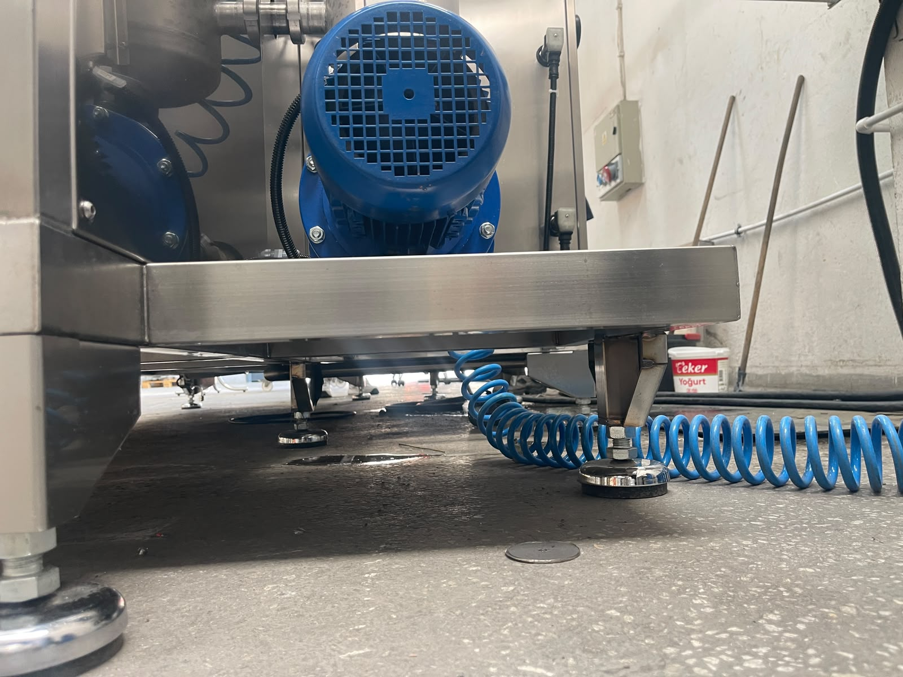

# 5.1 Makine montajı

Montaj tahmini **1 gün** sürer ve **1 kişilik** ekip ile gerçekleştirilir. Makine **montajlı** halde (**1300 kg**) taşınır; kurulum sırasında modül sökülmez. Taşıma ve indirme **Bölüm 4.1** forklift prosedürüne göre yapılır; vinç kullanılmaz.

Bu bölüm montajın ana adım sırasını verir. Konumlandırma ayrıntıları **Bölüm 5.2**'de; bağlantı prosedürleri **Bölüm 5.3**'te; güvenlik ve doğrulama testleri **Bölüm 5.4** ve **5.5**'te detaylandırılmıştır.

---

## 5.1.1 Montaj ön hazırlık

Montaja başlamadan önce aşağıdaki koşullar sağlanmalıdır:

| Parametre | Gereksinim |
|-----------|------------|
| Montaj alanı min. boyut | 5 m × 3 m |
| Zemin düzgünlük toleransı | 0,5 mm/m |
| Zemin mukavemeti | Sert ve düz yüzey |
| Gerekli ekipman | Forklift |
| Ambalaj tipi | Konteyner |
| Ortam sıcaklığı | +10°C – +30°C |
| Ortam | Nem ve korozif madde olmamalı |

Kurulum alanı etraf boşlukları ve tavan yüksekliği **Bölüm 3.5.2**'de SSOT olarak verilmiştir. Tesisat hazırlığı: **6 bar** basınçlı hava (3/4"), **1 bar** su (1/2"), **380 V / 50 Hz / 3 faz** elektrik hattı (50 kW / 100 A — bkz. **Bölüm 3.3.3**, **3.3.5**).

**UYARI — Elektrik:** 380 V trifaze besleme bağlantısı yalnızca yetkili elektrik personeli tarafından yapılmalıdır.

---

## 5.1.2 Montaj adımları — özet

Montaj aşağıdaki sırayla gerçekleştirilmelidir:

| Adım | İşlem | Detay bölüm |
|:----:|-------|-------------|
| 1 | Makine kurulacağı bölgeye getirildi ve indirildi | Bölüm 4.1.4 |
| 2 | Makine ambalajı soyuldu | Bölüm 4.1.3 |
| 3 | Makine zemine oturtuldu; ayaklar teraziye alındı | Bölüm 5.2.3 |
| 4 | Basınçlı hava bağlantısı yapıldı | Bölüm 5.3.1 |
| 5 | Su bağlantısı yapıldı | Bölüm 5.3.2 |
| 6 | Trifaze elektrik beslemesi bağlandı | Bölüm 5.3.3 |
| 7 | Makine elektriği pano üzerinden açıldı | Bölüm 5.3.4 |
| 8 | Faz yönü kontrol edildi ve düzeltildi | Bölüm 5.3.4 |
| 9 | Kurulum testleri tamamlandı; makine kullanıma hazır | Bölüm 5.4, 5.5 |

> **Not:** DATA dosyasında su ve elektrik bağlantıları aynı adım numarası altında listelenmiştir. Bu kılavuzda prosedür netliği için su (Adım 5) ve elektrik (Adım 6) ayrılmıştır.

---

## 5.1.3 Adım 3 — Teraziye alma

Makine **ayarlanabilir ayak** sistemi üzerine oturtulur. Ayaklar, makinenin **terazide** olacak şekilde ayarlanmalıdır. Hizalama toleransı **0,5 mm**'dir (bkz. **Bölüm 5.2.3**).

**Beklenen sonuç:** Su terazisi ile her iki eksende makine dengeli; ayaklar zemine eşit temas eder.

<!-- FOTO: Ayarlanabilir ayaklar — seviye ayarı (EKLENECEK: FOTO-5-1-1-ayarlanabilir-ayak.jpg) -->

---

## 5.1.4 Adım 4–6 — Medya ve elektrik bağlantıları

Bağlantı prosedürleri **Bölüm 5.3**'te adım adım verilmiştir. Özet:

| Medya | Basınç / gerilim | Bağlantı | SSOT |
|-------|------------------|----------|------|
| Basınçlı hava | 6 bar | 3/4" | Bölüm 3.3.5 |
| Su | 1 bar | 1/2" | Bölüm 3.3.5 |
| Elektrik | 380 V, 50 Hz, 3 faz, 50 kW / 100 A | 3P+N+PE | Bölüm 3.3.3 |

Bağlantı sonrası HMI **Manuel Sayfası**'nda hava ve su bilgisi **yeşil** yanmalıdır (bkz. **Bölüm 3.4.5**).

---

## 5.1.5 Adım 7–8 — Devreye alma ve faz kontrolü

1. Trifaze besleme panoya bağlandıktan sonra makine elektriği **pano üzerinden** açılır.
2. **Faz sıra rölesi** üzerinden faz yönü kontrol edilir.
3. Faz yönü ters ise **iki faz değiştirilerek** düzeltilir.

Motorlar tek yönde çalışacak şekilde tasarlanmıştır; yanlış faz sırası pompa yön hatasına yol açar (bkz. **Bölüm 6.3** — Motor yönü / faz kontrolü).

<!-- FOTO: Faz sıra rölesi — pano içi (EKLENECEK: FOTO-5-1-5-faz-sira-role.jpg) -->

---

## 5.1.6 Adım 9 — Montaj tamamlama

Adım 9'da makine **kullanıma hazır** kabul edilmeden önce aşağıdaki testler tamamlanmalıdır:

| Test | Bölüm |
|------|-------|
| Güvenlik fonksiyon testleri | 5.4 |
| Kurulum doğrulama ve boş koşu (15 dk) | 5.5 |
| İletişim doğrulama (Profinet, I/O) | 5.6 |

Operasyona geçmeden önce **Bölüm 6** OEM ayarlarının gözden geçirilmesi önerilir.

<!-- FOTO: Montaj tamamlandı — tepe lambası sarı (EKLENECEK: FOTO-5-1-6-montaj-tamamlandi.jpg) -->

