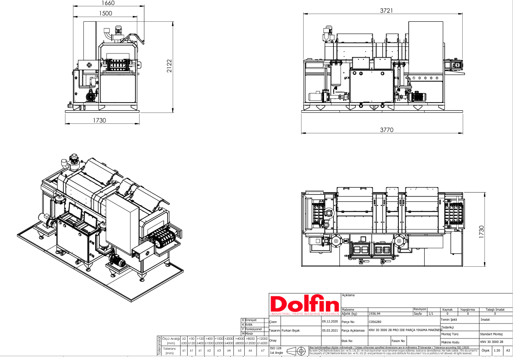

# 5.2. Machine Positioning

Positioning operations are performed within **Step 3** of Section 5.1 assembly steps; they are detailed in this section.

---

## 5.2.1. Installation Area Requirements

Before placing the machine, the installation area shall meet the following conditions:

| Parameter | Requirement |
|-----------|-------------|
| Minimum assembly area size | 5 m × 3 m |
| Floor flatness tolerance | 0.5 mm/m |
| Floor strength | Floor surface shall be hard and level |
| Minimum clearance — front | 1000 mm |
| Minimum clearance — rear | 1000 mm |
| Minimum clearance — sides | 1000 mm |
| Minimum ceiling height | 2500 mm |

Reference layout plan: **1726050-ALPER-KNV 30 LAYOUT.pdf**

<!-- PHOTO: Installation area plan — clearances marked -->

---

## 5.2.2. Orientation Definitions and Placement

The machine shall be positioned according to the following orientations:

| Definition | Direction |
|------------|-----------|
| Operator side | Right |
| Feed side (infeed) | Left |
| Discharge side (outfeed) | Right |
| Conveyor flow direction | Left → Right |

Parts are loaded from the left and removed from the right. The HMI panel and electrical panel are accessible from the operator side (right). A crane shall **not be used under any circumstances** when transporting the machine; profiles under the machine shall be used for forklift transport.

| Parameter | Value |
|-----------|-------|
| Centre of gravity | Midpoint of machine conveyor |
| Transport weight (assembled) | 1300 kg |

<!-- PHOTO: Machine orientation — feed left, discharge right -->

---

## 5.2.3. Levelling and Alignment

| Parameter | Value |
|-----------|-------|
| Levelling mechanism | Adjustable feet |
| Alignment tolerance | 0.5 mm |

### Positioning procedure

1. The machine is brought to its final position with a forklift and placed on the floor.
2. **Adjustable feet** are used to set the machine **level**.
3. Alignment tolerance shall not exceed **0.5 mm**.
4. Check both axes with a spirit level or equivalent measuring tool.
5. If deviation is detected, adjust foot heights and repeat measurement.

Mechanical installation test check: *Is the machine level?*

<!-- PHOTO: Adjustable foot — levelling detail -->

---

## 5.2.4. Maintenance Access

Care shall be taken not to obstruct maintenance access zones during positioning:

| Zone | Access |
|------|--------|
| Rear of machine | All covers are removable and accessible |

A minimum clearance of **1000 mm** shall be maintained at the rear of the machine.

<!-- PHOTO: Rear of machine — maintenance covers and access clearance -->

