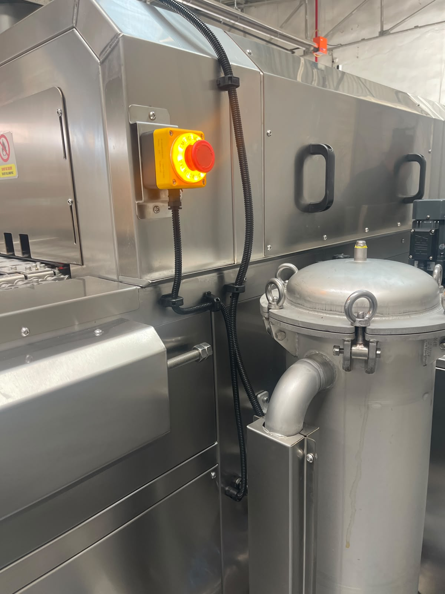

# 5.2 Makine konumlandırma

Konumlandırma, makinenin kurulum alanındaki nihai konumunu, yönünü ve seviyesini belirler. İşlemler **Bölüm 5.1 Adım 3** kapsamında uygulanır; bu bölümde detaylandırılır. Yanlış konumlandırma robot erişimini, bakım kapak açılımını ve konveyör hizasını olumsuz etkiler.

Alan gereksinimleri (etraf boşlukları, tavan yüksekliği, yön tanımları) **Bölüm 3.5**'te verilmiştir; burada kurulum prosedürü odaklı açıklanır.

---

## 5.2.1 Kurulum alanı gereksinimleri

Makine yerleştirilmeden önce kurulum alanı aşağıdaki koşulları karşılamalıdır:

| Parametre | Gereksinim | Referans |
|-----------|------------|------|
| Montaj alanı min. boyut | 5 m × 3 m | Bölüm 3.5 |
| Zemin düzgünlük toleransı | 0,5 mm/m | Bölüm 3.5 |
| Zemin mukavemeti | Sert ve düz yüzey | Bölüm 3.5.2 |
| Minimum etraf boşluğu | Ön, arka, yan: 1000 mm | Bölüm 3.5.2 |
| Minimum tavan yüksekliği | 2500 mm | Bölüm 3.5.2 |

Referans yerleşim planı teslim paketindeki makine layout PDF'dir (bkz. **Bölüm 3.5**).

---

## 5.2.2 Yön tanımları ve yerleşim

Makine aşağıdaki yönlere göre konumlandırılmalıdır (bkz. **Bölüm 3.5.1**):

| Tanım | Yön |
|-------|-----|
| Operatör tarafı | Sağ |
| Besleme tarafı (giriş) | Sol |
| Boşaltma tarafı (çıkış) | Sağ |
| Konveyör akış yönü | Sol → Sağ |

Parçalar sol taraftan yüklenir, sağ taraftan alınır. HMI paneli ve elektrik panosu operatör tarafında (sağ) erişilebilir konumdadır. Bu projede giriş/çıkış **robot** ile yapılır; robot manevra alanı planlanırken besleme ve boşaltma taraflarında yeterli boşluk bırakılmalıdır.

Forklift ile yerleştirme **Bölüm 4.1.4** prosedürüne göre yapılır; ağırlık merkezi konveyör ortasındadır (bkz. **Bölüm 3.5.4**).

---

## 5.2.3 Seviye ayarı ve hizalama

| Parametre | Değer |
|-----------|-------|
| Seviye ayar mekanizması | Ayarlanabilir ayaklar |
| Hizalama toleransı | 0,5 mm |

### Konumlandırma prosedürü

1. Makine forklift ile nihai konumuna getirilir ve zemine oturtulur (bkz. **Bölüm 4.1.4**).
2. **Ayarlanabilir ayaklar** kullanılarak makine **terazide** olacak şekilde ayarlanır.
3. Su terazisi veya eşdeğer ölçüm aleti ile her iki eksende kontrol yapılır.
4. Hizalama toleransı **0,5 mm**'yi aşmamalıdır; sapma varsa ayak yükseklikleri ayarlanır ve ölçüm tekrarlanır.
5. Tüm ayakların zemine eşit temas ettiğini doğrulayın.

**Beklenen sonuç:** Makine terazide; konveyör hattı hedef hat hizası ile uyumlu.

**Anormal durum:** Zemin toleransı aşılıyorsa zemin düzeltmesi yapılmadan operasyona geçmeyin.

Mekanik kurulum test sorusu: *Makine terazide mi?* (bkz. **Bölüm 5.5.1**)

---

## 5.2.4 Bakım erişimi

Konumlandırma sırasında bakım erişim bölgelerinin engellenmemesine dikkat edilmelidir (bkz. **Bölüm 3.5.3**):

| Bölge | Gereksinim |
|-------|------------|
| Makine arkası | Kapakların tamamı sökülebilir ve erişilebilir |
| Arka minimum boşluk | 1000 mm |

Makine duvara veya ekipmana çok yakın konumlandırılırsa filtre bakımı ve tank müdahalesi güvenli yapılamaz.

