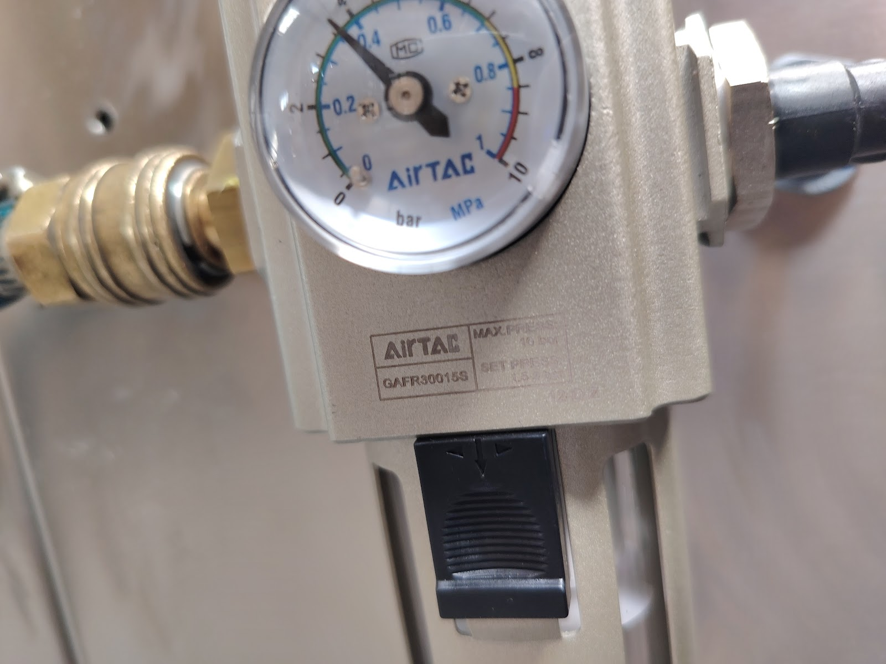
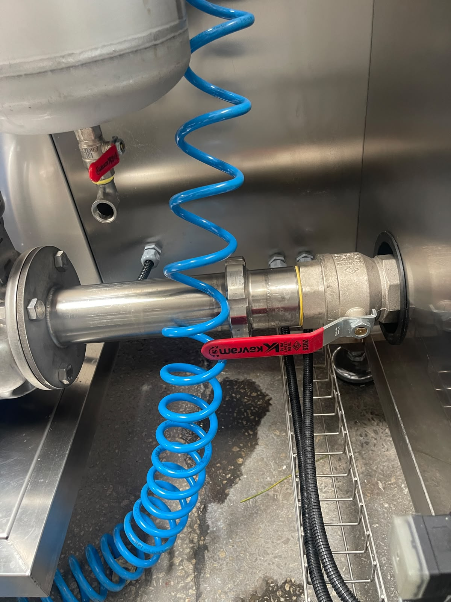
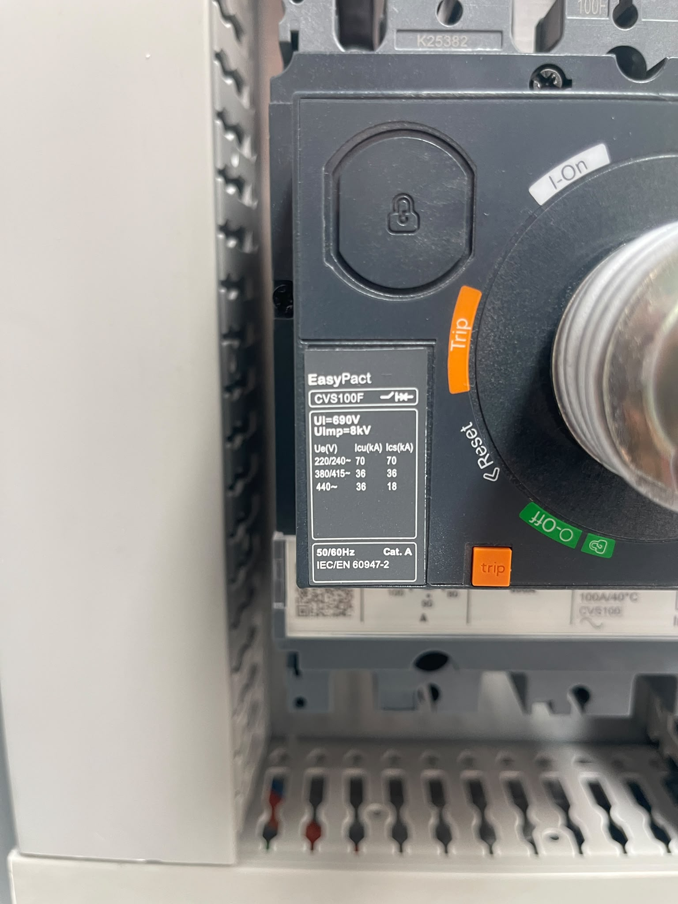

# 5.3 System connections and commissioning

Media and electrical connections are carried out under **Chapter 5.1 Steps 4–8**. Technical connection values are given in the **Chapter 3.3.3** (electrical) and **Chapter 3.3.5** (air/water) tables; this section defines the installation procedure.

There is no hydraulic system. There is no vacuum connection.

---

## 5.3.1 Compressed-air connection

| Parameter | Value (Chapter 3.3.5) |
|-----------|---------------------------|
| Compressed-air inlet | 6 bar |
| Connection | 3/4" |
| Regulator setting | 6 bar |

### Connection procedure

1. Connect the site compressed-air line to the machine inlet (3/4").
2. Set the pneumatic regulator to **6 bar** (see **Chapter 6.5**).
3. Open the HMI **Manual Page**.
4. Wait until the **air status** indication turns **green**.

**Expected result:** Air status green on the HMI manual page.

**Abnormal condition:** If the indication stays red, check pressure, connection seal and regulator setting.

---

## 5.3.2 Water connection

| Parameter | Value (Chapter 3.3.5) |
|-----------|---------------------------|
| Water inlet pressure | 1 bar |
| Connection | 1/2" |
| Water temperature | +10°C – +70°C |
| Water quality | Mains water or treated water |

### Connection procedure

1. Connect the site water line to the machine inlet (1/2").
2. Verify that water pressure is **1 bar**.
3. Open the HMI **Manual Page**.
4. Wait until the **water status** indication turns **green**.

**Expected result:** Water status green on the HMI manual page.

**Abnormal condition:** If filling does not occur, check that the automatic-fill water inlet valve is open (see **Chapter 7.2** — Commissioning prerequisites).

---

## 5.3.3 Electrical connection

Electrical supply values are given in **Chapter 3.3.3** — Electrical specifications table. Minimum installation supply: **380 V, 50 Hz, 3-phase, 3P+N+PE, 50 kW / 100 A, ICC 10 kA**.

**DANGER — Electric shock:** Work on live lines is performed only by authorised personnel and with a lockout procedure. Before connection, the main switch must be in the **OFF** position.

### Connection procedure

1. Connect the three-phase supply line to the panel incoming terminals in **3P+N+PE** configuration.
2. Verify that the earth connection is complete.
3. Check that the main switch (**100 A**, Schneider) and protective devices match **Chapter 3.3.3** values.
4. Have authorised electrical personnel carry out tightness and insulation tests on the connections.

---

## 5.3.4 Commissioning and phase check

Phase sequence is critical for pump and fan direction; reverse phase can cause motors to run backwards and process failure.

### Commissioning procedure

| Seq. | Action |
|:----:|-------|
| 1 | Three-phase supply line connected to the panel |
| 2 | Main switch set to **ON** — machine power switched on at the panel |
| 3 | Phase rotation checked on the **phase-sequence relay** |
| 4 | If phase rotation is reversed, main switch **OFF**; authorised electrical personnel swapped **two phases**; switch switched on again |

### Electrical commissioning test checklist

| Check | Expected result |
|---------|----------------|
| Does the phase-protection relay provide output? | Yes |
| Is there power on the machine? | Yes |
| Does the machine stop when emergency stop is pressed? | Yes |

Emergency-stop test steps are in **Chapter 5.4.1**; the reset procedure is in **Chapter 2.5**.

---

## 5.3.5 Connection completion checklist

| # | Check | Status |
|---|---------|:-----:|
| 1 | Compressed-air connection made (6 bar, 3/4") | ☐ |
| 2 | Air status green on HMI manual page | ☐ |
| 3 | Water connection made (1 bar, 1/2") | ☐ |
| 4 | Water status green on HMI manual page | ☐ |
| 5 | Three-phase electrical connection made (380 V, 50 Hz) | ☐ |
| 6 | Phase rotation verified | ☐ |
| 7 | Power switched on at the panel | ☐ |
| 8 | Phase-protection relay providing output | ☐ |

After connections are complete, proceed to the **Chapter 5.4** and **5.5** tests.

