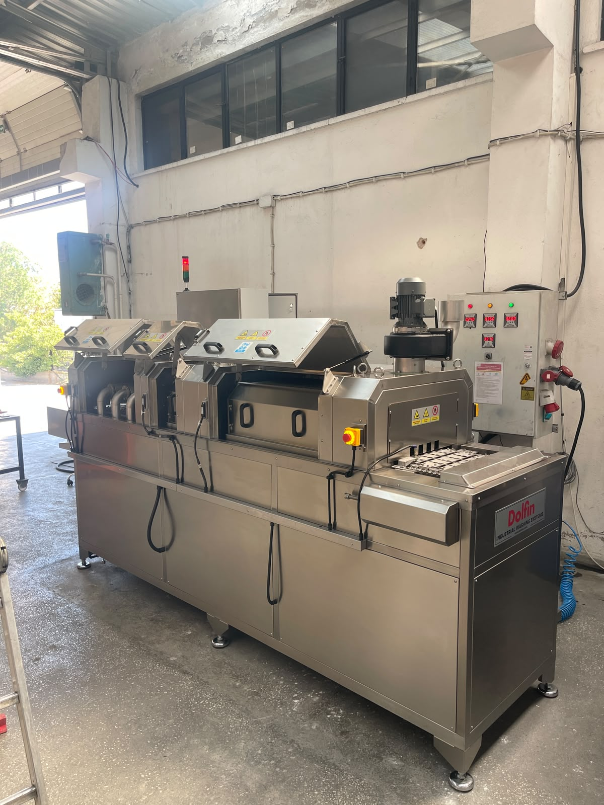

# 5.4. Sicherheitssystem-Tests

Stop-Kategorie der Maschine: **Kat. 3**. Ein **RFID-Sicherheitssensor** ist an der Maschine installiert. **Keine Lichtschranke** vorhanden. Anzahl Schutz Türen / Barrieren: **0**.

---

## 5.4.1. Not-Halt-Test

An der Maschine befinden sich insgesamt **4** Not-Halt-Taster:

| # | Position |
|---|----------|
| 1 | Am Elektroschrank |
| 2 | Rechts am Förderband am Maschineneinlauf |
| 3 | Links am Förderband am Maschineneinlauf |
| 4 | Links am Förderband am Maschinenauslauf |

### Testverfahren

Für jeden Not-Halt-Taster einzeln:

1. Bei laufender oder betriebsbereiter Maschine Not-Halt-Taster betätigen.
2. Prüfen, dass **jede Funktion der Maschine stoppt**.
3. Prüfen, dass das Signalelement **rot** leuchtet.
4. Not-Halt-Taster freigeben; sicherstellen, dass die Gefahr behoben ist.
5. **Reset-Taste** am Schranketikett drücken, bis die Leuchte aufleuchtet.
6. Maschine in Normalzustand zurückführen.

| Prüfung | Erwartetes Ergebnis |
|---------|---------------------|
| Stoppt die Maschine bei Not-Halt? | Ja — jede Funktion stoppt |

Not-Halt-Testperiode: **monatlich** wiederholen.

<!-- FOTO: Not-Halt-Taster — 4 Stellen -->

<!-- FOTO: Reset-Taste — am Schranketikett -->

---

## 5.4.2. RFID-Sicherheitssensor-Test

| Parameter | Wert |
|-----------|------|
| Sensortyp | RFID-Sicherheitssensor |
| Anzahl Schutz Türen | 0 |

### Testverfahren

1. Bei laufender oder betriebsbereiter Maschine eine Abdeckung öffnen.
2. Prüfen, dass der RFID-Sensor die Maschine **stoppt**.
3. Abdeckung schließen und Reset-Verfahren anwenden.

| Prüfung | Erwartetes Ergebnis |
|---------|---------------------|
| Stoppt der RFID-Sensor die Maschine beim Öffnen der Abdeckungen? | Ja |

Bypass der Schutzvorrichtung ist **streng untersagt**. Für Wartung Abdeckungen erst nach Abschaltung öffnen; **LOTO-Verfahren** anwenden.

<!-- FOTO: RFID-Sicherheitssensor — Abdeckungsbereich -->

---

## 5.4.3. Phasenschutz- und Elektrosicherheitstest

Checkliste elektrische Inbetriebnahme:

| # | Prüfung | Erwartetes Ergebnis |
|---|---------|---------------------|
| 1 | Gibt das Phasenschutzrelais einen Ausgang? | Ja |
| 2 | Liegt Spannung an der Maschine an? | Ja |
| 3 | Stoppt die Maschine bei Not-Halt? | Ja |

<!-- FOTO: Phasenschutzrelais — im Schrank -->

---

## 5.4.4. Test Betriebsbereitschaft

| Prüfung | Erwartetes Ergebnis |
|---------|---------------------|
| Ist die Maschine betriebsbereit? | Ja |
| Signalelement gelb (betriebsbereit) | Ja |

Auf der HMI-Oberfläche darf kein Alarm vorliegen. Ist die Maschine nicht betriebsbereit, werden Alarmbildschirm und rotes Signalelement aktiviert.

<!-- FOTO: Signalelement — gelb (betriebsbereit) -->

---

## 5.4.5. Checkliste Sicherheitsfunktionsprüfung

Nach Abschluss aller Sicherheitstests folgende Liste ausfüllen:

| # | Test | Ergebnis | Datum | Geprüft von |
|---|------|----------|-------|-------------|
| 1 | Not-Halt #1 — Schrank | ☐ OK / ☐ NOK | | |
| 2 | Not-Halt #2 — Einlauf rechts | ☐ OK / ☐ NOK | | |
| 3 | Not-Halt #3 — Einlauf links | ☐ OK / ☐ NOK | | |
| 4 | Not-Halt #4 — Auslauf links | ☐ OK / ☐ NOK | | |
| 5 | Reset-Verfahren | ☐ OK / ☐ NOK | | |
| 6 | RFID-Sensor — Abdeckung offen | ☐ OK / ☐ NOK | | |
| 7 | Phasenschutzrelais | ☐ OK / ☐ NOK | | |
| 8 | Maschine betriebsbereit | ☐ OK / ☐ NOK | | |

Erst wenn alle Punkte **OK** sind, zu Abschnitt 5.5 Installationsprüfungen und Betrieb übergehen.
