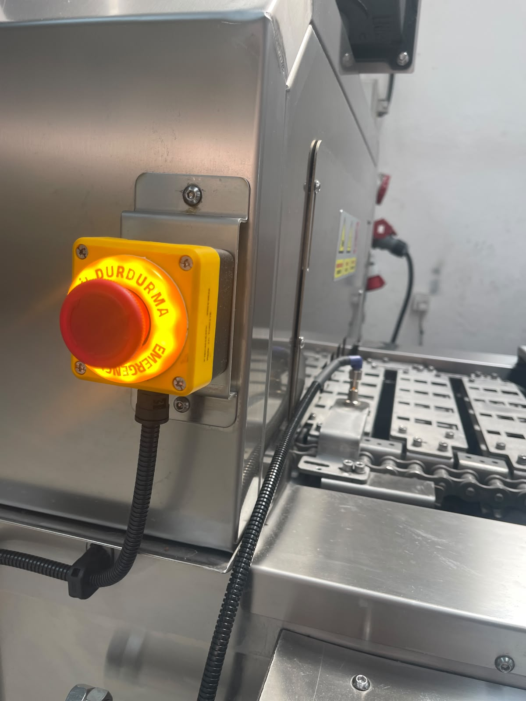
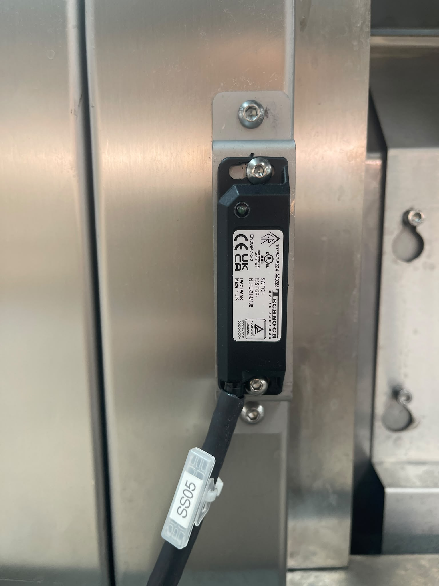
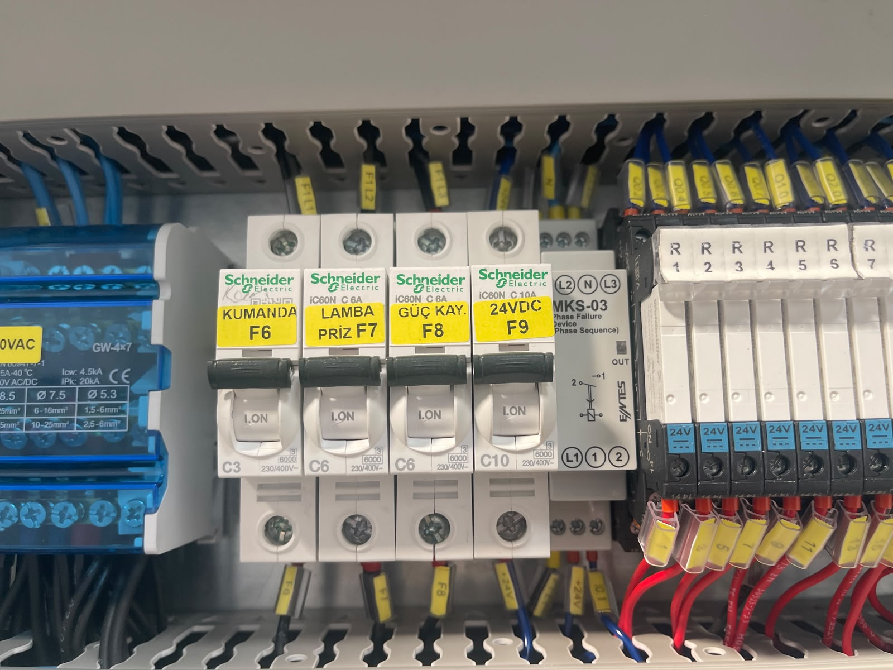

# 5.4 Güvenlik sistemleri testi

Kurulum sonrası güvenlik fonksiyonları, operasyona geçmeden önce doğrulanmalıdır. Makine güvenlik kategorisi **Cat. 3**'tür (EN ISO 13849-1). Makinede **RFID güvenlik sensörü** bulunur; **ışık perdesi yoktur**. Emniyet kapısı / sabit bariyer sayısı **0**'dır.

Acil stop konumları, reset prosedürü ve acil stop sonrası davranış **Bölüm 2.5**'te verilmiştir; bu bölümde yalnızca **kurulum test adımları** tanımlanır. LOTO prosedürü bakım müdahalelerinde **Bölüm 2.4**'e göre uygulanır.

Acil stop fonksiyon testi periyodu: **Her ay bir kez** tekrarlanmalıdır (bkz. **Bölüm 6.2** — Güvenlik ayarları).

---

## 5.4.1 Acil stop testi

Makinede **4 adet** acil stop butonu bulunur (bkz. **Bölüm 2.5**):

| # | Konum |
|---|-------|
| 1 | Elektrik panosu üzerinde |
| 2 | Makine girişinde konveyörün sağında |
| 3 | Makine girişinde konveyörün solunda |
| 4 | Makine çıkışında konveyörün solunda |

### Test prosedürü

Her acil stop butonu için ayrı ayrı:

1. Tehlike bölgesinin boş olduğunu doğrulayın; konveyör giriş/çıkışına kimse girmesin.
2. Makine hazır veya çalışır durumda iken ilgili acil stop butonuna basın.
3. Makinedeki **her fonksiyonun durduğunu** doğrulayın.
4. Tepe lambasının **kırmızı** yandığını kontrol edin.
5. Reset prosedürünü uygulayın (**Bkz. Bölüm 2.5**).
6. Bir sonraki buton testine geçmeden makineyi normal hazır duruma getirin.

| Kontrol | Beklenen sonuç |
|---------|----------------|
| Acil stop'a basıldığında makine duruyor mu? | Evet — her fonksiyon durur |

---

## 5.4.2 RFID güvenlik sensörü testi

| Parametre | Değer |
|-----------|-------|
| Sensör tipi | RFID güvenlik sensörü |
| Emniyet kapısı sayısı | 0 |

Bu alt bölüm **fonksiyon testidir**; bakım erişimi değildir. Bakım/temizlik için kapak açmadan önce **Bölüm 2.4** LOTO zorunludur.

### Test prosedürü

1. Tehlike bölgesinin boş olduğunu doğrulayın; kapağı açarken hareketli parçalara uzanmayın.
2. Makine hazır veya çalışır durumda iken RFID korumalı bir bakım kapağını **yalnızca algılama için** kısmen açın.
3. RFID sensörünün makineyi **durdurduğunu** doğrulayın.
4. Kapağı kapatın; reset prosedürünü uygulayın (**Bkz. Bölüm 2.5**).

| Kontrol | Beklenen sonuç |
|---------|----------------|
| Kapaklar açıldığında RFID sensörü makineyi durduruyor mu? | Evet |

RFID güvenlik sensörü **bypass edilmez**. Test başarısızsa operasyona geçmeyin.

---

## 5.4.3 Faz koruma ve elektrik güvenlik testi

| # | Kontrol | Beklenen sonuç |
|---|---------|----------------|
| 1 | Faz koruma rölesi çıkış veriyor mu? | Evet |
| 2 | Makinede elektrik var mı? | Evet |
| 3 | Acil stop'a basıldığında makine duruyor mu? | Evet |

---

## 5.4.4 Makine hazır durumu testi

| Kontrol | Beklenen sonuç |
|---------|----------------|
| Makine kullanıma hazır mı? | Evet |
| Tepe lambası | Sarı — kullanıma hazır |

HMI alarm ekranında aktif alarm bulunmamalıdır. Alarm varsa **Bölüm 11**'e bakın.

---

## 5.4.5 Güvenlik fonksiyon test kontrol listesi

| # | Test | Sonuç | Tarih | Test eden |
|---|------|:-----:|-------|-----------|
| 1 | Acil stop #1 — pano | ☐ OK / ☐ NOK | | |
| 2 | Acil stop #2 — giriş sağ | ☐ OK / ☐ NOK | | |
| 3 | Acil stop #3 — giriş sol | ☐ OK / ☐ NOK | | |
| 4 | Acil stop #4 — çıkış sol | ☐ OK / ☐ NOK | | |
| 5 | Reset prosedürü (Bölüm 2.5) | ☐ OK / ☐ NOK | | |
| 6 | RFID sensör — kapak açık | ☐ OK / ☐ NOK | | |
| 7 | Faz koruma rölesi | ☐ OK / ☐ NOK | | |
| 8 | Makine kullanıma hazır | ☐ OK / ☐ NOK | | |

Tüm maddeler **OK** olmadan **Bölüm 5.5** testlerine ve operasyona geçilmemelidir.
