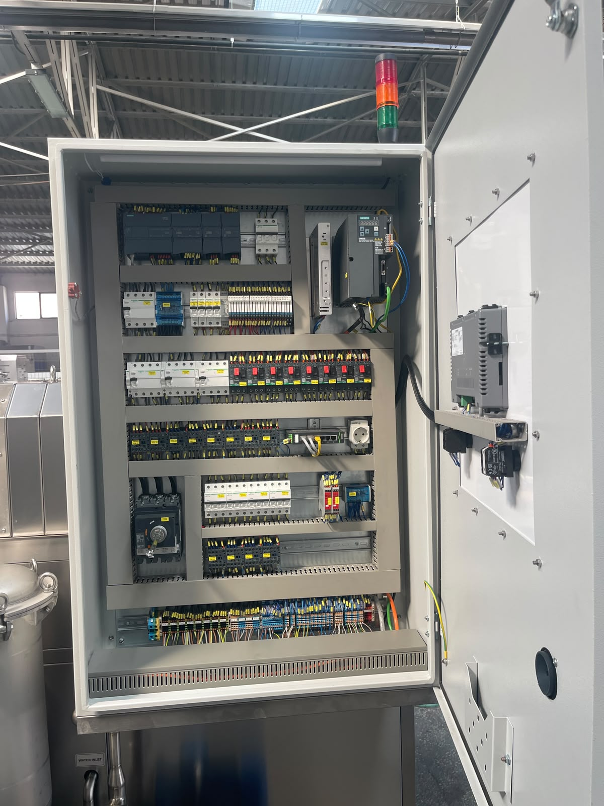

# 5.5. Installationsprüfung und Test

Die Tests sind nach Abschluss der Sicherheitstests in Abschnitt **5.4** durchzuführen. Erst wenn alle Prüfungen **OK** sind, den Betrieb aufnehmen.

---

## 5.5.1. Mechanischer Installationstest

| # | Prüfung | Erwartetes Ergebnis | Status |
|---|---------|---------------------|--------|
| 1 | Ist die Maschine waagerecht? | Ja — innerhalb 0,5 mm Toleranz mit verstellbaren Füßen | ☐ |

Der mechanische Installationstest wird nach Abschluss der Positionierung und Nivellierung in Abschnitt 5.2 durchgeführt. Beide Achsen mit Wasserwaage oder gleichwertigem Messgerät prüfen.

<!-- FOTO: Waagerechtprüfung mit Wasserwaage -->

---

## 5.5.2. Elektrische Inbetriebnahmeprüfung

| # | Prüfung | Erwartetes Ergebnis | Status |
|---|---------|---------------------|--------|
| 1 | Gibt das Phasenschutzrelais einen Ausgang? | Ja | ☐ |
| 2 | Liegt Spannung an der Maschine an? | Ja | ☐ |
| 3 | Stoppt die Maschine bei Not-Halt? | Ja | ☐ |

Elektrische Tests werden nach dem Einschalten am Schrank durchgeführt. Die Phasenfolge muss über das Phasenfolgerelais verifiziert sein.

<!-- FOTO: Schrank geöffnet — Inbetriebnahmetest -->

---

## 5.5.3. Pneumatik- und Medienanschlusstest

| # | Prüfung | Erwartetes Ergebnis | Status |
|---|---------|---------------------|--------|
| 1 | Leuchtet die Luftanzeige auf der HMI-Handseite nach Luftanschluss grün? | Ja | ☐ |
| 2 | Leuchtet die Wasseranzeige auf der HMI-Handseite nach Wasseranschluss grün? | Ja | ☐ |

Anschlussparameter:

| Medium | Wert |
|--------|------|
| Druckluft | 6 bar — 3/4" |
| Wasser | 1 bar — 1/2" |

<!-- FOTO: HMI-Handseite — Luft und Wasser grün -->

---

## 5.5.4. Sicherheitsfunktionsprüfung

| # | Prüfung | Erwartetes Ergebnis | Status |
|---|---------|---------------------|--------|
| 1 | Stoppt die Maschine bei Not-Halt? | Ja — jede Funktion stoppt | ☐ |
| 2 | Ist die Maschine betriebsbereit? | Ja — gelbes Signalelement | ☐ |
| 3 | Stoppt der RFID-Sensor die Maschine beim Öffnen der Abdeckungen? | Ja | ☐ |

Detailliertes Not-Halt-Testverfahren siehe Abschnitt **5.4**.

<!-- FOTO: Sicherheitstest — RFID-Sensor auslösen -->

---

## 5.5.5. Leerlauflauf-Test

| Parameter | Wert |
|-----------|------|
| Leerlauflauf-Testdauer | **15 Minuten** |

### Testverfahren

1. Alle Prüfungen in Abschnitt 5.5.1–5.5.4 müssen als **OK** abgeschlossen sein.
2. Maschine **ohne Teile** (leer) **15 Minuten** laufen lassen.
3. Maschine nach Ablauf der Testdauer anhalten.

| # | Prüfung | Status |
|---|---------|--------|
| 1 | 15 Min. Leerlauflauf-Test abgeschlossen | ☐ OK / ☐ NOK |

Bei erfolgreichem Leerlauflauf gilt die Maschine als **betriebsbereit** (Abschnitt 5.1 Schritt 9).

<!-- FOTO: Leerlauflauf-Test — Maschine in Betrieb -->

---

## 5.5.6. Zusammenfassende Installationsprüfliste

| Abschnitt | Test | Abgeschlossen |
|-----------|------|:-------------:|
| 5.5.1 | Mechanisch — waagerecht | ☐ |
| 5.5.2 | Elektrisch — Phasenschutz, Not-Halt | ☐ |
| 5.5.3 | Medien — HMI Luft/Wasser grün | ☐ |
| 5.5.4 | Sicherheit — RFID, betriebsbereit | ☐ |
| 5.5.5 | Leerlauflauf — 15 Min. | ☐ |

**Datum:** _______________ **Geprüft von:** _______________ **Freigegeben von:** _______________
