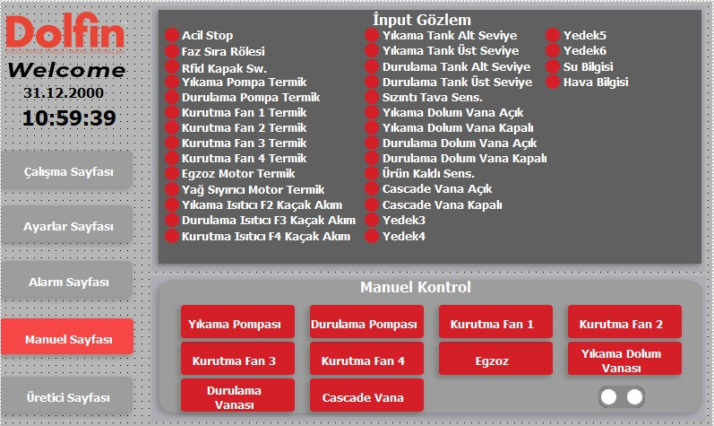
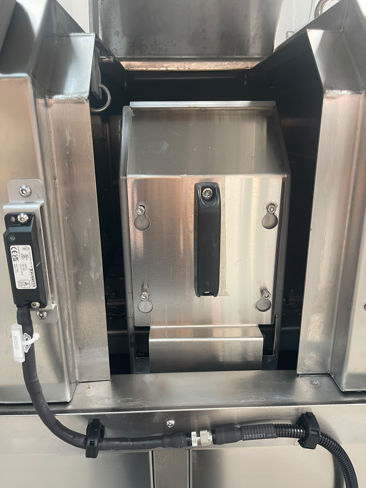

# 5.5 Kurulum doğrulama ve test

Kurulum doğrulama testleri, **Bölüm 5.4** güvenlik testleri tamamlandıktan sonra uygulanır. Tüm kontroller **OK** olmadan operasyona geçilmemelidir. Testler DATA dosyasındaki **KURULUM_TEST** checklist'ine dayanır.

---

## 5.5.1 Mekanik kurulum testi

| # | Kontrol | Beklenen sonuç | Durum |
|---|---------|-----------------|:-----:|
| 1 | Makine terzide mi? | Evet — ayarlanabilir ayaklar, 0,5 mm tolerans içinde | ☐ |

Test, **Bölüm 5.2.3** seviye ayarı tamamlandıktan sonra yapılır. Su terazisi veya eşdeğer ölçüm aleti ile her iki eksende kontrol edin.

<!-- FOTO: Su terazisi ile terazi kontrolü (EKLENECEK: FOTO-5-5-0-terazi-test.jpg) -->

---

## 5.5.2 Elektrik devreye alma testi

| # | Kontrol | Beklenen sonuç | Durum |
|---|---------|-----------------|:-----:|
| 1 | Faz koruma rölesi çıkış veriyor mu? | Evet | ☐ |
| 2 | Makinede elektrik var mı? | Evet | ☐ |
| 3 | Acil stop'a basıldığında makine duruyor mu? | Evet | ☐ |

Faz yönü **Bölüm 5.3.4**'te doğrulanmış olmalıdır.

<!-- FOTO: Pano — devreye alma testi (EKLENECEK: FOTO-5-5-1-elektrik-test.jpg) -->

---

## 5.5.3 Pnömatik ve medya bağlantı testi

| # | Kontrol | Beklenen sonuç | Durum |
|---|---------|-----------------|:-----:|
| 1 | HMI manuel sayfasında hava bilgisi yeşil mi? | Evet | ☐ |
| 2 | HMI manuel sayfasında su bilgisi yeşil mi? | Evet | ☐ |

Bağlantı değerleri: **6 bar / 3/4"** hava, **1 bar / 1/2"** su (bkz. **Bölüm 3.3.5**).

<!-- FOTO: HMI manuel — hava/su yeşil -->

---

## 5.5.4 Güvenlik fonksiyon testi

| # | Kontrol | Beklenen sonuç | Durum |
|---|---------|-----------------|:-----:|
| 1 | Acil stop makineyi durduruyor mu? | Evet | ☐ |
| 2 | Makine kullanıma hazır mı? | Evet — sarı tepe lambası | ☐ |
| 3 | RFID sensör kapak açılınca durduruyor mu? | Evet | ☐ |

Detaylı test adımları **Bölüm 5.4**'te verilmiştir.

<!-- FOTO: RFID test — kapak açık durdurma (EKLENECEK: FOTO-5-5-3-guvenlik-test.jpg) -->

---

## 5.5.5 Boş koşu testi

| Parametre | Değer |
|-----------|-------|
| Boş koşu test süresi | **15 dakika** |

Boş koşu testi, makinenin parça olmadan sürekli çalışmasını doğrular; sızıntı, alarm, aşırı titreşim ve proses fonksiyonlarının birlikte çalışmasını kontrol eder.

### Ön koşullar

1. Bölüm **5.5.1–5.5.4** kontrolleri **OK** tamamlanmış olmalıdır.
2. Konveyör hattında sıkıştıracak parça veya cisim olmamalıdır.
3. Pompa önü vanalar **açık** olmalıdır.
4. Hava (**6 bar**) ve su bağlantıları aktif; HMI manuel sayfasında hava/su **yeşil** olmalıdır.

### Test prosedürü

1. HMI **Çalışma Sayfası**'na geçin.
2. Yıkama, durulama, kurutma 1, kurutma 2 ve egzoz fonksiyonlarını test kapsamına göre **aktif** konuma getirin.
3. **Hazırlık Start** düğmesine basın; tank dolumu ve ısıtma tamamlanana kadar bekleyin (bkz. **Bölüm 7.2**).
4. Tepe lambasının **sarı** (kullanıma hazır) yandığını doğrulayın.
5. **Makine Start** ile otomatik çalışmayı başlatın; konveyör, pompalar ve fanların devreye girdiğini gözlemleyin.
6. Makineyi **parça olmadan** **15 dakika** çalıştırın.
7. Test süresince HMI alarm ekranını ve tepe lambasını izleyin; sızıntı, anormal ses veya koku olup olmadığını kontrol edin.
8. **Makine Stop** ile durdurun.

| # | Kabul kriteri | Durum |
|---|---------------|:-----:|
| 1 | 15 dk kesintisiz boş koşu tamamlandı | ☐ OK / ☐ NOK |
| 2 | Test süresince kritik alarm oluşmadı | ☐ OK / ☐ NOK |
| 3 | Gözle görülür sızıntı veya anormal titreşim yok | ☐ OK / ☐ NOK |

**Anormal durum:** Alarm oluşursa makineyi durdurun; **Bölüm 11**'e bakın. Test tekrarlanmadan operasyona geçmeyin.

Boş koşu testi başarılı ise makine **kullanıma hazır** kabul edilir (**Bölüm 5.1 Adım 9**).

<!-- FOTO: Boş koşu — makine çalışır, tepe lambası yeşil (EKLENECEK: FOTO-5-5-4-bos-kosu.jpg) -->

---

## 5.5.6 Kurulum doğrulama özet kontrol listesi

| Bölüm | Test | Tamamlandı |
|-------|------|:----------:|
| 5.5.1 | Mekanik — terazi | ☐ |
| 5.5.2 | Elektrik — faz koruma, acil stop | ☐ |
| 5.5.3 | Medya — HMI hava/su yeşil | ☐ |
| 5.5.4 | Güvenlik — RFID, kullanıma hazır | ☐ |
| 5.5.5 | Boş koşu — 15 dk | ☐ |

**Tarih:** _______________ **Test eden:** _______________ **Onaylayan:** _______________

---

Operasyon prosedürleri için bkz. **Bölüm 7**.
