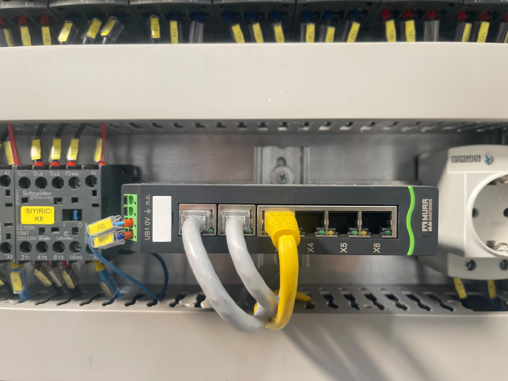

# 5.6 Kommunikation und Automatisierungsschnittstelle

Die Automatisierungsinfrastruktur der Maschine muss nach der Installation verifiziert werden. SPS-, HMI- und Profinet-Eigenschaften sind in **Kapitel 3.4.7** zusammengefasst; dieser Abschnitt gibt die Checkliste für Installation und Inbetriebnahme.

---

## 5.6.1 Feldbus und Protokoll

| Parameter | Wert |
|-----------|-------|
| Feldbus / Protokoll | **Profinet** |

| Komponente | Marke / Modell |
|---------|---------------|
| SPS | SIEMENS SIMATIC S7-1200 — CPU 1215C DC/DC/DC (6ES7215-1AG40-0XB0) |
| HMI | SIMATIC HMI KTP700 Basic PN (6AV2123-2GB03-0AX0) |
| E/A-Übersicht | 36 Eingänge / 24 Ausgänge |

Die SPS–HMI-Kommunikation muss über das Profinet-Netzwerk aufgebaut werden. Encoder-/Feedback-Einstellungen sind im SPS-Programm eingebettet; Änderungen dürfen nur durch den **autorisierten Herstellerservice** vorgenommen werden (siehe **Kapitel 6.3**).

**VORSICHT — Unbefugter Eingriff:** Unbefugte Änderung des SPS-Programms und eingebetteter Parameter kann Sicherheitsfunktionen außer Kraft setzen.

---

## 5.6.2 Anbindung an das übergeordnete System

| Parameter | Wert |
|-----------|-------|
| Anbindung übergeordnetes System (MES / SCADA) | Wird vom Kunden durchgeführt |

Die MES- oder SCADA-Integration liegt in der Verantwortung des **Kunden**. Die Maschine ist über die **Profinet**-Infrastruktur zur Anbindung an ein übergeordnetes System bereit; Protokoll, Adressierung und Signalzuordnung werden gemäß Kunden-Automatisierungsprojekt konfiguriert.

---

## 5.6.3 E/A-Liste und Dokumentation

| Dokument | Dateiname | Status |
|---------|-----------|-------|
| E/A-Liste | Wird nicht als separates Dokument geliefert | Auf Anfrage beim Hersteller (siehe **13.1.3**) |

Die E/A-Liste ist das Referenzdokument für Eingangs-/Ausgangsadressen sowie Sensor- und Aktorbezeichnungen. Sie wird nicht als separates Dokument geliefert; die elektrischen Installationsanschlüsse werden anhand des Stromlaufplans (**Kapitel 13.1.1**) und der Vor-Ort-Installation verifiziert. Die Liste wird bei Bedarf beim Hersteller angefordert.

---

## 5.6.4 Kommunikations-Checkliste

| # | Prüfung | Status |
|---|---------|:-----:|
| 1 | Profinet-Netzwerk konfiguriert | ☐ |
| 2 | SPS — HMI-Kommunikation bestätigt | ☐ |
| 3 | HMI-Startbildschirm und Sprachauswahl getestet | ☐ |
| 4 | Stromlaufplan als Referenz verwendet | ☐ |
| 5 | Encoder-/Feedback-Einstellung durch den Hersteller bestätigt | ☐ |

**Datum:** _______________ **Kontrolliert durch:** _______________

---

Für die HMI-Bildschirmstruktur siehe **Kapitel 3.4**; für Parametereinstellungen siehe **Kapitel 6**.
