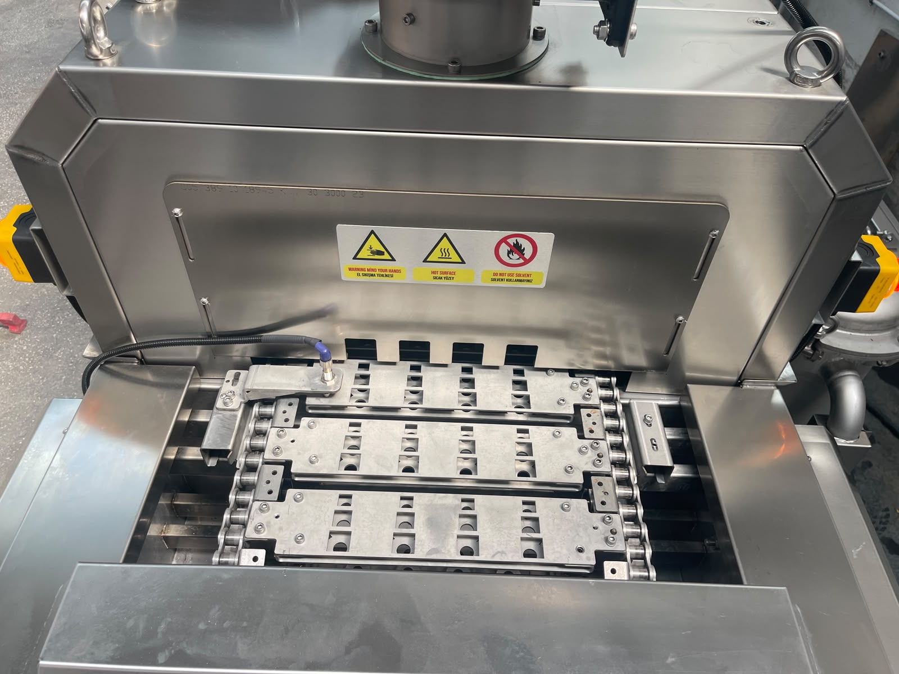

# 6.1 Mechanical settings

---

## 6.1.1 Mechanical adjustment points

| Parameter | Value / Description |
|-----------|---------------------|
| List of mechanical adjustment points | No adjustment required |

---

## 6.1.2 Reference / Home position

| Parameter | Value / Description |
|-----------|---------------------|
| Reference / home position adjustment | Conveyor head shall be used as reference |

The conveyor head is accepted as the machine reference point. Part positioning and process synchronization are based on this reference.

<!-- PHOTO: Conveyor head — reference/home position -->

---

## 6.1.3 Chain / belt and limit settings

| Parameter | Value / Description |
|-----------|---------------------|
| Chain / belt tension value | No adjustment required |
| Distance / limit switch settings | No adjustment required |

---

## 6.1.4 Nozzle / fill head

| Parameter | Value / Description |
|-----------|---------------------|
| Nozzle / fill head adjustment range (mm) | No adjustment required |

---

## 6.1.5 Format change

| Parameter | Value / Description |
|-----------|---------------------|
| Format change procedure summary | No format change procedure |

---

## 6.1.6 Mechanical settings checklist

| # | Check | Status |
|---|-------|--------|
| 1 | Reference point (conveyor head) verified | ☐ OK / ☐ NOK |
| 2 | No mechanical adjustment required — recorded | ☐ OK / ☐ NOK |

**Date:** _______________ **Checked by:** _______________
