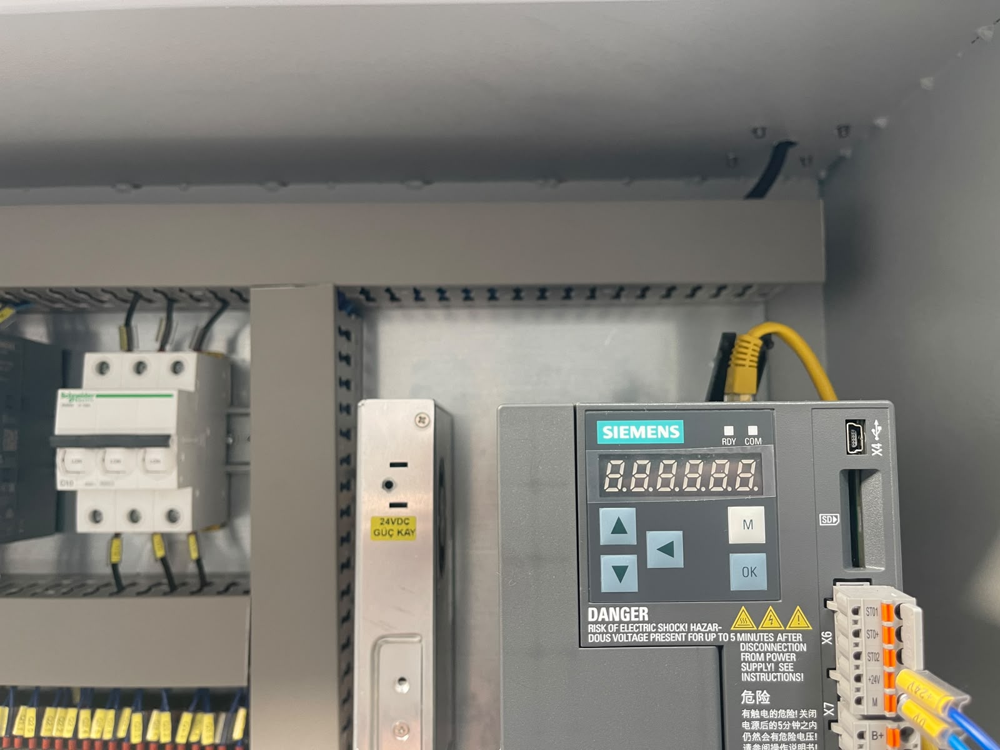

# 6.3. Elektrische Einstellungen

Dieser Abschnitt definiert die elektrischen und Automatisierungseinstellungen der Maschine KNV 30 3000 2B. Elektrische Einstellungen dürfen nur von autorisierten Elektrotechnikern oder -ingenieuren durchgeführt werden.

---

## 6.3.1. Motordrehrichtung / Phasenprüfung

| Parameter | Wert / Beschreibung |
|-----------|---------------------|
| Motordrehrichtung / Phasenprüfung | Motor nur in einer Drehrichtung betreiben. Dafür ist keine Einstellung erforderlich |

Phasenrichtung und -folge wurden bei der Installation mit dem Phasenfolgerelais verifiziert (siehe Abschnitt **5.3**).

---

## 6.3.2. Encoder / Feedback

| Parameter | Wert / Beschreibung |
|-----------|---------------------|
| Encoder- / Feedback-Einstellung | Im PLC-Programm eingebettet. Einstellung durch unser Unternehmen |

Encoder-Einstellung darf nicht durch den Bediener erfolgen.

<!-- PHOTO: PLC-Schrank — Encoder-Einstellung Hersteller -->

---

## 6.3.3. Analoge Skalierung

| Parameter | Wert / Beschreibung |
|-----------|---------------------|
| Analoge Skalierung (Druck / Temperatur) | Keine Druckeinstellung. Für Temperatureinstellung HMI-Einstellseite verwenden |

<!-- PHOTO: HMI-Einstellseite — Temperatur -->

---

## 6.3.4. Datum / Uhrzeit / Sprache

| Parameter | Wert / Beschreibung |
|-----------|---------------------|
| Datum- / Uhrzeit- / Spracheinstellung | Auf der Einstellseite der HMI-Oberfläche durchführen |

<!-- PHOTO: HMI-Einstellseite — Datum Uhrzeit Sprache -->

---

## 6.3.5. Checkliste elektrische Einstellungen

| # | Prüfung | Status |
|---|---------|--------|
| 1 | Motordrehrichtung verifiziert | ☐ OK / ☐ NOK |
| 2 | Encoder-Einstellung durch Hersteller | ☐ OK / ☐ NOK |
| 3 | HMI-Temperatureinstellung (falls erforderlich) | ☐ OK / ☐ NOK |
| 4 | HMI Datum / Uhrzeit / Sprache konfiguriert | ☐ OK / ☐ NOK |

**Datum:** _______________ **Geprüft von:** _______________
