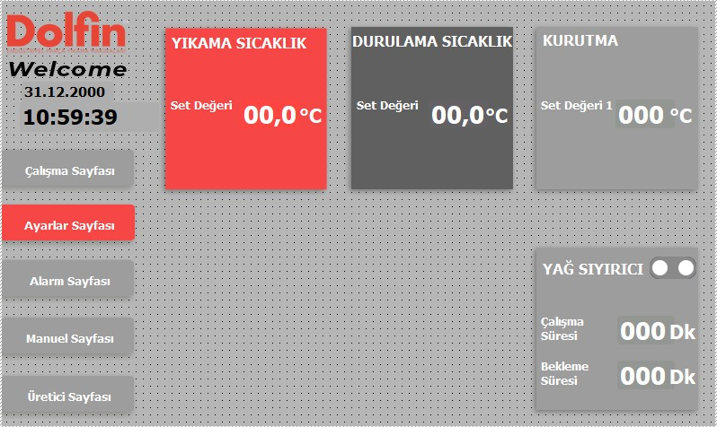

# 8.2 Spezifische Einrichtung und Rezeptverwaltung

An der Maschine gibt es **kein mechanisches Formatwechselverfahren** (siehe **Kapitel 6.1.5**). Produkt- und Prozessunterschiede werden über das HMI mit **Rezeptlogik** geführt: Temperatur-Sollwerte, Ölskimmer-Zeiten und Prozessfunktion ein/aus.

Es gibt **kein** oberes Limit für die Anzahl der Rezeptaufzeichnungen (siehe **Kapitel 3.4.11**). Rezeptnummerierung und Produktzuordnung werden vom **Anwenderunternehmen** definiert; die Integration des übergeordneten Systems (Roboter-SPS / MES) hängt von der Automatisierungsstruktur des **Kunden** ab (siehe **Kapitel 5.6.2**).

---

## 8.2.1 Rezeptkonzept und HMI-Struktur

An dieser Maschine sind die Parameter statt auf einem separaten „Rezeptlisten“-Bildschirm auf zwei HMI-Seiten zusammengefasst:

| Rezeptkomponente | HMI-Seite | Kapitel |
|-----------------|-------------|-------|
| Wasch- / Spül- / Trocknungstemperatur | Einstellseite | 6.3.3, 3.4.4 |
| Ölskimmer-Lauf- / Wartezeit | Einstellseite | 6.3.3 |
| Waschen, Spülen, Trocknen 1/2, Abluft ein/aus | Betriebsseite | 7.1.6 |
| Vorbereitung / Start | Betriebsseite | 7.2 |

Ein konsistenter Satz dieser Parameter für jeden Produkttyp gilt als „Rezept“. Erfolgt die Rezeptauswahl vom übergeordneten System, liegt die Übertragung der Parameter an das HMI in der Verantwortung der Kundensoftware.

---

## 8.2.2 Verfahren zur Erstellung eines neuen Rezepts

Bei Inbetriebnahme eines neuen Teiletyps:

1. Die Maschine in den **Stopp**-Zustand bringen.
2. Auf der HMI-**Einstellseite** die Ziel-Temperatur-Sollwerte eingeben (Waschen, Spülen, Trocknen — siehe **Kapitel 6.3.3**).
3. Ölskimmer-Lauf- und Wartezeiten gemäß Ölbelastung des Teils einstellen.
4. Auf der HMI-**Betriebsseite** die erforderlichen Prozessfunktionen auf **aktiv** stellen.
5. Mit **Vorbereitung Start** Füllung/Beheizung abschließen (siehe **Kapitel 7.2**).
6. Mit einem Musterteil eine Probewäsche durchführen; das Reinheits-/Trockenheitskriterium prüfen.
7. Den genehmigten Parametersatz mit Rezeptnummer dokumentieren (Dokumentation des Anwenderunternehmens).
8. Prüfen, dass die Robotereinlauf-/auslauf-Zykluszeit mit dem Ziel-**Stk./h** (Referenz 730) kompatibel ist. **900 s** ist die Teile-Durchlaufzeit; der Roboterzyklus muss nicht dieser Wert sein (siehe **Kapitel 3.3.2**, **7.4.2**).

**Erwartetes Ergebnis:** Das Teil erfüllt das Ziel-Reinheitskriterium; der Linien-Throughput liegt im Ziel-Stk./h-Bereich.

**Abweichender Zustand:** Ist die Beheizung unzureichend, Sollwerte und Heizungsalarmstatus prüfen (siehe **Kapitel 11**).

---

## 8.2.3 Produktbezogene Parameter

Die folgenden Felder werden **vom Anwenderunternehmen** ausgefüllt:

| Parameter | Wert |
|-----------|-------|
| Parameter Produkt A | Wird vom Anwenderunternehmen eingestellt |
| Parameter Produkt B | Wird vom Anwenderunternehmen eingestellt |
| Parameter Produkt C | Wird vom Anwenderunternehmen eingestellt |

Beispiel-Parametersatz-Vorlage (vom Anwenderunternehmen auszufüllen):

| Parameter | Produkt A | Produkt B | Produkt C |
|-----------|--------|--------|--------|
| Rezeptnr. | | | |
| Waschtemperatur (°C) | | | |
| Spültemperatur (°C) | | | |
| Trocknen-Soll (°C) | | | |
| Ölskimmer Lauf (min) | | | |
| Ölskimmer Warte (min) | | | |
| Waschen / Spülen / Trocknen 1/2 / Abluft | ein/aus | ein/aus | ein/aus |
| Ziel Stk./h | | | |

---

## 8.2.4 Rezeptnummerliste

| Parameter | Wert |
|-----------|-------|
| Rezeptnr.-Liste | Wird vom Anwenderunternehmen eingestellt |

Rezeptnummerierung und Produkt–Rezept-Zuordnung müssen vom Anwenderunternehmen definiert werden. Erfolgt die Rezeptauswahl vom Roboter oder vom übergeordneten System, gehört die automatische oder bedienerbestätigte Aktualisierung der HMI-Parameter zum Kunden-Automatisierungsprojekt.

Eine Beispiel-Rezeptliste wird vom Anwenderunternehmen definiert (siehe **Kapitel 14**).

---

## 8.2.5 Checkliste spezifische Einrichtung

| # | Prüfung | Status |
|---|---------|:-----:|
| 1 | Rezept-Parametersatz für den Produkttyp definiert | ☐ |
| 2 | Tanktemperaturen auf Zielwerte eingestellt (Einstellseite) | ☐ |
| 3 | Prozessfunktionen korrekt ein/aus (Betriebsseite) | ☐ |
| 4 | Roboterzykluszeit mit Ziel-Stk./h kompatibel | ☐ |
| 5 | Probewäsche mit Musterteil durchgeführt — Abnahmekriterium OK | ☐ |
| 6 | Kapazitätsprüfergebnis in die Tabelle eingetragen (Kapitel 8.1.3) | ☐ |

**Datum:** _______________ **Kontrolliert durch:** _______________

---

Für den Betrieb siehe **Kapitel 7**; für Kapazitätsgrenzen siehe **Kapitel 8.1**.
