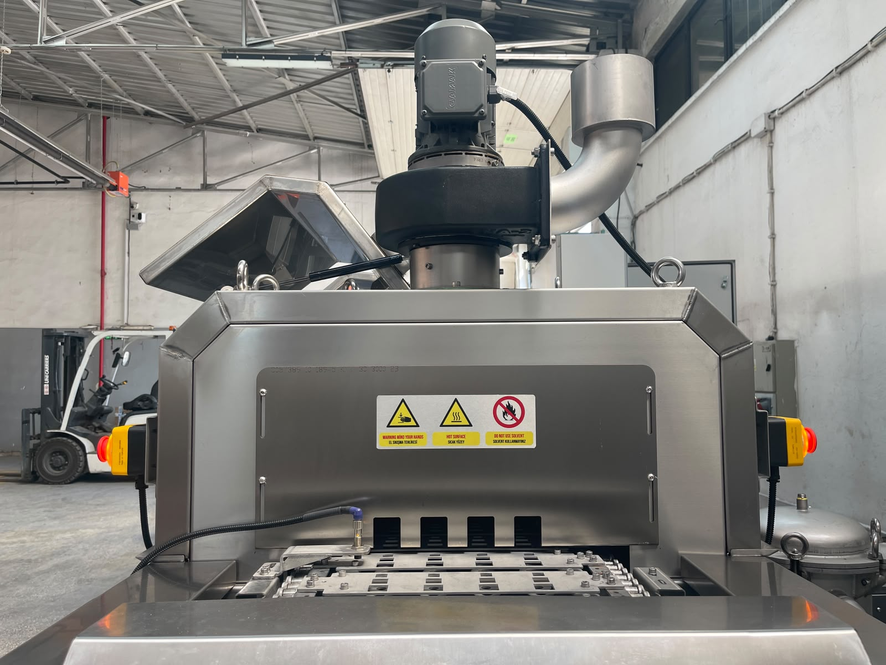

# 8. KAPASİTE

Bu bölüm, **KNV 30 3000 2B** makinesinin üretim kapasitesi, ürün sınırları ve reçete/proses yapılandırmasını tanımlar. Kapasite; parça geometrisi, robot besleme/çıkış hızı, HMI reçete parametreleri (sıcaklık, yağ sıyırıcı) ve aktif proses fonksiyonlarına (yıkama, durulama, kurutma 1/2, egzoz) bağlıdır.

Makine **7/24 robot** hattında kesintisiz çalışmaya uygundur. Nominal döngü süresi ve minimum kapasite referans değerleri **Bölüm 3.3.2**'de SSOT olarak verilmiştir; bu bölümde tekrarlanmaz. Operasyon prosedürleri **Bölüm 7**'de; HMI parametre ayarları **Bölüm 6.3**'te anlatılmıştır.

| Alt bölüm | Konu |
|-------|--------|
| **8.1** | Ürün kapasitesi, sınırlar, test, sürekli çalışma |
| **8.2** | Reçete / spesifik kurulum — HMI yapılandırması |

## Özet referans değerler

| Parametre | Değer | SSOT |
|-----------|-------|------|
| Nominal döngü süresi | 900 sn (15 dk) | Bölüm 3.3.2 |
| Minimum kapasite | 730 adet/saat | Bölüm 3.3.2 |
| Nominal / maksimum kapasite | Kullanıcı firma belirler | DATA |
| Maksimum sürekli çalışma | 24/7 | DATA |
| Reçete kayıt sınırı | Sınır yok | Bölüm 3.4.12 |

<!-- FOTO: Konveyör — kapasite / parça akışı -->

---

**Bölüm 8 sonu.** Operasyon sekansı için bkz. **Bölüm 7.4**; teknik boyutlar için bkz. **Bölüm 3.3**.
