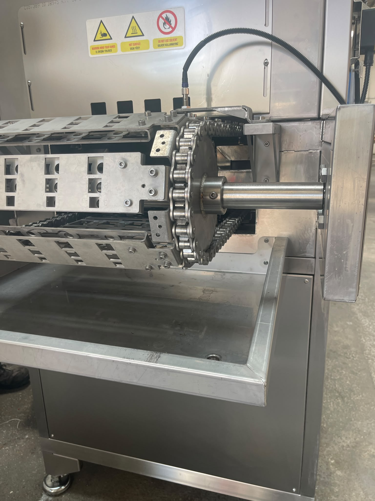
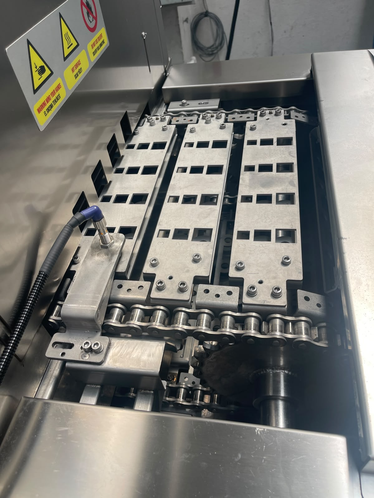

# 9.1 Bakım talimatları

---

## 9.1.1 Bakım felsefesi ve personel

| Parametre | Değer / Açıklama |
|-----------|------------------|
| Bakım felsefesi | **Önleyici bakım** felsefesi uygulanır |
| Bakım personeli yeterlilik seviyesi | Makinenin kullanıldığı ülkenin mevcut bakım personeli yeterlilik seviyesi uygulanmalıdır |
| Lubrication chart dosya referansı | **Yoktur** |

Bakım personeli; makine kullanımı ve bakımı ile ilgili eğitim almış olmalıdır (bkz. Bölüm **3.2**).

---

## 9.1.2 Bakım öncesi güvenlik

Bakım için **özel bir mod yoktur**. Aşağıdaki kurallara uyulmalıdır:

| # | Kural |
|---|-------|
| 1 | Makine **HMI stop** ile durdurulmalıdır |
| 2 | Ana şalter kapatılmalıdır |
| 3 | **LOTO prosedürü** uygulanmalıdır (bkz. Bölüm **5.4**, **12.1**) |
| 4 | Emniyet kapısı / RFID sensör **bypass edilmemelidir** |
| 5 | Kapaklar yalnızca enerji kesildikten ve LOTO uygulandıktan sonra açılmalıdır |

Makine arkasındaki kapakların tamamı sökülebilir ve bakım erişimi için kullanılabilir (bkz. Bölüm **3.5**).

---

## 9.1.3 Periyodik bakım

Makine **7/24 robot hattında** çalışır; aşağıdaki maddeler **bakım personeli** tarafından planlı olarak uygulanır. Bakım öncesi makine durdurulmalı, gerekli işlemlerde **LOTO** uygulanmalıdır (bkz. Bölüm **2.4**). Temizlik adımları Bölüm **10**'da tanımlıdır — burada yalnızca referans verilir.

Saat bazlı periyotlar, makine **toplam çalışma saati** üzerinden takip edilir. Sayaç yoksa yaklaşık takvim karşılığı kullanılabilir (250 saat ≈ 3–4 hafta sürekli çalışma).

| Periyot | Özet |
|---------|------|
| Günlük | Görsel kontrol, ön filtre, alarm/basınç, çıkış konveyörü |
| Haftalık | Tank/torba filtre, yağ sıyırıcı, konveyör, emniyet |
| Aylık | Acil stop testi, yağlama, sensör/pano, pompa-fan |
| 250 saat | Vanalar, ısıtıcı, sensör, fan temizliği |
| 500 saat | Sıyırıcı redüktör, contalar, pnömatik kaçak |
| 1000 saat | Emiş filtresi, nozzle, servo/konveyör, tank temizliği |
| Yıllık | Emniyet raporu, ısıtıcı, redüktör yağı, elektrik, uzun duruş |

**Günlük bakım**

1. Genel görsel kontrol yapın — sızıntı, anormal ses, alarm/tepe lambası durumu.
2. Yıkama tankı ön filtrelerini temizleyin — bkz. Bölüm **10.1.3**.
3. HMI alarm geçmişini kontrol edin; aktif alarm varsa giderin — bkz. Bölüm **11**.
4. Su ve hava basıncı durumunu kontrol edin (HMI manuel sayfa) — bkz. Bölüm **7.2**.
5. Çıkış konveyöründe sıkışma veya parça birikintisi olup olmadığını kontrol edin.

**Haftalık bakım**

1. Tank iç filtrelerini temizleyin — bkz. Bölüm **10.1.4**.
2. Pompa çıkışı torba filtrelerini temizleyin veya değiştirin — bkz. Bölüm **10.1.4**.
3. Yağ sıyırıcı ve tank yüzeyini kontrol edin — aşırı yağ tabakası.
4. Konveyör zincir/kayış gerginliği ve hizasını gözle kontrol edin.
5. RFID / kapak emniyet fonksiyonunu kısa test edin — bkz. Bölüm **2.3**, **5.4.2**.
6. Acil stop butonlarını görsel kontrol edin (hasar, sıkışma yok) — bkz. Bölüm **2.5**.

**Aylık bakım**

1. Acil stop fonksiyon testi yapın — basın, makine dursun, resetleyin — bkz. Bölüm **6.2.3**.
2. Konveyör **4 yağlama noktasını** gresleyin — bkz. Bölüm **9.1.4**.
3. Seviye sensörlerini ve sızıntı tavasını temizleyin/kontrol edin.
4. Pano filtre/ventilasyon deliklerinde toz kontrolü yapın.
5. Pompa ve fan birimlerinde anormal titreşim/ses kontrol edin.

**250 saat bakım**

1. Otomatik dolum vanalarını ve aktarma vanasını test edin.
2. Isıtıcı termokupl ve rezistans bağlantılarını kontrol edin (LOTO sonrası).
3. Proximity sensörleri temizleyin; montaj sıkılığını kontrol edin.
4. Egzost fan ve kurutma fan kanat/gövde toz birikimini temizleyin.

**500 saat bakım**

1. Yağ sıyırıcı redüktör yağ keçesi / teflonu kontrol edin; gerekirse değiştirin — bkz. Bölüm **13.3**.
2. Konveyör redüktör yağ seviyesi ve sızıntısını kontrol edin.
3. Tank ve kapak contalarını kontrol edin.
4. Pnömatik regülatör ve bağlantı noktalarında kaçak kontrol edin — bkz. Bölüm **6.5**.

**1000 saat bakım**

1. Pompa emiş filtresini kontrol edin / değiştirin — bkz. Bölüm **13.3**.
2. Nozzle tıkanma/aşınmasını kontrol edin — bkz. Bölüm **13.3**.
3. Servo/konveyör tahrik grubunun mekanik ve elektrik kontrolünü yaptırın.
4. Tank su kalitesini değerlendirin; gerekirse tam boşaltma ve iç temizlik yapın — bkz. Bölüm **10**.

**Yıllık bakım**

1. Tüm emniyet fonksiyonları için test raporu düzenleyin (RFID, acil stop, kaçak akım) — bkz. Bölüm **2**, **5.4**.
2. Isıtıcı rezistans ve termokupl fonksiyon kontrolü yaptırın.
3. Redüktör yağ değişimini yapın — bkz. Bölüm **9.1.4**.
4. Elektrik bağlantı sıkılık kontrolü yaptırın (LOTO, yetkili elektrikçi).
5. Uzun duruş planlanıyorsa tankları boşaltın ve koruyucu temizlik uygulayın — bkz. Bölüm **7.3**.

---

## 9.1.4 Yağlama

| Parametre | Değer / Açıklama |
|-----------|------------------|
| Yağlama noktası sayısı | **4 adet** |
| Konum | Konveyör **girişinde 2 adet**, **çıkışında 2 adet** |
| Gres tipi | [EKSİK] |
| Redüktör yağ değişimi | [EKSİK] |
| Periyot | [EKSİK] |

<!-- FOTO: Konveyör giriş yağlama noktaları -->

<!-- FOTO: Konveyör çıkış yağlama noktaları -->

---

## 9.1.5 Yedek parça

Sahada bulundurulması önerilen yedek parçalar aşağıdadır. **Kritik** parçalar arızada makinenin çalışmasını veya güvenliğini doğrudan etkiler; **Tüketim** parçaları planlı bakımda değiştirilir. Önerilen stok miktarları duruş süresini kısaltmak içindir; zorunlu sipariş taahhüdü değildir.

Tam parça listesi (tüm kalemler) için bkz. Bölüm **13.3**.

Parça fotoğrafları `assets/9.1/` klasöründe **sipariş kodu** ile adlandırılır (ör. `10 06675.png`).

| Sipariş kodu | Parça adı | Kategori | Önerilen stok | Konum / fonksiyon | Gerekçe |
|--------------|-----------|----------|---------------|-------------------|---------|
| 07 10214 | ÖN FİLTRE NS KOMPLESİ | Tüketim | 2 | Yıkama tankı | Günlük temizlik; tüketim |
| 10 02976 | TERMOKUPL ETB30F06-5Ç | Kritik | 1 | Tank ısıtma | Arızada sıcaklık kontrolü/ısıtma devre dışı |
| 07 15142 | REZİSTANS KOMPLESİ 8000W 50CM DÜZ DİKİŞSİZ | Kritik | 2 | Tank ısıtma | Arızada proses sıcaklığı sağlanamaz |
| 07 00670 | EMİŞ FİLTRESİ KOMPLESİ (PYM2,KBN,VDL,ULT,KNV) | Tüketim | 2 | Pompa emiş hattı | Periyodik değişim |
| 07 16791 | SEVİYE SENSÖRÜ ÇAT.TİP VEGASWING 51 DİŞ ÇEKİLMİŞ | Kritik | 0 (siparişle) | Tank seviye | Arızada dolum/seviye kontrolü bozulur |
| 10 03088 | NOZZLE 632.724.16.CC | Tüketim | 32 | Yıkama/durulama nozul | Aşınan parça |
| 07 03497 | YAĞ SIYIRICI TEFLONU | Tüketim | 1 | Yağ sıyırıcı | Periyodik değişim |
| 10 00586 | REDÜKTÖR MOTORU 0,09KW 1500D/D B14 SIYIRICI | Kritik | 0 (siparişle) | Yağ sıyırıcı | Arızada yağ sıyırıcı çalışmaz |
| 10 02526 | YAĞ KEÇESİ 20*42*7 | Tüketim | 1 | Yağ sıyırıcı redüktör | Bakım tüketimi |
| 10 01017 | RULMAN 6004 2RS ORS | Tüketim | 1 | Yağ sıyırıcı / genel | Bakım tüketimi |
| 10 05378 | TORBA FİLTRE 200 MİKRON (50CM PASL. TEL ÇERÇEVE) | Tüketim | 2 | Pompa çıkışı | Haftalık değişim |
| 10 00296 | PASLANMAZ SEVİYE BEKÇİSİ | Kritik | 0 (siparişle) | Tank seviye | Seviye güvenlik/kontrol |
| 10 19321 | REDÜKTÖR WITTENSTEIN NP035S-MF2-30-1G1-1S | Kritik | 0 (siparişle) | Konveyör tahrik | Arızada konveyör durur |
| 10 19317 | SERVO MOTOR SIEMENS SIMOTICS 1FL6064-1AC61-2AA1 | Kritik | 0 (siparişle) | Konveyör | Arızada parça akışı durur |
| 10 19318 | SERVO SÜRÜCÜ SIEMENS 6SL3210-5FE11-5UF0 | Kritik | 0 (siparişle) | Konveyör | Arızada parça akışı durur |
| 10 07147 | SWITCH F3STGRNLPU21M1J8 OMRON MANYETİK KAPI | Kritik | 1 | RFID / kapak güvenlik | Arızada güvenlik fonksiyonu etkilenir |
| 07 17478 | KNV 30 3000 2B PRO IDE GOULDS POMPA KOMPLESİ | Kritik | 0 (siparişle) | Durulama pompası | Arızada durulama prosesi durur |
| 10 06675 | POMPA LOWARA ESHE 40-160/30 380V/50HZ | Kritik | 0 (siparişle) | Yıkama pompası | Arızada yıkama prosesi durur |

---

## 9.1.6 Bakım kayıt formu

| # | İşlem | Periyot | Tarih | Yapan | OK/NOK |
|---|-------|---------|-------|-------|--------|
| 1 | Periyodik bakım (ilgili madde) | | | | |
| 2 | Yağlama (4 nokta) | | | | |
| 3 | Acil stop testi | Aylık | | | |
| 4 | Filtre temizliği | Bkz. Bölüm 10 | | | |

**Onay:** _______________
