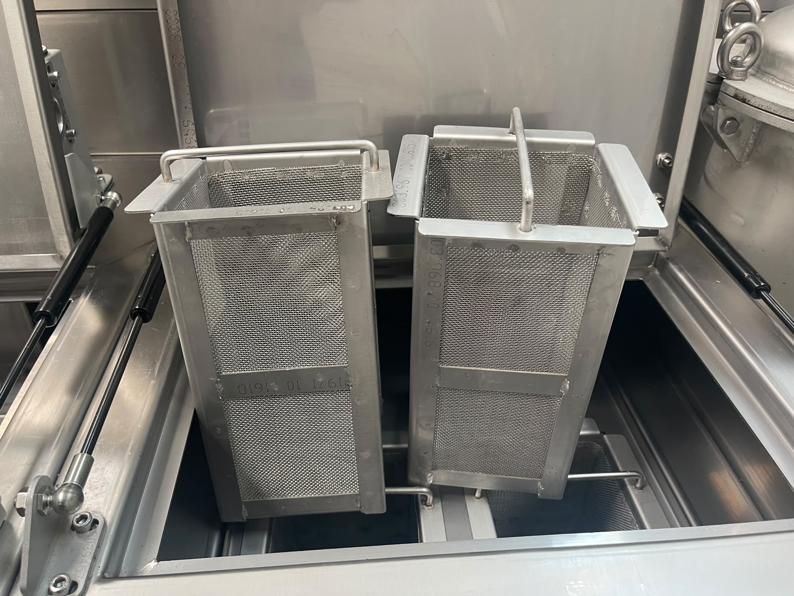
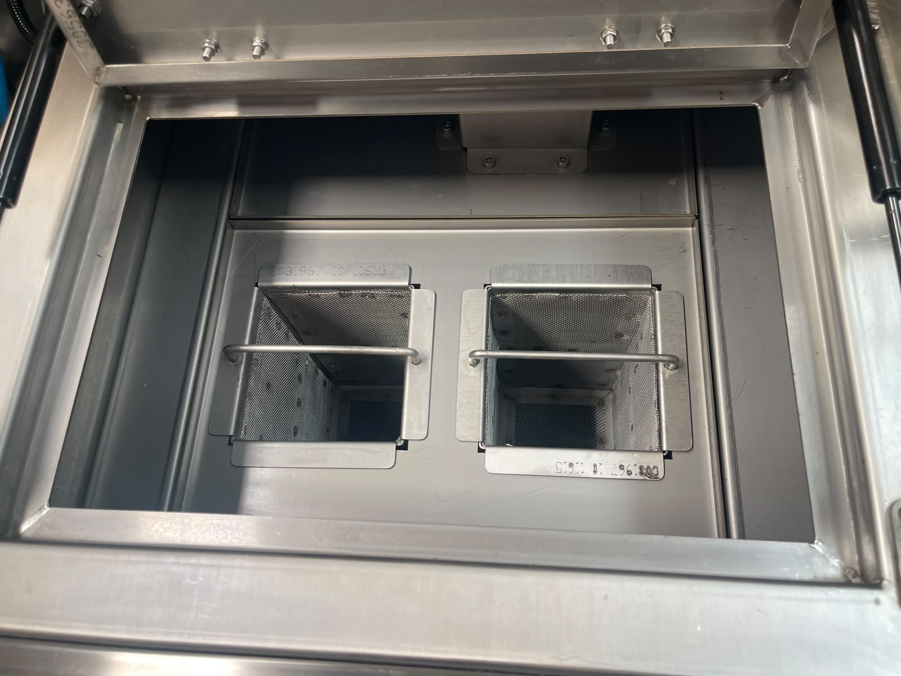
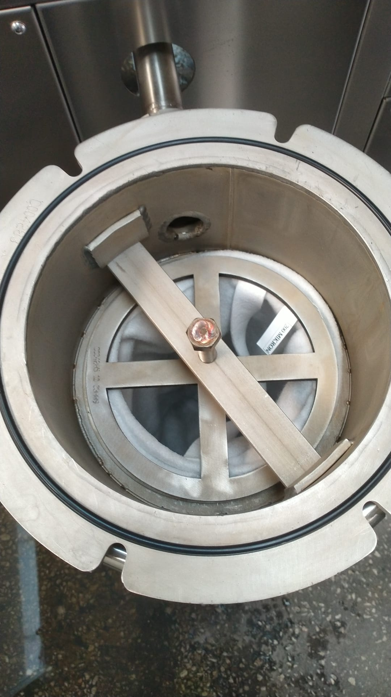

# 10.1 Reinigung und Desinfektion

Die Prozesstanks der Maschine arbeiten mit **Heißwasser**; während der Reinigung besteht die Gefahr heißer Oberflächen und von Dampf. Als Reinigungsmittel müssen Stoffe verwendet werden, die den in **Abschnitt 10.1.7** definierten Kriterien entsprechen; verbotene Stoffe verursachen dauerhafte Schäden an Tank und Edelstahloberflächen.

Bestellcodes der Filterersatzteile sind in den Tabellen **Abschnitt 9.1.6** und **13.3.1** angegeben.

---

## 10.1.1 Reinigungstyp

| Parameter | Wert |
|-----------|------|
| Reinigungstyp | **Trocken / nass** |
| CIP / COP | Nicht vorhanden |

Die Reinigung wird **manuell** durchgeführt. Maschinenaußenflächen werden mit einem trockenen Tuch abgewischt; das Tankinnere erfordert nasse Reinigung (Wasser, Seifenwasser). Sprühen Sie **kein Wasser direkt** auf den Elektroschrank, das HMI und die RFID-Sensorbereiche.

---

## 10.1.2 Sicherheit vor der Reinigung

Tank- und Filterzugang erfordert das Öffnen einer Abdeckung. Die RFID-Abdeckung **verriegelt nicht**; beim Öffnen wird die Maschine stillgesetzt. Vor der Reinigung:

1. Halten Sie die Maschine mit HMI **Maschinenstopp** an.
2. Stellen Sie den Hauptschalter auf **OFF (0)**.
3. Wenden Sie das **LOTO-Verfahren** an (**Siehe Abschnitt 2.4**).
4. Umgehen (**bypass**) Sie den RFID-Sicherheitssensor **nicht**.
5. **Entleeren** Sie die Tanks vor längerer Reinigung oder Desinfektion (siehe **Abschnitt 7.3.4**).

**WARNUNG — Heiße Oberfläche und Dampf:** Warten Sie vor dem Öffnen der Tankabdeckung, bis die Prozessflüssigkeit auf eine sichere Temperatur abgekühlt ist; heißes Wasser und Dampf können Hautverbrennungen verursachen. Tragen Sie Schutzhandschuhe.

**WARNUNG — Chemikalie:** Verwenden Sie nur zugelassene Reinigungsmittel. Säurebasierte Stoffe und Stoffe, die Edelstahl schädigen, sind **verboten** (siehe **Abschnitt 10.1.7**).

---

## 10.1.3 Tägliche Reinigung — Vorfilter

| Parameter | Wert |
|-----------|------|
| Intervall | **Täglich** (siehe **Abschnitt 9.1.3**) |
| Umfang | Waschtank-**Vorfilter** |
| Sonstiges | Keine weitere tägliche Reinigung erforderlich |

Ersatzteil: **07 10214** — ÖN FİLTRE NS KOMPLESİ (empfohlener Bestand: 2 — siehe **Abschnitt 9.1.6**).

### Tägliches Reinigungsverfahren

1. Halten Sie die Maschine still; wenden Sie für Abdeckungs-/Filterzugang **LOTO** an.
2. Demontieren Sie die Waschtank-**Vorfilter**.
3. Reinigen Sie die Filter mit **Leitungswasser** und zugelassenen Reinigungsmitteln (siehe **Abschnitt 10.1.7**); Hochdruckwasser oder Bürste dürfen verwendet werden; verbotene Chemikalien nicht verwenden.
4. Bei Filterschaden (Verformung, Riss) durch Ersatzteil ersetzen.
5. Filter in der richtigen Richtung und fest sitzend einsetzen.
6. LOTO-Aufhebung abschließen; vor der Inbetriebnahme prüfen, dass keine Leckage vorliegt.

**Erwartetes Ergebnis:** Vorfilter sauber, korrekt montiert; kein ungewöhnliches Geräusch/keine Verstopfung am Pumpenansaug.

**Abnormaler Zustand:** Bei häufiger Verstopfung Prozesswasserqualität und Ölbelastung bewerten (siehe **Abschnitt 3.3.5**, **11**).

---

## 10.1.4 Wöchentliche Tiefenreinigung — Tank und Beutelfilter

| Parameter | Wert |
|-----------|------|
| Intervall | **Wöchentlich** (siehe **Abschnitt 9.1.3**) |
| Umfang | Tankinnenfilter + **Beutelfilter** am Pumpenausgang |

Ersatzteil: **10 05378** — TORBA FİLTRE 200 MİKRON (empfohlener Bestand: 2).

### Wöchentliches Reinigungsverfahren

1. Halten Sie die Maschine still; wenden Sie **LOTO** an.
2. Entnehmen Sie die **Innenfilter** aus Wasch- und Spültank.
3. Reinigen Sie die Filter; verschlissene oder beschädigte Filter ersetzen.
4. Demontieren Sie die **Beutelfilter** in der Pumpenausgangsleitung.
5. Beutelfilter reinigen oder **ersetzen**, wenn Reinigung nicht möglich ist.
6. Alle Filter wieder einsetzen; Dichtungen und Dichtheit prüfen.
7. Die **tägliche** Vorfilterreinigung (Abschnitt 10.1.3) in derselben Wartungsrunde durchführen.
8. Bei übermäßigem Ölfilm auf Ölskimmer und Tankoberfläche reinigen.

**Erwartetes Ergebnis:** Filter sauber oder neu; Pumpendurchsatz normal; keine Leckage.

---

## 10.1.5 Desinfektionsverfahren

| Parameter | Wert |
|-----------|------|
| Anwendung | Langzeitstillstand, periodische Hygiene oder Geruchs-/Verschmutzungsansammlung im Tank |
| Methode | Tankentleerung + Innenwäsche mit **Seifenwasser** |

### Desinfektionsverfahren

1. Halten Sie die Maschine still; wenden Sie **LOTO** an.
2. Prozesswasser aus Wasch- und Spültank **vollständig entleeren**.
3. Tankinnenflächen mit **Seifenwasser** waschen; weiche Bürste oder Tuch verwenden, die für Edelstahlflächen geeignet sind.
4. Seifenwasser in die Tankdrainleitung entleeren.
5. Tankinnenraum mit **sauberem Wasser** spülen.
6. Nach abgeschlossener Entleerung den Tankinnenraum trocknen lassen oder mit geeignetem Verfahren trocknen.
7. Maschinenaußenfläche gemäß **Abschnitt 10.1.6** abwischen.
8. Abwasser gemäß **Abschnitt 10.1.8** entsorgen.

**VORSICHT — Verbotene Chemikalie:** Säurebasierte Reinigungs-/Desinfektionsmittel und Stoffe, die Edelstahl schädigen, **dürfen nicht verwendet werden** (siehe **Abschnitt 10.1.7**). Für die Tankinnendesinfektion gilt die **Seifenwasser**-Methode.

**Erwartetes Ergebnis:** Tankinnenraum sauber, Geruch reduziert; bereit zum erneuten Füllen mit Prozesswasser.

---

## 10.1.6 Trocknung nach der Reinigung

| Parameter | Wert |
|-----------|------|
| Maschinenaußenfläche | Muss mit einem **trockenen Tuch** abgewischt werden |
| Tankinnenraum | Natürliche Trocknung nach Entleerung oder geeignete Trocknung |
| Elektroschrank / HMI | **Wird nicht mit Wasser gewaschen** — nur trockenes oder leicht feuchtes Tuch |

Lassen Sie keine Wasserpfützen auf der Maschinenaußenfläche; führen Sie in der Nähe des Elektroschranks keine nasse Reinigung durch. Nach abgeschlossener Trocknung wird LOTO aufgehoben und die Inbetriebnahme gemäß Verfahren **Abschnitt 7.2** durchgeführt.

---

## 10.1.7 Reinigungsmittel

Zur Maschinenreinigung darf **Leitungswasser** verwendet werden. Als Reinigungschemikalie müssen **edelstahlverträgliche neutrale oder leicht alkalische** Detergentien verwendet werden. Die folgende Tabelle gibt die Herstellerempfehlung; der Kunde kann auch gleichwertige Produkte verwenden, die nicht säurebasiert sind und die Maschine nicht beschädigen.

| Parameter | Wert |
|-----------|------|
| Reinigungswasser | **Leitungswasser** |
| Allgemeines Kriterium | Edelstahlverträgliche **neutrale** oder **leicht alkalische** Detergentien |
| Desinfektion (Tankinnenraum) | **Seifenwasser** |
| Kunden-Äquivalentprodukt | Nicht säurebasierte, maschinenschonende Produkte dürfen verwendet werden |

### Vom Hersteller empfohlene Reinigungsmittel

| Produkt | Verwendung |
|------|----------|
| **VEIDEC 89 SUPER FOAM 750** | Allgemeine Reinigung |
| **VEIDEC BIO CLEANING 3** | Hartnäckige Flecken, die nicht abgehen — mit einem mit geringer Menge befeuchteten **Schwamm** reiben |
| **VEIDEC 34 INOX** | Polieren |

Den Produktanweisungen (Dosierung, Einwirkzeit, Spülen) folgen. Chemikalie nicht direkt auf Elektroschrank, HMI und RFID-Sensorbereiche auftragen.

### Verbotene Reinigungsmittel

| Verboten | Begründung |
|-------|---------|
| **Säurebasierte** Reinigungsmittel | Korrosion von Tank/Dichtung und Edelstahlflächen |
| Stoffe, die **Edelstahl schädigen** | Schaden an Maschinenkörper und Tankwerkstoff |

Prozesswasserquelle (Produktion): Leitungs- oder aufbereitetes Wasser (siehe **Abschnitt 3.3.5**). Für die **Reinigung** der Maschine ist Leitungswasser ausreichend.

---

## 10.1.8 Abwasser- und Chemikalienentsorgung

| Parameter | Anforderung |
|-----------|------------|
| Abwasser- / Chemikalienentsorgung | Die geltende Gesetzgebung des Einsatzlandes der Maschine |

Das Tankentleerungswasser ist **ölhaltiges Prozesswasser**; nicht in die häusliche Kanalisation einleiten. Tankentleerungswasser, Seifenwaschwasser und Filterreinigungsabfälle müssen gemäß den örtlichen Regeln zur **Abwasser- und Chemikalienentsorgung** gesammelt und behandelt werden. Das Entsorgungsverfahren muss im Rahmen der Umweltgenehmigungen der Anlage definiert werden.

Druckluft-, Wasser- und Drainanschlussdaten sind in der Layoutzeichnung angegeben (siehe **Abschnitt 3.3.5**, **1726050-ALPER-KNV 30 LAYOUT.pdf**).

---

## 10.1.9 Reinigungsprotokollformular

| # | Vorgang | Intervall | Datum | Ausgeführt von | OK/NOK |
|---|-------|---------|-------|-------|:------:|
| 1 | Waschtank-Vorfilterreinigung | Täglich | | | ☐ |
| 2 | Tankinnenfilterreinigung | Wöchentlich | | | ☐ |
| 3 | Beutelfilter am Pumpenausgang Reinigung/Wechsel | Wöchentlich | | | ☐ |
| 4 | Desinfektion (Seifenwasser) | Bei Bedarf | | | ☐ |
| 5 | Außentrocknung | Nach jeder Reinigung | | | ☐ |

**Freigegeben von:** _______________ **Datum:** _______________

---

Flüssigkeitsableitung vor Demontage Referenz **Abschnitt 12.1** → Abschnitt 10.1.5.
